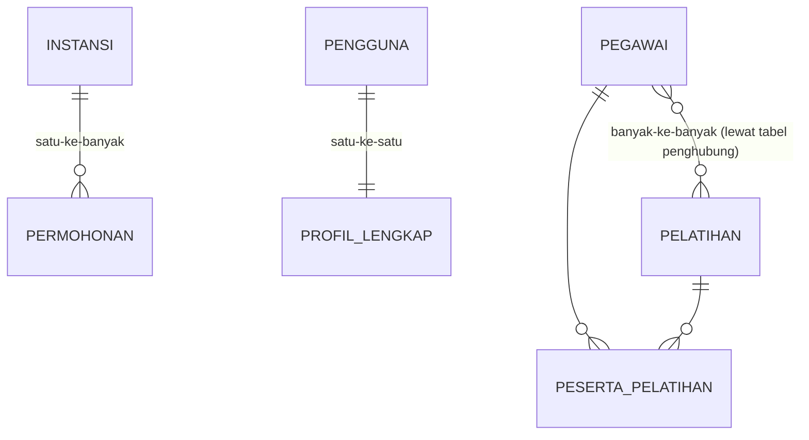

## TL;DR

Relational modelling adalah proses mengubah entitas dunia nyata (pengguna, permohonan, instansi) dan hubungan di antara mereka menjadi tabel, kolom, dan foreign key. Keputusan intinya ada di **kardinalitas relasi**: satu-ke-satu, satu-ke-banyak, atau banyak-ke-banyak — dan tiap jenis punya cara representasi tabel yang berbeda (banyak-ke-banyak butuh tabel penghubung/junction table, dua yang lain tidak). Model yang salah di awal tidak menampakkan masalahnya lewat error — ia menampakkannya lewat query yang makin lama makin rumit, dan migrasi skema yang makin lama makin menyakitkan, begitu kebutuhan bisnis berkembang melampaui asumsi model awal.

## The Problem

Sistem permohonan dokumen awalnya dimodelkan dengan asumsi "satu permohonan hanya diproses satu petugas": kolom `petugas_id` langsung ditaruh di tabel `permohonan`. Ini bekerja baik selama berbulan-bulan. Lalu kebijakan berubah: sebuah permohonan bisa melewati **beberapa** petugas secara berurutan (pemroses awal, verifikator, penandatangan) — relasi yang sebenarnya satu-ke-banyak (satu permohonan, banyak petugas yang pernah menanganinya, masing-masing di tahap berbeda), bukan satu-ke-satu seperti yang dimodelkan.

Karena kolom `petugas_id` sudah tertanam langsung di tabel `permohonan`, "memperbaikinya" berarti migrasi skema yang menyakitkan: membuat tabel baru `penanganan_permohonan` (junction table dengan kolom tambahan seperti `tahap` dan `waktu`), memindahkan data historis dari kolom lama ke tabel baru, lalu mengubah **setiap** query dan setiap baris kode aplikasi yang mengasumsikan "satu permohonan = satu petugas". Kalau kardinalitas relasi ini sudah dipikirkan sejak awal — bahkan kalau kebutuhan "banyak petugas" belum ada saat itu — model bisa dirancang lebih fleksibel dari awal, atau setidaknya perubahan ke depan sudah diantisipasi secara sadar, bukan ditemukan sebagai kejutan mendadak.

## Intuition

Bayangkan relational modelling seperti **merancang formulir kertas sebelum mencetaknya massal**. Kalau formulirnya punya satu kolom "nama petugas penanggung jawab", kamu secara implisit sudah memutuskan "satu permohonan hanya punya satu petugas" — keputusan yang tertanam di struktur formulir itu sendiri, bukan sekadar detail pengisian. Mengubah formulir yang sudah dicetak jutaan lembar jauh lebih mahal daripada memikirkan ulang strukturnya sebelum dicetak.

Analogi ini bocor pada satu hal: formulir kertas yang salah rancang hanya menyulitkan pengisian manual, sedangkan model relasional yang salah rancang **membiaskan seluruh cara aplikasi berpikir tentang data** — setiap query, setiap validasi, setiap asumsi di lapisan bisnis dibangun di atas struktur itu. Memperbaikinya bukan sekadar mencetak ulang formulir; itu migrasi skema yang menyentuh setiap titik di aplikasi yang pernah berasumsi tentang bentuk data lama.

## How It Works

**Satu-ke-satu**: setiap baris tabel A punya paling banyak satu pasangan di tabel B, dan sebaliknya. Direpresentasikan dengan foreign key yang juga unique (atau langsung memakai primary key yang sama di kedua tabel). Contoh: `pengguna` dan `profil_lengkap` (dipisah karena `profil_lengkap` jarang dibaca dan berisi banyak kolom besar).

**Satu-ke-banyak**: satu baris tabel A punya banyak pasangan di tabel B, tapi setiap baris B hanya punya satu pasangan di A. Direpresentasikan dengan foreign key di tabel "banyak" yang menunjuk ke tabel "satu". Contoh: satu `instansi` punya banyak `permohonan`.

**Banyak-ke-banyak**: baris di A bisa berpasangan dengan banyak baris di B, dan sebaliknya. Direpresentasikan lewat **tabel penghubung** (junction table) yang masing-masing barisnya adalah satu pasangan foreign key ke A dan ke B. Contoh: `pegawai` dan `pelatihan` — satu pegawai bisa ikut banyak pelatihan, satu pelatihan diikuti banyak pegawai.



Diagram ini menunjukkan bagaimana relasi banyak-ke-banyak `PEGAWAI`–`PELATIHAN` secara fisik selalu terurai jadi dua relasi satu-ke-banyak lewat tabel penghubung `PESERTA_PELATIHAN` — tidak ada mekanisme tabel relasional yang merepresentasikan banyak-ke-banyak secara langsung tanpa perantara.

Perbaikan model untuk "The Problem", memakai tabel penghubung dengan kolom tambahan:

```sql
CREATE TABLE penanganan_permohonan (
    id INT PRIMARY KEY AUTO_INCREMENT,
    permohonan_id INT NOT NULL,
    petugas_id INT NOT NULL,
    tahap VARCHAR(50) NOT NULL,   -- 'pemrosesan', 'verifikasi', 'penandatanganan'
    waktu_mulai DATETIME NOT NULL,
    FOREIGN KEY (permohonan_id) REFERENCES permohonan(id),
    FOREIGN KEY (petugas_id) REFERENCES pegawai(id)
);
```

## In Go

```go
package main

import (
	"context"
	"database/sql"
	"fmt"
)

// PenangananPermohonan merepresentasikan satu baris relasi satu-ke-banyak
// (permohonan -> banyak penanganan) yang juga menyimpan relasi ke petugas.
type PenangananPermohonan struct {
	ID            int
	PermohonanID  int
	PetugasID     int
	Tahap         string
}

func AmbilRiwayatPenanganan(ctx context.Context, db *sql.DB, permohonanID int) ([]PenangananPermohonan, error) {
	rows, err := db.QueryContext(ctx, `
		SELECT id, permohonan_id, petugas_id, tahap
		FROM penanganan_permohonan
		WHERE permohonan_id = ?
		ORDER BY waktu_mulai ASC
	`, permohonanID)
	if err != nil {
		return nil, fmt.Errorf("query riwayat penanganan permohonan %d: %w", permohonanID, err)
	}
	defer rows.Close()

	var hasil []PenangananPermohonan
	for rows.Next() {
		var p PenangananPermohonan
		if err := rows.Scan(&p.ID, &p.PermohonanID, &p.PetugasID, &p.Tahap); err != nil {
			return nil, fmt.Errorf("scan baris penanganan permohonan: %w", err)
		}
		hasil = append(hasil, p)
	}
	if err := rows.Err(); err != nil {
		return nil, fmt.Errorf("iterasi baris penanganan permohonan: %w", err)
	}
	return hasil, nil
}
```

## In His Stack

Yii2 mendeklarasikan relasi lewat method seperti `getPermohonan()` yang memanggil `hasMany()`/`hasOne()`/`belongsTo()` di `ActiveRecord` — ini murni lapisan kenyamanan di atas foreign key yang **sudah harus** benar dulu di skema database; Yii2 tidak menyimpulkan kardinalitas relasi, ia hanya mencerminkan apa yang sudah kamu definisikan lewat foreign key dan method itu sendiri. Kesalahan model yang sudah tertanam di skema (seperti `petugas_id` langsung di `permohonan` pada contoh di atas) akan tercermin persis sama di `ActiveRecord` — `belongsTo(Petugas::class)` yang mengasumsikan satu-ke-satu, dan migrasi model yang sama-sama harus dilakukan di kedua lapisan (skema database dan relasi `ActiveRecord`) sekaligus.

## Trade-offs and When Not To Use It

Model relasional yang "benar secara akademis" (setiap kardinalitas dimodelkan presisi sesuai aturan bisnis saat ini) tidak selalu pilihan paling praktis — kadang menambahkan fleksibilitas ekstra (misalnya langsung membuat tabel penghubung untuk relasi yang **saat ini** satu-ke-satu tapi berpotensi berkembang) menambah kompleksitas query yang tidak dibutuhkan hari ini. Trade-off nyatanya adalah antara kesederhanaan sekarang dan biaya migrasi nanti — keputusan ini butuh penilaian sadar tentang seberapa mungkin dan seberapa mahal perubahan kardinalitas di masa depan, bukan default "selalu buat paling fleksibel" atau "selalu buat paling sederhana."

## Common Mistakes

> [!warning] Jebakan
> Menaruh foreign key langsung di tabel "satu" untuk relasi yang sebenarnya satu-ke-banyak atau banyak-ke-banyak — mengunci model ke asumsi kardinalitas yang salah sejak awal, seperti pada contoh "The Problem".

> [!warning] Jebakan
> Membuat tabel penghubung tanpa primary key/unique constraint pada kombinasi kedua foreign key-nya — membuka celah baris duplikat untuk pasangan relasi yang sama (misalnya satu pegawai terdaftar dua kali untuk pelatihan yang sama).

> [!warning] Jebakan
> Mengabaikan kemungkinan sebuah relasi berkembang dari satu-ke-satu menjadi satu-ke-banyak seiring waktu, padahal ini pola yang sangat umum di sistem yang berumur panjang — pertimbangkan riwayat kebijakan yang mungkin berubah sejak awal, bukan setelah migrasi menyakitkan terjadi.

## Exercises

1. Sebuah `pengguna` bisa punya banyak `nomor_telepon`, tapi setiap `nomor_telepon` hanya milik satu `pengguna`. Kardinalitas apa ini, dan bagaimana merepresentasikannya dengan foreign key?
2. Kenapa relasi banyak-ke-banyak selalu butuh tabel penghubung, dan tidak bisa direpresentasikan langsung dengan foreign key di salah satu dari dua tabel?
3. Rancang skema untuk "satu `dokumen` bisa dilampirkan ke banyak `permohonan`, dan satu `permohonan` bisa punya banyak `dokumen` lampiran" — termasuk tabel penghubungnya.
4. Desain terbuka: sistem saat ini memodelkan "satu permohonan hanya bisa diajukan oleh satu pemohon" dengan kolom `pemohon_id` langsung di tabel `permohonan`. Kebijakan baru memperbolehkan permohonan kolektif — diajukan atas nama beberapa pemohon sekaligus (misalnya permohonan kelompok/keluarga). Rancang migrasi model relasionalnya, dan jelaskan pertimbangan tentang bagaimana menjaga kompatibilitas mundur untuk permohonan lama yang masih memakai kolom `pemohon_id` tunggal selama masa transisi.

> [!success]- Kunci jawaban
> **1.** Satu-ke-banyak (satu pengguna, banyak nomor telepon). Foreign key `pengguna_id` ditaruh di tabel `nomor_telepon` (sisi "banyak"), menunjuk ke `pengguna.id` — bukan sebaliknya, karena satu baris `nomor_telepon` hanya bisa menunjuk ke satu `pengguna`, sementara satu `pengguna` perlu bisa dirujuk oleh banyak baris `nomor_telepon`.
> **4.** Buat tabel penghubung `pemohon_permohonan (permohonan_id, pemohon_id, peran)` untuk merepresentasikan relasi banyak-ke-banyak yang baru. Untuk kompatibilitas mundur, kolom `pemohon_id` lama di `permohonan` bisa dipertahankan sementara sebagai "pemohon utama" (didenormalisasi secara sengaja untuk memudahkan query lama yang belum dimigrasi — lihat [[Deliberate Denormalisation]]), sambil data historisnya juga disalin ke tabel penghubung baru (satu baris per permohonan lama, dengan `peran = 'utama'`). Kode baru menulis ke kedua tempat selama masa transisi (dual-write, dengan kesadaran risiko yang dibahas di [[../60 Distributed Systems/Dual Writes and Their Dangers|Dual Writes and Their Dangers]] kalau nanti dipelajari di level senior), sampai seluruh konsumen data (query, laporan, kode aplikasi) sudah dipastikan membaca dari tabel penghubung baru, baru kolom `pemohon_id` lama dihapus di migrasi terpisah.

## Self-Check

- Sebutkan tiga jenis kardinalitas relasi dan cara representasi tabelnya masing-masing.
- Kenapa relasi banyak-ke-banyak selalu butuh tabel penghubung?
- Constraint apa yang wajib ada di tabel penghubung untuk mencegah baris relasi duplikat?
- Apa risiko menaruh foreign key langsung di tabel utama untuk relasi yang berpotensi berkembang jadi satu-ke-banyak?

## Connected Notes

- [[Normalisation 1NF to 3NF]] — kelanjutan langsung: setelah kardinalitas relasi ditentukan, normalisasi memastikan setiap tabel menyimpan fakta yang tepat tanpa duplikasi yang tidak perlu.
- [[../30 APIs and Web/Resource Modelling|Resource Modelling]] — modelling di lapisan API (bagaimana resource dan relasinya diekspos lewat endpoint) sering berangkat langsung dari model relasional yang dibahas di note ini, meski keduanya tidak selalu harus identik.
- [[Join Types and Their Mental Models]] — kardinalitas relasi yang dipilih di note ini secara langsung menentukan jenis join dan potensi penggandaan baris saat query.
- [[Data Types and Constraints]] — foreign key adalah salah satu bentuk constraint; note itu membahas lebih dalam bagaimana database menegakkan integritas relasi ini.
- [[Deliberate Denormalisation]] — kadang model "benar secara akademis" sengaja disimpangi demi performa baca, keputusan yang harus dibuat sadar setelah model normalnya dipahami dulu.

## Further Reading

- E.F. Codd, *"A Relational Model of Data for Large Shared Data Banks"* (1970) — paper asal mula model relasional; berguna untuk memahami akar pemikiran di balik konsep ini, meski notasi dan istilahnya sudah lama.

## Catatan Saya

*Tulis di sini skema tabel di kerjaanmu yang kardinalitas relasinya pernah berubah setelah sistem berjalan, dan seberapa mahal migrasinya saat itu.*
