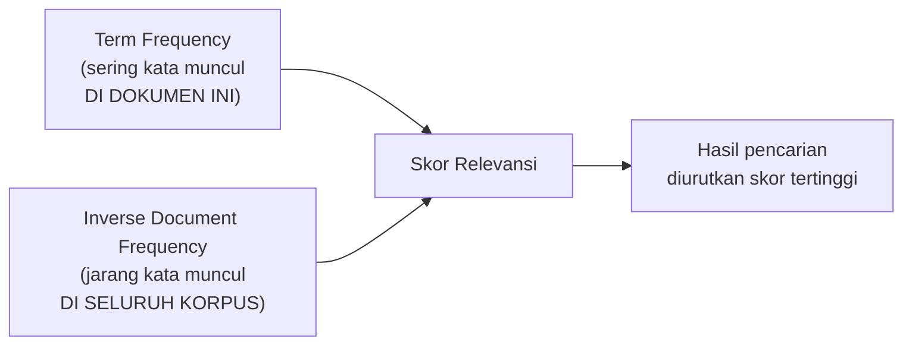

## TL;DR

[[Inverted Indexes and How Search Engines Work|Inverted index]] menjawab "dokumen mana saja yang cocok dengan kata kunci ini" — tapi pencarian nyata jarang berhenti di situ. Kalau seratus dokumen sama-sama mengandung kata "tanah", pengguna tetap butuh tahu **dokumen mana yang paling relevan** untuk ditampilkan lebih dulu. Relevance scoring memberi setiap dokumen yang cocok sebuah **skor numerik** berdasarkan seberapa relevan ia diperkirakan terhadap query, dan hasil pencarian diurutkan berdasarkan skor itu — bukan sekadar "cocok atau tidak cocok" seperti pencarian di database relasional biasa, tapi "seberapa cocok, dibanding hasil lain".

## The Problem

Sebuah fitur pencarian dokumen mengembalikan seratus dokumen yang sama-sama mengandung kata "sengketa tanah", diurutkan berdasarkan tanggal upload (satu-satunya pengurutan yang tersedia karena hanya memakai `WHERE isi LIKE '%sengketa%' AND isi LIKE '%tanah%'` biasa). Pengguna yang mencari dokumen paling relevan dengan sengketa tanah warisan tertentu harus menggulir puluhan hasil, karena tidak ada cara membedakan dokumen yang menyebut "sengketa tanah" sebagai topik utamanya (berkali-kali, di judul dan paragraf pembuka) dari dokumen yang hanya menyebutnya sekali secara sepintas di tengah teks panjang yang membahas topik lain sama sekali — keduanya sama-sama "cocok" secara biner, tapi jelas tidak sama relevannya.

Tanpa relevance scoring, pencarian teks bebas kehilangan nilai terbesarnya — kemampuan menyaring **jutaan** dokumen jadi segelintir yang paling mungkin dibutuhkan pengguna, di posisi teratas, tanpa pengguna perlu tahu detail teknis kenapa satu dokumen dianggap lebih relevan dari yang lain.

## Intuition

Bayangkan dua orang mencari topik "sengketa tanah warisan" di sebuah perpustakaan besar. Orang pertama menyerahkan daftar semua buku yang menyebut kata "tanah" **di mana pun** dalam bukunya — termasuk ensiklopedia geografi yang menyebut "tanah" sekali di satu paragraf tentang jenis tanah pertanian. Orang kedua, seorang pustakawan berpengalaman, memberi rekomendasi berdasarkan **seberapa sering dan seberapa sentral** kata "tanah" dan "sengketa" dan "warisan" muncul di setiap buku — buku yang judulnya sendiri "Panduan Hukum Sengketa Tanah Warisan" jelas direkomendasikan lebih dulu dibanding ensiklopedia geografi yang kebetulan menyebut kata yang sama sekali. Relevance scoring adalah versi otomatis dari penilaian pustakawan berpengalaman itu — bukan sekadar mencocokkan kata, tapi menilai **seberapa penting** kata itu bagi dokumen tersebut.

Analogi ini bocor pada satu hal: pustakawan manusia menilai relevansi dengan pemahaman semantik yang mendalam tentang isi buku. Algoritma relevance scoring (seperti TF-IDF atau BM25) bekerja murni secara **statistik** — ia tidak "memahami" makna kalimat, ia hanya menghitung seberapa sering kata muncul di dokumen tertentu dibanding seberapa umum kata itu di seluruh korpus. Ini cukup efektif untuk kebanyakan kasus, tapi bisa keliru untuk kasus yang benar-benar butuh pemahaman semantik/konteks — batasan yang penting disadari, bukan diasumsikan algoritma ini "mengerti" isi dokumen seperti manusia.

## How It Works

**TF-IDF (Term Frequency - Inverse Document Frequency)**, algoritma klasik yang mendasari banyak sistem relevance scoring modern, menggabungkan dua faktor:

- **Term Frequency (TF)** — seberapa sering sebuah kata muncul **dalam satu dokumen tertentu**. Dokumen yang menyebut "tanah" sepuluh kali dianggap lebih relevan untuk kata itu dibanding dokumen yang menyebutnya sekali.
- **Inverse Document Frequency (IDF)** — seberapa **jarang** sebuah kata muncul di **seluruh korpus** dokumen. Kata yang muncul di hampir semua dokumen (bahkan setelah stop word removal, kata seperti "permohonan" mungkin masih sangat umum di korpus dokumen legal-services) diberi bobot rendah, karena kemunculannya tidak banyak membantu membedakan dokumen yang relevan dari yang tidak. Kata yang jarang muncul secara keseluruhan tapi muncul di dokumen tertentu (seperti istilah hukum spesifik) diberi bobot tinggi, karena kemunculannya sangat informatif.



Diagram ini menunjukkan kenapa TF-IDF adalah **perkalian** dua faktor yang saling melengkapi: kata yang sering muncul di satu dokumen **dan** jarang muncul di korpus keseluruhan mendapat skor tertinggi — kombinasi yang menandakan kata itu benar-benar sentral dan distingtif untuk dokumen tersebut, bukan sekadar kata umum yang kebetulan sering disebut di mana-mana.

**BM25** (Best Matching 25), algoritma yang lebih modern dan menjadi default di Elasticsearch/Lucene, memperbaiki beberapa kelemahan TF-IDF murni: ia menerapkan **saturasi** pada term frequency (kata yang muncul 100 kali tidak dianggap 100x lebih relevan dari yang muncul sekali — manfaat tambahan dari pengulangan berkurang secara diminishing returns) dan mempertimbangkan **panjang dokumen** (dokumen pendek yang menyebut kata kunci beberapa kali secara proporsional lebih relevan dibanding dokumen sangat panjang yang menyebut kata yang sama jumlah kali, karena kepadatan relevansinya berbeda).

## Under The Hood

Skor relevansi bukan angka absolut yang punya makna universal — ia hanya bermakna sebagai **perbandingan relatif** antar dokumen untuk **query yang sama**. Skor 8.5 untuk satu query tidak bisa dibandingkan dengan skor 8.5 untuk query berbeda — masing-masing dihitung dalam konteks korpus dan query spesifiknya sendiri. Ini penting dipahami saat men-debug hasil pencarian yang terasa "aneh": membandingkan skor lintas query yang berbeda tidak memberi informasi yang berguna.

Sistem pencarian produksi jarang hanya mengandalkan skor tekstual murni (TF-IDF/BM25) — biasanya dikombinasikan dengan **boosting** manual berdasarkan field tertentu (misalnya kecocokan di judul dokumen diberi bobot lebih tinggi dibanding kecocokan di isi), dan kadang **faktor non-tekstual** seperti kebaruan dokumen (dokumen terbaru diberi sedikit bobot tambahan) atau popularitas (dokumen yang lebih sering dibuka pengguna lain). Kombinasi faktor tekstual dan non-tekstual ini yang membuat relevance scoring produksi jauh lebih kompleks dari sekadar rumus TF-IDF/BM25 murni.

## In Go

```go
package relevance

import (
	"math"
)

// HitungTFIDFSederhana mendemonstrasikan PRINSIP di balik TF-IDF —
// implementasi produksi nyata (Elasticsearch/Lucene) jauh lebih canggih,
// termasuk saturasi BM25 dan penanganan panjang dokumen.
func HitungTFIDFSederhana(frekuensiKataDiDokumen, totalKataDiDokumen int, jumlahDokumenMengandungKata, totalDokumen int) float64 {
	if totalKataDiDokumen == 0 || jumlahDokumenMengandungKata == 0 {
		return 0
	}

	tf := float64(frekuensiKataDiDokumen) / float64(totalKataDiDokumen)
	idf := math.Log(float64(totalDokumen) / float64(jumlahDokumenMengandungKata))

	return tf * idf
}

// contohPenggunaan menunjukkan kenapa kata umum mendapat skor rendah
// meski sering muncul, sementara kata langka dan sentral mendapat skor
// tinggi.
func contohPenggunaan() (skorKataUmum, skorKataLangka float64) {
	// "permohonan" muncul di 9000 dari 10000 dokumen (sangat umum di
	// korpus legal-services) — IDF rendah meski TF di dokumen ini tinggi.
	skorKataUmum = HitungTFIDFSederhana(15, 200, 9000, 10000)

	// "wanprestasi" muncul di hanya 50 dari 10000 dokumen (istilah hukum
	// spesifik) — IDF tinggi, mendorong skor akhir jauh lebih besar meski
	// frekuensi kemunculannya di dokumen ini sama.
	skorKataLangka = HitungTFIDFSederhana(15, 200, 50, 10000)

	return skorKataUmum, skorKataLangka
	// skorKataLangka akan jauh lebih besar dari skorKataUmum, menunjukkan
	// kenapa kata langka/spesifik lebih berpengaruh terhadap relevansi.
}
```

## In His Stack

Elasticsearch memakai BM25 sebagai algoritma default sejak beberapa versi (menggantikan TF-IDF murni yang dipakai versi lebih lama) — memahami TF-IDF tetap berharga sebagai fondasi konseptual sebelum memahami BM25 sebagai penyempurnaannya. Untuk pencarian dokumen legal-services, kombinasi boosting manual sangat relevan — misalnya, kecocokan pada field `judul_permohonan` diberi bobot jauh lebih tinggi dibanding kecocokan pada field `catatan_tambahan`, dan dokumen yang berstatus "aktif" bisa diberi boost dibanding dokumen berstatus "arsip" — keputusan bisnis yang diterjemahkan jadi konfigurasi boosting di level query Elasticsearch.

## Trade-offs and When Not To Use It

Relevance scoring berbasis statistik (TF-IDF/BM25) tidak memahami makna semantik — pencarian "kendaraan bermotor" tidak akan otomatis menemukan dokumen yang hanya menyebut "mobil" atau "motor" tanpa frasa persis itu, kecuali ditambahkan mekanisme sinonim eksplisit (disinggung di [[Inverted Indexes and How Search Engines Work]]) atau pendekatan yang lebih canggih seperti pencarian berbasis embedding vektor (di luar cakupan intermediate ini). Untuk kebutuhan pencarian yang sangat sederhana (mencari berdasarkan ID atau kode eksak), relevance scoring adalah overhead yang tidak perlu — pencarian eksak lewat index B+Tree biasa jauh lebih cepat dan tidak butuh konsep "skor" sama sekali, karena hasilnya memang biner (cocok atau tidak).

## Common Mistakes

> [!warning] Jebakan
> Membandingkan skor relevansi lintas query yang berbeda sebagai indikator kualitas absolut — skor hanya bermakna sebagai perbandingan relatif antar dokumen **untuk query yang sama**, tidak bisa dipakai membandingkan seberapa "baik" dua query yang berbeda.

> [!warning] Jebakan
> Mengasumsikan algoritma relevance scoring memahami makna semantik kalimat — TF-IDF/BM25 murni statistik berdasarkan frekuensi kata, tidak "mengerti" bahwa dua kalimat berbeda kata tapi semakna itu relevan satu sama lain, kecuali ditambah mekanisme tambahan.

> [!warning] Jebakan
> Tidak menyesuaikan boosting field berdasarkan kepentingan bisnis (misalnya kecocokan di judul dokumen diberi bobot sama dengan kecocokan di catatan sepintas) — hasil pencarian terasa "kurang relevan" meski algoritma scoring dasarnya sudah benar, karena bobot antar field belum disesuaikan dengan konteks bisnis nyata.

## Exercises

1. Jelaskan bagaimana TF dan IDF bekerja bersama untuk memberi skor tinggi pada kata yang benar-benar distingtif untuk sebuah dokumen.
2. Kenapa skor relevansi tidak bisa dibandingkan secara bermakna antar query yang berbeda?
3. Apa perbaikan utama BM25 dibanding TF-IDF murni?
4. Desain terbuka: sistem pencarian dokumenmu memakai Elasticsearch dengan BM25 default, tapi pengguna melaporkan hasil pencarian "kurang relevan" — dokumen dengan judul yang sangat cocok dengan kata kunci sering muncul di halaman kedua atau ketiga, kalah oleh dokumen panjang yang menyebut kata kunci itu berkali-kali di catatan tambahan yang kurang penting. Jelaskan penyebab teknis paling mungkin di balik gejala ini, dan usulkan satu penyesuaian konfigurasi yang bisa memperbaikinya.

> [!success]- Kunci jawaban
> **1.** TF memastikan dokumen yang menyebut sebuah kata lebih sering (secara proporsional terhadap panjang dokumennya) dianggap lebih relevan untuk kata itu. IDF memastikan kata yang jarang muncul di seluruh korpus (karena itu lebih informatif/distingtif ketika muncul) diberi bobot lebih tinggi dibanding kata umum yang muncul di hampir semua dokumen. Perkalian keduanya menghasilkan skor tertinggi untuk kata yang **sering muncul di dokumen tertentu** DAN **jarang muncul secara umum** — kombinasi yang menandakan kata itu benar-benar sentral dan unik untuk dokumen tersebut, bukan sekadar kata umum yang kebetulan sering disebut di mana pun.
> **4.** Penyebab paling mungkin: seluruh field (judul, isi, catatan tambahan) diberi bobot yang **sama** dalam perhitungan skor gabungan, sehingga dokumen panjang dengan banyak pengulangan kata kunci di field yang kurang penting bisa mengumpulkan skor total lebih tinggi dibanding dokumen dengan kecocokan tepat di judul tapi teksnya lebih pendek secara keseluruhan. Penyesuaian yang tepat: terapkan **field boosting** eksplisit di query Elasticsearch (misalnya `judul^3` memberi bobot tiga kali lipat untuk kecocokan di judul dibanding kecocokan di field lain yang tidak di-boost) — mencerminkan kepentingan bisnis nyata bahwa kecocokan di judul dokumen jauh lebih bermakna dibanding kecocokan di catatan tambahan yang sifatnya sekunder.

## Self-Check

- Apa perbedaan Term Frequency dan Inverse Document Frequency, dan kenapa keduanya perlu dikalikan bersama?
- Kenapa skor relevansi tidak bisa dibandingkan lintas query yang berbeda?
- Apa perbaikan BM25 dibanding TF-IDF murni terkait saturasi dan panjang dokumen?
- Kenapa boosting field manual sering dibutuhkan di atas skor tekstual dasar?

## Connected Notes

- [[Inverted Indexes and How Search Engines Work]] — relevance scoring beroperasi di atas hasil pencarian yang ditemukan lewat inverted index yang dijelaskan di note itu.
- [[Keeping Search in Sync with the Source of Truth]] — kelanjutan langsung: risiko operasional dari sistem pencarian yang terpisah dari database sumber, dibahas di note berikutnya.
- [[../92 Tools/_Overview|Tools Overview]] — BM25 sebagai algoritma default Elasticsearch dibahas lebih operasional di tool note Elasticsearch.
- [[../30 APIs and Web/Filtering and Sorting|Filtering and Sorting]] — pengurutan berdasarkan relevansi adalah bentuk khusus dari sorting yang dibahas lebih umum di note itu, dengan sumber nilai sort yang jauh lebih kompleks (skor, bukan kolom tunggal).
- [[Beyond Relational - Document, Key-Value, Wide-Column, Graph, and Time-Series Stores]] — Elasticsearch sebagai document-oriented search engine berbagi filosofi skema fleksibel dengan document store yang dibahas di note itu.

## Further Reading

- Manning, Raghavan, Schütze, "Introduction to Information Retrieval", bab mengenai scoring dan term weighting.
- Dokumentasi resmi Elasticsearch, bagian "Theory behind relevance scoring" dan BM25.

## Catatan Saya

*Tulis di sini apakah kamu pernah menerima keluhan "hasil pencarian tidak relevan" di kerjaanmu — dan setelah membaca note ini, dugaan apa yang muncul soal penyebabnya (boosting field, analyzer, atau hal lain).*
