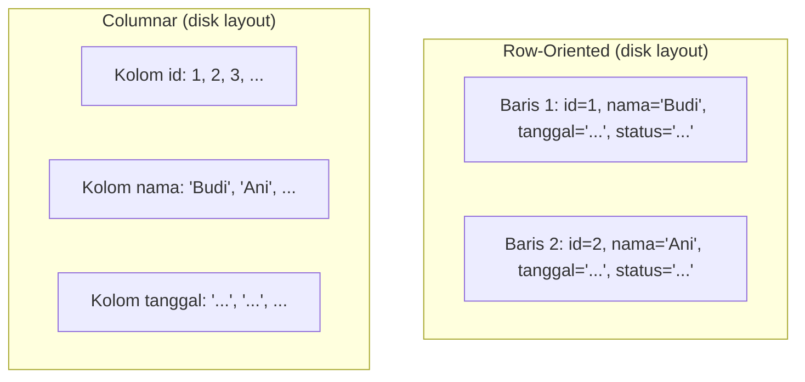

## TL;DR

Bagaimana database menyusun data secara fisik di disk menentukan beban kerja apa yang ia layani dengan efisien. Penyimpanan **row-oriented** (MariaDB/InnoDB, PostgreSQL default) menyimpan seluruh kolom satu baris berdampingan secara fisik — efisien untuk mengambil atau mengubah **satu baris utuh** sekaligus, pola akses khas aplikasi transaksional. Penyimpanan **columnar** (ClickHouse dan sejenisnya) menyimpan setiap **kolom** berdampingan secara terpisah di seluruh baris — efisien untuk membaca **satu atau beberapa kolom** dari jutaan baris sekaligus sambil mengabaikan kolom lain sepenuhnya, pola akses khas query analitik. Ini bukan soal mana yang "lebih baik" secara universal — keduanya mengoptimalkan pola akses yang berlawanan, dan memilih yang salah untuk beban kerjamu berarti membayar biaya struktural yang tidak bisa ditambal dengan index atau tuning apa pun.

## The Problem

Sebuah tim menjalankan query analitik "rata-rata waktu pemrosesan permohonan per bulan, per jenis layanan, selama tiga tahun terakhir" langsung terhadap database production MariaDB yang sama yang melayani transaksi harian aplikasi. Query ini harus membaca **seluruh baris** tabel `permohonan` (jutaan baris, tiga tahun data) meski hanya butuh tiga kolom dari puluhan kolom yang ada (`tanggal_dibuat`, `tanggal_selesai`, `jenis_layanan`) — karena penyimpanan row-oriented menyimpan seluruh kolom satu baris berdampingan secara fisik, database tetap harus membaca **seluruh isi baris** (termasuk kolom yang tidak dibutuhkan sama sekali, seperti deskripsi panjang atau metadata lain) untuk sampai ke tiga kolom yang relevan, memboroskan I/O secara signifikan.

Yang lebih buruk, query analitik berat ini berjalan **bersamaan** dengan trafik transaksional harian (petugas menyimpan perubahan status, warga mengajukan permohonan baru) — keduanya bersaing memperebutkan sumber daya I/O dan memori cache yang sama di instance database yang sama. Query analitik yang memindai jutaan baris bisa menghabiskan cache yang seharusnya menyimpan data "panas" (hot data) untuk transaksi harian, memperlambat **kedua** jenis beban kerja sekaligus — sebuah bau arsitektur yang akan dibahas lebih formal di [[OLTP vs OLAP vs HTAP]].

## Intuition

Bayangkan row-oriented storage seperti **rak arsip yang menyimpan satu map (folder) lengkap per orang** — semua dokumen tentang satu orang (KTP, riwayat pekerjaan, riwayat kesehatan) ditaruh dalam satu map yang sama, berdampingan fisik. Mengambil **seluruh informasi tentang satu orang** sangat cepat — cukup ambil satu map. Tapi kalau kamu butuh "daftar tanggal lahir seluruh orang di rak ini" (satu informasi spesifik dari **setiap** orang), kamu harus membuka **setiap** map satu per satu, membaca satu baris kecil, lalu mengabaikan sisa isi map yang tebal itu — sangat boros untuk kebutuhan seperti ini.

Columnar storage seperti **menyusun ulang arsip itu berdasarkan jenis informasi**, bukan berdasarkan orang — satu rak khusus berisi **hanya** tanggal lahir semua orang berjejer, rak lain berisi **hanya** riwayat pekerjaan semua orang. Mengambil "daftar tanggal lahir semua orang" sekarang tinggal membaca satu rak itu langsung, tanpa menyentuh rak lain sama sekali. Tapi mengambil "seluruh informasi tentang satu orang tertentu" sekarang jadi lebih merepotkan — harus mengunjungi banyak rak berbeda dan mengumpulkan potongan informasi orang itu dari masing-masing rak.

Analogi ini bocor pada satu hal: memindahkan arsip fisik antar susunan butuh usaha manual besar. Database bisa memilih strategi penyimpanan ini sejak desain awal (memilih engine row-oriented atau columnar), tapi **mengubahnya di kemudian hari** setelah data besar terkumpul tetap butuh migrasi data yang signifikan — bukan sekadar mengubah konfigurasi, melainkan menulis ulang seluruh data dalam struktur fisik yang berbeda.

## How It Works



Diagram ini menunjukkan perbedaan fisik paling mendasar: row-oriented menyimpan data **per baris**, semua kolom satu entitas berdampingan; columnar menyimpan data **per kolom**, semua nilai satu atribut berdampingan lintas seluruh baris.

**Kenapa perbedaan fisik ini berdampak drastis pada kompresi**: nilai-nilai dalam satu kolom cenderung punya tipe data yang sama dan sering berulang atau berpola (misalnya kolom `status` hanya berisi beberapa nilai enum, kolom `provinsi` berulang untuk banyak baris) — menyimpannya berdampingan membuat algoritma kompresi jauh lebih efektif dibanding mengompresi baris campuran berbagai tipe data. Ini kenapa database columnar sering mencapai rasio kompresi jauh lebih tinggi dibanding row-oriented untuk data yang sama, mengurangi kebutuhan I/O lebih jauh lagi karena data yang dibaca dari disk sudah lebih kecil secara fisik.

## Under The Hood

**Row-oriented unggul untuk OLTP** (Online Transaction Processing) — pola akses yang mengambil atau mengubah satu entitas utuh sekaligus (`SELECT * FROM permohonan WHERE id = ?`, `UPDATE permohonan SET status = ? WHERE id = ?`). Menulis satu baris baru juga efisien di row-oriented — cukup satu operasi tulis berurutan untuk seluruh kolom baris itu. Di columnar storage, menulis satu baris baru berarti menyisipkan nilai ke **setiap** kolom secara terpisah (potongan kecil tersebar di banyak lokasi fisik berbeda) — operasi yang jauh lebih mahal dan menjadi salah satu alasan struktural kenapa database columnar umumnya tidak dirancang untuk transaksi tulis baris-per-baris bervolume tinggi, dan lebih cocok menerima data secara batch (banyak baris sekaligus).

**Columnar unggul untuk OLAP** (Online Analytical Processing) — pola akses yang membaca sedikit kolom dari banyak baris untuk agregasi (`AVG`, `SUM`, `COUNT` per grup) — karena hanya kolom yang relevan yang perlu dibaca dari disk, mengabaikan seluruh kolom lain sepenuhnya, dan karena nilai yang berdekatan fisik dalam satu kolom bisa diproses secara vektor (vectorized execution) yang jauh lebih efisien bagi CPU modern dibanding memproses baris demi baris.

## In Go

Pemilihan storage engine bukan sesuatu yang dikonfigurasi dari kode aplikasi Go — ini keputusan desain infrastruktur. Tapi kode aplikasi harus **sadar** ke storage mana sebuah query diarahkan, karena pola akses yang optimal untuk satu storage bisa sangat tidak optimal untuk yang lain:

```go
package repository

import (
	"context"
	"database/sql"
	"fmt"
)

// TransaksiRepo bicara ke database row-oriented (MariaDB) — dioptimalkan
// untuk operasi per baris: ambil satu, ubah satu.
type TransaksiRepo struct {
	db *sql.DB
}

func (r *TransaksiRepo) AmbilPermohonanUtuh(ctx context.Context, id int64) (map[string]any, error) {
	// SELECT * cocok di sini karena row-oriented memang menyimpan seluruh
	// kolom satu baris berdampingan — mengambil semuanya sekaligus MURAH.
	row := r.db.QueryRowContext(ctx, `SELECT * FROM permohonan WHERE id = ?`, id)
	_ = row
	return nil, fmt.Errorf("implementasi scan diringkas untuk fokus pada konsep")
}

// AnalitikRepo bicara ke database columnar (ClickHouse) — dioptimalkan
// untuk membaca beberapa kolom dari jutaan baris sekaligus.
type AnalitikRepo struct {
	db *sql.DB
}

func (r *AnalitikRepo) RataRataWaktuProsesPerBulan(ctx context.Context) (*sql.Rows, error) {
	// Query ini HANYA menyentuh 3 kolom dari puluhan kolom yang ada di
	// tabel sumber — inilah pola yang diuntungkan penuh oleh columnar
	// storage, dan akan MEMBOROSKAN I/O kalau dijalankan langsung
	// terhadap tabel row-oriented yang sama besarnya.
	rows, err := r.db.QueryContext(ctx, `
		SELECT
			toStartOfMonth(tanggal_dibuat) AS bulan,
			jenis_layanan,
			avg(dateDiff('hour', tanggal_dibuat, tanggal_selesai)) AS rata_rata_jam
		FROM permohonan_analitik
		GROUP BY bulan, jenis_layanan
		ORDER BY bulan
	`)
	if err != nil {
		return nil, fmt.Errorf("query rata-rata waktu proses: %w", err)
	}
	return rows, nil
}
```

Pola arsitektur yang umum: data transaksional tetap hidup di MariaDB (row-oriented), lalu disalin secara berkala (lewat [[../60 Distributed Systems/Change Data Capture|Change Data Capture]] atau batch export) ke sistem columnar terpisah (ClickHouse) khusus untuk beban analitik — memisahkan kedua beban kerja secara fisik, bukan memaksanya berbagi satu instance yang sama.

## In His Stack

Ini adalah alasan konkret kenapa ClickHouse ada di daftar tool `working` tier untuk konteks kerja ini (lihat `92 Tools/_Overview.md`) — begitu laporan analitik lintas tahun mulai memperlambat aplikasi transaksional harian di MariaDB, jawabannya bukan menambah index atau menambah RAM server MariaDB, tapi memindahkan beban analitik itu ke sistem yang secara struktural dirancang untuknya. Elasticsearch, meski bukan murni database analitik kolom, juga memakai prinsip penyimpanan yang mengoptimalkan pencarian dan agregasi lintas banyak dokumen — pemahaman row vs columnar di sini membantu memahami kenapa Elasticsearch terasa begitu berbeda dari MariaDB meski keduanya sama-sama "menyimpan data".

## Trade-offs and When Not To Use It

Columnar storage adalah pilihan yang salah untuk beban kerja OLTP — transaksi yang sering mengubah satu baris (`UPDATE`/`DELETE` per baris, bukan batch) berjalan jauh lebih lambat di kebanyakan database columnar dibanding row-oriented, dan beberapa database columnar bahkan tidak mendukung `UPDATE`/`DELETE` per baris sama sekali secara native, hanya mendukung insert batch dan (kadang) mekanisme khusus untuk menandai baris sebagai usang. Row-oriented, sebaliknya, adalah pilihan yang buruk untuk agregasi analitik berat lintas jutaan baris — bukan karena tidak bisa (secara fungsional, `GROUP BY` tetap bekerja), tapi karena setiap baris yang diproses membawa serta seluruh kolom yang tidak relevan, memboroskan I/O yang seharusnya bisa dihindari. Keputusan storage bukan soal mana yang objektif lebih baik — ia sepenuhnya bergantung pada bentuk beban kerja yang dominan.

## Common Mistakes

> [!warning] Jebakan
> Menjalankan query analitik berat (agregasi lintas jutaan baris, sedikit kolom) langsung terhadap database row-oriented yang sama yang melayani trafik transaksional — memboroskan I/O dan bersaing memperebutkan cache dengan trafik transaksional harian, memperlambat keduanya sekaligus.

> [!warning] Jebakan
> Mengira database columnar bisa langsung menggantikan database row-oriented untuk seluruh kebutuhan aplikasi — transaksi per-baris yang sering (`UPDATE` status satu permohonan) menjadi jauh lebih mahal atau bahkan tidak didukung native di kebanyakan database columnar.

> [!warning] Jebakan
> Mencoba memperbaiki performa query analitik lambat di database row-oriented lewat index atau tuning konfigurasi saja — index membantu untuk **mencari** baris tertentu, tapi tidak mengubah fakta struktural bahwa setiap baris yang dibaca tetap membawa seluruh kolomnya, bukan hanya kolom yang relevan untuk agregasi.

## Exercises

1. Jelaskan kenapa row-oriented storage efisien untuk mengambil satu baris utuh, tapi boros untuk agregasi lintas banyak baris dengan sedikit kolom.
2. Kenapa database columnar bisa mencapai rasio kompresi yang jauh lebih tinggi dibanding row-oriented untuk data yang sama?
3. Kenapa menulis satu baris baru jauh lebih mahal di kebanyakan database columnar dibanding row-oriented?
4. Desain terbuka: sistemmu punya satu tabel `permohonan` yang dipakai baik untuk transaksi harian (CRUD per baris oleh petugas) maupun laporan analitik bulanan (agregasi lintas jutaan baris) yang mulai memperlambat aplikasi. Rancang arsitektur yang memisahkan kedua beban kerja ini tanpa mengharuskan aplikasi menulis dua kali secara manual ke dua tempat berbeda, dan jelaskan mekanisme apa yang menjaga data di sisi analitik tetap sinkron dengan sumbernya.

> [!success]- Kunci jawaban
> **1.** Mengambil satu baris utuh di row-oriented storage berarti membaca satu lokasi fisik berdampingan yang sudah menyimpan seluruh kolom baris itu — satu operasi baca sekuensial singkat. Agregasi lintas banyak baris dengan sedikit kolom, sebaliknya, memaksa row-oriented membaca **setiap** baris secara utuh (termasuk seluruh kolom yang tidak relevan untuk agregasi itu) satu per satu, karena struktur fisiknya tidak memisahkan kolom — tidak ada cara "melompati" kolom yang tidak dibutuhkan tanpa membaca seluruh baris terlebih dulu.
> **4.** Arsitektur yang umum: pertahankan tabel `permohonan` di MariaDB (row-oriented) sebagai satu-satunya sumber kebenaran (source of truth) untuk transaksi harian — aplikasi tetap menulis normal ke sana, tidak ada perubahan pada alur tulis yang ada. Tambahkan mekanisme **Change Data Capture** (dibahas di [[../60 Distributed Systems/Change Data Capture|Change Data Capture]], level senior) yang membaca perubahan dari binlog MariaDB secara real-time atau near-real-time, dan mereplikasikannya ke instance ClickHouse (columnar) terpisah yang khusus melayani query analitik. Aplikasi tidak pernah menulis dua kali secara manual — CDC yang menjaga sinkronisasi secara otomatis di latar belakang, dan laporan analitik dijalankan sepenuhnya terhadap ClickHouse, membebaskan MariaDB dari beban query analitik berat sepenuhnya. Trade-off yang harus diterima: data di sisi analitik akan selalu sedikit tertinggal dari sumbernya (mirip replication lag), yang untuk kebanyakan kebutuhan laporan bulanan adalah trade-off yang sepenuhnya wajar.

## Self-Check

- Apa perbedaan fisik mendasar antara row-oriented dan columnar storage?
- Kenapa columnar storage secara struktural lebih efisien untuk agregasi lintas banyak baris?
- Kenapa row-oriented lebih cocok untuk beban kerja transaksional dibanding columnar?
- Mekanisme apa yang biasa dipakai menjaga data di sistem columnar tetap sinkron dengan sumber row-oriented?

## Connected Notes

- [[Materialised Views]] — materialised view adalah solusi ringan untuk agregasi berulang dalam satu instance row-oriented; row vs columnar storage adalah solusi yang lebih fundamental ketika volume analitiknya sudah melampaui itu.
- [[OLTP vs OLAP vs HTAP]] — kelanjutan langsung: mengapa mencampur beban kerja transaksional dan analitik dalam satu database (apa pun storage-nya) adalah bau arsitektur, dibahas di note berikutnya.
- [[LSM-Trees vs B-Trees]] — dimensi lain dari desain storage engine (struktur data untuk menulis vs membaca), sering dikombinasikan dengan pertimbangan row vs columnar dalam memilih database yang tepat.
- [[../92 Tools/ClickHouse|ClickHouse]] — implementasi konkret database columnar yang relevan di ekosistem kerja ini, dibahas lebih operasional di tool note itu.
- [[../30 APIs and Web/_Overview|APIs and Web Overview]] — endpoint yang melayani laporan analitik idealnya diarahkan ke sistem columnar terpisah, keputusan desain yang berakar dari pemahaman di note ini.

## Further Reading

- Dokumentasi resmi ClickHouse, bagian "Why ClickHouse is So Fast" — penjelasan konkret dampak columnar storage dan vectorized execution.

## Catatan Saya

*Tulis di sini query analitik di kerjaanmu yang paling berat dijalankan langsung terhadap MariaDB — apakah pemisahan ke sistem columnar terpisah bisa membantu di sana.*
