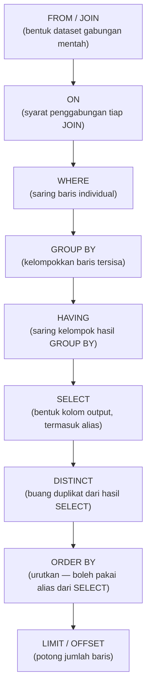

## TL;DR

SQL ditulis dalam urutan `SELECT ... FROM ... WHERE ... GROUP BY ... HAVING ... ORDER BY`, tapi database **tidak** mengeksekusinya dalam urutan itu. Urutan logisnya adalah `FROM`/`JOIN` → `WHERE` → `GROUP BY` → `HAVING` → `SELECT` → `DISTINCT` → `ORDER BY` → `LIMIT`/`OFFSET`. Ini bukan trivia — ini menjelaskan langsung kenapa `WHERE` tidak bisa melihat alias kolom dari `SELECT`, kenapa memfilter hasil aggregate butuh `HAVING` bukan `WHERE`, dan kenapa `ORDER BY` justru **boleh** memakai alias itu. Salah paham urutan ini adalah sumber paling umum dari error "unknown column" dan — yang lebih berbahaya — query yang jalan tanpa error tapi menghasilkan angka yang salah.

## The Problem

Bayangkan kamu diminta membuat laporan: "tampilkan instansi yang mengajukan lebih dari 100 permohonan bulan ini, urutkan dari yang paling banyak." Query pertama yang wajar ditulis:

```sql
SELECT instansi_id, COUNT(*) AS jumlah_permohonan
FROM permohonan
WHERE jumlah_permohonan > 100
GROUP BY instansi_id
ORDER BY jumlah_permohonan DESC;
```

Ini gagal dengan error semacam `Unknown column 'jumlah_permohonan' in 'where clause'`. Alasan intuitif "kan `jumlah_permohonan` sudah didefinisikan di baris pertama" terasa masuk akal — sampai kamu sadar `WHERE` dieksekusi **sebelum** `SELECT` bahkan sempat menghitung apa pun. Baris `SELECT` yang "di atas" secara tekstual justru salah satu tahap **terakhir** yang dievaluasi. Memindahkan syarat itu ke `HAVING COUNT(*) > 100` memperbaikinya — tapi tanpa memahami urutan logisnya, perbaikan ini terasa seperti mantra, bukan konsekuensi yang bisa diprediksi.

Yang lebih berbahaya: kadang kesalahan urutan ini **tidak** menghasilkan error sama sekali, hanya angka yang diam-diam salah — misalnya memfilter `WHERE status = 'aktif'` padahal maksudnya memfilter *setelah* agregasi per instansi, sehingga instansi yang salah satu permohonannya berstatus non-aktif malah hilang seluruhnya dari laporan.

## Intuition

Bayangkan query SQL seperti **jalur perakitan pabrik**: bahan mentah masuk di satu ujung (`FROM`), melewati stasiun kerja berurutan (`WHERE` menyaring baris, `GROUP BY` mengelompokkan, `HAVING` menyaring kelompok, `SELECT` membentuk hasil akhir, `ORDER BY` menyusun urutan), dan produk jadi keluar di ujung lain. Setiap stasiun **hanya bisa melihat** apa yang sudah keluar dari stasiun sebelumnya — stasiun `WHERE` belum pernah melihat kolom hasil `SELECT` karena `SELECT` belum berjalan.

Analogi ini bocor pada satu hal penting: jalur perakitan sungguhan bersifat fisik dan berurutan secara nyata, sedangkan **query optimizer database tidak benar-benar mengeksekusi tahap demi tahap secara fisik seperti ini**. Optimizer bebas menyusun ulang operasi fisik (misalnya menerapkan sebagian filter `WHERE` lebih awal langsung saat membaca index, sebelum join selesai) demi performa, selama hasil akhirnya identik dengan yang didefinisikan urutan logis ini. Yang dijelaskan di note ini adalah **kontrak semantik** — apa yang boleh "dilihat" oleh setiap klausa — bukan denah fisik bagaimana mesin database benar-benar bekerja di baliknya (itu urusan [[Reading EXPLAIN|execution plan]]).

## How It Works

Urutan logis lengkap, dari yang paling awal dievaluasi sampai paling akhir:



Diagram ini menjelaskan setiap aturan yang sering terasa "aneh": `WHERE` ada di tahap C, sebelum `SELECT` (tahap F) sempat membuat alias apa pun — jadi `WHERE` tidak pernah bisa melihat alias `SELECT`. `HAVING` ada di tahap E, setelah `GROUP BY` — jadi `HAVING` bisa memfilter hasil `COUNT()`/`SUM()` yang belum ada sebelum pengelompokan terjadi, sesuatu yang mustahil dilakukan `WHERE`. `ORDER BY` ada di tahap H, **setelah** `SELECT` — jadi ia satu-satunya klausa selain `SELECT` sendiri yang boleh memakai alias kolom.

Query dari bagian "The Problem", ditulis benar mengikuti urutan ini:

```sql
SELECT instansi_id, COUNT(*) AS jumlah_permohonan
FROM permohonan
WHERE status = 'diajukan'          -- saring BARIS dulu, sebelum dikelompokkan
GROUP BY instansi_id
HAVING COUNT(*) > 100               -- saring KELOMPOK, setelah dihitung
ORDER BY jumlah_permohonan DESC;    -- boleh pakai alias, karena SELECT sudah selesai
```

## In Go

Kesalahan urutan logis ini paling sering muncul saat query dibangun secara dinamis — kode Go yang menyusun potongan SQL berdasarkan filter yang dipilih user, tanpa disiplin soal di klausa mana sebuah kondisi seharusnya masuk.

```go
package main

import (
	"context"
	"fmt"
	"strings"

	"github.com/jmoraru/sqlbuilder" // ilustratif — bentuk API mirip query builder pada umumnya
)

// FilterLaporan menampung syarat yang dipilih user di UI laporan.
type FilterLaporan struct {
	Status        string
	MinJumlah     int // syarat ini berlaku pada HASIL AGREGASI, bukan baris mentah
}

// BangunQueryLaporan salah — mencampur syarat baris dan syarat agregat
// jadi satu WHERE, sehingga MinJumlah tidak pernah bisa diterapkan dengan benar
// karena COUNT(*) belum ada saat WHERE dievaluasi.
func BangunQueryLaporanSalah(f FilterLaporan) string {
	var kondisi []string
	if f.Status != "" {
		kondisi = append(kondisi, fmt.Sprintf("status = '%s'", f.Status))
	}
	if f.MinJumlah > 0 {
		// SALAH: COUNT(*) belum eksis di titik WHERE dievaluasi.
		kondisi = append(kondisi, fmt.Sprintf("COUNT(*) > %d", f.MinJumlah))
	}
	return fmt.Sprintf(
		"SELECT instansi_id, COUNT(*) AS jumlah_permohonan FROM permohonan WHERE %s GROUP BY instansi_id",
		strings.Join(kondisi, " AND "),
	)
}

// BangunQueryLaporanBenar memisahkan syarat baris (WHERE) dari syarat
// agregat (HAVING) berdasarkan urutan logis eksekusi SQL.
func BangunQueryLaporanBenar(f FilterLaporan) string {
	var syaratBaris []string
	var syaratAgregat []string

	if f.Status != "" {
		syaratBaris = append(syaratBaris, fmt.Sprintf("status = '%s'", f.Status))
	}
	if f.MinJumlah > 0 {
		syaratAgregat = append(syaratAgregat, fmt.Sprintf("COUNT(*) > %d", f.MinJumlah))
	}

	query := "SELECT instansi_id, COUNT(*) AS jumlah_permohonan FROM permohonan"
	if len(syaratBaris) > 0 {
		query += " WHERE " + strings.Join(syaratBaris, " AND ")
	}
	query += " GROUP BY instansi_id"
	if len(syaratAgregat) > 0 {
		query += " HAVING " + strings.Join(syaratAgregat, " AND ")
	}
	return query
}

func main() {
	f := FilterLaporan{Status: "diajukan", MinJumlah: 100}
	fmt.Println(BangunQueryLaporanBenar(f))
	_ = context.Background() // pengingat: query nyata selalu dijalankan lewat ctx, lihat database/sql and sqlx
}
```

> [!info]
> Contoh di atas memakai concatenation string murni hanya untuk menonjolkan *struktur* klausa mana yang menampung syarat mana. Di kode produksi nyata, nilai filter **tidak pernah** ditempel langsung ke string SQL seperti ini — itu SQL injection. Lihat [[Prepared Statements]] untuk cara aman menyisipkan nilai dinamis.

## In His Stack

Yii2 `ActiveQuery` menyediakan method `andWhere()` dan `having()` sebagai method yang jelas terpisah — itu bukan kebetulan, itu cermin langsung dari pemisahan tahap `WHERE` dan `HAVING` di urutan logis ini. Masalah biasanya muncul saat seseorang di tim menambahkan syarat lewat `andWhere()` untuk sesuatu yang sebenarnya butuh `having()` (misalnya menyaring berdasarkan hasil `COUNT()` dari relasi `hasMany`), dan MariaDB melempar error yang membingungkan kalau tidak paham kenapa keduanya tidak bisa dipertukarkan begitu saja.

## Trade-offs and When Not To Use It

Ini adalah aturan semantik SQL, bukan teknik yang punya alternatif — tidak ada "kapan sebaiknya tidak dipakai". Yang ada adalah kapan memahami urutan ini **tidak cukup** sendirian: begitu query melibatkan subquery bersarang atau CTE, urutan logis berlaku *di dalam* tiap blok secara independen, dan kamu perlu [[Subqueries vs CTEs]] untuk bernalar tentang query sebagai keseluruhan.

## Common Mistakes

> [!warning] Jebakan
> Memakai alias `SELECT` di klausa `WHERE`. Alias baru "ada" setelah `SELECT` dievaluasi, dan `WHERE` berjalan jauh sebelum itu.

> [!warning] Jebakan
> Menaruh syarat yang seharusnya memfilter hasil agregasi (`COUNT()`, `SUM()`, dll.) di `WHERE` alih-alih `HAVING`. `WHERE` beroperasi pada baris individual sebelum `GROUP BY` — ia tidak pernah punya akses ke nilai agregat.

> [!warning] Jebakan
> Berasumsi `ORDER BY` juga tidak bisa memakai alias `SELECT`, karena "kan sama-sama di luar `SELECT`". Padahal `ORDER BY` justru salah satu klausa terakhir yang dievaluasi, jadi ia satu dari sedikit tempat yang **boleh** memakai alias.

## Exercises

1. Sebuah query `SELECT nama, gaji FROM pegawai WHERE gaji > rata_gaji` gagal karena `rata_gaji` tidak dikenal. Kenapa, dan bagaimana memperbaikinya tanpa mengubah maksud query (bandingkan dengan subquery)?
2. Jelaskan kenapa `GROUP BY` harus dievaluasi sebelum `HAVING`, tapi `HAVING` harus dievaluasi sebelum `SELECT`.
3. Tulis ulang query yang salah di bagian "The Problem" tanpa melihat jawabannya dulu, lalu jelaskan tahap mana dari urutan logis yang membuat versi awalnya gagal.
4. Desain terbuka: tim data mengeluh dashboard laporan bulanan kadang menampilkan instansi dengan jumlah permohonan yang "terlihat kurang" dibanding data mentah di database. Setelah investigasi, ternyata query-nya memakai `WHERE status = 'aktif'` padahal maksud aslinya adalah "tampilkan instansi yang **punya minimal satu** permohonan aktif, dihitung dari **seluruh** permohonannya". Jelaskan kenapa urutan logis `WHERE` sebelum `GROUP BY` menyebabkan bug ini, dan rancang query yang benar.

> [!success]- Kunci jawaban
> **1.** `rata_gaji` belum ada di titik `WHERE` dievaluasi karena itu bukan kolom asli tabel — solusinya memakai subquery di `WHERE`: `WHERE gaji > (SELECT AVG(gaji) FROM pegawai)`, karena subquery ini dievaluasi sebagai bagian dari tahap `FROM`/ekspresi sebelum `WHERE` memakainya, bukan bergantung pada alias `SELECT` di query luar.
> **2.** `HAVING` memfilter *kelompok* yang dihasilkan `GROUP BY` — kalau `GROUP BY` belum berjalan, tidak ada kelompok atau nilai agregat untuk difilter. Dan `HAVING` harus sebelum `SELECT` karena secara semantik ia menentukan baris kelompok mana yang lolos ke tahap pembentukan output; `SELECT` tidak pernah "menyaring", ia hanya membentuk bentuk kolom dari baris yang sudah lolos semua penyaringan sebelumnya.
> **4.** `WHERE status = 'aktif'` membuang baris permohonan non-aktif **sebelum** `GROUP BY instansi_id` sempat mengelompokkan seluruh permohonan milik instansi tersebut — akibatnya instansi yang di antara permohonannya ada status non-aktif tetap dihitung, tapi baris non-aktifnya sudah hilang duluan, membuat `COUNT()` di bawah nilai sebenarnya (atau instansi hilang total kalau kebetulan tidak ada baris aktif sama sekali). Query yang benar memindahkan syarat status ke dalam ekspresi agregat bersyarat: `SELECT instansi_id, COUNT(*) AS total_semua, SUM(CASE WHEN status = 'aktif' THEN 1 ELSE 0 END) AS total_aktif FROM permohonan GROUP BY instansi_id` — sehingga seluruh baris tetap ikut dikelompokkan, dan pembedaan aktif/non-aktif terjadi di dalam agregasi, bukan sebelum pengelompokan.

## Self-Check

- Sebutkan urutan logis eksekusi SQL dari awal sampai akhir.
- Kenapa `WHERE` tidak bisa memakai alias dari `SELECT`, tapi `ORDER BY` bisa?
- Kenapa syarat pada hasil `COUNT()`/`SUM()` harus ditaruh di `HAVING`, bukan `WHERE`?
- Apakah database benar-benar menjalankan query secara fisik tahap demi tahap sesuai urutan logis ini? Kenapa atau kenapa tidak?

## Connected Notes

- [[Join Types and Their Mental Models]] — tahap `FROM`/`JOIN` adalah tahap paling awal dari urutan logis ini; memahami bentuk join menentukan dataset apa yang dilihat tahap-tahap sesudahnya.
- [[Aggregation and GROUP BY Semantics]] — pembahasan lebih dalam tentang tahap `GROUP BY` dan `HAVING` yang disinggung di note ini.
- [[Subqueries vs CTEs]] — urutan logis berlaku *di dalam* setiap subquery/CTE secara independen; note ini prasyarat untuk bernalar tentang query bersarang.
- [[NULL Semantics and Three-Valued Logic]] — `WHERE` dan `HAVING` sama-sama harus bernalar dengan `NULL` sebagai hasil ketiga (bukan hanya benar/salah), yang mengubah cara membaca hasil penyaringan.
- [[Reading EXPLAIN]] — melihat rencana eksekusi *fisik* yang sebenarnya dipilih optimizer, sebagai kontras dari urutan *logis* yang dibahas di note ini.

## Further Reading

- Dokumentasi resmi MySQL/MariaDB dan PostgreSQL, bagian tentang urutan evaluasi klausa `SELECT` — cari "Query Execution Order" atau bagian sintaks `SELECT` masing-masing.

## Catatan Saya

*Tulis di sini query di kerjaanmu yang pernah membingungkan karena salah paham urutan `WHERE` vs `HAVING`, atau kasus lain yang baru masuk akal setelah membaca note ini.*
