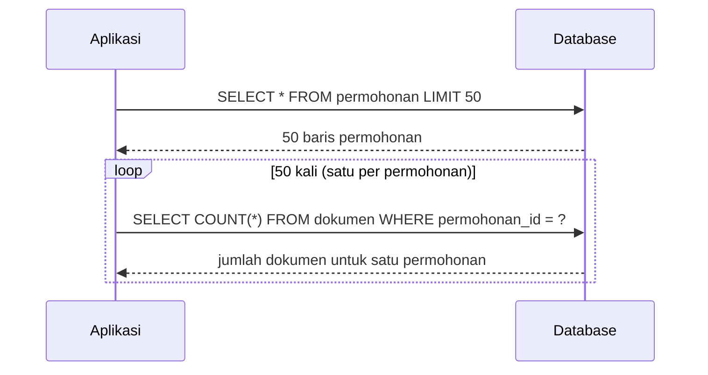

## TL;DR

N+1 query adalah pola akses data paling umum yang merusak performa aplikasi berbasis ORM: satu query untuk mengambil **N** baris induk (misalnya daftar permohonan), lalu **N query terpisah** — satu per baris — untuk mengambil data terkait masing-masing (misalnya dokumen pendukung tiap permohonan). Totalnya N+1 query untuk sesuatu yang bisa dijawab dalam satu atau dua query lewat `JOIN` atau `WHERE ... IN (...)`. Masalah ini nyaris tidak pernah terlihat di development (data test sedikit, N kecil, semua terasa cepat) dan baru menyerang di production ketika N benar-benar besar — sebuah jebakan yang secara struktural tersembunyi oleh kenyamanan ORM itu sendiri.

## The Problem

Sebuah endpoint dashboard menampilkan 50 permohonan terbaru beserta jumlah dokumen pendukung masing-masing. Ditulis dengan ORM (baik Active Record Yii2 maupun library Go semacam GORM), kodenya terlihat sederhana dan bersih: `foreach ($permohonan as $p) { $jumlahDokumen = $p->getDokumen()->count(); }` — satu baris kode yang elegan, disembunyikan di balik lazy loading ORM. Yang tidak terlihat dari baris kode itu: setiap pemanggilan `$p->getDokumen()` memicu **satu query SQL terpisah** ke database. Untuk 50 permohonan, endpoint ini menjalankan 51 query (1 untuk daftar permohonan, 50 untuk dokumen masing-masing) — di local development dengan latency database mendekati nol, ini terasa instan. Begitu di-deploy ke production dengan latency jaringan nyata antara aplikasi dan database (apalagi kalau keduanya berada di availability zone atau bahkan region berbeda), 51 round-trip berurutan bisa berarti detik, bukan milidetik, meski masing-masing query individual sangat cepat dan `EXPLAIN`-nya terlihat sempurna.

Masalah yang lebih parah muncul ketika dashboard yang sama menampilkan 500 permohonan alih-alih 50 (pertumbuhan data yang wajar seiring waktu) — jumlah query melonjak jadi 501, dan endpoint yang tadinya "cukup cepat" tiba-tiba menjadi salah satu penyebab utama connection pool (lihat [[Connection Pooling]]) kehabisan koneksi di jam sibuk, karena setiap request ke endpoint ini menahan koneksi jauh lebih lama dari yang seharusnya dibutuhkan operasi yang secara logis sederhana.

## Intuition

Bayangkan N+1 query seperti **mengirim kurir terpisah untuk setiap barang belanjaan**, alih-alih satu kurir dengan satu daftar belanja lengkap. Kalau kamu butuh 50 barang dari toko yang sama, mengirim 50 kurir terpisah (masing-masing pulang-pergi sendiri) jauh lebih lambat dan mahal dibanding satu kurir yang membawa daftar lengkap dan pulang sekali membawa semuanya — meski setiap perjalanan kurir individual itu sendiri cepat dan "berhasil".

Analogi ini bocor pada satu hal: mengirim 50 kurir terlihat jelas boros dari luar, sementara N+1 query **tersembunyi** di balik satu baris kode ORM yang terlihat tidak berbahaya (`$p->getDokumen()`) — kamu tidak melihat "kurim kurir baru" secara eksplisit di kode, itu terjadi secara implisit setiap kali properti relasi diakses dalam loop. Inilah yang membuat N+1 lebih berbahaya dari sekadar "kode yang jelas-jelas boros" — ia terlihat rapi dan idiomatic ORM, dan hanya terlihat sebagai masalah lewat query log atau APM (application performance monitoring), tidak dari membaca kode itu sendiri.

## How It Works



Diagram ini menunjukkan 51 round-trip total untuk data yang bisa didapat dalam satu atau dua query. Dua solusi standar:

**Solusi 1 — `JOIN` dengan agregasi:**
```sql
SELECT p.id, p.nomor_permohonan, COUNT(d.id) AS jumlah_dokumen
FROM permohonan p
LEFT JOIN dokumen d ON d.permohonan_id = p.id
GROUP BY p.id, p.nomor_permohonan
ORDER BY p.tanggal_dibuat DESC
LIMIT 50;
```

**Solusi 2 — dua query, satu untuk induk, satu untuk seluruh anak sekaligus (dikenal sebagai *eager loading* atau *batch loading*):**
```sql
SELECT id, nomor_permohonan FROM permohonan ORDER BY tanggal_dibuat DESC LIMIT 50;
-- lalu, dengan daftar ID dari hasil di atas:
SELECT permohonan_id, COUNT(*) AS jumlah
FROM dokumen
WHERE permohonan_id IN (?, ?, ?, ..., /* 50 ID */)
GROUP BY permohonan_id;
```

Solusi kedua ini menjadi **2** query total (bukan 51) — dan seringkali lebih fleksibel dibanding `JOIN` tunggal ketika data anak yang dibutuhkan cukup kompleks untuk digabung langsung dalam satu hasil `JOIN` tanpa duplikasi baris induk yang canggung (misalnya ketika satu permohonan punya banyak dokumen dan aplikasi juga butuh detail penuh tiap dokumen, bukan sekadar hitungan).

## Under The Hood

ORM modern menyediakan mekanisme *eager loading* eksplisit justru untuk mengatasi jebakan ini — memberi tahu ORM di awal "muat juga data relasi ini sekaligus", bukan membiarkannya lazy-load satu per satu saat diakses dalam loop. Tapi eager loading sendiri punya jebakan turunannya: eager loading naif lewat `JOIN` untuk relasi one-to-many bisa menghasilkan **duplikasi baris induk** di level SQL (satu baris permohonan muncul berkali-kali, sekali per dokumen terkait), yang kalau tidak ditangani dengan benar di lapisan aplikasi (deduplikasi hasil sebelum dipetakan ke struct), justru menghasilkan bug data ganda yang berbeda jenis dari N+1, tapi sama-sama berasal dari kesalahpahaman soal bagaimana relasi one-to-many bekerja di SQL relasional (lihat [[Join Types and Their Mental Models]]).

## In Go

```go
package repository

import (
	"context"
	"database/sql"
	"fmt"
)

type Permohonan struct {
	ID              int64
	NomorPermohonan string
	JumlahDokumen   int
}

// AmbilPermohonanNaif adalah pola N+1 KLASIK — satu query untuk daftar,
// lalu satu query TERPISAH per baris untuk menghitung dokumen. Untuk 50
// baris, ini 51 round-trip ke database.
func AmbilPermohonanNaif(ctx context.Context, db *sql.DB) ([]Permohonan, error) {
	rows, err := db.QueryContext(ctx, `SELECT id, nomor_permohonan FROM permohonan ORDER BY tanggal_dibuat DESC LIMIT 50`)
	if err != nil {
		return nil, fmt.Errorf("query daftar permohonan: %w", err)
	}
	defer rows.Close()

	var daftar []Permohonan
	for rows.Next() {
		var p Permohonan
		if err := rows.Scan(&p.ID, &p.NomorPermohonan); err != nil {
			return nil, fmt.Errorf("scan permohonan: %w", err)
		}
		daftar = append(daftar, p)
	}

	// JEBAKAN: query terpisah di dalam loop — inilah "+N" dari N+1.
	for i := range daftar {
		err := db.QueryRowContext(ctx, `SELECT COUNT(*) FROM dokumen WHERE permohonan_id = ?`, daftar[i].ID).
			Scan(&daftar[i].JumlahDokumen)
		if err != nil {
			return nil, fmt.Errorf("hitung dokumen permohonan %d: %w", daftar[i].ID, err)
		}
	}
	return daftar, nil
}

// AmbilPermohonanBatch memakai pola batch loading: SATU query untuk daftar
// induk, SATU query untuk seluruh data anak sekaligus (memakai IN dengan
// daftar ID), lalu digabung di memori aplikasi — total 2 query, bukan 51.
func AmbilPermohonanBatch(ctx context.Context, db *sql.DB) ([]Permohonan, error) {
	rows, err := db.QueryContext(ctx, `SELECT id, nomor_permohonan FROM permohonan ORDER BY tanggal_dibuat DESC LIMIT 50`)
	if err != nil {
		return nil, fmt.Errorf("query daftar permohonan: %w", err)
	}
	defer rows.Close()

	var daftar []Permohonan
	idKeIndeks := make(map[int64]int)
	for rows.Next() {
		var p Permohonan
		if err := rows.Scan(&p.ID, &p.NomorPermohonan); err != nil {
			return nil, fmt.Errorf("scan permohonan: %w", err)
		}
		idKeIndeks[p.ID] = len(daftar)
		daftar = append(daftar, p)
	}
	if len(daftar) == 0 {
		return daftar, nil
	}

	ids := make([]any, len(daftar))
	placeholder := make([]string, len(daftar))
	for i, p := range daftar {
		ids[i] = p.ID
		placeholder[i] = "?"
	}

	query := fmt.Sprintf(
		`SELECT permohonan_id, COUNT(*) FROM dokumen WHERE permohonan_id IN (%s) GROUP BY permohonan_id`,
		joinPlaceholder(placeholder),
	)
	hitungRows, err := db.QueryContext(ctx, query, ids...)
	if err != nil {
		return nil, fmt.Errorf("query batch jumlah dokumen: %w", err)
	}
	defer hitungRows.Close()

	for hitungRows.Next() {
		var permohonanID int64
		var jumlah int
		if err := hitungRows.Scan(&permohonanID, &jumlah); err != nil {
			return nil, fmt.Errorf("scan batch jumlah dokumen: %w", err)
		}
		if idx, ok := idKeIndeks[permohonanID]; ok {
			daftar[idx].JumlahDokumen = jumlah
		}
	}
	return daftar, nil
}

func joinPlaceholder(ph []string) string {
	hasil := ph[0]
	for _, p := range ph[1:] {
		hasil += ", " + p
	}
	return hasil
}
```

## In His Stack

Yii2 Active Record menyediakan `with()` untuk eager loading eksplisit (`Permohonan::find()->with('dokumen')->all()`) yang secara internal memakai pola batch loading serupa contoh Go di atas — tapi jebakan N+1 tetap sangat umum di codebase Yii2 justru karena `with()` harus **diingat** dipakai secara sadar; kode yang mengakses relasi lewat `$model->dokumen` tanpa `with()` sebelumnya diam-diam jatuh kembali ke lazy loading satu-per-satu, dan kode itu terlihat **identik** baik dengan atau tanpa `with()` — perbedaannya hanya terlihat dari query log atau profiling, bukan dari membaca kode itu sendiri. Ini salah satu alasan kenapa slow query log dan APM (lihat [[../70 Infrastructure and Delivery/The Three Pillars of Observability|The Three Pillars of Observability]]) penting dipasang bahkan untuk endpoint yang "terlihat sudah dioptimasi" di level kode.

## Trade-offs and When Not To Use It

Batch loading/eager loading tidak selalu lebih baik dalam semua kasus — untuk daftar yang sangat pendek (misalnya menampilkan detail satu permohonan beserta dokumennya, N=1), perbedaan antara satu query gabungan dan dua query terpisah nyaris tidak terasa, dan kadang dua query terpisah yang sederhana lebih mudah dibaca serta dipelihara dibanding satu `JOIN` kompleks. N+1 menjadi masalah nyata secara spesifik ketika **N besar** (puluhan sampai ribuan baris) — mengoptimasi prematur untuk N yang selalu kecil (dan dijamin tetap kecil oleh desain, misalnya paginasi ketat) adalah usaha yang tidak sepadan. Aturan praktis: identifikasi N+1 lewat pengukuran nyata (query count per request, lihat [[../70 Infrastructure and Delivery/The Three Pillars of Observability|The Three Pillars of Observability]]), bukan menghindarinya secara refleks di semua tempat tanpa data.

## Common Mistakes

> [!warning] Jebakan
> Mengakses properti relasi ORM di dalam loop (`foreach ($items as $item) { $item->relasi }`) tanpa eager loading eksplisit — pola paling umum penyebab N+1, dan yang paling mudah luput dari code review karena terlihat seperti kode yang bersih dan idiomatic.

> [!warning] Jebakan
> Menyalahkan "database yang lambat" atau menambah index tanpa menyadari masalah sebenarnya adalah jumlah round-trip yang berlebihan, bukan kecepatan satu query individual — `EXPLAIN` pada satu query dari pola N+1 biasanya terlihat sempurna, karena setiap query individual memang efisien; masalahnya ada di **jumlah** query, bukan rencana eksekusi satu query.

> [!warning] Jebakan
> Melakukan eager loading naif lewat `JOIN` untuk relasi one-to-many tanpa menyadari duplikasi baris induk yang dihasilkan, lalu salah menghitung atau salah menampilkan data karena baris induk yang sama muncul berkali-kali di hasil mentah `JOIN`.

## Exercises

1. Jelaskan kenapa N+1 query sering tidak terlihat di local development tapi menjadi masalah serius di production.
2. Apa perbedaan solusi `JOIN` dengan agregasi dibanding solusi dua-query (batch loading) untuk mengatasi N+1, dan kapan masing-masing lebih tepat?
3. Kenapa `EXPLAIN` terhadap satu query dalam pola N+1 biasanya tidak menunjukkan masalah apa pun, padahal pola keseluruhannya jelas bermasalah?
4. Desain terbuka: sebuah endpoint menampilkan 100 permohonan, masing-masing dengan (a) jumlah dokumen pendukung, (b) nama petugas yang menangani (lewat relasi ke tabel `petugas`), dan (c) tiga komentar terbaru (lewat relasi ke tabel `komentar`, diurutkan berdasarkan tanggal). Rancang strategi query yang menghindari N+1 untuk ketiga relasi ini sekaligus, dan jelaskan kenapa relasi (c) — mengambil "tiga komentar terbaru per permohonan" — butuh pendekatan yang sedikit berbeda dari sekadar `JOIN`/`IN` biasa.

> [!success]- Kunci jawaban
> **1.** Di local development, latency jaringan antara aplikasi dan database biasanya mendekati nol (keduanya di mesin yang sama atau jaringan lokal sangat cepat), dan jumlah data test biasanya kecil (N kecil) — 51 query yang masing-masing memakan waktu submilidetik terasa instan secara keseluruhan. Di production, latency jaringan nyata (apalagi lintas availability zone) mengalikan setiap query dengan overhead round-trip yang jauh lebih besar, dan N yang sesungguhnya (jumlah data nyata) seringkali jauh lebih besar dari data test — kombinasi keduanya membuat masalah yang tidak terlihat sama sekali di development menjadi sangat terasa di production.
> **4.** Relasi (a) dan (b) bisa diselesaikan dengan pola batch loading standar: satu query untuk 100 ID permohonan, satu query `COUNT ... GROUP BY permohonan_id` untuk (a), satu query `SELECT ... WHERE id IN (...)` untuk data petugas (b) berdasarkan kumpulan `petugas_id` dari 100 permohonan itu. Relasi (c) — "tiga komentar terbaru **per** permohonan" — tidak bisa diselesaikan semudah itu dengan `WHERE permohonan_id IN (...)` biasa, karena itu akan mengembalikan **semua** komentar untuk 100 permohonan itu, bukan dibatasi tiga per permohonan; butuh window function (`ROW_NUMBER() OVER (PARTITION BY permohonan_id ORDER BY tanggal DESC)`, lihat [[Window Functions]]) yang diikuti filter `WHERE row_num <= 3`, dijalankan sebagai satu query tunggal yang mengembalikan maksimal 3 komentar per permohonan sekaligus untuk seluruh 100 permohonan — pendekatan yang jauh lebih efisien dibanding 100 query terpisah masing-masing dengan `ORDER BY ... LIMIT 3`.

## Self-Check

- Kenapa N+1 query sering tidak terlihat sebagai masalah performa saat membaca kode ORM yang bersih?
- Apa dua solusi standar mengatasi N+1, dan kapan masing-masing lebih tepat?
- Kenapa `EXPLAIN` satu query saja tidak cukup untuk mendiagnosis masalah N+1?
- Kenapa eager loading naif lewat `JOIN` untuk relasi one-to-many bisa menimbulkan bug duplikasi data?

## Connected Notes

- [[Join Types and Their Mental Models]] — solusi `JOIN` untuk N+1 bertumpu langsung pada pemahaman LEFT JOIN dan implikasi duplikasi baris yang dijelaskan di note itu.
- [[Window Functions]] — kasus N+1 yang lebih kompleks (misalnya "N item terbaru per grup") butuh window function untuk diselesaikan dalam satu query, bukan sekadar `JOIN`/`IN` biasa.
- [[Connection Pooling]] — N+1 query yang tidak ditangani memperbesar tekanan pada connection pool karena setiap request menahan koneksi jauh lebih lama dari yang seharusnya.
- [[Covering Indexes]] — query batch loading dengan `WHERE ... IN (...)` yang sering dijalankan adalah kandidat baik untuk covering index, mengurangi biaya tambahan dari solusi N+1 sekalipun.
- [[../70 Infrastructure and Delivery/The Three Pillars of Observability|The Three Pillars of Observability]] — query count per request adalah metrik yang perlu diukur eksplisit untuk mendeteksi N+1 sebelum jadi masalah production.

## Further Reading

- Dokumentasi ORM yang relevan (GORM untuk Go, Yii2 Active Record) mengenai eager loading/preloading, sebagai referensi API konkret untuk mencegah N+1 di masing-masing ekosistem.

## Catatan Saya

*Tulis di sini endpoint di kerjaanmu yang menurutmu berpotensi N+1 — cek query log-nya, dan hitung berapa banyak query yang sebenarnya dijalankan untuk satu request.*
