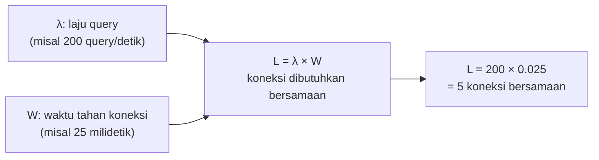

## TL;DR

[[Connection Pooling]] menjelaskan kenapa pool dibutuhkan dan kenapa ukurannya harus dibatasi secara sadar. Note ini menjawab pertanyaan yang sengaja ditunda di sana: **angka berapa** yang tepat. Jawabannya bukan rumus universal ("25 selalu aman"). Ukuran pool yang tepat adalah fungsi dari tiga hal yang harus diukur, bukan ditebak: berapa lama rata-rata satu query menahan koneksi, berapa banyak request konkuren yang perlu dilayani, dan berapa banyak instance aplikasi yang berbagi kuota koneksi database yang sama. **Little's Law** memberi kerangka matematis sederhana untuk menghubungkan ketiganya, mengubah "tebak angka aman" menjadi perhitungan yang bisa dipertanggungjawabkan.

## The Problem

Sebuah tim menetapkan `MaxOpenConns = 100` untuk service barunya, angka yang "terasa aman" tanpa perhitungan lebih lanjut. Di produksi, ternyata beban puncak layanan ini hanya butuh sekitar 15 koneksi aktif bersamaan — 85 koneksi menganggur sepanjang waktu, masing-masing tetap memakai memori di sisi database (setiap koneksi InnoDB, misalnya, memakai buffer memori tersendiri) tanpa manfaat apa pun. Ketika lima service lain yang berbagi database yang sama juga menetapkan angka serupa "yang terasa aman" secara independen, total kuota koneksi yang dialokasikan jauh melebihi kapasitas database. Meski penggunaan **aktual** gabungan kelima service itu masih jauh di bawah limit, database menolak koneksi baru karena kuota yang **dialokasikan** (bukan yang benar-benar dipakai) sudah melebihi `max_connections` server.

Masalah kebalikan yang sama seriusnya: sebuah service lain menetapkan `MaxOpenConns = 5` karena "sudah cukup untuk trafik normal", tanpa mengukur bagaimana angka itu berperilaku saat lonjakan trafik (misalnya jam pengumpulan berkas mendekati tenggat). Saat lonjakan terjadi, request mulai antre menunggu koneksi yang tersedia. Latensi p99 melonjak drastis bukan karena database lambat memproses, tapi karena request menunggu giliran mendapat koneksi sebelum query-nya bahkan sempat dikirim — persis gejala yang disinggung di [[Connection Pooling]] tapi belum dijelaskan cara mengukurnya secara sistematis.

## Intuition

Bayangkan connection pool seperti **jumlah kursi di ruang tunggu klinik**. Terlalu sedikit kursi berarti pasien mengantre berdiri di lorong meski dokter tidak terlalu sibuk (kapasitas ruang tunggu yang membatasi, bukan kapasitas dokter memeriksa). Terlalu banyak kursi berarti ruang tunggu memakan tempat besar yang sebagian besar kosong sepanjang hari. Kalau setiap klinik di gedung yang sama (setiap service yang berbagi database) sama-sama memesan ruang tunggu besar "untuk jaga-jaga", gedung itu kehabisan ruang meski secara agregat sebagian besar kursi menganggur. Jumlah kursi yang tepat dihitung dari **berapa lama** rata-rata satu pasien diperiksa dan **berapa banyak** pasien datang per jam — bukan ditebak berdasarkan "terasa cukup besar".

Analogi ini bocor pada satu hal: kursi ruang tunggu klinik yang kosong tidak memakan biaya operasional tambahan yang berarti. Koneksi database yang menganggur **tetap** memakai memori nyata di sisi server database (buffer per koneksi). Inilah kenapa "melebihkan pool untuk jaga-jaga" bukan pilihan yang gratis seperti melebihkan jumlah kursi kosong, dan kenapa perhitungan yang tepat lebih bernilai dibanding sekadar menetapkan angka besar sebagai margin aman.

## How It Works

**Little's Law**, hukum sederhana dari teori antrean, menyatakan:

$$L = \lambda \times W$$

di mana $L$ adalah jumlah rata-rata "item" dalam sistem (dalam konteks ini: jumlah koneksi yang dibutuhkan bersamaan), $\lambda$ adalah laju kedatangan (berapa query per detik yang perlu dijalankan), dan $W$ adalah waktu rata-rata satu item berada dalam sistem (berapa lama satu query menahan koneksi, dari mulai dikirim sampai hasilnya diterima aplikasi).



Diagram ini menunjukkan contoh konkret: kalau sebuah service menjalankan 200 query per detik, dan setiap query rata-rata menahan koneksi 25 milidetik (0.025 detik) dari dikirim sampai selesai diproses, maka rata-rata **5 koneksi** dibutuhkan bersamaan pada kondisi steady-state. `MaxOpenConns` idealnya diset **di atas** angka ini (untuk menyerap variasi/lonjakan sesaat, bukan pas-pasan di rata-rata), tapi tidak perlu jauh melebihi kebutuhan puncak yang realistis — angka seperti 100 untuk kebutuhan rata-rata 5 koneksi adalah alokasi berlebihan yang tidak berdasar perhitungan apa pun.

**Untuk banyak instance (Kubernetes pod, misalnya)**, total kuota koneksi ke database adalah:

$$\text{Total} = \text{MaxOpenConns per pod} \times \text{jumlah pod maksimum}$$

dan `Total` ini, dijumlahkan dengan kuota service lain yang berbagi database yang sama, harus tetap di bawah `max_connections` server dengan margin aman untuk koneksi administratif (backup, monitoring, koneksi manual DBA).

## Under The Hood

Mengukur $W$ (waktu tahan koneksi) secara akurat butuh observability yang sudah terpasang: metrik seperti waktu eksekusi query rata-rata dari slow query log, atau lebih baik lagi, metrik `database/sql` bawaan Go (`DBStats`) yang melaporkan `WaitCount` dan `WaitDuration` — berapa kali request harus menunggu koneksi tersedia, dan berapa total waktu yang dihabiskan menunggu. `WaitCount` yang terus bertambah dan `WaitDuration` yang signifikan adalah sinyal paling langsung bahwa pool terlalu kecil untuk beban saat ini — jauh lebih dapat diandalkan dibanding menebak dari gejala tidak langsung seperti latensi endpoint yang naik (yang bisa disebabkan banyak hal lain juga).

Mengukur $\lambda$ (laju query) juga tidak selalu sama dengan laju request HTTP: satu request bisa memicu beberapa query (apalagi kalau ada jejak N+1 yang belum ditangani, lihat [[The N+1 Query Problem]]). Laju query yang relevan untuk Little's Law harus diukur dari metrik database itu sendiri (query per detik dari sisi database, atau dari instrumentasi aplikasi yang menghitung setiap `db.QueryContext`/`db.ExecContext`), bukan diasumsikan sama dengan laju request per detik endpoint.

## In Go

```go
package monitoring

import (
	"context"
	"database/sql"
	"fmt"
	"log/slog"
	"time"
)

// PantauStatistikPool secara berkala melaporkan DBStats — termasuk
// WaitCount dan WaitDuration, dua metrik paling langsung untuk menilai
// apakah MaxOpenConns saat ini cukup untuk beban nyata. Pool yang sehat
// punya WaitCount mendekati nol; WaitCount yang terus naik adalah sinyal
// pool terlalu kecil, BUKAN sinyal database yang lambat.
func PantauStatistikPool(ctx context.Context, db *sql.DB, logger *slog.Logger, interval time.Duration) {
	ticker := time.NewTicker(interval)
	defer ticker.Stop()

	var waitCountSebelumnya int64

	for {
		select {
		case <-ctx.Done():
			return
		case <-ticker.C:
			stats := db.Stats()
			waitBaru := stats.WaitCount - waitCountSebelumnya
			waitCountSebelumnya = stats.WaitCount

			logger.Info("statistik connection pool",
				"open_connections", stats.OpenConnections,
				"in_use", stats.InUse,
				"idle", stats.Idle,
				"wait_count_interval", waitBaru,
				"wait_duration_total", stats.WaitDuration,
				"max_open_connections", stats.MaxOpenConnections,
			)

			if waitBaru > 0 {
				logger.Warn("connection pool mengalami wait — pertimbangkan menaikkan MaxOpenConns atau menyelidiki query yang menahan koneksi terlalu lama",
					"wait_count_interval", waitBaru,
				)
			}
		}
	}
}

// HitungKebutuhanPoolDariLittlesLaw adalah helper sederhana untuk
// mengubah pengukuran laju query dan waktu tahan koneksi jadi estimasi
// jumlah koneksi bersamaan yang dibutuhkan — hasilnya adalah TITIK AWAL
// untuk menentukan MaxOpenConns, bukan angka final tanpa margin.
func HitungKebutuhanPoolDariLittlesLaw(queryPerDetik float64, rataRataWaktuTahan time.Duration) float64 {
	return queryPerDetik * rataRataWaktuTahan.Seconds()
}

func contohPenggunaan() {
	// Terukur dari metrik nyata: 200 query/detik, rata-rata 25ms per query.
	kebutuhan := HitungKebutuhanPoolDariLittlesLaw(200, 25*time.Millisecond)
	fmt.Printf("kebutuhan koneksi bersamaan (rata-rata): %.1f\n", kebutuhan)
	// Output: 5.0 — MaxOpenConns diset dengan margin di atas ini, misalnya
	// 15-20, untuk menyerap variasi beban, bukan pas-pasan di angka rata-rata.
}
```

## In His Stack

Untuk 13 aplikasi yang berbagi beberapa instance database yang sama, koordinasi kuota koneksi lintas aplikasi adalah tanggung jawab yang jarang dipikirkan eksplisit sampai insiden "too many connections" terjadi. Biasanya ini karena setiap tim menetapkan `MaxOpenConns` (atau setara di Yii2, `PDO` connection settings) secara independen tanpa visibilitas ke kuota yang dipakai aplikasi lain. Mendokumentasikan kuota koneksi yang dialokasikan setiap aplikasi (bahkan sesederhana spreadsheet yang di-maintain koordinator teknis) dan meninjaunya berkala adalah langkah operasional sederhana yang mencegah insiden ini, jauh sebelum butuh solusi yang lebih canggih seperti connection pooler eksternal (PgBouncer untuk PostgreSQL, ProxySQL untuk MySQL) yang memultipleks koneksi logis aplikasi ke jumlah koneksi fisik database yang lebih kecil.

## Trade-offs and When Not To Use It

Perhitungan Little's Law memberi **titik awal** yang jauh lebih baik dari tebakan murni, tapi bukan angka final yang bisa diset sekali dan dilupakan. Beban kerja aplikasi berubah seiring waktu (fitur baru, pertumbuhan pengguna, perubahan pola akses), dan pool yang tepat untuk kondisi hari ini bisa jadi tidak tepat enam bulan kemudian. Untuk sistem dengan beban yang sangat bervariasi (lonjakan tajam di waktu tertentu, seperti tenggat pengumpulan dokumen), menetapkan pool berdasarkan rata-rata harian saja tidak cukup. Perhitungan perlu mempertimbangkan beban **puncak** yang realistis, bukan rata-rata sepanjang hari, dan dikombinasikan dengan pemantauan `WaitCount`/`WaitDuration` yang berkelanjutan untuk menangkap penyimpangan dari asumsi awal.

## Common Mistakes

> [!warning] Jebakan
> Menetapkan `MaxOpenConns` berdasarkan angka yang "terasa aman" tanpa pengukuran laju query atau waktu tahan koneksi sama sekali — bisa jauh melebihkan (memakan kuota database tanpa manfaat) atau jauh mengurangi (menyebabkan wait time tinggi) dibanding kebutuhan nyata.

> [!warning] Jebakan
> Mengabaikan bahwa `MaxOpenConns` per pod harus dikalikan **jumlah pod maksimum** (termasuk saat autoscaling mencapai batas atasnya), bukan jumlah pod saat ini — kuota yang terlihat aman dengan 3 pod bisa jauh melebihi limit database begitu autoscaling menaikkan jadi 10 pod di jam sibuk.

> [!warning] Jebakan
> Tidak memantau `WaitCount`/`WaitDuration` secara berkelanjutan setelah menetapkan `MaxOpenConns` sekali di awal proyek — beban kerja berubah seiring waktu, dan angka yang tepat enam bulan lalu belum tentu tepat sekarang.

## Exercises

1. Jelaskan Little's Law dengan kata-katamu sendiri, dan bagaimana ia menghubungkan laju query, waktu tahan koneksi, dan jumlah koneksi yang dibutuhkan.
2. Kenapa `WaitCount` dan `WaitDuration` adalah sinyal yang lebih langsung untuk menilai ukuran pool dibanding sekadar mengamati latensi endpoint secara umum?
3. Kenapa `MaxOpenConns` per pod harus dikalikan jumlah pod **maksimum** (bukan jumlah pod saat ini) saat menghitung total kuota koneksi ke database?
4. Desain terbuka: sistemmu punya endpoint yang menjalankan rata-rata 50 query/detik dengan waktu tahan koneksi rata-rata 10ms di hari biasa, tapi setiap tanggal 1-5 (periode pengumpulan laporan bulanan), laju query melonjak jadi 400 query/detik dengan waktu tahan koneksi naik jadi 40ms (karena query laporan lebih berat). Aplikasi berjalan sebagai 4 pod, dan database punya `max_connections = 200` yang dipakai bersama dua aplikasi lain yang memakai total sekitar 80 koneksi di jam sibuk mereka. Rancang nilai `MaxOpenConns` yang tepat untuk pod aplikasi ini, dengan mempertimbangkan kedua kondisi (hari biasa dan periode laporan).

> [!success]- Kunci jawaban
> **1.** Little's Law menyatakan jumlah rata-rata item yang berada "di dalam sistem" pada satu waktu ($L$) sama dengan laju kedatangan item baru ($\lambda$) dikalikan rata-rata waktu setiap item berada di dalam sistem ($W$). Dalam konteks connection pool: jumlah koneksi yang dibutuhkan bersamaan sama dengan laju query per detik dikalikan rata-rata berapa lama satu query menahan koneksi. Hukum ini berlaku secara umum untuk sistem antrean apa pun, dan connection pool pada dasarnya adalah sistem antrean (request menunggu koneksi yang tersedia).
> **4.** Kondisi puncak (periode laporan) adalah yang harus dijadikan basis perhitungan, karena pool yang gagal di periode puncak jauh lebih berbahaya dibanding pool yang sedikit berlebih di hari biasa. Kebutuhan koneksi bersamaan saat puncak: $400 \times 0.04 = 16$ koneksi. Dengan margin untuk variasi (misalnya 1.5x), `MaxOpenConns` per pod sekitar 24. Untuk 4 pod, total kuota aplikasi ini: $24 \times 4 = 96$ koneksi. Ditambah 80 koneksi yang dipakai dua aplikasi lain di jam sibuk mereka, total keseluruhan sekitar 176 — masih di bawah `max_connections = 200`, tapi dengan margin tersisa hanya 24 koneksi untuk kebutuhan administratif dan variasi tak terduga, yang cukup tipis. Ini situasi yang layak didiskusikan dengan tim yang mengelola dua aplikasi lain (apakah jam sibuk mereka tumpang tindih dengan periode laporan bulanan ini), dan mempertimbangkan menaikkan `max_connections` server atau memakai connection pooler eksternal (PgBouncer/ProxySQL) kalau ketiga aplikasi berpotensi mencapai puncak bersamaan.

## Self-Check

- Apa rumus Little's Law, dan bagaimana ia diterapkan pada connection pool?
- Metrik apa dari `database/sql` Go yang paling langsung menunjukkan pool terlalu kecil?
- Kenapa perhitungan `MaxOpenConns` untuk banyak pod harus mempertimbangkan jumlah pod maksimum, bukan jumlah saat ini?
- Kenapa menetapkan pool berdasarkan beban puncak lebih penting daripada beban rata-rata harian?

## Connected Notes

- [[Connection Pooling]] — pengantar konsep dan risiko dasar pool yang tidak dibatasi, dilanjutkan dengan metodologi pengukuran angka yang tepat di note ini.
- [[The N+1 Query Problem]] — laju query yang relevan untuk Little's Law bisa jauh lebih tinggi dari laju request kalau ada N+1 yang belum ditangani, mendistorsi perhitungan kalau tidak disadari.
- [[Read Replicas and Replication Lag]] — memisahkan beban baca ke replica adalah salah satu cara mengurangi tekanan pada pool koneksi database utama, dibahas di note berikutnya.
- [[../50 Concurrency and Performance/_Overview|Concurrency and Performance Overview]] — worker pool dan goroutine yang dibahas di domain itu punya prinsip sizing yang serupa (mengukur, bukan menebak) dengan connection pool di sini.
- [[../92 Tools/PostgreSQL vs MySQL - How To Choose|PostgreSQL vs MySQL - How To Choose]] — koneksi PostgreSQL secara historis lebih berat per koneksi dibanding MySQL, salah satu pertimbangan yang relevan saat menghitung kuota, dibahas di tool note itu.

## Further Reading

- Dokumentasi resmi Go, package `database/sql`, tipe `DBStats`.
- Materi pengantar teori antrean (queueing theory) dan Little's Law dari sumber akademik distributed systems/performance engineering mana pun yang membahasnya secara formal.

## Catatan Saya

*Tulis di sini nilai MaxOpenConns yang dipakai service di kerjaanmu saat ini — apakah pernah dihitung, atau masih angka tebakan yang "terasa aman"?*
