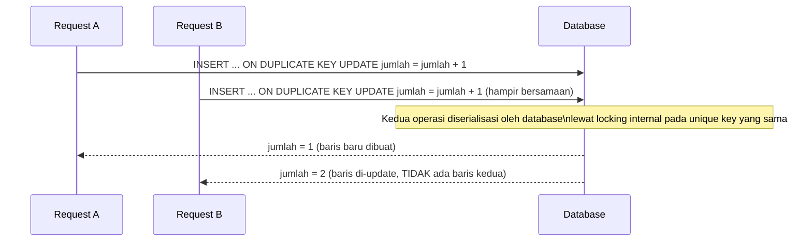

## TL;DR

Upsert berarti "insert kalau belum ada, update kalau sudah ada" — dilakukan sebagai **satu operasi atomik** di database, bukan dua langkah terpisah ("cek dulu, baru insert atau update"). MySQL/MariaDB memakai `INSERT ... ON DUPLICATE KEY UPDATE`; PostgreSQL memakai `INSERT ... ON CONFLICT ... DO UPDATE`. Keduanya mengandalkan **unique constraint atau primary key** untuk mendeteksi "sudah ada" — tanpa constraint itu, tidak ada yang bisa dijadikan patokan konflik, dan upsert kehilangan maknanya. Pola "cek dulu pakai `SELECT`, baru putuskan `INSERT` atau `UPDATE` di aplikasi" yang masih umum ditulis manual punya race condition serius yang upsert secara desain menghilangkan.

## The Problem

Sebuah service mencatat statistik "jumlah kunjungan per hari per instansi" — satu baris per kombinasi `(instansi_id, tanggal)`, di-increment setiap ada kunjungan baru. Kode awal ditulis sebagai dua langkah:

```go
var jumlah int
err := db.QueryRowContext(ctx, "SELECT jumlah FROM statistik_kunjungan WHERE instansi_id = ? AND tanggal = ?", instansiID, tanggal).Scan(&jumlah)
if err == sql.ErrNoRows {
    db.ExecContext(ctx, "INSERT INTO statistik_kunjungan (instansi_id, tanggal, jumlah) VALUES (?, ?, 1)", instansiID, tanggal)
} else {
    db.ExecContext(ctx, "UPDATE statistik_kunjungan SET jumlah = ? WHERE instansi_id = ? AND tanggal = ?", jumlah+1, instansiID, tanggal)
}
```

Di beban rendah ini tampak bekerja. Tapi begitu dua request kunjungan untuk instansi dan tanggal yang sama datang **hampir bersamaan** (persis skenario aplikasi web bertraffic tinggi), keduanya bisa sama-sama menjalankan `SELECT` dan sama-sama mendapati `sql.ErrNoRows` **sebelum** salah satunya sempat menyelesaikan `INSERT`-nya — hasilnya dua `INSERT` untuk baris yang seharusnya satu, yang akan gagal dengan error duplicate key kalau ada unique constraint (baik, setidaknya kelihatan), atau — kalau tidak ada unique constraint — menghasilkan **dua baris statistik untuk kombinasi yang sama**, salah satunya dengan `jumlah = 1` yang seharusnya tidak pernah ada. Ini adalah [[../30 APIs and Web/Idempotency|read-modify-write race]] klasik — sama persis kelasnya dengan bug counter yang dibahas [[../94 Case Studies/Case - The Counter That Undercounts|di case study ini]].

## Intuition

Bayangkan upsert seperti **loket pendaftaran dengan satu petugas yang menangani satu orang secara utuh** — "cek nama sudah terdaftar atau belum, lalu daftarkan atau perbarui" dilakukan sebagai satu tindakan tak terputus oleh satu petugas, bukan dua antrean terpisah (satu antrean untuk "cek", satu lagi untuk "daftarkan") yang bisa diselang orang lain di antaranya. Kalau prosesnya dipecah jadi dua antrean terpisah, dua orang dengan nama yang sama bisa lolos "cek belum terdaftar" secara bersamaan sebelum salah satunya sempat benar-benar terdaftar.

Analogi ini bocor pada satu hal teknis penting: atomicity upsert **bergantung sepenuhnya pada adanya unique constraint atau primary key** di kolom yang jadi dasar "konflik". Tanpa constraint itu, database tidak punya cara mendeteksi "sudah ada" sama sekali — `ON CONFLICT`/`ON DUPLICATE KEY` butuh sesuatu yang bisa dilanggar sebagai sinyal konflik. Loket pendaftaran di dunia nyata tidak butuh "aturan keunikan" eksplisit untuk tahu dua orang itu "sama" — cukup akal sehat; database butuh definisi keunikan yang eksplisit dan sudah ditegakkan sebelumnya lewat skema.

## How It Works

MySQL/MariaDB:

```sql
INSERT INTO statistik_kunjungan (instansi_id, tanggal, jumlah)
VALUES (?, ?, 1)
ON DUPLICATE KEY UPDATE jumlah = jumlah + 1;
```

PostgreSQL:

```sql
INSERT INTO statistik_kunjungan (instansi_id, tanggal, jumlah)
VALUES ($1, $2, 1)
ON CONFLICT (instansi_id, tanggal) DO UPDATE SET jumlah = statistik_kunjungan.jumlah + 1;
```

Keduanya butuh unique constraint pada `(instansi_id, tanggal)` agar "konflik" punya makna:

```sql
ALTER TABLE statistik_kunjungan ADD UNIQUE (instansi_id, tanggal);
```

Perhatikan `jumlah = jumlah + 1` (bukan `jumlah = 1`) — ini yang membuat upsert benar sebagai mekanisme increment atomik: nilai `jumlah` yang dibaca di sisi kanan `+1` adalah nilai **yang sedang ada di database saat baris itu dikunci untuk update**, bukan nilai yang dibaca aplikasi Go beberapa milidetik sebelumnya (yang mungkin sudah basi kalau ada request lain yang menyelanya).



Diagram ini menunjukkan kenapa hasilnya selalu benar meskipun dua request datang bersamaan: database yang menyerialisasi kedua operasi lewat mekanisme locking internalnya sendiri, bukan aplikasi yang harus mengatur urutan secara manual.

## In Go

```go
package main

import (
	"context"
	"database/sql"
	"fmt"
	"time"
)

// CatatKunjungan memakai upsert atomik — bukan pola SELECT lalu INSERT/UPDATE
// yang rentan race condition saat dua kunjungan tercatat hampir bersamaan.
func CatatKunjungan(ctx context.Context, db *sql.DB, instansiID int, tanggal time.Time) error {
	_, err := db.ExecContext(ctx, `
		INSERT INTO statistik_kunjungan (instansi_id, tanggal, jumlah)
		VALUES (?, ?, 1)
		ON DUPLICATE KEY UPDATE jumlah = jumlah + 1
	`, instansiID, tanggal.Format("2006-01-02"))
	if err != nil {
		return fmt.Errorf("upsert statistik kunjungan instansi %d tanggal %s: %w", instansiID, tanggal.Format("2006-01-02"), err)
	}
	return nil
}
```

## In His Stack

Yii2 `ActiveRecord` tidak punya method upsert bawaan yang idiomatic untuk pola `ON DUPLICATE KEY UPDATE` — kebanyakan proyek Yii2 menulisnya lewat `Yii::$app->db->createCommand()->upsert()`, yang tersedia di query builder murni sejak versi Yii2 yang cukup baru. Penting diperiksa: `upsert()` Yii2 butuh tahu kolom mana yang jadi unique constraint agar bisa membangun SQL `ON DUPLICATE KEY UPDATE`/`ON CONFLICT` yang benar — kalau constraint-nya belum ditegakkan di skema, method ini tidak akan membantu, dan bug read-modify-write dari "The Problem" tetap bisa terjadi walau tampak sudah "pakai upsert" di kode aplikasi.

## Trade-offs and When Not To Use It

Upsert menambah kompleksitas syarat skema (wajib ada unique constraint yang bermakna) dan sedikit mengaburkan niat kode dibanding `INSERT` atau `UPDATE` terpisah yang eksplisit menyatakan "aku tahu baris ini baru" atau "aku tahu baris ini sudah ada". Untuk kasus di mana kamu **memang** tahu pasti sebuah baris baru atau sudah ada (misalnya `INSERT` di alur pendaftaran akun baru yang sudah divalidasi unik di lapisan aplikasi sebelumnya), `INSERT` biasa lebih jelas dan gagal lebih informatif (error duplicate key yang eksplisit) daripada upsert yang diam-diam mengubah baris yang mungkin tidak seharusnya diubah. Upsert paling bernilai justru untuk kasus "aku tidak peduli apakah ini baru atau sudah ada, aku hanya ingin state akhirnya benar" — counter, cache di database, sinkronisasi data dari sumber eksternal.

## Common Mistakes

> [!warning] Jebakan
> Menulis pola manual "`SELECT` untuk cek, baru `INSERT` atau `UPDATE`" alih-alih upsert atomik — race condition antara dua request yang datang bersamaan bisa menghasilkan baris duplikat atau nilai yang salah.

> [!warning] Jebakan
> Memakai `jumlah = 1` alih-alih `jumlah = jumlah + 1` di klausa `ON DUPLICATE KEY UPDATE` untuk kasus increment — ini menghapus nilai lama alih-alih menambahnya, kehilangan seluruh riwayat penghitungan sebelumnya.

> [!warning] Jebakan
> Memakai `ON DUPLICATE KEY UPDATE` di MySQL/MariaDB pada tabel dengan **lebih dari satu** unique key yang mungkin sama-sama dilanggar oleh baris yang sama — perilakunya menjadi tidak terdefinisi secara jelas soal key mana yang dianggap "konflik", dan bisa meng-update baris yang salah.

## Exercises

1. Kenapa upsert butuh unique constraint atau primary key untuk bekerja, dan apa yang terjadi kalau constraint itu tidak ada?
2. Jelaskan kenapa pola "`SELECT` untuk cek, baru `INSERT`/`UPDATE`" punya race condition, sementara upsert atomik tidak.
3. Tulis query upsert untuk kasus "simpan preferensi notifikasi pengguna — kalau sudah ada, timpa nilainya; kalau belum, buat baru" (bukan increment, murni overwrite).
4. Desain terbuka: sebuah job sinkronisasi berjalan tiap malam, menerima file CSV dari partner berisi ribuan baris data pegawai yang harus di-upsert ke tabel lokal berdasarkan `nik` sebagai unique key. Sebagian baris di file adalah data baru, sebagian pembaruan data lama, dan job ini bisa saja terhenti di tengah jalan (misalnya listrik padam) lalu dijalankan ulang dari awal keesokan harinya. Rancang pendekatan upsert untuk job ini, dan jelaskan kenapa sifat atomik dan idempotent-nya penting untuk skenario "dijalankan ulang dari awal" ini.

> [!success]- Kunci jawaban
> **1.** Unique constraint/primary key adalah satu-satunya cara database mendefinisikan "baris ini dianggap sama dengan baris itu" untuk keperluan upsert — tanpa itu, `INSERT` yang "seharusnya" konflik justru berhasil membuat baris baru sepenuhnya, karena database tidak punya aturan apa pun yang dilanggar.
> **4.** Setiap baris CSV di-upsert dengan `nik` sebagai unique key: `INSERT INTO pegawai (nik, nama, jabatan, ...) VALUES (?, ?, ?, ...) ON DUPLICATE KEY UPDATE nama = VALUES(nama), jabatan = VALUES(jabatan), ...`. Sifat idempotent ini krusial justru karena job bisa terhenti di tengah dan dijalankan ulang dari awal — kalau job memakai `INSERT` biasa (tanpa upsert), menjalankan ulang dari baris pertama akan gagal dengan error duplicate key untuk seluruh baris yang sudah berhasil diproses sebelum listrik padam. Dengan upsert, menjalankan ulang seluruh file dari awal aman: baris yang sudah pernah diproses hanya akan di-update dengan nilai yang identik (tidak berefek), dan baris yang belum sempat diproses akan berhasil dibuat baru — job bisa dijalankan ulang berkali-kali tanpa perlu melacak persis baris mana yang sudah sempat diproses sebelum gangguan.

## Self-Check

- Apa syarat skema yang wajib ada agar upsert bisa bekerja?
- Kenapa pola "SELECT cek dulu, baru INSERT/UPDATE" punya race condition yang tidak dimiliki upsert atomik?
- Apa bedanya `jumlah = 1` dan `jumlah = jumlah + 1` di klausa `ON DUPLICATE KEY UPDATE`?
- Kenapa upsert cocok dipakai untuk job sinkronisasi yang mungkin dijalankan ulang dari awal?

## Connected Notes

- [[Set Operations in SQL]] — sama-sama soal mencocokkan baris antar sumber data, walau untuk tujuan penulisan bukan pembacaan.
- [[Database Transactions]] — upsert adalah salah satu contoh operasi yang atomicity-nya dijamin database tanpa perlu transaction eksplisit di sisi aplikasi, tapi memahami transaction tetap prasyarat memahami *kenapa* ia atomik.
- [[Data Types and Constraints]] — unique constraint yang jadi syarat upsert adalah salah satu bentuk constraint yang dibahas lebih dalam di note itu.
- [[../30 APIs and Web/Idempotency|Idempotency]] — upsert adalah salah satu alat paling praktis untuk membuat operasi tulis menjadi idempotent di level database.
- [[../94 Case Studies/Case - The Counter That Undercounts|Case - The Counter That Undercounts]] — studi kasus penuh dari kelas bug read-modify-write race yang dibahas di "The Problem" note ini.

## Further Reading

- Dokumentasi resmi MySQL/MariaDB, bagian "INSERT ... ON DUPLICATE KEY UPDATE".
- Dokumentasi resmi PostgreSQL, bagian "INSERT ... ON CONFLICT".

## Catatan Saya

*Tulis di sini kode di kerjaanmu yang masih memakai pola SELECT-lalu-INSERT/UPDATE manual, dan pertimbangkan apakah itu rentan race condition yang sama.*
