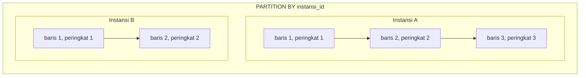

## TL;DR

Window function menghitung nilai agregat (`SUM`, `AVG`, `ROW_NUMBER`, `RANK`, `LAG`/`LEAD`, dll.) **tanpa** mengurangi jumlah baris hasil — berbeda dari `GROUP BY` yang meleburkan banyak baris jadi satu baris per kelompok. Setiap baris tetap muncul di hasil, tapi mendapat kolom tambahan berisi nilai yang dihitung dari sebuah "jendela" (window) baris terkait di sekitarnya, ditentukan lewat klausa `OVER (PARTITION BY ... ORDER BY ...)`. Ini menjawab pertanyaan yang mustahil dijawab `GROUP BY` biasa: "berapa peringkat baris ini di dalam kelompoknya?", "berapa selisih nilai baris ini dari baris sebelumnya?", "berapa total berjalan sampai baris ini?" — semuanya sambil tetap menampilkan detail tiap baris.

## The Problem

Tim ingin laporan "3 permohonan dengan waktu pemrosesan tercepat, **per instansi**" — bukan 3 tercepat secara global, tapi 3 tercepat masing-masing di dalam setiap instansi. `GROUP BY` tidak bisa menjawab ini secara langsung, karena `GROUP BY` meleburkan seluruh baris permohonan sebuah instansi jadi satu baris ringkasan — begitu dileburkan, informasi "permohonan mana saja" sudah hilang, padahal itu justru yang ditanyakan.

Pendekatan naif: `GROUP BY instansi_id` untuk cari `MIN(waktu_proses)`, lalu `JOIN` balik ke tabel `permohonan` untuk mencari baris mana yang cocok — tapi ini hanya menemukan yang **tercepat tunggal**, dan tersandung lagi begitu butuh 3 teratas, bukan 1. Window function menjawab ini secara langsung: beri peringkat tiap permohonan **di dalam kelompok instansinya masing-masing**, tanpa pernah meleburkan barisnya.

## Intuition

Bayangkan `GROUP BY` seperti **meleburkan semua nilai dalam satu kelompok jadi satu angka ringkasan** — detail individualnya hilang. Window function seperti **menempelkan sticky note di setiap baris**, berisi informasi tentang "di mana posisi baris ini dibanding baris-baris lain yang sejenis" — tapi barisnya sendiri tetap utuh, tidak dileburkan.

Analogi ini bocor pada satu hal: sticky note dalam analogi terdengar seperti informasi tambahan yang pasif, padahal window function bisa menghitung sesuatu yang **butuh melihat seluruh kelompok terlebih dulu** (misalnya `SUM() OVER (PARTITION BY ...)` — total dari seluruh baris di partisi itu) sebelum bisa ditempelkan ke satu baris — jadi secara komputasi ia tetap sebuah agregasi penuh per kelompok, hanya saja hasilnya **disiarkan kembali** ke tiap baris anggota kelompok, bukan diringkas jadi satu baris.

## How It Works

Struktur umum: `fungsi() OVER (PARTITION BY kolom_kelompok ORDER BY kolom_urut)`.

`PARTITION BY` membagi baris jadi kelompok — mirip `GROUP BY`, tapi tidak meleburkannya. `ORDER BY` di dalam `OVER` menentukan urutan baris **di dalam tiap partisi**, dipakai fungsi seperti `ROW_NUMBER()`, `RANK()`, `LAG()`/`LEAD()` yang butuh tahu urutan.

```sql
SELECT
    instansi_id,
    id,
    waktu_proses,
    ROW_NUMBER() OVER (PARTITION BY instansi_id ORDER BY waktu_proses ASC) AS peringkat
FROM permohonan;
```

Menjawab masalah "The Problem", bungkus dengan CTE lalu saring peringkatnya:

```sql
WITH peringkat_per_instansi AS (
    SELECT
        instansi_id, id, waktu_proses,
        ROW_NUMBER() OVER (PARTITION BY instansi_id ORDER BY waktu_proses ASC) AS peringkat
    FROM permohonan
)
SELECT instansi_id, id, waktu_proses
FROM peringkat_per_instansi
WHERE peringkat <= 3;
```

Perhatikan `WHERE peringkat <= 3` **tidak bisa** langsung ditaruh di query yang sama dengan `ROW_NUMBER()` — window function dievaluasi di tahap yang setara dengan `SELECT` dalam urutan logis (lihat [[The Logical Order of Query Execution]]), yaitu **setelah** `WHERE`, jadi `WHERE` tidak pernah bisa melihat hasil window function secara langsung dalam query yang sama. Ini alasan konkret kenapa dibutuhkan CTE atau subquery pembungkus.



Diagram ini menunjukkan `ROW_NUMBER()` mengulang dari 1 di setiap partisi — peringkat instansi A tidak melanjutkan hitungan dari instansi B.

`RANK()` dan `DENSE_RANK()` mirip `ROW_NUMBER()` tapi menangani nilai yang sama (*ties*) secara berbeda: `RANK()` melompati nomor setelah ties (1, 1, 3), `DENSE_RANK()` tidak melompat (1, 1, 2), sementara `ROW_NUMBER()` selalu memberi nomor unik berurutan tanpa peduli ties (1, 2, 3) — pilihan di antara ketiganya bergantung apakah "lompatan nomor setelah seri" itu bermakna bagi kebutuhan bisnisnya.

`LAG()`/`LEAD()` mengambil nilai dari baris sebelumnya/berikutnya di dalam partisi yang sama — berguna untuk menghitung selisih antar baris berurutan, seperti "berapa hari sejak status permohonan sebelumnya berubah."

## In Go

```go
package main

import (
	"context"
	"database/sql"
	"fmt"
)

type PermohonanTercepat struct {
	InstansiID   int
	PermohonanID int
	WaktuProses  int // dalam menit
}

// AmbilTigaTercepatPerInstansi memakai ROW_NUMBER() dibungkus CTE, karena
// hasil window function tidak bisa langsung disaring di WHERE query yang sama.
func AmbilTigaTercepatPerInstansi(ctx context.Context, db *sql.DB) ([]PermohonanTercepat, error) {
	rows, err := db.QueryContext(ctx, `
		WITH peringkat AS (
			SELECT
				instansi_id, id AS permohonan_id, waktu_proses,
				ROW_NUMBER() OVER (PARTITION BY instansi_id ORDER BY waktu_proses ASC) AS rn
			FROM permohonan
			WHERE status = 'selesai'
		)
		SELECT instansi_id, permohonan_id, waktu_proses
		FROM peringkat
		WHERE rn <= 3
		ORDER BY instansi_id, waktu_proses ASC
	`)
	if err != nil {
		return nil, fmt.Errorf("query tiga tercepat per instansi: %w", err)
	}
	defer rows.Close()

	var hasil []PermohonanTercepat
	for rows.Next() {
		var p PermohonanTercepat
		if err := rows.Scan(&p.InstansiID, &p.PermohonanID, &p.WaktuProses); err != nil {
			return nil, fmt.Errorf("scan baris permohonan tercepat: %w", err)
		}
		hasil = append(hasil, p)
	}
	if err := rows.Err(); err != nil {
		return nil, fmt.Errorf("iterasi baris permohonan tercepat: %w", err)
	}
	return hasil, nil
}
```

## In His Stack

MariaDB baru mendukung window function sejak versi 10.2 — sistem legacy yang masih berjalan di versi lebih lama dari itu tidak punya akses ke fitur ini sama sekali, dan pola "top-N per group" harus disimulasikan lewat correlated subquery atau variabel sesi (`@rank := @rank + 1`), yang jauh lebih rapuh dan sulit dibaca. Kalau kamu mengelola atau berkoordinasi dengan sistem lintas 13+ aplikasi pemerintah, memverifikasi versi MariaDB aktual tiap sistem sebelum mengasumsikan window function tersedia adalah langkah yang layak, bukan formalitas.

> [!question] Perlu diverifikasi
> Klaim: MariaDB mendukung window function sejak versi 10.2.
> Kenapa ragu: nomor versi persis mudah salah diingat dan bisa berbeda antara MariaDB dan MySQL (MySQL mendukungnya sejak 8.0, database yang cabangnya berbeda dari MariaDB).
> Cara verifikasi: changelog resmi MariaDB untuk fitur "window functions", atau jalankan langsung `SELECT VERSION();` lalu cek dokumentasi versi tersebut.

## Trade-offs and When Not To Use It

Window function menambah kompleksitas bacaan bagi yang belum terbiasa dengan sintaks `OVER (PARTITION BY ... ORDER BY ...)`, dan tidak semua mesin database versi lama mendukungnya. Untuk kebutuhan yang benar-benar hanya butuh satu angka ringkasan per kelompok (bukan detail tiap baris), `GROUP BY` biasa lebih sederhana dan biasanya lebih murah — jangan memakai window function hanya karena terasa lebih canggih. Window function bernilai justru saat kebutuhannya secara eksplisit adalah "detail tiap baris **plus** konteks dari kelompoknya" — top-N per group, running total, perbandingan dengan baris sebelumnya/berikutnya, atau persentil dalam kelompok.

## Common Mistakes

> [!warning] Jebakan
> Mencoba menyaring hasil window function langsung di `WHERE` pada query yang sama — window function dievaluasi setelah `WHERE`, sehingga selalu butuh dibungkus CTE atau subquery untuk bisa disaring.

> [!warning] Jebakan
> Memakai `ROW_NUMBER()` padahal maksudnya menangani ties dengan adil (misalnya dua permohonan dengan waktu proses identik seharusnya sama-sama "peringkat 1") — `ROW_NUMBER()` selalu memberi nomor unik meskipun nilainya sama, `RANK()` atau `DENSE_RANK()` yang seharusnya dipakai.

> [!warning] Jebakan
> Lupa menambahkan `PARTITION BY`, sehingga window function beroperasi pada **seluruh tabel sebagai satu partisi besar** alih-alih per kelompok yang dimaksud — hasilnya peringkat atau total berjalan lintas seluruh data, bukan per instansi/per grup yang sebenarnya diinginkan.

## Exercises

1. Jelaskan perbedaan hasil `RANK()`, `DENSE_RANK()`, dan `ROW_NUMBER()` untuk data dengan nilai yang sama di beberapa baris berurutan.
2. Tulis query yang menghitung "total permohonan berjalan (running total) per hari" untuk sebuah instansi, memakai `SUM() OVER (ORDER BY tanggal)`.
3. Kenapa `ROW_NUMBER() OVER (...) AS rn` yang dihitung di sebuah query tidak bisa langsung disaring dengan `WHERE rn <= 3` di query yang sama?
4. Desain terbuka: dashboard operasional butuh menampilkan, untuk setiap permohonan, "berapa lama sejak status permohonan sebelumnya (dari instansi yang sama) berubah" — untuk mendeteksi apakah sebuah instansi tiba-tiba mengirim permohonan jauh lebih jarang dari biasanya. Rancang query memakai window function yang sesuai, dan jelaskan kenapa `LAG()` dipilih dibanding pendekatan lain seperti self-join.

> [!success]- Kunci jawaban
> **1.** Untuk data `[10, 20, 20, 30]` diurutkan: `ROW_NUMBER()` menghasilkan `1, 2, 3, 4` (selalu unik, walau nilai 20 muncul dua kali). `RANK()` menghasilkan `1, 2, 2, 4` (dua baris nilai 20 sama-sama peringkat 2, lalu peringkat 3 dilompati). `DENSE_RANK()` menghasilkan `1, 2, 2, 3` (sama-sama peringkat 2, tapi peringkat berikutnya tetap 3, tidak melompat).
> **4.** `LAG(tanggal_perubahan) OVER (PARTITION BY instansi_id ORDER BY tanggal_perubahan)` mengambil nilai `tanggal_perubahan` dari baris sebelumnya **di dalam partisi instansi yang sama**, lalu selisihnya terhadap baris saat ini dihitung sebagai `tanggal_perubahan - LAG(tanggal_perubahan) OVER (...)`. `LAG()` dipilih dibanding self-join karena self-join butuh syarat penjodohan eksplisit ("baris sebelumnya" harus dicari lewat subquery `MAX(tanggal) WHERE tanggal < tanggal_saat_ini`, per baris), yang jauh lebih mahal secara eksekusi (butuh scan berulang per baris) dan lebih rumit ditulis dibanding `LAG()` yang menyelesaikan pekerjaan "ambil nilai baris sebelumnya dalam urutan partisi" dalam satu ekspresi deklaratif.

## Self-Check

- Apa perbedaan mendasar window function dan `GROUP BY` dalam hal jumlah baris hasil?
- Fungsi apa yang dipakai untuk mengambil top-N per kelompok, dan kenapa hasilnya harus dibungkus CTE/subquery sebelum bisa disaring?
- Apa beda `RANK()` dan `DENSE_RANK()` saat menangani nilai yang sama?
- Kapan `LAG()`/`LEAD()` lebih tepat dipakai dibanding self-join?

## Connected Notes

- [[Aggregation and GROUP BY Semantics]] — window function menjawab pertanyaan yang mirip agregasi, tapi tanpa meleburkan baris seperti `GROUP BY`.
- [[Subqueries vs CTEs]] — hasil window function hampir selalu perlu dibungkus CTE/subquery sebelum bisa disaring lewat `WHERE`.
- [[The Logical Order of Query Execution]] — window function dievaluasi setara dengan tahap `SELECT`, setelah `WHERE` — inilah kenapa penyaringannya butuh lapisan tambahan.
- [[Reading EXPLAIN]] — cara memverifikasi biaya nyata sebuah window function terhadap dataset besar, alih-alih menebak.
- [[Composite Indexes and the Leftmost-Prefix Rule]] — kolom yang dipakai `PARTITION BY`/`ORDER BY` dalam window function bisa memanfaatkan index yang tepat untuk menghindari sort mahal.

## Further Reading

- Dokumentasi resmi PostgreSQL, bagian "Window Functions" di manual `SELECT` — penjelasan paling lengkap dan konsisten tentang semantik `OVER()`.
- Dokumentasi resmi MariaDB, bagian "Window Functions".

## Catatan Saya

*Tulis di sini kebutuhan laporan "top-N per group" atau "running total" yang pernah kamu temui di kerjaan, dan bagaimana itu diselesaikan sebelum (atau tanpa) window function.*
