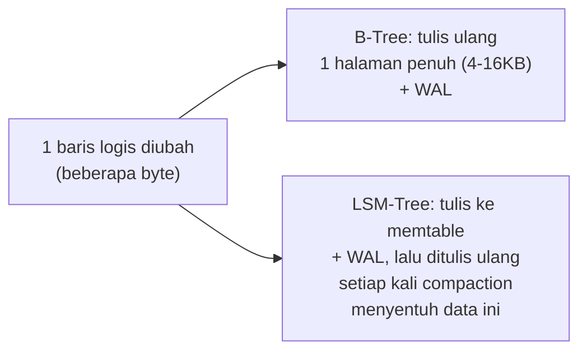

## TL;DR

[[LSM-Trees vs B-Trees]] menyinggung bahwa keduanya membayar "pajak" tulis tambahan lewat mekanisme berbeda — note ini memberi nama dan angka pada pajak itu: **write amplification**, rasio antara berapa banyak data yang benar-benar ditulis ke disk dibanding berapa banyak data yang secara logis diminta aplikasi untuk ditulis. Menulis satu baris kecil bisa, di baliknya, memicu penulisan ulang halaman berukuran jauh lebih besar (B-Tree) atau memicu compaction yang menulis ulang data yang sama berkali-kali seiring waktu (LSM-Tree) — angka amplifikasi 10x atau lebih bukan hal aneh. **Compression** adalah salah satu alat mengurangi dampak fisiknya (data yang ditulis ulang lebih kecil), tapi menambah beban CPU sebagai gantinya — trade-off yang sekali lagi tidak gratis.

## The Problem

Sebuah tim mengukur bahwa aplikasinya menulis sekitar 50 MB data logis ke database per jam, tapi monitoring disk menunjukkan volume tulis fisik ke SSD jauh lebih besar — mendekati 500 MB per jam. Selisih 10x ini bukan bug atau kebocoran — ini write amplification yang normal terjadi di balik layar, dan penting dipahami khususnya untuk sistem yang berjalan di infrastruktur dengan biaya I/O yang dihitung eksplisit (cloud storage dengan billing per operasi I/O) atau di storage dengan keterbatasan fisik (SSD yang punya batas siklus tulis/erase sebelum mulai rusak).

Tim ini awalnya mengira menambah SSD berkapasitas besar akan menyelesaikan masalah pertumbuhan data — tapi tanpa memahami write amplification, mereka tidak menyadari bahwa **umur pakai** SSD (dibatasi jumlah siklus tulis, bukan hanya kapasitas) terkikis 10x lebih cepat dari yang mereka kira berdasarkan volume data logis aplikasi, sebuah biaya operasional tersembunyi yang baru terlihat saat SSD mulai menunjukkan tanda keausan jauh lebih cepat dari perkiraan garansi vendor.

## Intuition

Bayangkan write amplification seperti **merevisi satu kalimat di tengah dokumen cetak yang sudah dijilid** — mengubah satu kalimat kecil di halaman 50 dari dokumen setebal 200 halaman, dalam praktiknya berarti mencetak ulang **seluruh** halaman itu (kadang beberapa halaman sekaligus kalau perubahan panjangnya menggeser teks), bukan hanya mengganti kalimat itu sendiri. Rasio "berapa banyak kertas dicetak ulang" dibanding "berapa banyak teks sebenarnya berubah" adalah write amplification versi kertas — perubahan sekecil apa pun tetap memicu pencetakan ulang dalam unit halaman penuh, karena itulah unit terkecil yang bisa ditulis ulang di sistem percetakan itu.

Analogi ini bocor pada satu hal: kertas yang dicetak ulang tidak "aus" secara fisik dari proses percetakan itu sendiri (kertas baru dipakai setiap kali). SSD justru **fisiknya sendiri** yang terkikis setiap kali ditulis — setiap sel flash memory punya jumlah siklus tulis/hapus terbatas sebelum mulai gagal menyimpan data dengan andal, sehingga write amplification bukan sekadar soal "kerja lebih banyak" tapi juga "mendekati akhir umur hardware lebih cepat".

## How It Works

**Write amplification di B-Tree** terjadi lewat beberapa jalur. Unit tulis ke disk adalah **halaman penuh** (16KB default di InnoDB, 8KB di PostgreSQL), meski perubahannya hanya beberapa byte; kalau perubahan memicu node split (dibahas di [[B+Tree Structure]]), lebih dari satu halaman ditulis ulang. Halaman yang sering diubah biasanya dikumpulkan dulu di memori (buffer pool) sehingga beberapa perubahan terbayar oleh satu kali tulis, tapi halaman yang disentuh sekali lalu di-flush membayar harga penuh. Di atas itu, write-ahead log (redo log di InnoDB, WAL di PostgreSQL) mencatat setiap perubahan sebelum diterapkan. Kedua engine juga punya perlindungan terhadap halaman yang tertulis setengah saat crash, dan keduanya menambah tulisan: InnoDB menulis setiap halaman dua kali lewat *doublewrite buffer*, sedangkan PostgreSQL menulis salinan halaman penuh ke WAL pada perubahan pertama setelah checkpoint (`full_page_writes`).

**Write amplification di LSM-Tree** terjadi lewat compaction: data yang sama, secara logis ditulis **satu kali** oleh aplikasi, bisa ditulis ulang secara fisik **berkali-kali** seiring proses compaction menggabungkan SSTable kecil jadi SSTable lebih besar berulang kali sepanjang siklus hidup data itu di sistem — semakin banyak level compaction yang dilalui sebuah data sebelum akhirnya dihapus/digantikan, semakin tinggi write amplification totalnya.


```mermaid
flowchart LR
    A["1 baris logis diubah\n(beberapa byte)"] --> B["B-Tree: tulis ulang\n1 halaman penuh (4-16KB)\n+ WAL"]
    A --> C["LSM-Tree: tulis ke memtable\n+ WAL, lalu ditulis ulang\nsetiap kali compaction\nmenyentuh data ini"]
```

Diagram ini menunjukkan bahwa **tidak ada struktur yang bebas dari write amplification** — keduanya membayar pajak ini, hanya lewat mekanisme dan pola yang berbeda. Mengukur write amplification aktual (rasio bytes ditulis ke disk dibanding bytes yang diminta aplikasi, biasanya tersedia lewat metrik storage engine atau OS-level disk I/O monitoring) adalah langkah pertama memahami apakah sistem tertentu punya amplifikasi yang wajar atau tidak wajar tinggi untuk beban kerjanya.

## Under The Hood

**Compression** mengurangi write amplification secara tidak langsung — dengan mengompresi data sebelum ditulis ke disk, jumlah **byte fisik** yang ditulis untuk representasi logis yang sama menjadi lebih kecil, mengurangi dampak fisik dari amplifikasi yang tetap terjadi secara rasio. Trade-off-nya eksplisit: kompresi butuh siklus CPU untuk mengompresi saat menulis dan mendekompresi saat membaca — untuk beban kerja yang sudah CPU-bound, menambah kompresi bisa memindahkan bottleneck dari I/O ke CPU, bukan menghilangkan biaya sama sekali, hanya memindahkannya.

Algoritma kompresi yang dipakai database punya trade-off berbeda antara **rasio kompresi** dan **kecepatan**. Snappy dan LZ4 mengutamakan kecepatan dengan rasio sedang; Zstandard (zstd) dan zlib/gzip di level tinggi mengutamakan rasio dengan kecepatan lebih rendah. Pilihan ini tidak punya jawaban universal. Beban tulis sangat tinggi biasanya memilih algoritma cepat, sementara data dingin (arsip yang jarang dibaca) boleh memakai rasio maksimal. Dua contoh konkret: PostgreSQL mengompresi nilai besar di TOAST dengan `pglz` secara default dan menawarkan `lz4` sejak versi 14 (`default_toast_compression`); ClickHouse memakai LZ4 sebagai codec default dan mengizinkan ZSTD per kolom. Untuk engine lain, cek dokumentasi versi yang kamu pakai, karena default-nya berubah antar versi.

## Schema Design Against Write Amplification

Salah satu cara mengurangi write amplification dari sisi aplikasi adalah memisahkan kolom yang sering berubah dari kolom yang jarang berubah. Manfaatnya berbeda antar engine, dan perbedaannya penting:

- **PostgreSQL** memakai MVCC dengan menulis **versi baris baru utuh** untuk setiap `UPDATE` (lihat [[MVCC]]). Mengubah `status` pada baris lebar berarti menyalin seluruh bagian baris yang tersimpan inline, termasuk kolom-kolom yang tidak berubah. Nilai yang sangat besar sudah dipindah ke TOAST dan hanya pointer-nya yang ikut tersalin, tapi kolom berukuran sedang (JSON beberapa ratus byte, `VARCHAR` panjang) ikut tersalin setiap kali.
- **InnoDB** mengubah baris di tempat dan menyimpan versi lama di undo log. Dengan row format `DYNAMIC` (default modern), nilai `BLOB`/`TEXT` yang besar disimpan di halaman overflow terpisah, sehingga `UPDATE status` tidak menulis ulang halaman-halaman itu. Yang tetap terdampak adalah kolom sedang yang disimpan inline: baris jadi lebar, lebih sedikit baris muat per halaman, dan setiap halaman yang di-flush membawa lebih sedikit data yang berguna.

```sql
-- Kolom yang sering berubah: baris sempit, banyak baris per halaman
CREATE TABLE permohonan (
    id BIGINT PRIMARY KEY,
    status VARCHAR(30) NOT NULL,
    diperbarui_pada DATETIME NOT NULL
);

-- Kolom yang ditulis sekali lalu jarang berubah
CREATE TABLE permohonan_detail (
    permohonan_id BIGINT PRIMARY KEY,
    uraian TEXT,
    metadata JSON,
    FOREIGN KEY (permohonan_id) REFERENCES permohonan (id)
);
```

Pemisahan ini paling bernilai di PostgreSQL dan untuk kolom berukuran sedang. Untuk blob besar di InnoDB, manfaat write amplification-nya kecil, meski pemisahan tetap berguna agar `SELECT` yang tidak butuh blob tidak menyentuhnya. Keputusan ini murni keputusan skema; kode Go-nya hanya berubah di query repository yang kini perlu `JOIN` saat data lengkap dibutuhkan.

## In His Stack

Untuk sistem dengan volume log dan audit trail besar (relevan untuk kepatuhan compliance pemerintah), memahami write amplification menjelaskan kenapa biaya storage seringkali jauh lebih tinggi dari yang diharapkan berdasarkan ukuran data mentah — baik dari sisi ruang disk yang terpakai (sebelum kompresi efektif diterapkan) maupun dari sisi keausan hardware fisik untuk deployment on-premise. Untuk deployment di Kubernetes dengan storage berbasis SSD cloud, biaya I/O yang ditagih berdasarkan jumlah operasi (bukan hanya volume data) membuat write amplification punya dampak finansial yang bisa dihitung langsung — sesuatu yang layak dipahami koordinator teknis saat mengevaluasi biaya infrastruktur lintas 13 aplikasi.

## Trade-offs and When Not To Use It

Mengaktifkan kompresi tidak selalu menguntungkan — untuk beban kerja yang sudah CPU-bound (banyak komputasi per request, bukan I/O-bound), menambah overhead kompresi/dekompresi bisa memperlambat keseluruhan sistem meski mengurangi I/O. Untuk data yang sudah terkompresi secara alami (gambar, file terenkripsi, data yang sudah dikompresi di level aplikasi sebelum disimpan), kompresi tambahan di level database memberi manfaat minimal (data yang sudah random/terkompresi tidak bisa dikompresi lebih jauh secara signifikan) sementara tetap membayar biaya CPU untuk mencobanya. Mengurangi write amplification lewat desain skema (memisahkan kolom sering-berubah dari jarang-berubah) juga menambah kompleksitas query (butuh `JOIN` untuk data yang sebelumnya ada dalam satu tabel) — trade-off yang hanya sepadan kalau volume tulis dan write amplification-nya benar-benar terukur signifikan, bukan diterapkan sebagai optimasi prematur di semua tempat.

## Common Mistakes

> [!warning] Jebakan
> Mengukur kebutuhan kapasitas storage/SSD hanya berdasarkan volume data logis aplikasi, tanpa memperhitungkan write amplification — bisa meremehkan kecepatan keausan SSD atau kebutuhan I/O throughput yang sesungguhnya jauh lebih tinggi dari volume data yang terlihat di aplikasi.

> [!warning] Jebakan
> Mengaktifkan kompresi tingkat tinggi secara serampangan tanpa mengukur dampaknya pada CPU — untuk sistem yang sudah CPU-bound, ini bisa memindahkan bottleneck dari I/O ke CPU, memperlambat sistem secara keseluruhan meski volume I/O berkurang.

> [!warning] Jebakan
> Mencampur kolom yang sangat sering berubah dengan kolom berukuran sedang yang jarang berubah dalam satu baris, terutama di PostgreSQL, di mana setiap `UPDATE` menulis versi baris baru yang menyalin semua kolom inline itu.

## Exercises

1. Jelaskan apa itu write amplification, dan kenapa ia terjadi di kedua struktur (B-Tree maupun LSM-Tree) meski lewat mekanisme berbeda.
2. Kenapa write amplification punya dampak finansial langsung untuk deployment di cloud dengan billing berbasis operasi I/O?
3. Kenapa kompresi tidak selalu menguntungkan, meski secara umum mengurangi write amplification fisik?
4. Desain terbuka: tabel `permohonan` di sistemmu punya kolom `status` (diubah puluhan kali per hari per baris seiring alur persetujuan) dan kolom `dokumen_lengkap_base64` (blob besar, disimpan sekali saat submit, hampir tidak pernah berubah). Rancang perubahan skema yang mengurangi write amplification akibat perubahan `status` yang sering, dan jelaskan trade-off yang muncul dari perubahan itu.

> [!success]- Kunci jawaban
> **1.** Write amplification adalah rasio antara byte yang benar-benar ditulis ke disk dibanding byte yang secara logis diminta aplikasi untuk ditulis. Di B-Tree, ia terjadi karena setiap perubahan kecil memaksa penulisan ulang seluruh halaman disk yang menampungnya (plus WAL), bukan hanya byte yang berubah. Di LSM-Tree, ia terjadi karena data yang sama ditulis ulang berkali-kali seiring proses compaction menggabungkan SSTable dari kecil ke besar sepanjang siklus hidupnya di sistem. Kedua mekanisme berbeda total, tapi keduanya menghasilkan fenomena yang sama: byte fisik yang ditulis jauh melebihi byte logis yang diminta.
> **4.** Pertanyaan pertama bukan soal write amplification, tapi kenapa dokumen disimpan sebagai base64 di database. Base64 memperbesar ukuran sekitar sepertiga (lihat [[../30 APIs and Web/Binary in JSON and the Base64 Tax|Binary in JSON and the Base64 Tax]]), dan dokumen besar biasanya lebih tepat disimpan di object storage dengan hanya key dan checksum-nya di database. Kalau dokumen harus tetap di database, pindahkan ke tabel terpisah (`permohonan_dokumen`: `permohonan_id`, `dokumen`) sebagai `BLOB` biner, bukan teks base64. Efeknya bergantung engine. Di PostgreSQL, dokumen sebesar itu sudah berada di TOAST, jadi manfaat terbesarnya ada pada kolom lain berukuran sedang yang ikut tersalin di setiap `UPDATE status`. Di InnoDB, blob besar sudah disimpan off-page, sehingga pemisahan terutama membantu query yang tidak butuh dokumen dan membuat tabel `permohonan` lebih ringkas. Trade-off-nya: mengambil permohonan lengkap beserta dokumen butuh `JOIN` atau query kedua, dan kedua tabel harus diisi dalam satu transaction saat submit.

## Self-Check

- Apa itu write amplification, dan kenapa ia terjadi di B-Tree maupun LSM-Tree?
- Kenapa write amplification punya dampak langsung pada umur pakai SSD, bukan hanya soal kecepatan?
- Apa trade-off inti mengaktifkan kompresi di database?
- Kenapa memisahkan kolom sering-berubah lebih bernilai di PostgreSQL daripada untuk blob besar di InnoDB?

## Connected Notes

- [[LSM-Trees vs B-Trees]] — write amplification adalah biaya konkret yang muncul dari kedua struktur yang dibahas di note itu, hanya lewat mekanisme berbeda.
- [[B+Tree Structure]] — node split yang dibahas di note itu adalah salah satu sumber write amplification di struktur B-Tree.
- [[Beyond Relational - Document, Key-Value, Wide-Column, Graph, and Time-Series Stores]] — pemilihan model data yang tepat untuk pola akses tertentu juga berdampak pada write amplification, dibahas di note berikutnya.
- [[MVCC]] — cara PostgreSQL menulis versi baris baru di setiap `UPDATE` adalah alasan pemisahan kolom sering-berubah paling bernilai di engine itu.
- [[../92 Tools/PostgreSQL - Features Worth Switching For|PostgreSQL - Features Worth Switching For]] — TOAST compression di PostgreSQL adalah implementasi konkret dari trade-off kompresi yang dibahas di note ini.

## Further Reading

- Dokumentasi resmi RocksDB, bagian "Compression" dan penjelasan write amplification di konteks LSM-Tree.
- Dokumentasi resmi PostgreSQL, bagian "TOAST" untuk mekanisme kompresi bawaan pada kolom besar.

## Catatan Saya

*Tulis di sini apakah kamu pernah mengukur write amplification nyata di sistem kerjaanmu (volume I/O fisik dibanding volume data logis) — kalau belum, coba cek metrik storage-nya sekali.*
