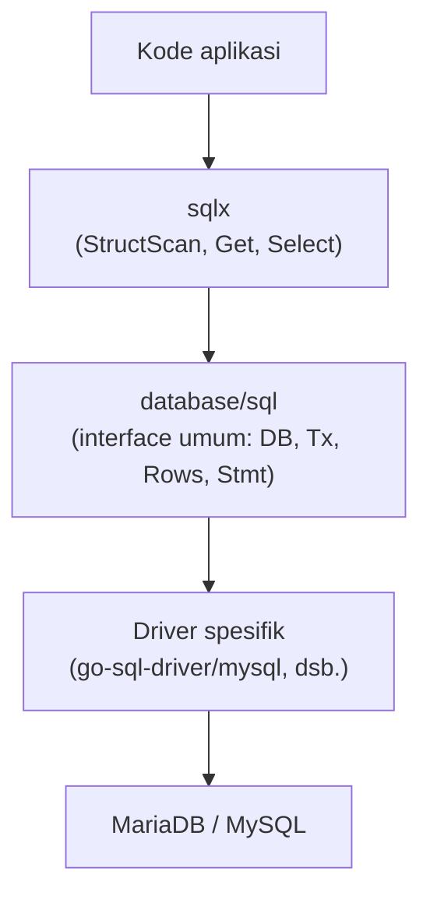

## TL;DR

`database/sql` adalah package standar Go untuk berbicara dengan database relasional — bukan driver itu sendiri, melainkan **interface umum** yang diimplementasikan berbagai driver (`go-sql-driver/mysql`, `lib/pq`, `jackc/pgx`, dll.) lewat `sql.Register()`. Ia menyediakan connection pooling bawaan, `Query`/`Exec`/`QueryRow`, dan tipe `sql.Null*` untuk kolom nullable — tapi API-nya cukup mentah: setiap hasil `SELECT` harus di-`Scan()` manual kolom per kolom ke variabel Go. `sqlx` (library pihak ketiga populer, bukan bagian stdlib) dibangun **di atas** `database/sql`, menambahkan `StructScan` untuk memetakan baris hasil langsung ke field struct lewat tag, dan `Get`/`Select` sebagai pembungkus yang lebih ringkas — tanpa mengorbankan akses langsung ke `database/sql` di baliknya kapan pun dibutuhkan.

## The Problem

Sebuah handler HTTP butuh mengambil satu baris `permohonan` dan mengembalikannya sebagai JSON. Memakai `database/sql` murni:

```go
var p Permohonan
row := db.QueryRowContext(ctx, "SELECT id, judul, status, instansi_id FROM permohonan WHERE id = ?", id)
err := row.Scan(&p.ID, &p.Judul, &p.Status, &p.InstansiID)
```

Ini bekerja, tapi begitu struct `Permohonan` punya lebih dari sepuluh kolom (umum untuk entitas bisnis nyata), daftar `Scan(&p.A, &p.B, &p.C, ...)` menjadi rentan salah urutan — menukar posisi dua argumen `Scan()` yang tipenya kebetulan kompatibel (misalnya dua kolom `string`) tidak akan menghasilkan error kompilasi maupun error runtime; ia hanya diam-diam memasukkan nilai ke field yang salah. Bug ini nyaris mustahil terlihat lewat code review biasa (urutan panjang argumen yang mirip semua), dan hanya ketahuan lewat data yang terasa "aneh" di produksi. `sqlx` menghilangkan seluruh kelas bug ini: `StructScan` memetakan berdasarkan **nama kolom** (lewat tag struct), bukan posisi argumen — menukar urutan kolom di query SQL tidak lagi berpengaruh pada field mana yang terisi.

## Intuition

Bayangkan `database/sql` murni seperti **mengisi formulir dengan mendiktekan jawaban berurutan lewat telepon** — "isi kotak pertama dengan ini, kotak kedua dengan itu" — bekerja, tapi kalau urutan pendiktean meleset satu saja, seluruh formulir terisi salah tanpa ada yang menyadari sampai formulir itu diperiksa ulang. `sqlx` seperti **formulir dengan label di setiap kotaknya** — kamu cukup bilang "nama-nya X, alamat-nya Y", dan sistem mencocokkan berdasarkan label itu sendiri, bukan urutan penyebutan.

Analogi ini bocor pada satu hal: label formulir di dunia nyata dibaca manusia yang bisa menoleransi sedikit variasi penulisan ("Nama" vs "nama" vs "Nama Lengkap"). `sqlx` mencocokkan nama kolom SQL dengan tag struct **secara persis** sesuai konfigurasi tag yang kamu tulis (`db:"nama_kolom"`) — tidak ada toleransi implisit. Kolom yang namanya tidak match tag apa pun di struct akan menghasilkan error eksplisit dari `StructScan` (kecuali kamu memakai opsi yang secara sengaja mengizinkan kolom tidak terpakai), bukan diam-diam diabaikan.

## How It Works

`database/sql` murni:

```go
rows, err := db.QueryContext(ctx, "SELECT id, judul, status FROM permohonan WHERE instansi_id = ?", instansiID)
if err != nil {
    return nil, fmt.Errorf("query permohonan instansi %d: %w", instansiID, err)
}
defer rows.Close()

var daftar []Permohonan
for rows.Next() {
    var p Permohonan
    if err := rows.Scan(&p.ID, &p.Judul, &p.Status); err != nil {
        return nil, fmt.Errorf("scan baris permohonan: %w", err)
    }
    daftar = append(daftar, p)
}
if err := rows.Err(); err != nil {
    return nil, fmt.Errorf("iterasi baris permohonan: %w", err)
}
```

`sqlx`, struct yang sama dengan tag `db`:

```go
type Permohonan struct {
    ID         int    `db:"id"`
    Judul      string `db:"judul"`
    Status     string `db:"status"`
    InstansiID int    `db:"instansi_id"`
}

var daftar []Permohonan
err := sqlxDB.SelectContext(ctx, &daftar,
    "SELECT id, judul, status, instansi_id FROM permohonan WHERE instansi_id = ?", instansiID)
if err != nil {
    return nil, fmt.Errorf("select permohonan instansi %d: %w", instansiID, err)
}
```

`sqlx.DB` **membungkus** `*sql.DB`, bukan menggantikannya — `sqlx.DB.DB` mengekspos `*sql.DB` aslinya kapan pun kamu butuh fitur `database/sql` murni (misalnya `BeginTx` dengan `sql.TxOptions` khusus seperti dibahas di [[Basic Isolation Levels]]).



Diagram ini menunjukkan `sqlx` sebagai lapisan kenyamanan opsional di atas `database/sql`, bukan pengganti — kode yang memakai `sqlx` tetap bisa turun ke `database/sql` murni kapan pun dibutuhkan.

## In Go

```go
package main

import (
	"context"
	"fmt"

	"github.com/jmoiron/sqlx"
	_ "github.com/go-sql-driver/mysql"
)

type Permohonan struct {
	ID         int    `db:"id"`
	Judul      string `db:"judul"`
	Status     string `db:"status"`
	InstansiID int    `db:"instansi_id"`
}

type PermohonanRepository struct {
	db *sqlx.DB
}

// AmbilByID memakai Get, pembungkus sqlx untuk query yang mengharapkan
// tepat satu baris hasil — mengembalikan sql.ErrNoRows kalau tidak ada.
func (r *PermohonanRepository) AmbilByID(ctx context.Context, id int) (*Permohonan, error) {
	var p Permohonan
	err := r.db.GetContext(ctx, &p, "SELECT id, judul, status, instansi_id FROM permohonan WHERE id = ?", id)
	if err != nil {
		return nil, fmt.Errorf("ambil permohonan id %d: %w", id, err)
	}
	return &p, nil
}

// AmbilByInstansi memakai Select untuk query yang mengharapkan banyak baris.
func (r *PermohonanRepository) AmbilByInstansi(ctx context.Context, instansiID int) ([]Permohonan, error) {
	var daftar []Permohonan
	err := r.db.SelectContext(ctx, &daftar,
		"SELECT id, judul, status, instansi_id FROM permohonan WHERE instansi_id = ? ORDER BY id", instansiID)
	if err != nil {
		return nil, fmt.Errorf("ambil permohonan instansi %d: %w", instansiID, err)
	}
	return daftar, nil
}
```

## In His Stack

Yii2 `ActiveRecord` melakukan pemetaan kolom-ke-property secara otomatis lewat reflection PHP, sesuatu yang terasa "gratis" dan mungkin membuat `Scan()` manual `database/sql` Go terasa seperti kemunduran — tapi ini justru perbedaan filosofi bahasa yang disengaja: Go tidak punya reflection implisit di jalur eksekusi normal (reflection eksplisit yang dipakai `sqlx` di baliknya punya biaya performa yang diketahui dan bisa diukur, dibahas lebih dalam di [[../20 Go Language/_Overview|Go Language Overview]]), sehingga developer Go memilih secara sadar kapan mengorbankan sedikit performa itu (`sqlx.StructScan`) demi keterbacaan, dan kapan tetap memakai `Scan()` manual untuk jalur yang benar-benar sensitif performa (misalnya query yang dijalankan jutaan kali per hari).

## Trade-offs and When Not To Use It

`database/sql` murni lebih verbose tapi tidak menambah dependency eksternal dan tidak ada biaya reflection sama sekali — cocok untuk query sederhana, atau kode yang sangat sensitif terhadap setiap alokasi dan setiap nanodetik (jalur hot path bervolume sangat tinggi). `sqlx` mengurangi boilerplate signifikan dan menghilangkan kelas bug "salah urutan Scan" — cocok untuk mayoritas kode aplikasi CRUD biasa, di mana keterbacaan dan kebenaran lebih penting daripada menghemat beberapa mikrodetik reflection per query. Tidak ada alasan memilih salah satu secara eksklusif untuk seluruh basis kode — banyak proyek Go produksi memakai `sqlx` untuk sebagian besar repository, dan turun ke `database/sql` murni untuk jalur yang benar-benar butuh kontrol penuh.

## Common Mistakes

> [!warning] Jebakan
> Menukar urutan argumen `Scan()` (atau urutan field struct saat `Scan()` manual) tanpa disadari — tidak ada error kompilasi maupun runtime kalau tipenya kebetulan kompatibel, hanya data yang salah masuk ke field yang salah.

> [!warning] Jebakan
> Lupa menutup `*sql.Rows` (`defer rows.Close()`) setelah `Query()`/`QueryContext()` — koneksi database tetap "ditahan" dari connection pool sampai `Rows` ditutup atau seluruh baris habis diiterasi, membuat pool cepat kehabisan koneksi di beban tinggi.

> [!warning] Jebakan
> Lupa memeriksa `rows.Err()` setelah loop `for rows.Next()` selesai — error yang terjadi **selama** iterasi (bukan di `Query()` awal, misalnya koneksi terputus di tengah membaca hasil) tidak akan pernah terlihat kalau `rows.Err()` tidak diperiksa setelah loop.

## Exercises

1. Jelaskan kenapa menukar urutan dua argumen `Scan()` yang tipenya sama tidak menghasilkan error, dan bagaimana `sqlx.StructScan` menghindari kelas bug ini.
2. Apa fungsi `defer rows.Close()`, dan apa yang terjadi kalau baris ini lupa ditulis pada kode yang memanggil `Query()` berulang kali dalam volume tinggi?
3. Kapan `database/sql` murni (tanpa `sqlx`) tetap jadi pilihan yang tepat, meski `sqlx` tersedia?
4. Desain terbuka: kamu me-review kode teman satu tim yang menulis repository dengan `Scan()` manual untuk struct berisi 22 kolom, dengan urutan `Scan()` yang sudah dua kali menyebabkan bug data salah field dalam sebulan terakhir (masing-masing baru ketahuan berhari-hari setelah deploy). Tulis argumen untuk migrasi repository ini ke `sqlx`, termasuk bagaimana migrasi ini dilakukan bertahap tanpa mengubah seluruh basis kode sekaligus, dan trade-off apa yang perlu didiskusikan dengan tim sebelum keputusan itu diambil.

> [!success]- Kunci jawaban
> **1.** `Scan(&a, &b)` menerima daftar pointer secara posisional — Go tidak tahu (dan `database/sql` tidak memeriksa) apakah pointer pertama "seharusnya" menerima kolom pertama hasil query; ia hanya menyalin nilai kolom ke-N ke argumen ke-N tanpa validasi semantik. Kalau `a` dan `b` sama-sama bertipe `string`, menukar urutannya tetap valid secara tipe, jadi tidak ada error kompilasi atau runtime. `sqlx.StructScan` menghindarinya dengan mencocokkan berdasarkan **nama kolom** hasil query terhadap tag `db:"..."` struct — urutan kolom di `SELECT` tidak lagi berpengaruh sama sekali terhadap field mana yang terisi.
> **4.** Argumen intinya: kelas bug "salah urutan Scan" ini sudah terbukti dua kali menyebabkan insiden produksi, dan `sqlx.StructScan` menghilangkannya secara struktural (bukan sekadar "lebih hati-hati kali ini"), dengan biaya reflection yang untuk repository CRUD biasa (bukan hot path bervolume ekstrem) hampir pasti tidak terasa. Migrasi bertahap bisa dilakukan repository per repository — karena `sqlx.DB` membungkus `*sql.DB` tanpa mengubah kontraknya, repository yang belum dimigrasi tetap bisa hidup berdampingan dengan yang sudah, tanpa perlu big-bang rewrite. Trade-off yang perlu didiskusikan: dependency eksternal baru (`sqlx` bukan stdlib, perlu masuk `go.mod` dan dipertimbangkan sebagai bagian dari supply chain proyek), dan kesepakatan tim soal kapan tetap memakai `database/sql` murni (jalur yang benar-benar sensitif performa) supaya basis kode tidak campur aduk tanpa pola yang jelas.

## Self-Check

- Apa hubungan `sqlx` dengan `database/sql` — apakah ia pengganti atau lapisan tambahan?
- Kenapa menukar urutan argumen `Scan()` bisa jadi bug yang lolos code review?
- Apa risiko lupa memanggil `rows.Close()` setelah `Query()`?
- Kapan `database/sql` murni tetap lebih tepat dibanding `sqlx`?

## Connected Notes

- [[Basic Isolation Levels]] — `sql.TxOptions{Isolation: ...}` adalah bagian dari `database/sql` yang dipakai langsung untuk mengatur isolation level dari kode Go.
- [[../20 Go Language/Interfaces and Implicit Satisfaction|Interfaces and Implicit Satisfaction]] — `database/sql` sendiri adalah contoh nyata desain lewat interface: driver berbeda-beda mengimplementasikan interface yang sama tanpa `database/sql` perlu tahu detail masing-masing.
- [[Prepared Statements]] — `Query`/`Exec`/`QueryRow` di `database/sql` secara otomatis memakai prepared statement di balik layar untuk parameter placeholder (`?`/`$1`), dibahas lebih dalam di note berikutnya.
- [[Connection Pooling]] — `*sql.DB` bukan koneksi tunggal, melainkan pool koneksi yang dikelola otomatis; perilaku pool inilah yang dibahas mendalam di note itu.
- [[Database Transactions]] — `sql.Tx` dan `sqlx.Tx` sama-sama membungkus mekanisme transaction yang dibahas di note itu, dengan API yang konsisten dengan `DB`/`Query`/`Exec` biasa.

## Further Reading

- Dokumentasi resmi package `database/sql` (pkg.go.dev/database/sql).
- Dokumentasi resmi `sqlx` (pkg.go.dev/github.com/jmoiron/sqlx), khususnya bagian `StructScan` dan perbedaan `Get`/`Select`/`Queryx`.

## Catatan Saya

*Tulis di sini repository di kerjaanmu yang masih memakai Scan() manual dengan banyak kolom — apakah pernah mengalami bug salah urutan seperti yang dibahas di note ini?*
