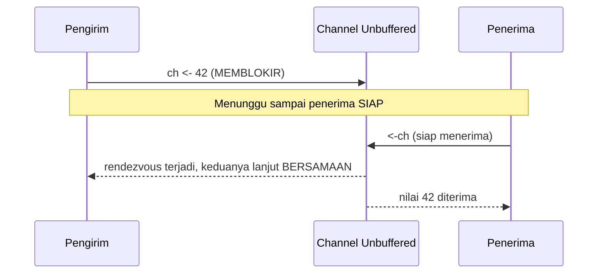

## TL;DR

Channel adalah cara idiomatic Go mengomunikasikan data antar goroutine — filosofi "share memory by communicating" alih-alih "communicate by sharing memory". Channel **unbuffered** (`make(chan int)`) memaksa pengirim dan penerima bertemu di titik waktu yang sama — pengirim **memblokir** sampai ada penerima yang siap menerima, dan sebaliknya, membentuk sinkronisasi rendezvous yang eksplisit. Channel **buffered** (`make(chan int, 5)`) memberi ruang tunggu — pengirim bisa mengirim tanpa memblokir selama buffer belum penuh, memisahkan waktu pengiriman dari waktu penerimaan. Memilih yang salah antara keduanya adalah sumber bug yang sangat umum: unbuffered yang dikira buffered menyebabkan deadlock tak terduga; buffered dengan ukuran yang salah menyembunyikan backpressure yang seharusnya terlihat.

## The Problem

Sebuah goroutine mengirim hasil pemrosesan ke channel unbuffered, berharap goroutine lain akan "mengambilnya nanti" — tapi karena channel ini unbuffered, `channel <- hasil` **memblokir** sampai ada goroutine lain yang benar-benar menjalankan `<-channel` di titik yang sama. Kalau tidak ada satu pun goroutine yang menerima (misalnya karena goroutine penerima sudah selesai lebih dulu, atau logikanya salah), goroutine pengirim akan **menunggu selamanya** — sebuah deadlock yang sering baru terlihat di production di bawah kondisi tertentu (goroutine penerima keluar lebih awal karena context dibatalkan, misalnya), bukan di testing lokal yang selalu menjalankan kedua goroutine dengan urutan yang sama.

Masalah kebalikan yang sama seriusnya: sebuah pipeline memakai channel buffered dengan ukuran yang dipilih sembarangan (`make(chan Job, 10000)`) sebagai "solusi" untuk error "goroutine blocking" yang sebelumnya terjadi — bug itu memang hilang, tapi masalah sesungguhnya (penerima yang terlalu lambat memproses dibanding laju pengiriman) tidak pernah benar-benar diperbaiki, hanya ditunda sampai buffer besar itu sendiri penuh. Buffer yang sangat besar juga menyembunyikan sinyal backpressure yang seharusnya memberi tahu sistem upstream untuk memperlambat laju pengiriman — masalah yang idealnya terlihat cepat (buffer kecil, cepat penuh, cepat terdeteksi) malah tertunda sampai kondisi jauh lebih parah.

## Intuition

Bayangkan channel unbuffered seperti **serah terima barang langsung dari tangan ke tangan** — pengirim harus benar-benar bertemu penerima secara bersamaan; kalau penerima belum datang, pengirim berdiri menunggu di tempat sampai penerima tiba. Channel buffered seperti **kotak surat dengan kapasitas terbatas** — pengirim bisa menaruh surat dan pergi tanpa menunggu penerima datang, selama kotak surat belum penuh; begitu penuh, pengirim berikutnya harus menunggu sampai penerima mengambil setidaknya satu surat untuk memberi ruang.

Analogi ini bocor pada satu hal: kotak surat fisik yang penuh biasanya terlihat jelas (surat menumpuk keluar kotak). Channel buffered yang penuh **tidak terlihat** dari luar sampai kode benar-benar mencoba mengirim ke sana dan memblokir — tidak ada peringatan bertahap, hanya baik-baik saja sampai tiba-tiba memblokir persis seperti unbuffered begitu buffer penuh. Ini kenapa memantau ukuran channel yang benar-benar terisi (lewat `len(channel)`, atau lebih baik lewat metrik eksplisit) penting untuk sistem production, bukan sekadar mengandalkan ukuran buffer besar sebagai jaring pengaman pasif.

## How It Works

```go
package main

import "fmt"

func contohUnbuffered() {
	ch := make(chan int) // UNBUFFERED

	go func() {
		fmt.Println("goroutine: mengirim...")
		ch <- 42 // MEMBLOKIR sampai ada penerima siap
		fmt.Println("goroutine: terkirim!")
	}()

	fmt.Println("main: menerima...")
	nilai := <-ch // rendezvous terjadi persis di titik ini
	fmt.Println("main: menerima", nilai)
}

func contohBuffered() {
	ch := make(chan int, 2) // BUFFERED, kapasitas 2

	ch <- 1 // TIDAK memblokir, buffer masih ada ruang (0/2 -> 1/2)
	ch <- 2 // TIDAK memblokir (1/2 -> 2/2, buffer PENUH sekarang)
	// ch <- 3 // INI AKAN MEMBLOKIR — buffer sudah penuh, tidak ada penerima

	fmt.Println(<-ch) // 1 (FIFO — first in, first out)
	fmt.Println(<-ch) // 2
}
```



Diagram ini menunjukkan sifat rendezvous channel unbuffered: pengiriman dan penerimaan terjadi di titik waktu yang **sama persis** — tidak ada satu pun yang "selesai" sebelum yang lain siap, memberi jaminan sinkronisasi yang kuat (kalau `ch <- 42` sudah selesai dieksekusi, itu **menjamin** ada penerima yang sudah menerima nilai itu, bukan sekadar "tersimpan di suatu tempat").

## Under The Hood

Channel unbuffered memberi jaminan sinkronisasi yang lebih kuat secara implisit — selesainya operasi kirim **menjamin** penerima sudah mulai menerima (happens-before relationship, dibahas formal di [[The Go Memory Model]]), properti yang berguna untuk memastikan urutan kejadian tertentu tanpa mekanisme sinkronisasi tambahan. Channel buffered melonggarkan jaminan ini — selesainya operasi kirim hanya menjamin nilai sudah masuk buffer, bukan bahwa penerima sudah menerimanya (atau bahkan bahwa penerima akan pernah menerimanya kalau ada bug di sisi penerima).

**Menutup channel** (`close(ch)`) memberi sinyal "tidak akan ada pengiriman lagi" ke seluruh penerima — penerima yang membaca dari channel yang sudah ditutup akan terus menerima nilai yang tersisa di buffer (kalau ada) diikuti nilai zero-value channel itu tanpa memblokir, bukan panic; **mengirim** ke channel yang sudah ditutup, sebaliknya, akan panic seketika. Aturan konvensi yang penting: hanya **pengirim** yang seharusnya menutup channel, tidak pernah penerima — penerima yang menutup channel berisiko channel itu ditutup dua kali (panic) atau ditutup saat pengirim lain masih mencoba mengirim (juga panic).

## In Go

```go
package pipeline

import (
	"context"
	"fmt"
)

// ProdusenKeKonsumer menunjukkan penggunaan channel yang IDIOMATIC:
// unbuffered untuk sinyal "selesai" yang butuh jaminan sinkron, buffered
// kecil untuk data yang laju produksinya sedikit tidak merata tapi
// TETAP terbatas (bukan buffer besar sembarangan).
func ProdusenKeKonsumer(ctx context.Context, jumlahItem int) <-chan int {
	// Buffer kecil (bukan nol, bukan besar) — memberi sedikit ruang
	// toleransi laju produksi vs konsumsi TANPA menyembunyikan
	// backpressure sepenuhnya seperti buffer besar akan lakukan.
	keluaran := make(chan int, 4)

	go func() {
		defer close(keluaran) // KONVENSI: pengirim yang menutup channel

		for i := 0; i < jumlahItem; i++ {
			select {
			case keluaran <- i:
				// terkirim (mungkin menunggu kalau buffer penuh)
			case <-ctx.Done():
				// context dibatalkan — berhenti mengirim, HINDARI
				// goroutine leak yang terjebak menunggu channel penuh
				// selamanya (dibahas di Goroutine Leaks).
				return
			}
		}
	}()

	return keluaran
}

func contohKonsumsi(ctx context.Context) {
	untukKonsumen := ProdusenKeKonsumer(ctx, 10)
	// range atas channel BERHENTI OTOMATIS saat channel ditutup —
	// tidak perlu mekanisme "selesai" terpisah.
	for nilai := range untukKonsumen {
		fmt.Println("konsumsi:", nilai)
	}
}
```

## In His Stack

Yii2/PHP tidak punya konsep channel sama sekali — komunikasi antar "unit kerja" konkuren di PHP klasik biasanya lewat mekanisme eksternal (queue seperti RabbitMQ, atau database sebagai perantara), karena model eksekusi PHP tradisional tidak punya goroutine atau setara dalam satu proses. Channel Go, sebaliknya, adalah primitif **dalam proses** untuk komunikasi antar goroutine — jauh lebih murah dan cepat dibanding melibatkan sistem eksternal, tapi hanya berlaku dalam satu proses aplikasi Go yang sama (komunikasi lintas proses/service tetap butuh Kafka, HTTP, atau mekanisme lain yang dibahas di domain `30 APIs and Web`).

## Trade-offs and When Not To Use It

Unbuffered channel memberi jaminan sinkronisasi terkuat tapi memaksa kedua sisi (pengirim dan penerima) selalu siap bersamaan — untuk kasus di mana laju produksi dan konsumsi wajar sedikit berbeda tanpa masalah, unbuffered channel bisa menyebabkan salah satu sisi menunggu tanpa perlu, mengurangi throughput yang sebenarnya bisa dicapai. Buffered channel mengurangi pemblokiran tapi menyembunyikan masalah laju produksi vs konsumsi yang tidak seimbang sampai buffer benar-benar penuh — ukuran buffer yang dipilih sembarangan (terlalu besar) hanya menunda deteksi masalah nyata, sementara ukuran yang terlalu kecil bisa membuat throughput tidak lebih baik dari unbuffered. Aturan praktis: pilih ukuran buffer berdasarkan **pengukuran nyata** laju produksi/konsumsi (mirip metodologi Little's Law yang dibahas di note lain domain ini), bukan angka yang "terasa aman".

## Common Mistakes

> [!warning] Jebakan
> Mengira channel unbuffered berperilaku seperti buffered kecil ("kan cuma nunggu sebentar") — unbuffered benar-benar memblokir sampai ada penerima yang siap di titik yang sama, bisa menyebabkan deadlock kalau tidak ada penerima yang pernah muncul.

> [!warning] Jebakan
> Memakai buffer yang sangat besar sebagai "solusi cepat" untuk masalah goroutine yang memblokir, tanpa menyelidiki kenapa laju produksi dan konsumsi tidak seimbang — menunda deteksi masalah nyata, bukan memperbaikinya.

> [!warning] Jebakan
> Menutup channel dari sisi penerima, atau menutup channel yang sama dua kali dari pengirim — keduanya menyebabkan panic; konvensi yang aman adalah hanya satu pengirim yang bertanggung jawab menutup channel, tepat sekali.

## Exercises

1. Jelaskan perbedaan jaminan sinkronisasi antara channel unbuffered dan buffered.
2. Kenapa buffer channel yang sangat besar dianggap "menunda" masalah, bukan menyelesaikannya?
3. Kenapa hanya pengirim yang seharusnya menutup channel, tidak pernah penerima?
4. Desain terbuka: pipeline pemrosesan dokumenmu punya satu goroutine produsen yang membaca dari database (cepat) dan satu goroutine konsumen yang mengunggah ke storage eksternal (lambat, laju tidak konsisten tergantung kondisi jaringan). Rancang strategi channel (unbuffered, buffered dengan ukuran tertentu, atau kombinasi mekanisme lain) untuk pipeline ini, dan jelaskan bagaimana desainmu memberi sinyal backpressure yang terlihat ketika konsumen benar-benar tidak bisa mengejar laju produsen, alih-alih menyembunyikannya di balik buffer besar.

> [!success]- Kunci jawaban
> **1.** Channel unbuffered memberi jaminan **rendezvous** — operasi kirim baru dianggap selesai persis pada saat penerima juga sudah mulai menerima nilai itu, menciptakan titik sinkronisasi eksplisit antara dua goroutine. Channel buffered melonggarkan ini — operasi kirim selesai begitu nilai masuk ke buffer, tanpa jaminan apa pun soal kapan (atau apakah) penerima akan benar-benar mengambilnya; keduanya bisa berjalan independen selama buffer belum penuh.
> **4.** Pakai buffer dengan ukuran **kecil dan terukur** (misalnya berdasarkan pengujian: cukup untuk menyerap variasi laju jaringan jangka pendek, tapi tidak besar-besar) — begitu konsumen benar-benar tertinggal jauh dari produsen (jaringan sangat lambat berkepanjangan, bukan sekadar fluktuasi sesaat), buffer akan penuh dan operasi kirim produsen mulai memblokir, sinyal yang **terlihat** (bisa diukur lewat metrik waktu tunggu kirim, atau `len(channel)` mendekati kapasitas) bahwa sistem sedang tertekan. Produsen yang memblokir ini pada gilirannya bisa memperlambat laju pembacaan dari database — backpressure yang mengalir mundur secara alami, bukan disembunyikan. Kombinasikan dengan context (lihat [[Context for Cancellation and Deadlines]]) supaya produsen bisa berhenti mengirim dengan bersih kalau operasi keseluruhan dibatalkan, alih-alih terjebak menunggu buffer punya ruang selamanya.

## Self-Check

- Apa perbedaan mendasar channel unbuffered dan buffered dari sisi jaminan sinkronisasi?
- Kenapa buffer yang sangat besar dianggap menunda masalah, bukan menyelesaikannya?
- Apa yang terjadi kalau mengirim ke channel yang sudah ditutup? Bagaimana dengan menerima?
- Konvensi apa yang harus diikuti soal siapa yang menutup channel?

## Connected Notes

- [[Goroutines]] — channel adalah mekanisme komunikasi utama antar goroutine yang dijelaskan fondasinya di note sebelumnya.
- [[The Select Statement]] — mekanisme menunggu beberapa channel sekaligus, termasuk pola menghindari channel yang memblokir selamanya, dibahas di note berikutnya.
- [[The Go Memory Model]] — jaminan happens-before dari channel unbuffered dibahas secara formal di note itu.
- [[Pipelines]] — pola merangkai beberapa tahap pemrosesan lewat channel, aplikasi langsung dari konsep di note ini.
- [[Goroutine Leaks]] — goroutine yang terjebak menunggu channel yang tidak pernah menerima/mengirim adalah salah satu penyebab paling umum goroutine leak, dibahas di note lain domain ini.

## Further Reading

- Dokumentasi resmi Go, "A Tour of Go" bagian "Channels" dan "Buffered Channels".
- Go blog resmi, "Go Concurrency Patterns: Pipelines and cancellation".

## Catatan Saya

*Tulis di sini apakah ada channel di kerjaanmu yang ukurannya "ditebak" tanpa pengukuran laju produksi/konsumsi yang jelas.*
