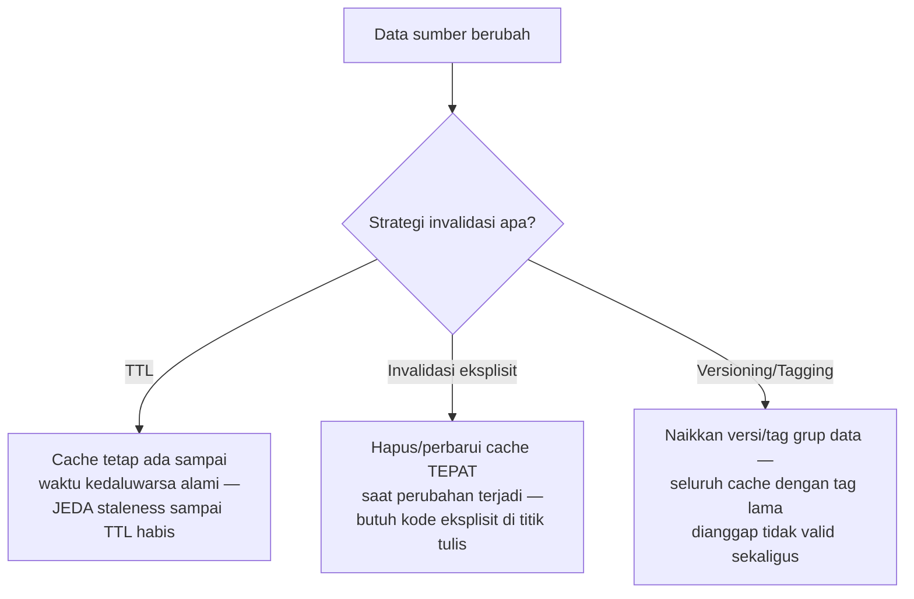

## TL;DR

Ada ungkapan lama di computer science: "there are only two hard things: cache invalidation and naming things" — cache invalidation dianggap sulit bukan karena tekniknya rumit, tapi karena keputusan **kapan** sebuah entri cache harus dianggap tidak valid lagi selalu melibatkan trade-off antara kesegaran data dan kompleksitas sistem, dan tidak ada jawaban universal yang benar untuk semua kasus. Tiga strategi utama: **TTL** (kedaluwarsa otomatis setelah durasi tertentu, sederhana tapi tidak presisi), **invalidasi eksplisit** (menghapus/memperbarui cache tepat saat data sumber berubah, presisi tapi butuh disiplin di setiap titik penulisan), dan **versioning/tagging** (menandai cache dengan versi yang berubah untuk grup data terkait, memudahkan invalidasi massal tanpa harus tahu setiap key spesifik).

## The Problem

Sebuah tim menerapkan cache untuk hasil pencarian dokumen dengan TTL 10 menit, dan menganggap masalah "data cache usang" sudah selesai — tapi seorang petugas yang baru saja mengubah status dokumen tetap melihat hasil pencarian yang menampilkan status lama selama hampir 10 menit penuh, karena TTL murni tidak tahu bahwa data sumbernya sudah berubah **sebelum** waktu kedaluwarsa alami tercapai. Untuk data yang perubahannya jarang (statistik agregat bulanan), TTL 10 menit sepenuhnya wajar; untuk data yang perlu terlihat berubah segera setelah diedit (status dokumen yang sedang ditindaklanjuti), TTL murni adalah pilihan yang salah — dibutuhkan invalidasi eksplisit yang dipicu tepat saat perubahan terjadi.

Masalah kedua yang lebih rumit: sebuah dashboard menampilkan agregasi dari banyak sumber data berbeda (jumlah permohonan per status, per provinsi), di-cache sebagai satu entri gabungan. Ketika **satu** dari sekian banyak permohonan yang mendasari agregasi ini berubah statusnya, tim harus memutuskan — apakah cukup menghapus satu entri cache gabungan itu (sederhana tapi berarti seluruh dashboard perlu dihitung ulang dari nol pada akses berikutnya), atau membangun sistem invalidasi yang lebih granular yang tahu persis entri cache mana saja yang dipengaruhi satu perubahan itu (rumit untuk diimplementasikan dan dipelihara benar).

## Intuition

Bayangkan cache invalidation seperti **mengelola papan pengumuman dengan banyak salinan tertempel di berbagai lokasi kantor** — begitu informasi aslinya berubah (misalnya jadwal pelayanan baru), kamu punya beberapa pilihan: (a) biarkan setiap salinan lama "kedaluwarsa" sendiri setelah periode tertentu dan diganti otomatis (TTL) — sederhana, tapi ada jeda di mana orang masih membaca informasi lama; (b) segera pergi ke **setiap** lokasi dan mengganti pengumuman itu tepat saat informasi berubah (invalidasi eksplisit) — presisi, tapi kamu harus tahu **semua** lokasi yang perlu diganti, dan lupa satu lokasi berarti informasi lama tetap ada di sana; (c) menempelkan **nomor versi** di setiap pengumuman, dan orang yang membacanya diberi tahu untuk membandingkan nomor versi itu dengan sumber resmi terpusat sebelum mempercayainya (versioning) — memindahkan sebagian beban verifikasi ke pembaca, bukan sepenuhnya pada penulis.

Analogi ini bocor pada satu hal: papan pengumuman fisik biasanya sedikit jumlahnya dan mudah dilacak semua lokasinya. Cache di sistem software bisa tersebar di banyak layer (cache aplikasi, CDN, browser pengguna) dengan jumlah entri yang sangat banyak — melacak "semua tempat yang perlu di-invalidate" untuk satu perubahan data bisa jauh lebih rumit dari sekadar mengetahui lokasi fisik papan pengumuman.

## How It Works



**Invalidasi eksplisit** yang paling umum: setiap fungsi yang mengubah data sumber juga memanggil penghapusan/pembaruan cache yang relevan pada titik yang sama — pola yang butuh disiplin memastikan **setiap** titik penulisan data (termasuk yang ditambahkan developer baru di masa depan) mengingat langkah invalidasi ini, kalau tidak, cache yang terlewat menjadi sumber bug "data usang" yang sulit dilacak.

**Versioning/tagging** menyelesaikan masalah "harus tahu semua key spesifik yang perlu di-invalidate" dengan cara berbeda: alih-alih menghapus banyak key satu per satu, satu **versi** atau **tag** yang menjadi bagian dari key cache dinaikkan — seluruh cache lama yang masih memakai versi/tag sebelumnya secara otomatis dianggap tidak relevan lagi (key baru tidak pernah cocok dengan versi lama), tanpa perlu tahu atau menghapus setiap entri cache lama satu per satu secara eksplisit (meski entri lama itu tetap ada secara fisik sampai TTL-nya sendiri habis atau di-evict, hanya tidak pernah diakses lagi karena key-nya sudah berbeda).

## Under The Hood

**Kombinasi TTL dan invalidasi eksplisit** adalah pendekatan yang paling umum dan paling praktis di banyak sistem nyata — invalidasi eksplisit menangani kasus umum (perubahan yang diketahui aplikasi, dipicu langsung dari kode yang mengubah data), sementara TTL menjadi **jaring pengaman** untuk kasus yang terlewat (bug yang lupa memanggil invalidasi, perubahan data lewat jalur lain yang tidak melalui aplikasi seperti perubahan manual langsung di database) — TTL memastikan cache yang "terlewat" tidak bertahan selamanya, hanya sampai TTL-nya habis.

**Cache invalidation untuk data agregat/gabungan** (seperti dashboard di "The Problem") sering diselesaikan dengan strategi yang lebih sederhana dari invalidasi granular yang sempurna: TTL pendek (beberapa menit) untuk data agregat yang sering berubah, diterima sebagai trade-off yang wajar karena membangun sistem pelacakan "entri agregat mana saja yang terpengaruh satu perubahan baris data" seringkali jauh lebih rumit dan rentan bug dibanding sekadar menerima staleness singkat.

## In Go

```go
package cache

import (
	"context"
	"fmt"
)

// InvalidasiEksplisit menunjukkan pola paling umum: fungsi yang MENGUBAH
// data JUGA bertanggung jawab menghapus cache yang relevan, di titik
// yang SAMA — disiplin yang harus dijaga di SETIAP tempat data ini bisa
// berubah, tidak hanya satu tempat.
func UbahStatusPermohonan(ctx context.Context, id int64, statusBaru string) error {
	if err := simpanStatusKeDatabase(ctx, id, statusBaru); err != nil {
		return fmt.Errorf("simpan status permohonan: %w", err)
	}

	// INVALIDASI EKSPLISIT — dipanggil TEPAT saat data berubah, tidak
	// menunggu TTL alami habis.
	hapusCache(fmt.Sprintf("permohonan:%d", id))
	// Cache agregat yang mungkin terpengaruh (dashboard ringkasan status)
	// SENGAJA TIDAK di-invalidate satu per satu di sini — terlalu banyak
	// kemungkinan agregat yang terpengaruh; dibiarkan usang sampai TTL
	// pendeknya sendiri habis, trade-off yang diterima sadar.

	return nil
}

// VersioningTag menunjukkan pola versioning untuk invalidasi massal —
// menaikkan versi berarti SELURUH cache lama dengan versi sebelumnya
// otomatis tidak pernah diakses lagi, tanpa perlu menghapus satu per satu.
type CacheVersion struct {
	versiSaatIni int
}

func (c *CacheVersion) KeyDenganVersi(kunciAsli string) string {
	return fmt.Sprintf("v%d:%s", c.versiSaatIni, kunciAsli)
}

func (c *CacheVersion) NaikkanVersi() {
	c.versiSaatIni++ // seluruh cache dengan versi lama jadi "tak terjangkau"
}

func simpanStatusKeDatabase(ctx context.Context, id int64, status string) error { return nil }
func hapusCache(key string)                                                     {}
```

## In His Stack

Untuk sistem dengan banyak endpoint yang mengubah data yang sama (permohonan diubah dari beberapa jalur berbeda — API mobile, dashboard petugas, job batch otomatis), disiplin memastikan **setiap** jalur perubahan memanggil invalidasi cache yang sama adalah tantangan koordinasi lintas tim yang nyata — inilah kenapa banyak tim memilih TTL pendek sebagai jaring pengaman yang konsisten, dikombinasikan dengan invalidasi eksplisit sebagai optimasi untuk kasus paling umum, alih-alih mengandalkan sepenuhnya pada invalidasi eksplisit yang sempurna di semua tempat (yang secara realistis akan ada celah yang terlewat).

## Trade-offs and When Not To Use It

Invalidasi eksplisit memberi kesegaran data yang presisi tapi butuh disiplin yang tersebar di banyak tempat kode — setiap developer yang menambah jalur baru mengubah data harus mengingat untuk menambahkan invalidasi cache yang sesuai, kewajiban yang mudah terlewat terutama di tim besar. TTL murni sederhana dan tidak butuh disiplin tersebar, tapi memberi jendela staleness yang tidak presisi (bisa terlalu lama untuk data yang butuh kesegaran, atau — kalau TTL dibuat sangat pendek untuk mengkompensasi — mengurangi manfaat cache karena terlalu sering dianggap kedaluwarsa dan memicu query ulang. Versioning/tagging menyelesaikan masalah invalidasi massal dengan elegan tapi menambah lapisan abstraksi (mengelola nomor versi) yang perlu dipahami seluruh tim yang berinteraksi dengan cache itu.

## Common Mistakes

> [!warning] Jebakan
> Menambahkan jalur baru yang mengubah data tanpa mengingat untuk menambahkan invalidasi cache yang sesuai — cache yang terlewat menjadi sumber bug "data usang" yang sulit dilacak karena tidak konsisten (kadang muncul, kadang tidak, tergantung jalur mana yang dipakai).

> [!warning] Jebakan
> Mengandalkan TTL sangat pendek sebagai "solusi" untuk kebutuhan kesegaran data, tanpa mempertimbangkan bahwa ini mengurangi sebagian besar manfaat cache (query ulang terlalu sering) — invalidasi eksplisit untuk data yang benar-benar butuh kesegaran seringkali lebih tepat dibanding TTL yang dipaksa sangat pendek.

> [!warning] Jebakan
> Mencoba membangun invalidasi granular yang sempurna untuk cache agregat/gabungan yang dipengaruhi banyak sumber data — kompleksitas yang sering tidak sepadan dibanding menerima TTL pendek sebagai trade-off yang jauh lebih sederhana.

## Exercises

1. Jelaskan kenapa cache invalidation dianggap salah satu masalah paling sulit dalam computer science, meski tekniknya sendiri tidak rumit.
2. Kapan invalidasi eksplisit lebih tepat dibanding TTL murni, dan sebaliknya?
3. Bagaimana strategi versioning/tagging menyelesaikan masalah "harus tahu semua key yang perlu di-invalidate"?
4. Desain terbuka: sistemmu punya cache untuk detail satu permohonan (`permohonan:{id}`) dan cache terpisah untuk daftar permohonan per petugas (`daftar_petugas:{petugas_id}`) yang menampilkan ringkasan beberapa permohonan sekaligus. Ketika status satu permohonan berubah, rancang strategi invalidasi yang menangani baik cache detail (mudah, tahu ID spesifiknya) maupun cache daftar (sulit, karena satu permohonan bisa muncul di banyak "daftar per petugas" yang berbeda tergantung riwayat penugasan).

> [!success]- Kunci jawaban
> **1.** Kesulitan cache invalidation bukan soal teknik implementasi (menghapus entri cache secara teknis mudah), tapi soal **melacak dengan tepat** kapan dan entri mana saja yang perlu di-invalidate ketika data sumber berubah, terutama ketika data itu dipakai di banyak tempat berbeda (cache individual, cache agregat, cache lintas relasi) yang tidak selalu jelas hubungannya dari satu titik perubahan data. Melewatkan satu tempat berarti data usang yang tidak terdeteksi sampai seseorang melihat inkonsistensi secara langsung — kesalahan yang sifatnya "diam-diam", bukan error yang jelas terlihat.
> **4.** Untuk cache detail (`permohonan:{id}`): invalidasi eksplisit langsung, karena key-nya diketahui pasti dari ID permohonan yang berubah. Untuk cache daftar per petugas: karena sulit melacak semua "daftar petugas" mana yang memuat permohonan ini (bisa berubah seiring riwayat penugasan), pendekatan yang lebih realistis adalah menerima **TTL pendek** untuk cache daftar ini (misalnya 1-2 menit) sebagai trade-off yang disengaja, alih-alih mencoba melacak invalidasi granular yang sempurna lintas semua kemungkinan daftar petugas yang terpengaruh. Kombinasi ini — invalidasi eksplisit presisi untuk data yang key-nya jelas, TTL pendek sebagai jaring pengaman untuk data agregat yang sulit dilacak semua dependensinya — adalah pola yang jauh lebih praktis dibanding mencoba mencapai invalidasi granular sempurna di semua tempat.

## Self-Check

- Kenapa cache invalidation dianggap masalah yang sulit secara konseptual, bukan teknis?
- Kapan invalidasi eksplisit lebih tepat dibanding TTL, dan sebaliknya?
- Bagaimana versioning/tagging menyelesaikan invalidasi massal?
- Kenapa cache agregat sering lebih sulit di-invalidate secara presisi dibanding cache entitas individual?

## Connected Notes

- [[Cache-Aside, Write-Through, and Write-Behind]] — strategi invalidasi berbeda relevansinya tergantung pola caching yang dipakai, dibahas di note sebelumnya.
- [[TTL and Jitter]] — TTL sebagai salah satu strategi invalidasi dibahas lebih mendalam, termasuk masalah turunannya, di note berikutnya.
- [[Eviction Policies]] — mekanisme berbeda dari invalidasi — eviction terjadi karena keterbatasan ruang, bukan karena data sudah tidak valid, dibahas di note lain domain ini.
- [[../40 Databases/Keeping Search in Sync with the Source of Truth|Keeping Search in Sync with the Source of Truth]] — masalah sinkronisasi yang secara konsep serupa dengan cache invalidation, hanya antara database dan search index alih-alih database dan cache.
- [[../60 Distributed Systems/Change Data Capture|Change Data Capture]] — mekanisme yang bisa dipakai untuk invalidasi cache berbasis perubahan data secara otomatis dan andal, dibahas di level senior.

## Further Reading

- Phil Karlton (dikutip luas di komunitas), ungkapan "There are only two hard things in Computer Science: cache invalidation and naming things" — kutipan yang jadi rujukan umum meski sumber persis publikasinya sering diperdebatkan asalnya.

## Catatan Saya

*Tulis di sini apakah pernah ada bug "data usang" di kerjaanmu yang ternyata disebabkan cache yang lupa di-invalidate di satu jalur perubahan data tertentu.*
