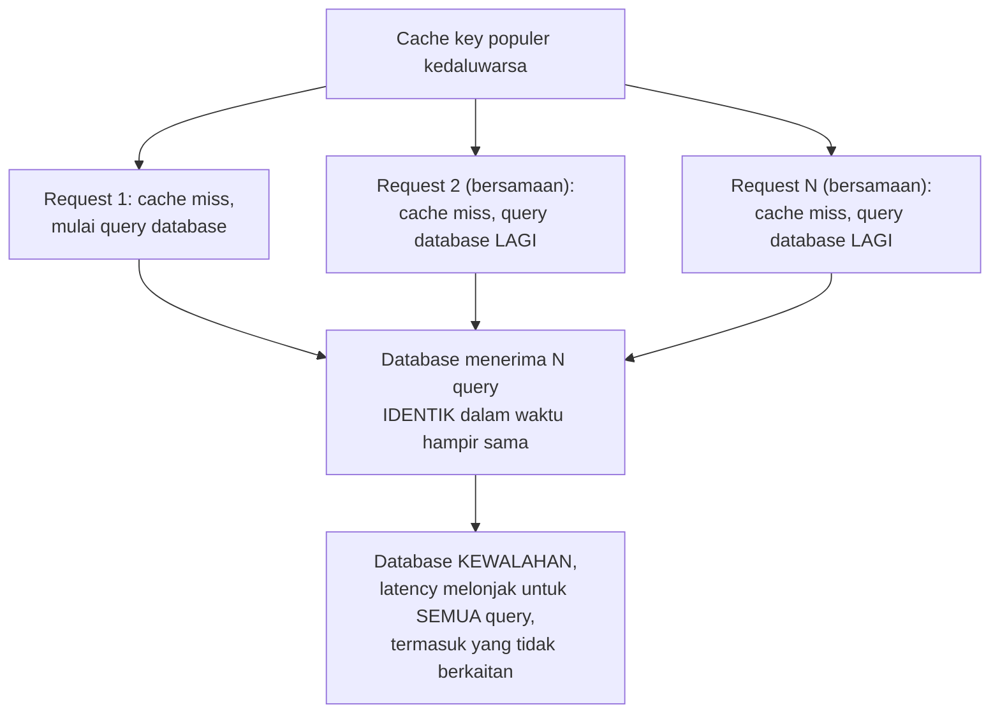

## TL;DR

Cache stampede (juga disebut *thundering herd* dalam konteks cache) adalah momen ketika satu cache key yang sangat populer kedaluwarsa atau di-evict, dan **ribuan request bersamaan** yang mengalami cache miss di jendela waktu yang sama semuanya memicu operasi mahal yang identik (query database, panggilan API) ke sumber data yang sama — mengubah cache dari pelindung database menjadi pemicu lonjakan beban yang jauh lebih parah daripada kalau cache itu tidak pernah ada sama sekali. Ini adalah note penutup yang menyatukan tiga topik sebelumnya di domain ini — [[TTL and Jitter]], [[Eviction Policies]], dan [[singleflight]] — semuanya adalah bagian dari strategi mencegah dan memitigasi cache stampede.

## The Problem

Sebuah dashboard yang menampilkan status permohonan untuk akun instansi resmi (dilihat oleh ribuan warga sekaligus) meng-cache hasilnya dengan TTL 5 menit. Setiap 5 menit, cache key ini kedaluwarsa, dan ribuan request yang datang **hampir bersamaan** persis di momen itu (karena akun ini memang selalu ramai diakses) semuanya mengalami cache miss secara bersamaan — masing-masing dari ribuan request itu independen memicu query database yang identik untuk mengambil ulang data yang sama persis, membebani database dengan ribuan query duplikat dalam hitungan detik, sesuatu yang jauh lebih buruk daripada jika tidak ada cache sama sekali dan setiap request memang selalu query database (setidaknya bebannya akan tersebar merata seiring waktu, bukan terkonsentrasi di satu titik).

Masalah ini adalah kombinasi dari beberapa faktor yang sudah dibahas terpisah di note-note sebelumnya: TTL yang seragam tanpa jitter (menyebabkan kedaluwarsa serentak), dan tidak adanya mekanisme deduplikasi permintaan bersamaan (seperti `singleflight`) — masing-masing faktor ini sendirian sudah cukup berbahaya, dan kombinasi keduanya memperbesar risiko stampede secara signifikan.

## Intuition

Bayangkan cache stampede seperti **satu pintu keluar toko yang tiba-tiba dibuka setelah ditutup lama saat diskon besar dimulai** — ribuan orang yang sudah menunggu di luar (request yang menunggu cache) semuanya berebut masuk **persis** di detik yang sama begitu pintu dibuka (cache kedaluwarsa), menciptakan desakan yang jauh lebih berbahaya dibanding kalau orang-orang itu masuk secara bertahap dan tersebar sepanjang hari. Toko (database) yang seharusnya bisa melayani ribuan pelanggan dengan baik kalau mereka datang tersebar sepanjang hari, tiba-tiba kewalahan karena semuanya datang dalam hitungan detik yang sama.

Analogi ini bocor pada satu hal: kerumunan di pintu toko fisik biasanya bisa diatasi dengan penjaga yang mengatur antrean secara manual saat itu juga. Cache stampede di sistem software butuh **pencegahan** yang sudah disiapkan sebelumnya (jitter, singleflight, refresh proaktif) — begitu stampede benar-benar terjadi dan database sudah kewalahan, sangat sulit "mengatur ulang" situasi itu secara real-time tanpa dampak lebih lanjut, karena permintaan yang sudah terlanjur menumpuk tetap harus dilayani atau ditolak, keduanya punya konsekuensi.

## How It Works



**Strategi pencegahan dan mitigasi, dirangkum dari note-note sebelumnya**:

1. **Jitter pada TTL** ([[TTL and Jitter]]) — mencegah **banyak key berbeda** kedaluwarsa bersamaan, mengurangi frekuensi terjadinya kondisi pemicu stampede.
2. **`singleflight`** ([[singleflight]]) — begitu stampede pada **satu key** mulai terjadi (banyak request bersamaan mengalami cache miss untuk key yang sama), menggabungkan permintaan-permintaan itu jadi satu eksekusi nyata, memotong dampak stampede secara signifikan.
3. **Refresh proaktif (early recomputation)** — alih-alih menunggu cache benar-benar kedaluwarsa, sistem me-refresh cache **sebelum** TTL habis (misalnya saat 90% dari durasi TTL sudah berlalu) menggunakan satu request "beruntung" yang kebetulan datang di jendela itu, sementara request lain tetap menerima data cache lama (yang masih valid) tanpa menunggu — mencegah cache miss sama sekali terjadi untuk key yang sangat populer.
4. **Locking eksplisit** (dibahas di note berikutnya, [[Distributed Locks and Why They Are Dangerous]]) — hanya satu proses yang "menang" untuk melakukan refresh, yang lain menunggu atau menerima data lama.

## Under The Hood

**Refresh proaktif (stale-while-revalidate)** adalah teknik yang lebih canggih dari sekadar jitter atau singleflight — pola ini secara eksplisit menyimpan **dua** informasi: nilai cache itu sendiri dan waktu "seharusnya di-refresh" yang **lebih awal** dari waktu kedaluwarsa sesungguhnya. Request yang datang setelah titik refresh (tapi sebelum kedaluwarsa sesungguhnya) tetap menerima data cache yang sudah ada (masih valid, hanya sedikit "stale") sambil **satu** dari request itu (atau proses latar belakang terpisah) memicu refresh data yang sebenarnya — pengguna tidak pernah menunggu cache miss sama sekali selama pola akses cukup teratur, karena refresh selalu terjadi sebelum data benar-benar kedaluwarsa.

**Kombinasi seluruh strategi** biasanya dibutuhkan untuk perlindungan yang benar-benar solid: jitter mengurangi **frekuensi** kondisi pemicu, singleflight mengurangi **dampak** kalau kondisi pemicu tetap terjadi (dalam satu instance), refresh proaktif mengurangi **kemungkinan** cache miss terjadi sama sekali untuk data yang sangat populer — ketiganya saling melengkapi, bukan saling menggantikan.

## In Go

```go
package cache

import (
	"context"
	"time"

	"golang.org/x/sync/singleflight"
)

type EntriCache struct {
	Data          string
	KedaluwarsaPada time.Time
	RefreshPada     time.Time // LEBIH AWAL dari KedaluwarsaPada
}

var grup singleflight.Group

// AmbilDenganRefreshProaktif menggabungkan singleflight DAN refresh
// proaktif — pertahanan berlapis terhadap cache stampede.
func AmbilDenganRefreshProaktif(ctx context.Context, key string) (string, error) {
	entri, ada := cekCache(key)

	if ada && time.Now().Before(entri.RefreshPada) {
		// MASIH SEGAR, belum perlu refresh sama sekali.
		return entri.Data, nil
	}

	if ada && time.Now().Before(entri.KedaluwarsaPada) {
		// SUDAH LEWAT titik refresh, TAPI belum benar-benar kedaluwarsa —
		// kembalikan data lama SEGERA, picu refresh di LATAR BELAKANG
		// lewat singleflight (hanya SATU goroutine yang benar-benar
		// menjalankan refresh, meski banyak request tiba di jendela ini).
		go func() {
			grup.Do(key, func() (interface{}, error) {
				return refreshDataKeCache(context.Background(), key)
			})
		}()
		return entri.Data, nil
	}

	// BENAR-BENAR kedaluwarsa (atau tidak ada sama sekali) — singleflight
	// tetap melindungi dari stampede penuh pada kasus ini.
	hasil, err, _ := grup.Do(key, func() (interface{}, error) {
		return refreshDataKeCache(ctx, key)
	})
	if err != nil {
		return "", err
	}
	return hasil.(string), nil
}

func cekCache(key string) (EntriCache, bool)                              { return EntriCache{}, false }
func refreshDataKeCache(ctx context.Context, key string) (string, error) { return "", nil }
```

## In His Stack

Untuk dashboard atau data yang diakses ribuan warga sekaligus (status layanan publik, pengumuman resmi), cache stampede adalah risiko yang nyata dan berdampak langsung pada kepercayaan publik kalau menyebabkan downtime database — kombinasi jitter, singleflight, dan idealnya refresh proaktif untuk data yang paling populer adalah investasi yang sepadan mengingat dampak insiden semacam ini bisa memengaruhi seluruh sistem, bukan hanya satu fitur yang kebetulan populer.

## Trade-offs and When Not To Use It

Refresh proaktif menambah kompleksitas kode yang signifikan (menyimpan dua timestamp, logika refresh latar belakang) dibanding TTL sederhana — untuk data yang tidak pernah benar-benar populer (jarang diakses ribuan kali bersamaan), risiko stampede sangat rendah dan investasi refresh proaktif tidak sepadan; jitter dan singleflight saja biasanya sudah cukup sebagai jaring pengaman untuk mayoritas kasus. Ketiga strategi ini juga menambah beban kerja tambahan (refresh proaktif berarti data di-refresh lebih sering dari yang benar-benar diperlukan, singleflight menambah sedikit overhead koordinasi) — trade-off yang jelas sepadan untuk data yang benar-benar populer dan berisiko stampede, tapi berlebihan untuk data yang aksesnya jarang dan tersebar merata secara alami.

## Common Mistakes

> [!warning] Jebakan
> Mengandalkan hanya satu strategi (misalnya jitter saja) tanpa mempertimbangkan bahwa stampede masih bisa terjadi meski TTL sudah di-jitter — kombinasi beberapa strategi memberi perlindungan yang jauh lebih solid dibanding satu strategi tunggal.

> [!warning] Jebakan
> Menerapkan cache untuk data populer tanpa mempertimbangkan sama sekali risiko stampede saat cache itu kedaluwarsa — menemukan masalah ini hanya setelah insiden nyata terjadi di production, bukan direncanakan sejak desain awal.

> [!warning] Jebakan
> Menerapkan refresh proaktif atau singleflight untuk seluruh cache secara membabi buta, termasuk data yang jarang diakses dan tidak pernah berisiko stampede — menambah kompleksitas tanpa manfaat yang sepadan untuk kasus yang sebenarnya tidak butuh perlindungan seketat itu.

## Exercises

1. Jelaskan kenapa cache stampede bisa membuat database lebih kewalahan dibanding kondisi tanpa cache sama sekali.
2. Bagaimana jitter, singleflight, dan refresh proaktif masing-masing berkontribusi mencegah/memitigasi cache stampede, dan kenapa ketiganya saling melengkapi?
3. Apa perbedaan "titik refresh" dan "titik kedaluwarsa" dalam pola refresh proaktif (stale-while-revalidate)?
4. Desain terbuka: sistemmu punya satu endpoint yang menampilkan pengumuman nasional yang diakses jutaan kali per hari oleh warga di seluruh Indonesia, dan pengumuman ini kadang diperbarui mendadak (misalnya perubahan kebijakan darurat). Rancang strategi caching lengkap untuk endpoint ini yang menyeimbangkan kebutuhan "pembaruan harus terlihat cepat setelah diedit" dengan "database tidak boleh kewalahan oleh cache stampede", menggabungkan strategi-strategi yang dibahas di note ini.

> [!success]- Kunci jawaban
> **1.** Tanpa cache, setiap request memang selalu query database, tapi bebannya **tersebar alami** seiring waktu request datang satu per satu (atau dalam kelompok kecil yang wajar). Dengan cache yang kedaluwarsa serentak untuk key yang sangat populer, ribuan request yang **seharusnya** dilayani cache (dan tidak pernah menyentuh database sama sekali di kondisi normal) tiba-tiba **semuanya** menyentuh database dalam jendela waktu yang sangat sempit — mengonsentrasikan beban yang seharusnya tidak pernah terjadi bersamaan menjadi satu lonjakan tajam, jauh lebih parah daripada distribusi beban alami tanpa cache sama sekali.
> **4.** Strategi berlapis: (1) gunakan **invalidasi eksplisit** (lihat [[Cache Invalidation Strategies]]) yang dipicu tepat saat pengumuman diedit — memastikan perubahan mendadak terlihat segera, tidak menunggu TTL alami habis; (2) untuk kasus di mana cache tetap perlu di-refresh secara berkala (jaring pengaman terhadap invalidasi yang mungkin terlewat), terapkan **refresh proaktif** dengan titik refresh jauh lebih awal dari titik kedaluwarsa (misalnya refresh di 80% durasi TTL) — memastikan data yang sangat populer ini nyaris tidak pernah benar-benar mengalami cache miss; (3) terapkan **singleflight** sebagai jaring pengaman terakhir untuk kasus di mana cache benar-benar miss (misalnya restart aplikasi, cache di-flush) — memastikan meski jutaan request datang bersamaan tepat di momen itu, hanya satu yang benar-benar query database; (4) untuk invalidasi eksplisit dari edit pengumuman darurat, pertimbangkan memicu refresh **segera** (bukan sekadar menghapus cache dan menunggu request berikutnya mengalami miss) — menjalankan refresh proaktif tepat saat invalidasi terjadi, sehingga request pertama setelah edit juga tidak perlu menunggu cache miss.

## Self-Check

- Kenapa cache stampede bisa lebih parah dibanding kondisi tanpa cache sama sekali?
- Bagaimana jitter, singleflight, dan refresh proaktif saling melengkapi dalam mencegah stampede?
- Apa perbedaan titik refresh dan titik kedaluwarsa dalam stale-while-revalidate?
- Kapan investasi refresh proaktif tidak sepadan diterapkan?

## Connected Notes

- [[TTL and Jitter]] — jitter mengurangi frekuensi kondisi pemicu stampede, salah satu dari tiga strategi yang dirangkum di note ini.
- [[singleflight]] — mekanisme deduplikasi permintaan bersamaan yang menjadi pertahanan inti terhadap stampede dalam satu instance.
- [[Eviction Policies]] — eviction yang terlalu agresif bisa memperbesar risiko stampede dengan membuat lebih banyak cache miss terjadi lebih sering.
- [[Distributed Locks and Why They Are Dangerous]] — mekanisme locking lintas instance sebagai pertahanan tambahan terhadap stampede pada sistem multi-instance, dibahas di note penutup domain ini.
- [[Cache-Aside, Write-Through, and Write-Behind]] — pola caching dasar yang menjadi konteks di mana cache stampede menjadi risiko relevan.

## Further Reading

- Materi umum industri mengenai "thundering herd problem" dan "stale-while-revalidate" (konsep yang juga dipakai luas di HTTP caching, RFC 5861).

## Catatan Saya

*Tulis di sini data paling populer di sistem kerjaanmu — apakah pernah ada insiden lonjakan database yang berkaitan dengan cache key ini kedaluwarsa.*
