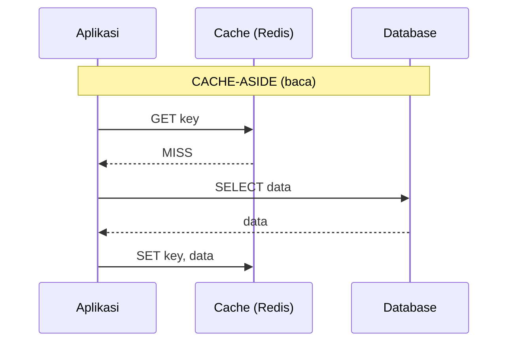
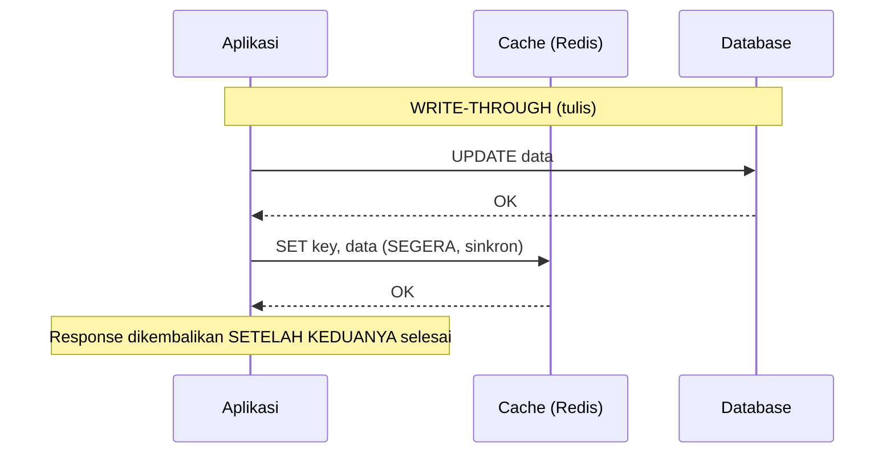
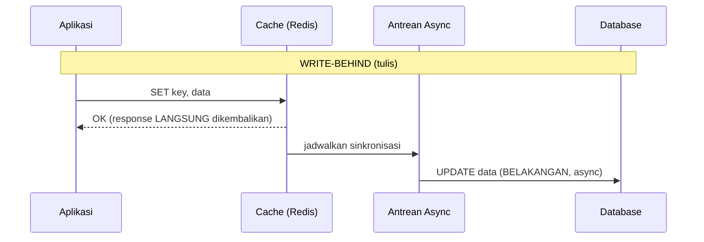

## TL;DR

Cache bukan sekadar "taruh data di Redis supaya cepat" — ada beberapa **pola** berbeda mengenai kapan cache diisi dan kapan database ditulis, masing-masing dengan trade-off konsistensi dan performa yang berbeda. **Cache-aside** (paling umum): aplikasi memeriksa cache dulu, kalau tidak ada baru query database dan mengisi cache; database dan cache ditulis terpisah, sering berarti sesaat keduanya tidak sinkron. **Write-through**: setiap tulisan ke database **langsung** juga menulis ke cache dalam operasi yang sama, menjaga keduanya selalu sinkron dengan biaya latensi tulis yang sedikit lebih tinggi. **Write-behind** (write-back): tulisan **hanya** ke cache dulu, disinkronkan ke database secara asinkron belakangan — latensi tulis tercepat, tapi risiko kehilangan data kalau cache gagal sebelum sinkronisasi selesai.

## The Problem

Sebuah tim mengimplementasikan caching untuk profil pengguna dengan menulis ke Redis **dan** database secara terpisah di setiap tempat kode yang mengubah profil — pola yang terlihat seperti write-through, tapi karena tidak ada disiplin memastikan kedua tulisan itu benar-benar konsisten (urutan mana dulu, bagaimana menangani kalau salah satu gagal), cache dan database perlahan **melenceng** satu sama lain seiring waktu — beberapa endpoint menulis ke database dulu baru cache, beberapa endpoint lain (ditulis developer berbeda) melakukan sebaliknya, dan tidak ada satu pun yang menangani kasus "tulis ke database berhasil, tulis ke cache gagal" dengan benar.

Masalah kedua: sebuah sistem lain memilih cache-aside (pola paling sederhana) untuk semua kebutuhan tanpa mempertimbangkan bahwa beberapa data (misalnya saldo akun) butuh konsistensi yang jauh lebih ketat dibanding data lain (misalnya nama tampilan pengguna) — cache-aside yang menerima staleness sesaat (data cache yang sedikit usang setelah tulisan ke database) adalah trade-off yang wajar untuk nama tampilan, tapi bisa jadi masalah serius kalau diterapkan tanpa pertimbangan untuk data yang butuh akurasi ketat.

## Intuition

Bayangkan ketiga pola ini sebagai tiga cara berbeda mengelola **buku catatan pribadi** (cache) dan **arsip resmi kantor** (database). **Cache-aside** seperti mencatat sesuatu di buku pribadimu **hanya saat** kamu perlu mengecek ulang informasi yang sudah lama tidak kamu lihat — kamu pergi ke arsip resmi, salin informasinya ke buku pribadi, dan lain kali cukup baca buku pribadi dulu; kalau arsip resmi berubah tanpa kamu tahu, buku pribadimu jadi usang sampai kamu memutuskan mengecek ulang. **Write-through** seperti kebiasaan **selalu** mencatat di kedua tempat sekaligus setiap kali ada perubahan — sedikit lebih repot setiap kali menulis, tapi buku pribadi dan arsip resmi selalu cocok. **Write-behind** seperti mencatat cepat di buku pribadi dulu, dan **menyalinnya ke arsip resmi nanti** saat sempat — sangat cepat mencatat, tapi kalau buku pribadimu hilang sebelum sempat disalin ke arsip, catatan itu hilang selamanya.

Analogi ini bocor pada satu hal: buku catatan pribadi dan arsip kantor fisik jarang diakses ribuan kali per detik oleh banyak orang bersamaan. Cache dan database dalam sistem nyata diakses secara **konkuren** oleh banyak request sekaligus — ini menambah dimensi race condition yang tidak ada di analogi buku catatan personal, di mana dua request bisa saling menimpa pembaruan cache dalam urutan yang tidak terduga.

## How It Works







Diagram-diagram ini menunjukkan perbedaan inti ketiga pola: cache-aside memisahkan baca dan tulis sepenuhnya (cache diisi hanya saat cache miss); write-through membuat tulisan **menunggu** kedua sistem selesai sebelum dianggap sukses; write-behind mengembalikan sukses **secepat mungkin** (setelah cache saja) dan menyinkronkan ke database belakangan, menerima risiko data hilang kalau terjadi kegagalan di antara keduanya.

## Under The Hood

**Cache-aside** adalah pola paling umum dipakai justru karena kesederhanaan dan fleksibilitasnya — cache bisa "kosong" kapan saja (restart, eviction) tanpa merusak apa pun, karena aplikasi selalu punya jalur fallback ke database. Trade-off-nya: ada jendela waktu di antara database berubah dan cache di-invalidasi/diperbarui, di mana pembaca lain bisa melihat data cache yang usang — untuk kebanyakan kasus (data yang toleran staleness beberapa detik) ini sepenuhnya bisa diterima.

**Write-through** menjamin cache tidak pernah usang (selalu sinkron dengan database) dengan mengorbankan latensi tulis — setiap operasi tulis harus menunggu **dua** sistem, bukan satu. Masalah konsistensi yang lebih dalam: kalau tulisan ke database berhasil tapi tulisan ke cache gagal (jaringan terputus, Redis sedang down), sistem harus punya kebijakan jelas — retry, invalidasi cache (bukan update, memaksa cache-aside menyelamatkan situasi di baca berikutnya), atau menggagalkan seluruh operasi. Tanpa kebijakan eksplisit ini, write-through separuh-jalan justru menciptakan inkonsistensi yang sama seperti pola ad-hoc di "The Problem".

**Write-behind** memberi latensi tulis tercepat (hanya menunggu cache, bukan database), tapi membawa risiko **kehilangan data** yang nyata — kalau cache (atau proses yang menjadwalkan sinkronisasi ke database) gagal sebelum sinkronisasi selesai, perubahan itu hilang selamanya, tidak pernah sampai ke database. Pola ini hanya masuk akal untuk data yang benar-benar bisa menerima risiko kehilangan (metrik non-kritis, log yang bisa direkonstruksi dari sumber lain) — jarang tepat untuk data transaksional yang harus benar-benar tersimpan.

## In Go

```go
package cache

import (
	"context"
	"fmt"
)

// AmbilProfilCacheAside menunjukkan pola cache-aside: cek cache dulu,
// kalau miss, query database, ISI cache untuk permintaan berikutnya.
func AmbilProfilCacheAside(ctx context.Context, userID string) (Profil, error) {
	if p, ada := cekCache(userID); ada {
		return p, nil
	}

	p, err := queryDatabaseProfil(ctx, userID)
	if err != nil {
		return Profil{}, fmt.Errorf("query profil %s: %w", userID, err)
	}

	simpanKeCache(userID, p) // isi cache SETELAH cache miss
	return p, nil
}

// SimpanProfilWriteThrough menunjukkan pola write-through: tulis ke
// database DAN cache dalam satu operasi, response menunggu KEDUANYA
// selesai — kebijakan EKSPLISIT diperlukan kalau salah satu gagal.
func SimpanProfilWriteThrough(ctx context.Context, userID string, p Profil) error {
	if err := simpanKeDatabase(ctx, userID, p); err != nil {
		return fmt.Errorf("simpan profil ke database: %w", err)
	}

	// Kebijakan EKSPLISIT: kalau update cache gagal SETELAH database
	// berhasil, HAPUS cache (bukan biarkan cache lama/usang tetap ada) —
	// memaksa pembaca berikutnya jatuh ke cache-aside sebagai fallback.
	if err := simpanKeCacheAtauHapus(userID, p); err != nil {
		hapusCache(userID)
	}

	return nil
}

type Profil struct{ Nama string }

func cekCache(key string) (Profil, bool)                          { return Profil{}, false }
func simpanKeCache(key string, p Profil)                          {}
func simpanKeCacheAtauHapus(userID string, p Profil) error         { return nil }
func hapusCache(key string)                                       {}
func queryDatabaseProfil(ctx context.Context, id string) (Profil, error) { return Profil{}, nil }
func simpanKeDatabase(ctx context.Context, id string, p Profil) error    { return nil }
```

## In His Stack

Cache-aside dengan Redis adalah pola paling umum dan paling aman untuk memulai di kebanyakan sistem — untuk data seperti status permohonan atau profil pengguna yang bisa menerima staleness beberapa detik, cache-aside memberi manfaat performa signifikan dengan kompleksitas paling rendah. Write-through lebih relevan untuk data yang **harus** selalu konsisten antara cache dan sumber (misalnya session data yang dipakai langsung untuk keputusan otorisasi) — staleness sesaat pada data semacam ini bisa berarti keputusan otorisasi yang salah, risiko yang tidak sepadan dengan penghematan latensi cache-aside.

## Trade-offs and When Not To Use It

Cache-aside menerima staleness sesaat sebagai trade-off untuk kesederhanaan — tidak cocok untuk data yang butuh konsistensi ketat setiap saat. Write-through menjamin konsistensi tapi menambah latensi tulis dan kompleksitas menangani kegagalan sebagian (partial failure) antara dua sistem. Write-behind memberi performa tulis terbaik tapi risiko kehilangan data yang nyata — hanya cocok untuk data yang benar-benar bisa ditoleransi hilang. Tidak ada pola yang "selalu benar" — pilihan bergantung pada kebutuhan konsistensi spesifik data yang bersangkutan, dan sistem yang sama seringkali memakai pola berbeda untuk jenis data berbeda, bukan satu pola tunggal untuk semuanya.

## Common Mistakes

> [!warning] Jebakan
> Menerapkan write-through tanpa kebijakan eksplisit untuk kegagalan sebagian (database berhasil, cache gagal) — menciptakan inkonsistensi yang sama seperti tidak memakai pola apa pun sama sekali.

> [!warning] Jebakan
> Memakai write-behind untuk data transaksional yang tidak bisa ditoleransi hilang — risiko kehilangan data nyata kalau cache gagal sebelum sinkronisasi ke database selesai.

> [!warning] Jebakan
> Menerapkan satu pola caching yang sama untuk seluruh jenis data tanpa mempertimbangkan kebutuhan konsistensi masing-masing — data yang butuh akurasi ketat (saldo) dan data yang toleran staleness (nama tampilan) butuh perlakuan berbeda.

## Exercises

1. Jelaskan perbedaan inti cache-aside, write-through, dan write-behind dari sisi kapan cache dan database ditulis.
2. Kenapa write-through butuh kebijakan eksplisit untuk kasus tulisan ke database berhasil tapi tulisan ke cache gagal?
3. Kenapa write-behind hanya cocok untuk data yang bisa menerima risiko kehilangan?
4. Desain terbuka: sistemmu punya dua jenis data yang perlu di-cache — (a) status real-time proses verifikasi dokumen (harus akurat, dipakai untuk keputusan lanjutan) dan (b) jumlah total dokumen yang pernah diproses sepanjang waktu (statistik, boleh sedikit usang). Pilih pola caching untuk masing-masing, dan jelaskan alasannya.

> [!success]- Kunci jawaban
> **1.** Cache-aside: database ditulis langsung, cache **tidak** ditulis saat itu juga — cache hanya diisi belakangan saat ada pembacaan yang mengalami cache miss. Write-through: database dan cache ditulis **bersamaan** dalam satu operasi, tulisan dianggap sukses hanya setelah keduanya selesai. Write-behind: cache ditulis **duluan** dan dianggap sukses seketika, database ditulis **belakangan** secara asinkron oleh proses terpisah.
> **4.** Untuk (a) status verifikasi dokumen: pakai **write-through**, karena data ini dipakai untuk keputusan lanjutan (misalnya menentukan apakah dokumen bisa diproses ke tahap berikutnya) — staleness bahkan beberapa detik bisa menyebabkan keputusan yang salah (memproses dokumen yang sebenarnya belum lolos verifikasi terbaru). Untuk (b) jumlah total dokumen: pakai **cache-aside** dengan TTL yang cukup panjang (misalnya beberapa menit) — data statistik semacam ini secara inheren toleran staleness, dan kesederhanaan cache-aside (tanpa perlu menjaga sinkronisasi ketat) jauh lebih sepadan dibanding kompleksitas write-through untuk data yang tidak butuh akurasi real-time.

## Self-Check

- Apa perbedaan inti ketiga pola caching dari sisi kapan cache dan database ditulis?
- Kenapa write-through butuh kebijakan eksplisit untuk kegagalan sebagian?
- Kapan write-behind menjadi pilihan yang tepat, dan kapan berbahaya?
- Kenapa satu sistem bisa memakai pola caching berbeda untuk jenis data berbeda?

## Connected Notes

- [[Cache Invalidation Strategies]] — kelanjutan langsung: bagaimana cache-aside menangani invalidasi saat data sumber berubah, dibahas di note berikutnya.
- [[Cache Stampede]] — risiko yang relevan khususnya untuk cache-aside, saat cache miss terjadi bersamaan pada key yang populer.
- [[singleflight]] — mekanisme mitigasi konkret untuk cache stampede yang dibahas di note lain domain ini.
- [[../40 Databases/Materialised Views|Materialised Views]] — pola yang secara konsep mirip write-behind, menyimpan hasil komputasi yang di-refresh terjadwal alih-alih real-time.
- [[../92 Tools/Redis|Redis]] — implementasi konkret cache yang relevan langsung di ekosistem kerja ini.

## Further Reading

- Materi resmi AWS/Azure/GCP mengenai pola caching (cache-aside, write-through, write-behind) — banyak vendor cloud mendokumentasikan pola ini sebagai referensi arsitektur umum.

## Catatan Saya

*Tulis di sini pola caching yang dipakai di kerjaanmu saat ini untuk data tertentu — apakah dipilih secara sadar atau kebetulan.*
