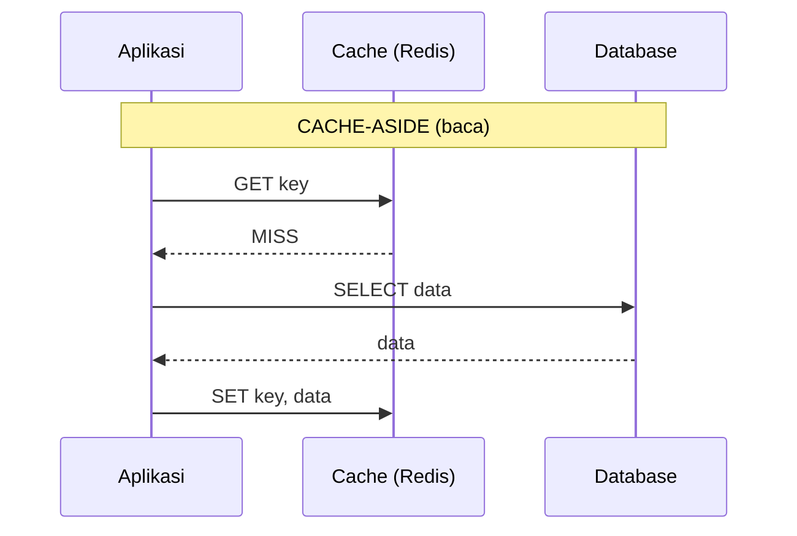
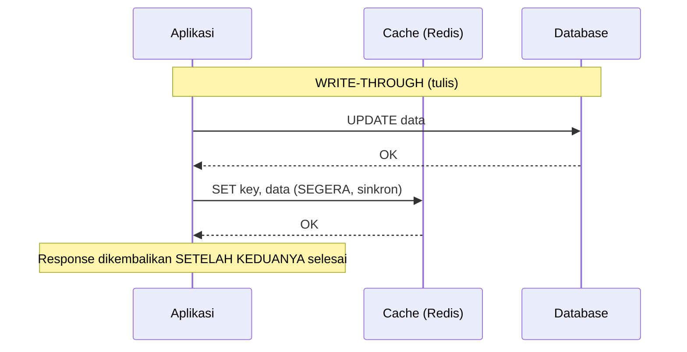
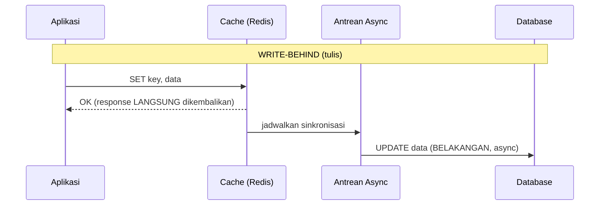

## TL;DR

Cache bukan sekadar "taruh data di Redis supaya cepat" — ada beberapa **pola** berbeda mengenai kapan cache diisi dan kapan database ditulis, masing-masing dengan trade-off konsistensi dan performa yang berbeda. **Cache-aside** (paling umum): aplikasi memeriksa cache dulu, kalau tidak ada baru query database dan mengisi cache; database dan cache ditulis terpisah, sering berarti sesaat keduanya tidak sinkron. **Write-through**: setiap tulisan ke database **langsung** juga menulis ke cache dalam operasi yang sama, sehingga cache biasanya segar setelah tulisan, dengan biaya latensi tulis yang sedikit lebih tinggi. "Biasanya" di sini penting: tanpa mekanisme tambahan, dua tulisan yang bersamaan tetap bisa meninggalkan cache usang. **Write-behind** (write-back): tulisan **hanya** ke cache dulu, disinkronkan ke database secara asinkron belakangan — latensi tulis tercepat, tapi risiko kehilangan data kalau cache gagal sebelum sinkronisasi selesai.

## The Problem

Sebuah tim mengimplementasikan caching untuk profil pengguna dengan menulis ke Redis **dan** database secara terpisah di setiap tempat kode yang mengubah profil — pola yang terlihat seperti write-through, tapi karena tidak ada disiplin memastikan kedua tulisan itu benar-benar konsisten (urutan mana dulu, bagaimana menangani kalau salah satu gagal), cache dan database perlahan **melenceng** satu sama lain seiring waktu — beberapa endpoint menulis ke database dulu baru cache, beberapa endpoint lain (ditulis developer berbeda) melakukan sebaliknya, dan tidak ada satu pun yang menangani kasus "tulis ke database berhasil, tulis ke cache gagal" dengan benar.

Masalah kedua: sebuah sistem lain memilih cache-aside (pola paling sederhana) untuk semua kebutuhan tanpa mempertimbangkan bahwa beberapa data (misalnya saldo akun) butuh konsistensi yang jauh lebih ketat dibanding data lain (misalnya nama tampilan pengguna) — cache-aside yang menerima staleness sesaat (data cache yang sedikit usang setelah tulisan ke database) adalah trade-off yang wajar untuk nama tampilan, tapi bisa jadi masalah serius kalau diterapkan tanpa pertimbangan untuk data yang butuh akurasi ketat.

## Intuition

Bayangkan ketiga pola ini sebagai tiga cara berbeda mengelola **buku catatan pribadi** (cache) dan **arsip resmi kantor** (database). **Cache-aside** seperti mencatat sesuatu di buku pribadimu **hanya saat** kamu perlu mengecek ulang informasi yang sudah lama tidak kamu lihat — kamu pergi ke arsip resmi, salin informasinya ke buku pribadi, dan lain kali cukup baca buku pribadi dulu; kalau arsip resmi berubah tanpa kamu tahu, buku pribadimu jadi usang sampai kamu memutuskan mengecek ulang. **Write-through** seperti kebiasaan **selalu** mencatat di kedua tempat sekaligus setiap kali ada perubahan — sedikit lebih repot setiap kali menulis, tapi buku pribadi dan arsip resmi selalu cocok. **Write-behind** seperti mencatat cepat di buku pribadi dulu, dan **menyalinnya ke arsip resmi nanti** saat sempat — sangat cepat mencatat, tapi kalau buku pribadimu hilang sebelum sempat disalin ke arsip, catatan itu hilang selamanya.

Analogi ini bocor pada satu hal: buku catatan pribadi dan arsip kantor fisik jarang diakses ribuan kali per detik oleh banyak orang bersamaan. Cache dan database dalam sistem nyata diakses secara **konkuren** oleh banyak request sekaligus — ini menambah dimensi race condition yang tidak ada di analogi buku catatan personal, di mana dua request bisa saling menimpa pembaruan cache dalam urutan yang tidak terduga.

## How It Works


```mermaid
sequenceDiagram
    participant App as Aplikasi
    participant Cache as Cache (Redis)
    participant DB as Database

    Note over App,DB: CACHE-ASIDE (baca)
    App->>Cache: GET key
    Cache-->>App: MISS
    App->>DB: SELECT data
    DB-->>App: data
    App->>Cache: SET key, data
```


```mermaid
sequenceDiagram
    participant App as Aplikasi
    participant Cache as Cache (Redis)
    participant DB as Database

    Note over App,DB: WRITE-THROUGH (tulis)
    App->>DB: UPDATE data
    DB-->>App: OK
    App->>Cache: SET key, data (SEGERA, sinkron)
    Cache-->>App: OK
    Note over App: Response dikembalikan SETELAH KEDUANYA selesai
```


```mermaid
sequenceDiagram
    participant App as Aplikasi
    participant Cache as Cache (Redis)
    participant Queue as Antrean Async
    participant DB as Database

    Note over App,DB: WRITE-BEHIND (tulis)
    App->>Cache: SET key, data
    Cache-->>App: OK (response LANGSUNG dikembalikan)
    Cache->>Queue: jadwalkan sinkronisasi
    Queue->>DB: UPDATE data (BELAKANGAN, async)
```

Diagram-diagram ini menunjukkan perbedaan inti ketiga pola: cache-aside memisahkan baca dan tulis sepenuhnya (cache diisi hanya saat cache miss); write-through membuat tulisan **menunggu** kedua sistem selesai sebelum dianggap sukses; write-behind mengembalikan sukses **secepat mungkin** (setelah cache saja) dan menyinkronkan ke database belakangan, menerima risiko data hilang kalau terjadi kegagalan di antara keduanya.

## Under The Hood

**Cache-aside** adalah pola paling umum dipakai justru karena kesederhanaan dan fleksibilitasnya — cache bisa "kosong" kapan saja (restart, eviction) tanpa merusak apa pun, karena aplikasi selalu punya jalur fallback ke database. Trade-off-nya: ada jendela waktu di antara database berubah dan cache di-invalidasi/diperbarui, di mana pembaca lain bisa melihat data cache yang usang — untuk kebanyakan kasus (data yang toleran staleness beberapa detik) ini sepenuhnya bisa diterima.

**Write-through** mempersempit jendela staleness dengan mengorbankan latensi tulis (setiap tulisan menunggu **dua** sistem), tapi **tidak menjamin** cache selalu sinkron. Ambil dua request yang mengubah profil yang sama hampir bersamaan. Database menerima A lalu B, sehingga nilai akhirnya B. Tapi dua perintah `SET` ke Redis bisa tiba dengan urutan terbalik, B lalu A, sehingga cache menyimpan A dan terus menyajikan data usang sampai TTL habis. Proses yang mati di antara tulisan database dan tulisan cache juga meninggalkan cache lama. Karena itu banyak tim memilih **menghapus** key setelah menulis database (bukan menimpanya dengan nilai baru): penghapusan yang datang dengan urutan terbalik tetap berujung pada cache kosong, dan pembaca berikutnya mengambil nilai terbaru dari database. Pola hapus ini pun masih punya celah sempit (pembaca yang sedang mengisi cache dengan nilai lama tepat saat penghapusan terjadi), jadi TTL tetap wajib sebagai batas atas staleness. Masalah konsistensi yang lebih dalam: kalau tulisan ke database berhasil tapi tulisan ke cache gagal (jaringan terputus, Redis sedang down), sistem harus punya kebijakan jelas — retry, invalidasi cache (bukan update, memaksa cache-aside menyelamatkan situasi di baca berikutnya), atau menggagalkan seluruh operasi. Tanpa kebijakan eksplisit ini, write-through separuh-jalan justru menciptakan inkonsistensi yang sama seperti pola ad-hoc di "The Problem".

**Write-behind** memberi latensi tulis tercepat (hanya menunggu cache, bukan database), tapi membawa risiko **kehilangan data** yang nyata — kalau cache (atau proses yang menjadwalkan sinkronisasi ke database) gagal sebelum sinkronisasi selesai, perubahan itu hilang selamanya, tidak pernah sampai ke database. Pola ini hanya masuk akal untuk data yang benar-benar bisa menerima risiko kehilangan (metrik non-kritis, log yang bisa direkonstruksi dari sumber lain) — jarang tepat untuk data transaksional yang harus benar-benar tersimpan.

## In Go

```go
package cache

import (
	"context"
	"errors"
	"fmt"
	"log/slog"
	"time"
)

type Profil struct{ Nama string }

// ErrCacheMiss dikembalikan Cache.Ambil kalau key tidak ada.
var ErrCacheMiss = errors.New("cache miss")

// Cache dan Repo adalah abstraksi kecil atas Redis dan database.
type Cache interface {
	Ambil(ctx context.Context, key string) (Profil, error)
	Simpan(ctx context.Context, key string, p Profil, ttl time.Duration) error
	Hapus(ctx context.Context, key string) error
}

type Repo interface {
	AmbilProfil(ctx context.Context, userID string) (Profil, error)
	SimpanProfil(ctx context.Context, userID string, p Profil) error
}

type LayananProfil struct {
	cache  Cache
	repo   Repo
	logger *slog.Logger
}

// Ambil memakai cache-aside: cek cache dulu; kalau miss, baca database
// lalu isi cache. Gangguan cache tidak boleh menggagalkan request.
func (l *LayananProfil) Ambil(ctx context.Context, userID string) (Profil, error) {
	key := "profil:" + userID
	p, err := l.cache.Ambil(ctx, key)
	if err == nil {
		return p, nil
	}
	if !errors.Is(err, ErrCacheMiss) {
		l.logger.Warn("baca cache gagal, lanjut ke database", "key", key, "error", err)
	}

	p, err = l.repo.AmbilProfil(ctx, userID)
	if err != nil {
		return Profil{}, fmt.Errorf("ambil profil %s: %w", userID, err)
	}
	// TTL membatasi berapa lama data usang bisa bertahan, apa pun yang terjadi.
	if err := l.cache.Simpan(ctx, key, p, 10*time.Minute); err != nil {
		l.logger.Warn("isi cache gagal", "key", key, "error", err)
	}
	return p, nil
}

// Perbarui menulis database dulu (sumber kebenaran), lalu MENGHAPUS key
// cache alih-alih menimpanya. Dua penghapusan yang tiba dengan urutan
// terbalik tetap berujung pada cache kosong; dua SET dengan urutan terbalik
// bisa meninggalkan nilai lama.
func (l *LayananProfil) Perbarui(ctx context.Context, userID string, p Profil) error {
	if err := l.repo.SimpanProfil(ctx, userID, p); err != nil {
		return fmt.Errorf("simpan profil %s: %w", userID, err)
	}
	key := "profil:" + userID
	if err := l.cache.Hapus(ctx, key); err != nil {
		// Database sudah benar; cache mungkin usang sampai TTL habis.
		// Catat supaya bisa dipantau, jangan gagalkan request yang sudah sukses.
		l.logger.Error("hapus cache gagal setelah update", "key", key, "error", err)
	}
	return nil
}
```

## In His Stack

Cache-aside dengan Redis adalah pola paling umum dan paling aman untuk memulai di kebanyakan sistem — untuk data seperti status permohonan atau profil pengguna yang bisa menerima staleness beberapa detik, cache-aside memberi manfaat performa signifikan dengan kompleksitas paling rendah. Untuk data yang dipakai langsung dalam keputusan otorisasi atau keputusan bisnis penting, pertanyaannya bukan "pola cache mana", melainkan apakah data itu boleh dibaca dari cache sama sekali. Staleness sesaat pada data semacam ini bisa berarti keputusan yang salah. Perhatikan juga perbedaannya: kalau Redis adalah **tempat penyimpanan utama** session (tidak ada salinan lain), Redis di situ bukan cache, dan pola-pola di note ini tidak berlaku.

## Trade-offs and When Not To Use It

Cache-aside menerima staleness sesaat sebagai trade-off untuk kesederhanaan — tidak cocok untuk data yang butuh konsistensi ketat setiap saat. Write-through mempersempit jendela staleness tapi tidak menjamin konsistensi di bawah tulisan konkuren, dan menambah latensi tulis serta kompleksitas menangani kegagalan sebagian (partial failure) antara dua sistem. Write-behind memberi performa tulis terbaik tapi risiko kehilangan data yang nyata — hanya cocok untuk data yang benar-benar bisa ditoleransi hilang. Tidak ada pola yang "selalu benar" — pilihan bergantung pada kebutuhan konsistensi spesifik data yang bersangkutan, dan sistem yang sama seringkali memakai pola berbeda untuk jenis data berbeda, bukan satu pola tunggal untuk semuanya.

## Common Mistakes

> [!warning] Jebakan
> Menerapkan write-through tanpa kebijakan eksplisit untuk kegagalan sebagian (database berhasil, cache gagal) — menciptakan inkonsistensi yang sama seperti tidak memakai pola apa pun sama sekali.

> [!warning] Jebakan
> Memakai write-behind untuk data transaksional yang tidak bisa ditoleransi hilang — risiko kehilangan data nyata kalau cache gagal sebelum sinkronisasi ke database selesai.

> [!warning] Jebakan
> Menerapkan satu pola caching yang sama untuk seluruh jenis data tanpa mempertimbangkan kebutuhan konsistensi masing-masing — data yang butuh akurasi ketat (saldo) dan data yang toleran staleness (nama tampilan) butuh perlakuan berbeda.

## Exercises

1. Jelaskan perbedaan inti cache-aside, write-through, dan write-behind dari sisi kapan cache dan database ditulis.
2. Kenapa write-through butuh kebijakan eksplisit untuk kasus tulisan ke database berhasil tapi tulisan ke cache gagal?
3. Kenapa write-behind hanya cocok untuk data yang bisa menerima risiko kehilangan?
4. Desain terbuka: sistemmu punya dua jenis data yang perlu di-cache — (a) status real-time proses verifikasi dokumen (harus akurat, dipakai untuk keputusan lanjutan) dan (b) jumlah total dokumen yang pernah diproses sepanjang waktu (statistik, boleh sedikit usang). Pilih pola caching untuk masing-masing, dan jelaskan alasannya.

> [!success]- Kunci jawaban
> **1.** Cache-aside: database ditulis langsung, cache **tidak** ditulis saat itu juga — cache hanya diisi belakangan saat ada pembacaan yang mengalami cache miss. Write-through: database dan cache ditulis **bersamaan** dalam satu operasi, tulisan dianggap sukses hanya setelah keduanya selesai. Write-behind: cache ditulis **duluan** dan dianggap sukses seketika, database ditulis **belakangan** secara asinkron oleh proses terpisah.
> **4.** Untuk (a) status verifikasi dokumen: keputusan lanjutan (misalnya boleh tidaknya dokumen masuk tahap berikutnya) sebaiknya **tidak dibaca dari cache sama sekali**, melainkan dari database, idealnya di dalam transaction yang sama dengan aksi yang diputuskan. Pola cache apa pun, termasuk write-through, punya jendela di mana cache bisa usang (tulisan konkuren yang tiba terbalik, proses mati di tengah jalan). Kalau status yang sama juga ditampilkan di dashboard, bagian tampilan itu boleh memakai cache-aside dengan TTL pendek dan penghapusan key setiap kali status berubah, karena staleness beberapa detik di layar tidak mengubah keputusan apa pun. Untuk (b) jumlah total dokumen: pakai **cache-aside** dengan TTL yang cukup panjang (misalnya beberapa menit). Data statistik semacam ini secara inheren toleran staleness, dan kesederhanaan cache-aside jauh lebih sepadan dibanding kompleksitas menjaga sinkronisasi ketat.

## Self-Check

- Apa perbedaan inti ketiga pola caching dari sisi kapan cache dan database ditulis?
- Kenapa write-through butuh kebijakan eksplisit untuk kegagalan sebagian?
- Kapan write-behind menjadi pilihan yang tepat, dan kapan berbahaya?
- Kenapa satu sistem bisa memakai pola caching berbeda untuk jenis data berbeda?

## Connected Notes

- [[Cache Invalidation Strategies]] — kelanjutan langsung: bagaimana cache-aside menangani invalidasi saat data sumber berubah, dibahas di note berikutnya.
- [[Cache Stampede]] — risiko yang relevan khususnya untuk cache-aside, saat cache miss terjadi bersamaan pada key yang populer.
- [[singleflight]] — mekanisme mitigasi konkret untuk cache stampede yang dibahas di note lain domain ini.
- [[../40 Databases/Materialised Views|Materialised Views]] — pola yang secara konsep mirip write-behind, menyimpan hasil komputasi yang di-refresh terjadwal alih-alih real-time.
- [[../92 Tools/Redis|Redis]] — implementasi konkret cache yang relevan langsung di ekosistem kerja ini.

## Further Reading

- Microsoft Azure Architecture Center, "Cache-Aside pattern" — penjelasan pola cache-aside beserta pertimbangan konsistensinya.
- Martin Kleppmann, *Designing Data-Intensive Applications*, bab tentang derived data — kerangka berpikir yang memperlakukan cache sebagai salinan turunan dari sumber kebenaran.

## Catatan Saya

*Tulis di sini pola caching yang dipakai di kerjaanmu saat ini untuk data tertentu — apakah dipilih secara sadar atau kebetulan.*
