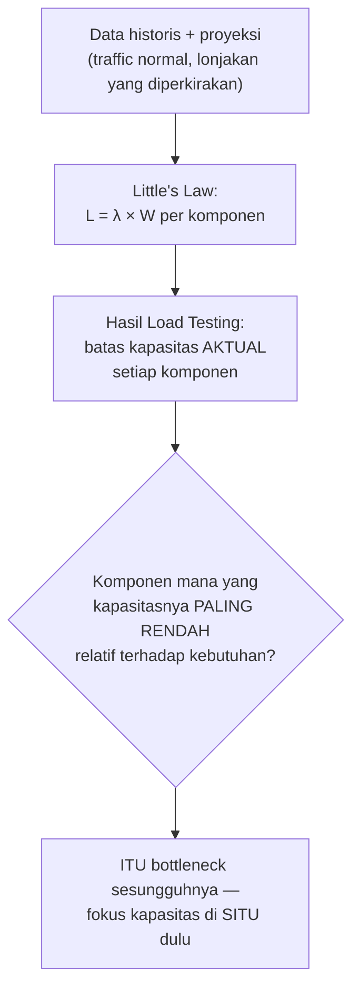

## TL;DR

[[Load Testing]] menemukan batas kapasitas sistem dalam kondisi terkontrol; [[Little's Law]] memberi kerangka matematis menghubungkan traffic, waktu proses, dan konkurensi. Capacity planning menggabungkan keduanya menjadi jawaban konkret atas pertanyaan yang selalu muncul sebelum peluncuran fitur baru atau menghadapi periode traffic tinggi yang diperkirakan: "berapa banyak resource (instance, replica database, kapasitas cache) yang benar-benar dibutuhkan?" — dihitung dari angka nyata (hasil load test, data historis), bukan ditebak atau dilebihkan "untuk jaga-jaga" tanpa dasar yang jelas.

## The Problem

Sebuah tim menghadapi peluncuran fitur pendaftaran baru yang diperkirakan menerima traffic signifikan, dan menjawab pertanyaan "berapa banyak server yang dibutuhkan?" dengan menggandakan kapasitas yang ada saat ini "untuk jaga-jaga" — angka yang tidak berdasar perhitungan apa pun, bisa jadi jauh berlebihan (biaya infrastruktur yang tidak perlu, dibayar terus-menerus meski kapasitas ekstra itu jarang benar-benar dipakai) atau jauh kurang (sistem tetap kewalahan meski sudah "digandakan", karena penggandaan itu tidak proporsional dengan lonjakan traffic sesungguhnya yang bisa jadi 10x atau 20x, bukan 2x).

Masalah kedua yang lebih halus: kapasitas dihitung berdasarkan **satu** komponen sistem (misalnya CPU aplikasi) tanpa mempertimbangkan bahwa komponen lain (database, cache, API partner eksternal dengan rate limit) mungkin punya batas kapasitas yang jauh lebih rendah — menambah instance aplikasi tidak membantu sama sekali kalau bottleneck sesungguhnya ada di connection pool database yang sudah mentok, atau di rate limit partner eksternal yang sama sekali tidak terpengaruh berapa banyak instance aplikasi yang dijalankan.

## Intuition

Bayangkan capacity planning seperti **merencanakan jumlah kursi dan meja untuk sebuah acara**, berdasarkan perkiraan jumlah tamu yang **dihitung** dari data pendaftaran sejauh ini, bukan sekadar "siapkan banyak, untuk jaga-jaga". Penyelenggara yang baik menghitung dari data konkret (jumlah pendaftar sejauh ini, tren pertumbuhan pendaftaran menjelang hari-H, rasio kehadiran historis dari acara serupa) untuk sampai pada angka yang wajar — bukan sekadar melipatgandakan kapasitas ruangan tahun lalu tanpa mempertimbangkan apakah acara tahun ini benar-benar diperkirakan dua kali lebih besar.

Analogi ini bocor pada satu hal: kursi dan meja acara adalah **satu** jenis sumber daya yang mudah dihitung. Sistem software punya **banyak** komponen dengan batas kapasitas berbeda-beda (CPU aplikasi, memori, connection pool database, rate limit partner eksternal, bandwidth jaringan) — perencanaan kapasitas yang benar harus menghitung **masing-masing** komponen ini secara terpisah, karena kapasitas keseluruhan sistem ditentukan oleh komponen **paling terbatas** di antara semuanya (bottleneck), bukan rata-rata atau komponen yang paling mudah ditambah.

## How It Works



Diagram ini menunjukkan alur berpikir capacity planning yang benar: bukan menambah kapasitas secara merata di semua tempat, tapi mengidentifikasi komponen mana yang **secara relatif** paling dekat dengan batasnya dibanding kebutuhan yang diproyeksikan, dan memprioritaskan penambahan kapasitas di situ.

**Langkah konkret capacity planning**:
1. **Kumpulkan data historis** — traffic pola normal, tren pertumbuhan, lonjakan historis (kalau ada event serupa sebelumnya).
2. **Buat proyeksi** — perkirakan traffic puncak yang realistis untuk periode yang direncanakan (dengan margin pengaman, bukan angka optimis).
3. **Hitung kebutuhan per komponen** memakai Little's Law — berapa konkurensi yang dibutuhkan di level aplikasi, database, cache, dst.
4. **Validasi lewat load testing** — konfirmasi bahwa kapasitas yang direncanakan benar-benar bisa menangani proyeksi itu dalam praktik, bukan hanya di atas kertas.
5. **Identifikasi bottleneck** dan alokasikan kapasitas tambahan di sana, bukan merata di semua komponen.

## Under The Hood

**Kapasitas komponen yang tidak bisa diskalakan secepat komponen lain** adalah pertimbangan kritis yang sering terlewat — menambah instance aplikasi Go relatif cepat dan murah (beberapa menit lewat autoscaling Kubernetes), tapi menambah kapasitas database (menambah read replica, upgrade instance) butuh waktu jauh lebih lama dan kadang tidak bisa dilakukan secara instan saat traffic sedang melonjak. Perencanaan kapasitas yang baik mempertimbangkan **waktu yang dibutuhkan** untuk menambah kapasitas setiap komponen, memastikan komponen yang lambat diskalakan (database) sudah disiapkan **jauh** sebelum hari-H, sementara komponen yang cepat diskalakan (instance aplikasi stateless) bisa mengandalkan autoscaling reaktif yang lebih dekat ke waktu sesungguhnya.

**Rate limit dari partner eksternal** adalah bentuk batasan kapasitas yang sama sekali tidak bisa diselesaikan dengan menambah resource internal — kalau partner membatasi 100 request per detik, menambah seratus instance aplikasi tidak mengubah batas itu sama sekali; perencanaan kapasitas untuk komponen semacam ini harus dikoordinasikan langsung dengan partner (negosiasi rate limit lebih tinggi untuk periode tertentu) atau dirancang di sisi aplikasi (antrean, batching, degradasi terkendali) untuk tetap berfungsi dalam batasan itu.

## In Go

```go
package planning

import "time"

// KebutuhanKapasitas menunjukkan perhitungan kapasitas per KOMPONEN
// secara terpisah — bukan angka tunggal untuk "sistem" secara umum.
type KebutuhanKapasitas struct {
	Komponen           string
	KonkurensiDibutuhkan float64
	KapasitasTersedia    float64
}

func HitungKebutuhanPerKomponen(requestPerDetik float64, waktuProsesKomponen map[string]time.Duration) []KebutuhanKapasitas {
	var hasil []KebutuhanKapasitas

	for komponen, waktu := range waktuProsesKomponen {
		kebutuhan := requestPerDetik * waktu.Seconds() // Little's Law
		hasil = append(hasil, KebutuhanKapasitas{
			Komponen:             komponen,
			KonkurensiDibutuhkan: kebutuhan,
		})
	}
	return hasil
}

func contohProyeksiLonjakan() {
	// Proyeksi: 1000 request/detik saat lonjakan (20x traffic normal 50/detik)
	waktuProses := map[string]time.Duration{
		"aplikasi":        50 * time.Millisecond,
		"database":        30 * time.Millisecond,
		"api-partner-nik": 800 * time.Millisecond, // JAUH lebih lambat dari komponen lain
	}

	kebutuhan := HitungKebutuhanPerKomponen(1000, waktuProses)
	// Hasil akan menunjukkan komponen "api-partner-nik" butuh konkurensi
	// JAUH lebih tinggi (800) dibanding aplikasi (50) atau database (30) —
	// bottleneck yang jelas terlihat dari perhitungan ini, BUKAN dari
	// menambah instance aplikasi yang tidak menyentuh masalah sesungguhnya.
	_ = kebutuhan
}
```

## In His Stack

Untuk sistem yang bergantung pada verifikasi data lewat API instansi lain (NIK, data kependudukan), perencanaan kapasitas **harus** mempertimbangkan rate limit dan kapasitas partner itu sebagai batasan yang independen dari kapasitas internal — menambah instance aplikasi sendiri sama sekali tidak membantu kalau bottleneck sesungguhnya ada di sisi partner. Ini adalah percakapan yang perlu dilakukan **jauh** sebelum hari peluncuran (koordinasi dengan tim partner soal kapasitas yang dibutuhkan), bukan ditemukan saat traffic sudah melonjak dan partner mulai menolak request karena rate limit terlampaui.

## Trade-offs and When Not To Use It

Capacity planning yang sangat detail dan formal butuh waktu dan usaha nyata — untuk sistem dengan traffic yang stabil dan dapat diprediksi tanpa periode lonjakan khusus, investasi capacity planning ekstensif setiap saat kurang sepadan dibanding untuk sistem yang menghadapi event dengan lonjakan traffic yang jelas dan berdampak besar (peluncuran fitur, tenggat pendaftaran). Proyeksi yang terlalu konservatif (melebihkan margin pengaman secara berlebihan) berarti membayar biaya infrastruktur untuk kapasitas yang jarang dipakai — keseimbangan antara margin pengaman yang wajar dan efisiensi biaya adalah keputusan yang harus disesuaikan dengan risiko yang bisa diterima organisasi (downtime pada sistem pemerintah punya biaya reputasi yang berbeda dari sistem internal, misalnya).

## Common Mistakes

> [!warning] Jebakan
> Menambah kapasitas secara merata di semua komponen ("gandakan semuanya") tanpa mengidentifikasi komponen mana yang sebenarnya menjadi bottleneck — membuang biaya pada komponen yang kapasitasnya sudah cukup, sementara bottleneck sesungguhnya tetap tidak teratasi.

> [!warning] Jebakan
> Tidak mempertimbangkan rate limit atau kapasitas partner eksternal sebagai batasan independen yang tidak bisa diselesaikan dengan menambah resource internal.

> [!warning] Jebakan
> Tidak mempertimbangkan waktu yang dibutuhkan untuk menambah kapasitas komponen yang lambat diskalakan (database) dibanding komponen yang cepat diskalakan (instance stateless) — perencanaan yang mengasumsikan semua komponen bisa ditambah secara instan sama seperti autoscaling aplikasi.

## Exercises

1. Jelaskan kenapa menambah kapasitas secara merata di semua komponen bukan strategi capacity planning yang efektif.
2. Kenapa rate limit dari partner eksternal adalah bentuk batasan kapasitas yang berbeda dari batasan resource internal?
3. Kenapa waktu yang dibutuhkan untuk menambah kapasitas berbeda-beda antar komponen perlu dipertimbangkan dalam perencanaan?
4. Desain terbuka: sistemmu akan menghadapi tenggat pengumpulan dokumen dalam tiga bulan, dengan proyeksi traffic 15x lipat dari normal pada minggu terakhir menjelang tenggat. Rancang urutan langkah capacity planning yang kamu lakukan dari sekarang sampai hari-H, dengan mempertimbangkan komponen mana yang perlu direncanakan lebih awal karena waktu scaling-nya lebih lama.

> [!success]- Kunci jawaban
> **1.** Kapasitas keseluruhan sistem ditentukan oleh komponen dengan kapasitas **paling terbatas** relatif terhadap kebutuhan (bottleneck) — menambah kapasitas komponen yang **bukan** bottleneck (misalnya menambah instance aplikasi ketika bottleneck sesungguhnya ada di database) tidak meningkatkan kapasitas sistem secara keseluruhan sama sekali, hanya membuang biaya pada komponen yang sudah cukup kapasitasnya.
> **4.** Urutan yang wajar: (1) segera, di awal periode tiga bulan — hitung proyeksi kebutuhan per komponen memakai Little's Law berdasarkan data historis traffic dan waktu proses setiap komponen (aplikasi, database, API partner kalau ada); (2) identifikasi komponen dengan waktu scaling paling lama (biasanya database — menambah read replica atau upgrade instance butuh perencanaan dan mungkin downtime terjadwal) dan mulai proses itu **paling awal**, jauh sebelum bulan terakhir; (3) satu-dua bulan sebelum tenggat — jalankan load testing di lingkungan staging yang mensimulasikan proyeksi 15x traffic dengan campuran pola akses realistis, memverifikasi kapasitas yang direncanakan benar-benar cukup; (4) satu-dua minggu sebelum tenggat — pastikan autoscaling untuk komponen yang cepat diskalakan (instance aplikasi stateless) sudah dikonfigurasi dengan ambang batas yang tepat berdasarkan hasil load testing; (5) kalau ada komponen eksternal (partner API), koordinasikan kapasitas/rate limit yang dibutuhkan dengan tim partner jauh-jauh hari, karena ini di luar kendali langsung timmu dan butuh waktu negosiasi/persetujuan yang tidak bisa dipercepat sepihak.

## Self-Check

- Kenapa menambah kapasitas merata di semua komponen bukan strategi yang efektif?
- Kenapa rate limit partner eksternal adalah batasan kapasitas yang berbeda dari resource internal?
- Kenapa waktu scaling berbeda antar komponen perlu dipertimbangkan dalam perencanaan?
- Apa lima langkah konkret capacity planning yang dibahas di note ini?

## Connected Notes

- [[Little's Law]] — kerangka matematis inti yang dipakai menghitung kebutuhan kapasitas per komponen di note ini.
- [[Load Testing]] — validasi konkret bahwa kapasitas yang direncanakan benar-benar memadai dalam praktik, bukan hanya perhitungan di atas kertas.
- [[Profiling a Real Application]] — latihan menyeluruh yang menggabungkan pprof, benchmark, dan load test, termasuk aplikasinya untuk capacity planning, dibahas di note penutup domain ini.
- [[../30 APIs and Web/Handling an Unreliable Counterparty|Handling an Unreliable Counterparty]] — rate limit dan batasan partner eksternal yang dibahas di note ini bersinggungan langsung dengan pola menangani counterparty yang terbatas kapasitasnya.
- [[../70 Infrastructure and Delivery/_Overview|Infrastructure and Delivery Overview]] — autoscaling Kubernetes yang disinggung di note ini adalah mekanisme konkret yang dibahas lebih dalam di domain infrastruktur.

## Further Reading

- Materi capacity planning dari praktik SRE (Site Reliability Engineering) yang dipublikasikan luas oleh berbagai perusahaan teknologi besar sebagai studi kasus umum (bukan rujukan spesifik satu sumber tunggal).

## Catatan Saya

*Tulis di sini event atau tenggat mendatang di kerjaanmu yang diperkirakan menyebabkan lonjakan traffic — apakah sudah ada rencana capacity planning untuk itu.*
