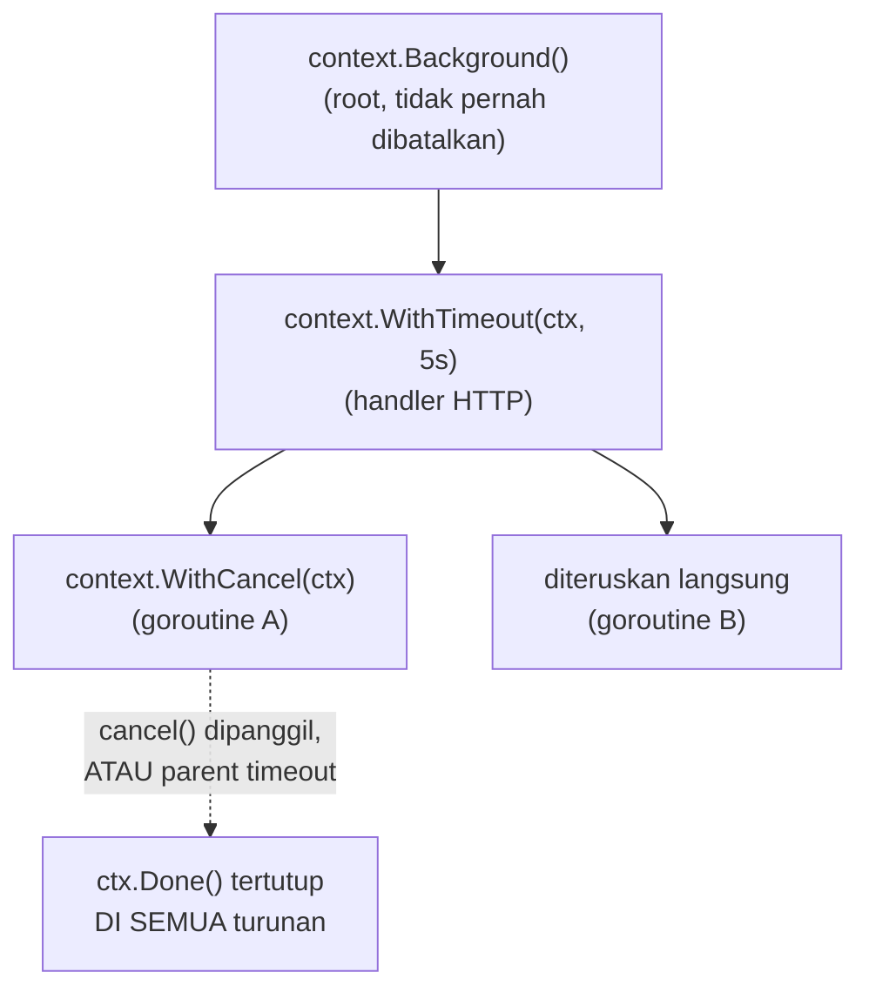

## TL;DR

[[../30 APIs and Web/Context Propagation in HTTP Servers|Context propagation]] menunjukkan *bahwa* `context.Context` membawa nilai dan sinyal pembatalan sepanjang rantai pemanggilan HTTP. Note ini menjawab pertanyaan yang lebih dalam: **bagaimana** sinyal pembatalan itu benar-benar sampai ke setiap goroutine yang perlu tahu, dan kenapa itu penting secara khusus dalam dunia concurrency, bukan sekadar HTTP. `context.Context` adalah mekanisme standar Go untuk membawa "berhenti sekarang" atau "batas waktu ini" lintas goroutine dan lintas layer pemanggilan — tanpa context, setiap goroutine yang diluncurkan untuk melayani satu request berpotensi terus bekerja meski request yang memicunya sudah lama dibatalkan atau selesai, memboroskan resource untuk pekerjaan yang hasilnya tidak akan pernah dipakai siapa pun.

## The Problem

Sebuah handler HTTP meluncurkan goroutine untuk memanggil tiga API partner eksternal secara paralel, mengumpulkan hasilnya, lalu mengembalikan response gabungan. Pengguna menutup koneksinya (menutup tab browser, atau timeout di sisi klien) sebelum ketiga panggilan API itu selesai — tapi tanpa context yang diteruskan ke ketiga panggilan itu, mereka **terus berjalan** sampai selesai sendiri (atau timeout internal masing-masing), meski hasilnya tidak akan pernah dikirim ke mana pun karena koneksi klien sudah terputus. Untuk satu request, ini tidak masalah — tapi untuk sistem dengan traffic tinggi di mana pengguna sering membatalkan request (menutup tab, refresh halaman), goroutine "hantu" ini terakumulasi, masing-masing menahan resource (koneksi jaringan, memori) untuk pekerjaan yang sudah sia-sia.

Masalah kedua: sebuah query database yang biasanya cepat tiba-tiba macet karena lock yang ditahan transaction lain (lihat [[../40 Databases/Deadlocks|Deadlocks]]) — tanpa deadline yang jelas, handler yang menunggu query ini bisa menahan goroutine (dan koneksi database dari pool, lihat [[../40 Databases/Connection Pooling|Connection Pooling]]) selamanya, ikut menahan resource yang seharusnya bisa dipakai request lain. Context dengan deadline eksplisit memberi batas waktu tegas: "kalau ini belum selesai dalam 5 detik, batalkan dan kembalikan error", mencegah satu query yang macet menahan resource sistem tanpa batas.

## Intuition

Bayangkan `context.Context` seperti **pengumuman "acara dibatalkan" yang harus didengar semua orang yang terlibat**, bukan hanya panitia utama. Kalau sebuah acara besar dibatalkan, pengumuman itu harus sampai ke setiap vendor, setiap panitia kecil, setiap sukarelawan yang sedang bekerja untuk acara itu — bukan hanya panitia utama yang tahu, sementara semua orang lain terus bekerja tanpa sadar acaranya sudah batal. Context yang diteruskan (bukan dibuat ulang) di setiap lapisan pemanggilan fungsi adalah cara memastikan pengumuman "batal" ini benar-benar sampai ke setiap goroutine yang terlibat, sedalam apa pun rantai pemanggilannya.

Analogi ini bocor pada satu hal: pengumuman manusia butuh seseorang secara aktif menyampaikannya ke semua pihak. `context.Done()` tidak "mendorong" sinyal secara aktif ke setiap goroutine — setiap goroutine harus secara **aktif memeriksa** `ctx.Done()` (biasanya lewat `select`, dibahas di [[The Select Statement]]) di titik-titik yang tepat dalam kodenya sendiri. Context yang diteruskan tapi **tidak pernah diperiksa** oleh kode yang menerimanya sama sekali tidak berguna — meneruskan context adalah prasyarat, tapi memeriksanya di titik yang tepat adalah tanggung jawab yang harus dipenuhi eksplisit oleh setiap fungsi yang menerimanya.

## How It Works

```go
package main

import (
	"context"
	"fmt"
	"time"
)

func panggilPartner(ctx context.Context, nama string) error {
	select {
	case <-time.After(3 * time.Second): // simulasi panggilan lambat
		fmt.Println("selesai memanggil", nama)
		return nil
	case <-ctx.Done():
		// ctx dibatalkan SEBELUM panggilan selesai — berhenti, jangan
		// tunggu 3 detik penuh untuk pekerjaan yang sudah tidak berguna.
		return ctx.Err()
	}
}

func main() {
	// WithTimeout membuat context yang OTOMATIS dibatalkan setelah durasi
	// tertentu — ctx.Done() akan menutup channelnya sendiri saat timeout.
	ctx, cancel := context.WithTimeout(context.Background(), 1*time.Second)
	defer cancel() // SELALU panggil cancel, bahkan kalau timeout sudah terjadi —
	                // mencegah goroutine internal context bocor.

	err := panggilPartner(ctx, "instansi-x")
	fmt.Println("hasil:", err) // context deadline exceeded, karena timeout 1s < 3s panggilan
}
```



Diagram ini menunjukkan sifat **hierarkis** context: membatalkan context di level manapun (atau timeout-nya habis) otomatis membatalkan **seluruh context turunan** yang dibuat darinya — sinyal pembatalan mengalir searah dari parent ke child, tidak pernah sebaliknya, dan tidak bisa "dibatalkan sebagian" hanya untuk sebagian turunan tertentu.

## Under The Hood

**`context.Context` membawa dua hal berbeda sekaligus**: sinyal pembatalan/deadline (lewat `Done()`, `Err()`, `Deadline()`) dan **nilai** request-scoped (lewat `Value()`/`WithValue`) — dua kebutuhan yang cukup berbeda dibungkus dalam satu interface yang sama. Sinyal pembatalan adalah kebutuhan yang relevan langsung dengan domain concurrency ini; nilai request-scoped (seperti correlation ID) lebih relevan untuk observability, dibahas di [[../30 APIs and Web/Context Propagation in HTTP Servers|Context Propagation in HTTP Servers]].

**Empat fungsi pembuat context turunan**: `context.WithCancel` (bisa dibatalkan manual lewat fungsi `cancel()` yang dikembalikan), `context.WithTimeout` (dibatalkan otomatis setelah durasi tertentu), `context.WithDeadline` (dibatalkan otomatis pada waktu absolut tertentu, mirip `WithTimeout` tapi dengan titik waktu tetap, bukan durasi relatif), dan `context.WithValue` (menambah satu pasangan key-value, tidak memengaruhi pembatalan). Setiap fungsi ini mengembalikan context **baru** yang merupakan turunan dari context yang diberikan — context asli tidak diubah (immutable), konsisten dengan filosofi Go menghindari mutasi tersembunyi.

**`cancel()` harus SELALU dipanggil**, bahkan kalau operasinya sudah selesai normal sebelum timeout — `context.WithTimeout`/`WithCancel` menjalankan goroutine internal (dan/atau timer) untuk memantau kondisi pembatalan; lupa memanggil `cancel()` (biasanya lewat `defer cancel()` segera setelah context dibuat) membuat resource internal ini tidak pernah dibersihkan sampai timeout aslinya benar-benar habis — sebuah bentuk kebocoran resource yang halus tapi nyata pada skala tinggi.

## In Go

```go
package handler

import (
	"context"
	"fmt"
	"time"
)

// AmbilDataDenganDeadline menunjukkan pola LENGKAP: deadline eksplisit
// untuk operasi yang berpotensi lambat (query database, panggilan API),
// dan cancel() SELALU dipanggil lewat defer.
func AmbilDataDenganDeadline(ctxInduk context.Context, id int64) (string, error) {
	ctx, cancel := context.WithTimeout(ctxInduk, 2*time.Second)
	defer cancel() // WAJIB, bahkan kalau operasi selesai lebih cepat dari 2 detik

	hasil := make(chan string, 1)
	errCh := make(chan error, 1)

	go func() {
		// simulasi operasi yang BISA lambat (query database sungguhan)
		time.Sleep(500 * time.Millisecond)
		hasil <- fmt.Sprintf("data-%d", id)
	}()

	select {
	case v := <-hasil:
		return v, nil
	case err := <-errCh:
		return "", err
	case <-ctx.Done():
		// ctx.Err() akan berupa context.DeadlineExceeded (timeout habis)
		// atau context.Canceled (parent dibatalkan sebelum timeout)
		return "", fmt.Errorf("ambil data %d: %w", id, ctx.Err())
	}
}
```

## In His Stack

Untuk sistem yang memanggil banyak API partner eksternal (relevan langsung dengan integrasi lintas instansi), context dengan timeout eksplisit di **setiap** panggilan keluar adalah kebiasaan yang tidak boleh diabaikan — partner yang responsnya lambat atau macet tidak boleh diizinkan menahan resource sistem tanpa batas hanya karena kode pemanggil lupa menyertakan deadline. Ini juga relevan langsung dengan pola timeout budget yang dibahas lebih formal di domain `30 APIs and Web` (resilience patterns) — context adalah mekanisme bahasa yang mengimplementasikan konsep timeout budget itu secara konkret di Go.

## Trade-offs and When Not To Use It

Context timeout yang terlalu ketat bisa membatalkan operasi yang sebenarnya hanya butuh sedikit lebih lama dari perkiraan (lonjakan latency sesaat pada partner eksternal yang biasanya cepat), menyebabkan kegagalan yang sebenarnya bisa dihindari dengan timeout yang sedikit lebih longgar. Context timeout yang terlalu longgar kehilangan manfaat utamanya — menahan resource dalam waktu lama untuk operasi yang seharusnya sudah dianggap gagal jauh lebih awal. Menentukan nilai timeout yang tepat butuh pengukuran nyata terhadap distribusi latency operasi yang bersangkutan (lihat [[Latency Percentiles (p50, p95, p99)]]) — bukan angka yang "terasa aman" tanpa dasar data.

## Common Mistakes

> [!warning] Jebakan
> Meluncurkan goroutine untuk melayani sebuah request tanpa meneruskan context request itu ke dalamnya — goroutine terus bekerja meski request yang memicunya sudah dibatalkan atau selesai, memboroskan resource untuk hasil yang tidak akan pernah dipakai.

> [!warning] Jebakan
> Lupa memanggil `cancel()` (tidak memakai `defer cancel()`) setelah membuat context dengan `WithTimeout`/`WithCancel` — goroutine internal context tidak dibersihkan sampai timeout aslinya habis, kebocoran resource kecil yang terakumulasi pada volume tinggi.

> [!warning] Jebakan
> Meneruskan context tapi tidak pernah memeriksa `ctx.Done()` di titik yang tepat dalam kode yang menerimanya — context yang diteruskan tanpa diperiksa sama sekali tidak memberi manfaat pembatalan apa pun.

## Exercises

1. Jelaskan kenapa `cancel()` harus selalu dipanggil, bahkan ketika operasi sudah selesai normal sebelum timeout terjadi.
2. Apa perbedaan `context.WithTimeout` dan `context.WithDeadline`?
3. Kenapa membatalkan context di level tertentu otomatis membatalkan seluruh context turunannya?
4. Desain terbuka: handler HTTP-mu memanggil tiga API partner eksternal secara paralel lewat tiga goroutine, mengumpulkan hasilnya lewat channel, lalu mengembalikan response gabungan. Rancang bagaimana context dari request HTTP diteruskan ke ketiga goroutine ini, dan jelaskan apa yang terjadi pada ketiga goroutine itu kalau pengguna menutup koneksinya di tengah proses.

> [!success]- Kunci jawaban
> **1.** `context.WithTimeout`/`WithCancel` menjalankan mekanisme internal (goroutine dan/atau timer) untuk memantau kapan context harus dibatalkan. Kalau operasi selesai lebih cepat dari timeout tapi `cancel()` tidak dipanggil, mekanisme internal ini **tetap berjalan** menunggu durasi timeout aslinya habis sebelum benar-benar dibersihkan — memanggil `cancel()` segera setelah operasi selesai (lewat `defer`, yang otomatis terpanggil begitu fungsi selesai) memberi tahu runtime untuk membersihkan mekanisme itu **seketika**, tidak perlu menunggu timeout.
> **4.** Context dari `*http.Request` (`r.Context()`) diteruskan sebagai parameter pertama ke fungsi yang menjalankan masing-masing dari tiga panggilan API partner — bisa langsung diteruskan (kalau ketiganya harus dibatalkan bersamaan begitu request HTTP selesai/dibatalkan) atau dibungkus lagi dengan `context.WithTimeout` individual (kalau masing-masing partner butuh batas waktu berbeda). Ketiga goroutine menjalankan `select` yang memeriksa `ctx.Done()` di samping menunggu hasil panggilan API. Begitu pengguna menutup koneksinya, Go `net/http` secara otomatis membatalkan context request itu (`r.Context()` yang mendasari) — sinyal pembatalan ini mengalir ke ketiga context turunan yang diteruskan ke tiga goroutine, dan `ctx.Done()` di ketiganya langsung tertutup, memicu ketiga goroutine berhenti lebih awal (asalkan masing-masing benar-benar memeriksa `ctx.Done()` lewat select) alih-alih terus menunggu respons API yang hasilnya sudah tidak berguna.

## Self-Check

- Kenapa `cancel()` harus selalu dipanggil meski operasi selesai normal?
- Apa perbedaan `context.WithTimeout` dan `context.WithDeadline`?
- Bagaimana pembatalan mengalir dari context induk ke context turunan?
- Kenapa meneruskan context tanpa memeriksa `ctx.Done()` tidak memberi manfaat apa pun?

## Connected Notes

- [[../30 APIs and Web/Context Propagation in HTTP Servers|Context Propagation in HTTP Servers]] — pengantar context dari sudut pandang HTTP handler; note ini memperdalam mekanisme pembatalannya di level goroutine.
- [[The Select Statement]] — `select` dengan `ctx.Done()` adalah pola konkret memeriksa pembatalan context di dalam goroutine.
- [[Worker Pools]] — worker pool yang baik harus responsif terhadap pembatalan context, dibahas di note berikutnya.
- [[Goroutine Leaks]] — goroutine yang tidak memeriksa context adalah salah satu penyebab paling umum goroutine leak.
- [[../40 Databases/Connection Pooling|Connection Pooling]] — query database tanpa context dengan timeout bisa menahan koneksi dari pool tanpa batas, menghubungkan langsung ke masalah di "The Problem".

## Further Reading

- Dokumentasi resmi Go, package `context`.
- Go blog resmi, "Go Concurrency Patterns: Context".

## Catatan Saya

*Tulis di sini apakah ada panggilan ke API partner eksternal di kerjaanmu yang belum memakai context dengan timeout eksplisit.*
