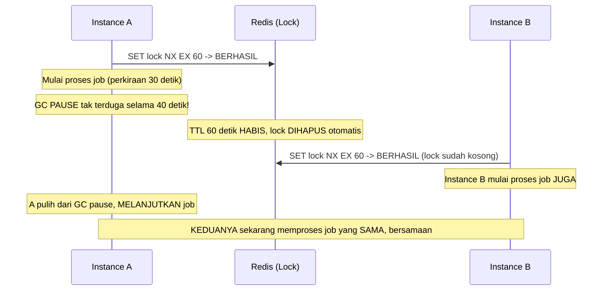

## TL;DR

[[../40 Databases/Locking and Row Locks|Locking dalam satu database]] bekerja karena semua transaction bicara dengan **satu** proses database yang punya pandangan konsisten tentang siapa memegang lock apa. Distributed lock mencoba mencapai hal yang sama **lintas banyak proses/instance aplikasi yang berjalan di mesin berbeda** — dan di sinilah masalahnya menjadi jauh lebih sulit dari yang terlihat: tidak ada jam yang benar-benar sinkron sempurna antar mesin, proses bisa berhenti sesaat tanpa peringatan (GC pause, page fault), dan jaringan bisa membuat pesan datang terlambat atau tidak sama sekali. Distributed lock yang diimplementasikan naif (misalnya `SETNX` sederhana di Redis) terlihat bekerja di kondisi normal, tapi punya celah nyata yang bisa menyebabkan **dua proses berpikir mereka berdua memegang lock yang sama** — persis kegagalan yang locking seharusnya mencegah.

## The Problem

Sebuah job terjadwal yang mengirim laporan bulanan harus dijalankan **tepat sekali**, tapi aplikasi berjalan sebagai tiga instance/pod untuk redundansi — tanpa koordinasi, ketiga instance itu bisa sama-sama menjalankan cron job pada waktu yang sama, mengirim laporan tiga kali. Tim menerapkan distributed lock sederhana: instance yang berhasil `SET lock_key value NX EX 60` (set hanya kalau belum ada, dengan TTL 60 detik) menganggap dirinya "menang" dan menjalankan job, sementara instance lain melihat key sudah ada dan mundur.

Skenario yang benar-benar terjadi: instance A berhasil mendapat lock dan mulai menjalankan job yang ternyata butuh waktu 90 detik (lebih lama dari TTL lock 60 detik) — karena mengalami **GC pause** yang tidak terduga selama beberapa detik di tengah proses (lihat [[Garbage Collection in Go]]), atau karena beban sistem yang sedang tinggi. TTL lock 60 detik habis **sebelum** instance A selesai menjalankan job, dan Redis menghapus lock itu secara otomatis. Instance B, yang sedang menunggu giliran, melihat lock sudah tidak ada, dan **berhasil mendapat lock yang "baru"** — sekarang **instance A dan B keduanya menjalankan job yang sama secara bersamaan**, persis kegagalan yang locking seharusnya mencegah, terjadi justru karena mekanisme TTL yang seharusnya menjadi jaring pengaman (mencegah lock macet selamanya kalau instance yang memegangnya crash) menjadi celah yang dieksploitasi oleh timing yang tidak terduga.

## Intuition

Bayangkan distributed lock seperti **kunci kamar hotel yang bisa "kedaluwarsa" otomatis setelah durasi tertentu** untuk mencegah kamar terkunci selamanya kalau tamu lupa check-out — mekanisme yang masuk akal untuk kasus normal. Tapi bayangkan seorang tamu (instance A) yang sedang di dalam kamar mengalami sesuatu yang membuatnya "membeku" sesaat (analog dari GC pause) — cukup lama sehingga kunci kamarnya kedaluwarsa otomatis **sementara ia masih di dalam**, tidak sadar kuncinya sudah tidak berlaku lagi. Resepsionis (sistem lock), tidak tahu tamu itu masih di dalam, memberikan kunci baru ke tamu lain (instance B) yang mengantre — sekarang **dua tamu** memegang kunci yang "sah" untuk kamar yang sama, masing-masing percaya mereka satu-satunya yang berhak masuk.

Analogi ini bocor pada satu hal penting: resepsionis hotel bisa secara fisik memeriksa apakah kamar benar-benar kosong sebelum memberi kunci baru. Sistem distributed lock **tidak punya cara mengetahui secara pasti** apakah pemegang lock sebelumnya benar-benar sudah berhenti bekerja, atau hanya "membeku" sesaat dan akan melanjutkan pekerjaannya — inilah akar masalah yang membuat distributed locking secara fundamental lebih sulit daripada yang terlihat, dan kenapa topik ini menjadi pengantar yang tepat menuju masalah **konsensus dan deteksi kegagalan** dalam sistem terdistribusi yang dibahas jauh lebih formal di `60 Distributed Systems`, level senior.

## How It Works



Diagram ini menunjukkan persis skenario "The Problem" — jeda tak terduga (GC pause, network partition, atau apa pun yang membuat proses tidak responsif sementara) yang melebihi TTL lock menciptakan jendela di mana **dua** pemegang lock yang sah bisa ada secara bersamaan, sebuah pelanggaran total terhadap jaminan mutual exclusion yang seharusnya diberikan lock.

## Under The Hood

**Melepas lock juga berbahaya, bukan cuma memegangnya.** Skenario TTL habis yang sudah dibahas di atas punya kelanjutan yang sering terlewat: kalau instance A akhirnya "bangun" setelah TTL-nya habis dan lock-nya sudah diambil alih instance B, instance A yang mencoba membersihkan diri dengan memanggil `DEL` polos pada key lock itu akan menghapus lock **milik instance B**, bukan miliknya sendiri — key-nya sama, Redis tidak tahu siapa pemiliknya. Pelepasan lock karena itu harus **bersyarat**: bandingkan dulu nilai token yang tersimpan di lock dengan token yang dipegang instance yang mencoba melepas, dan hapus hanya kalau cocok. Di Redis, perbandingan-lalu-hapus ini harus dijalankan sebagai satu skrip Lua (`EVAL`) supaya atomik — kalau dipisah jadi `GET` lalu `DEL` dua perintah terpisah, ada celah waktu di antaranya yang membuka race condition yang sama persis dengan yang coba dicegah fencing token.

**Fencing token** adalah mitigasi yang diakui luas untuk masalah ini — setiap kali lock diberikan, sertakan **nomor urut yang selalu naik** (fencing token) bersama lock itu. Instance yang memegang lock harus menyertakan fencing token ini setiap kali melakukan operasi yang dilindungi lock (misalnya menulis ke database), dan sistem yang menerima operasi itu (database, storage) harus **menolak** operasi dengan fencing token yang lebih rendah dari token terakhir yang sudah diterima — ini mencegah instance A yang "bangun terlambat" dari GC pause dan mencoba melanjutkan pekerjaannya (dengan token lama) dari benar-benar merusak data, karena sistem penerima akan menolak operasinya begitu melihat instance B sudah beroperasi dengan token yang lebih baru.

**Kenapa `SETNX` sederhana di satu instance Redis tidak cukup untuk kasus yang benar-benar kritis**: bahkan tanpa masalah GC pause, satu instance Redis sendiri bisa gagal (crash, network partition) — kalau replikasi ke instance Redis lain belum sempat terjadi sebelum crash, lock yang "sudah diberikan" ke satu klien bisa hilang begitu Redis gagal-alih (failover) ke replica yang belum menerima informasi lock itu, membuka celah yang sama seperti skenario TTL habis. **Redlock** adalah algoritma yang diusulkan untuk mengatasi ini dengan meminta lock dari **mayoritas** node Redis independen — tapi algoritma ini sendiri menjadi bahan perdebatan signifikan di komunitas (termasuk kritik terkenal dari Martin Kleppmann yang mempertanyakan asumsi soal clock dan waktu yang dipakai Redlock) tentang apakah ia benar-benar memberi jaminan yang diklaim dalam semua kondisi kegagalan yang mungkin terjadi.

> [!question] Perlu diverifikasi
> Klaim: detail spesifik algoritma Redlock dan isi kritik Kleppmann terhadapnya.
> Kenapa ragu: ini adalah perdebatan teknis yang cukup mendalam dan berkelanjutan dalam komunitas distributed systems; ringkasan singkat di sini tidak boleh dianggap representasi lengkap dari argumen kedua belah pihak.
> Cara verifikasi: baca langsung artikel asli Martin Kleppmann "How to do distributed locking" dan tanggapan resmi dari tim Redis (antirez) sebagai kedua sisi argumen.

## In Go

```go
package distlock

import (
	"context"
	"fmt"
	"time"

	"github.com/redis/go-redis/v9"
)

// PerolehLockDenganFencingToken menunjukkan pola fencing token —
// setiap lock yang berhasil diperoleh disertai nomor urut yang SELALU
// NAIK, yang harus diperiksa sistem penerima operasi (bukan hanya
// dipercaya oleh pemegang lock itu sendiri).
func PerolehLockDenganFencingToken(ctx context.Context, rdb *redis.Client, lockKey string, ttl time.Duration) (int64, error) {
	// INCR pada counter terpisah SELALU naik, terlepas dari lock itu
	// sendiri berhasil diperoleh atau tidak — dipakai SEBAGAI fencing token.
	token, err := rdb.Incr(ctx, lockKey+":token").Result()
	if err != nil {
		return 0, fmt.Errorf("increment fencing token: %w", err)
	}

	sukses, err := rdb.SetNX(ctx, lockKey, token, ttl).Result()
	if err != nil {
		return 0, fmt.Errorf("set lock: %w", err)
	}
	if !sukses {
		return 0, fmt.Errorf("lock sedang dipegang instance lain")
	}

	return token, nil
}

// TulisDenganFencingToken menunjukkan bagaimana sistem PENERIMA operasi
// (bukan pemegang lock) harus menolak token yang lebih lama — ini yang
// benar-benar mencegah kerusakan data, BUKAN sekadar mempercayai
// pemegang lock "pasti" satu-satunya yang aktif.
func TulisDenganFencingToken(ctx context.Context, tokenTerakhirTersimpan *int64, tokenBaru int64, data string) error {
	// <=, bukan < — token yang SAMA persis dengan yang terakhir tersimpan
	// berarti pemegang lock lama mencoba menulis lagi (misalnya request
	// yang tertunda), dan itu justru kasus yang harus ditolak juga.
	if tokenBaru <= *tokenTerakhirTersimpan {
		return fmt.Errorf("fencing token %d sudah usang, token terakhir %d — operasi DITOLAK", tokenBaru, *tokenTerakhirTersimpan)
	}
	*tokenTerakhirTersimpan = tokenBaru
	// ... simpan data ...
	return nil
}
```

## In His Stack

Untuk job batch atau cron job yang berjalan sebagai banyak pod Kubernetes (pola yang umum untuk redundansi), distributed lock sederhana berbasis Redis sering "cukup baik" untuk kebutuhan yang tidak benar-benar kritis (mencegah duplikasi laporan yang kalaupun terjadi, cukup mudah diperbaiki manual) — tapi untuk operasi yang benar-benar tidak boleh terjadi dobel (transaksi keuangan, perubahan status hukum yang berdampak legal), risiko celah distributed lock yang dijelaskan di note ini cukup serius untuk dipertimbangkan alternatif yang lebih kuat: pola `SELECT ... FOR UPDATE SKIP LOCKED` di database (lihat [[../40 Databases/Locking and Row Locks|Locking and Row Locks]]) yang bertumpu pada jaminan ACID satu database, bukan koordinasi lintas banyak proses independen yang secara fundamental lebih rapuh.

## Trade-offs and When Not To Use It

Distributed lock berbasis Redis sederhana cukup untuk kasus yang **toleran terhadap kegagalan sesekali** (duplikasi job yang jarang terjadi dan mudah diperbaiki) — investasi fencing token atau Redlock penuh untuk kasus semacam ini adalah over-engineering yang tidak sepadan. Untuk kasus yang benar-benar kritis (tidak boleh ada duplikasi sama sekali, konsekuensi kegagalan serius), pertimbangkan dulu apakah masalahnya bisa diselesaikan **tanpa** distributed lock sama sekali — misalnya dengan memindahkan koordinasi ke satu database yang sudah punya jaminan ACID kuat (locking baris database, unique constraint yang menolak duplikasi secara struktural), yang seringkali lebih sederhana dan lebih teruji dibanding membangun sendiri distributed lock yang benar-benar kokoh lintas banyak proses independen.

## Common Mistakes

> [!warning] Jebakan
> Mengasumsikan TTL lock yang "cukup lama" akan selalu melebihi waktu eksekusi operasi yang dilindunginya — jeda tak terduga (GC pause, network partition, beban sistem tinggi) bisa membuat operasi berjalan lebih lama dari perkiraan mana pun, dan tidak ada TTL yang benar-benar "aman" tanpa mekanisme tambahan seperti fencing token.

> [!warning] Jebakan
> Membangun distributed lock sendiri untuk kasus yang sebenarnya bisa diselesaikan lebih sederhana dan lebih andal lewat locking database (unique constraint, `SELECT FOR UPDATE`) yang sudah punya jaminan ACID kuat dalam satu sistem.

> [!warning] Jebakan
> Memakai distributed lock sederhana (SETNX tanpa fencing token) untuk operasi yang benar-benar kritis dan tidak boleh ada duplikasi sama sekali, tanpa menyadari celah TTL yang dijelaskan di note ini.

## Exercises

1. Jelaskan skenario konkret di mana TTL lock yang "cukup lama" tetap bisa menyebabkan dua proses memegang lock yang sama secara bersamaan.
2. Bagaimana fencing token mencegah kerusakan data meski celah TTL lock tetap terjadi?
3. Kenapa sistem yang menerima operasi (bukan hanya pemegang lock) harus memeriksa fencing token, bukan mempercayai pemegang lock begitu saja?
4. Desain terbuka: timmu perlu memastikan sebuah job migrasi data besar (butuh waktu bervariasi, dari beberapa menit sampai beberapa jam tergantung volume data) hanya berjalan di satu instance pada satu waktu, dan kegagalan karena duplikasi (dua instance menjalankan migrasi yang sama bersamaan) akan merusak data secara serius. Jelaskan kenapa distributed lock berbasis Redis sederhana (tanpa fencing token) berisiko untuk kasus ini, dan rancang pendekatan alternatif yang lebih aman.

> [!success]- Kunci jawaban
> **1.** Proses yang memegang lock bisa mengalami jeda tak terduga yang tidak berkaitan dengan logika bisnisnya sama sekali — GC pause pada aplikasi Go (lihat [[Garbage Collection in Go]]), network partition sesaat, atau node Kubernetes yang mengalami tekanan resource tinggi dan memperlambat seluruh proses di dalamnya. Jeda ini bisa terjadi kapan saja dan berdurasi tidak terduga, membuat **tidak ada** angka TTL yang benar-benar "pasti aman" — TTL yang cukup lama untuk kondisi normal tetap bisa terlampaui oleh jeda yang cukup ekstrem, membuka celah yang sama.
> **4.** Distributed lock sederhana berisiko karena durasi migrasi yang **sangat bervariasi** (menit sampai jam) membuat menentukan TTL yang aman menjadi sangat sulit — TTL yang cukup panjang untuk volume data terbesar berarti kalau instance yang memegang lock benar-benar crash (bukan sekadar jeda), lock itu akan macet dalam waktu yang sangat lama sebelum ada instance lain yang bisa mengambil alih. Pendekatan yang lebih aman: gunakan **locking di level database** yang menjadi sasaran migrasi itu sendiri — misalnya baris "status migrasi" yang di-lock lewat `SELECT ... FOR UPDATE` (lihat [[../40 Databases/Locking and Row Locks|Locking and Row Locks]]) dalam transaction yang **tetap terbuka selama migrasi berjalan** (bukan lock terpisah dengan TTL independen) — kalau instance yang menjalankan migrasi benar-benar crash, koneksi database-nya akan terputus dan lock itu otomatis dilepas oleh database itu sendiri (bukan menunggu TTL buatan yang terpisah dari kondisi sesungguhnya proses itu masih hidup atau tidak), sinyal yang jauh lebih akurat dibanding TTL yang ditebak di awal tanpa tahu durasi sesungguhnya migrasi akan berjalan.

## Self-Check

- Kenapa TTL lock yang "cukup lama" tetap bisa gagal mencegah dua pemegang lock bersamaan?
- Bagaimana fencing token mencegah kerusakan data meski celah TTL terjadi?
- Kenapa locking di level database sering lebih aman dibanding distributed lock buatan sendiri?
- Kapan distributed lock sederhana (tanpa fencing token) cukup memadai?

## Connected Notes

- [[../40 Databases/Locking and Row Locks|Locking and Row Locks]] — locking dalam satu database yang jauh lebih dapat diandalkan karena bertumpu pada satu sistem dengan jaminan ACID, kontras langsung dengan distributed lock di note ini.
- [[Cache Stampede]] — distributed lock kadang dipakai sebagai mitigasi tambahan cache stampede lintas banyak instance, disinggung sebagai penutup note sebelumnya.
- [[Garbage Collection in Go]] — GC pause adalah salah satu penyebab konkret jeda tak terduga yang bisa memicu celah TTL lock yang dijelaskan di note ini.
- [[../60 Distributed Systems/Failure Detectors|Failure Detectors]] — akar masalah "bagaimana tahu proses lain benar-benar mati, bukan hanya lambat" dibahas jauh lebih formal di level senior, domain Distributed Systems.
- [[../60 Distributed Systems/Consensus - Raft|Consensus - Raft]] — algoritma konsensus yang menyelesaikan masalah koordinasi lintas node dengan jaminan formal yang jauh lebih kuat dibanding distributed lock ad-hoc, dibahas di level senior.

## Further Reading

- Martin Kleppmann, "How to do distributed locking" — kritik mendalam terhadap algoritma Redlock dan asumsi soal waktu dalam sistem terdistribusi.
- Dokumentasi resmi Redis mengenai Redlock, sebagai sisi argumen lain dari perdebatan ini.

## Catatan Saya

*Tulis di sini apakah kerjaanmu memakai distributed lock untuk job/cron yang berjalan di banyak instance — dan seberapa kritis konsekuensinya kalau lock itu gagal mencegah duplikasi.*
