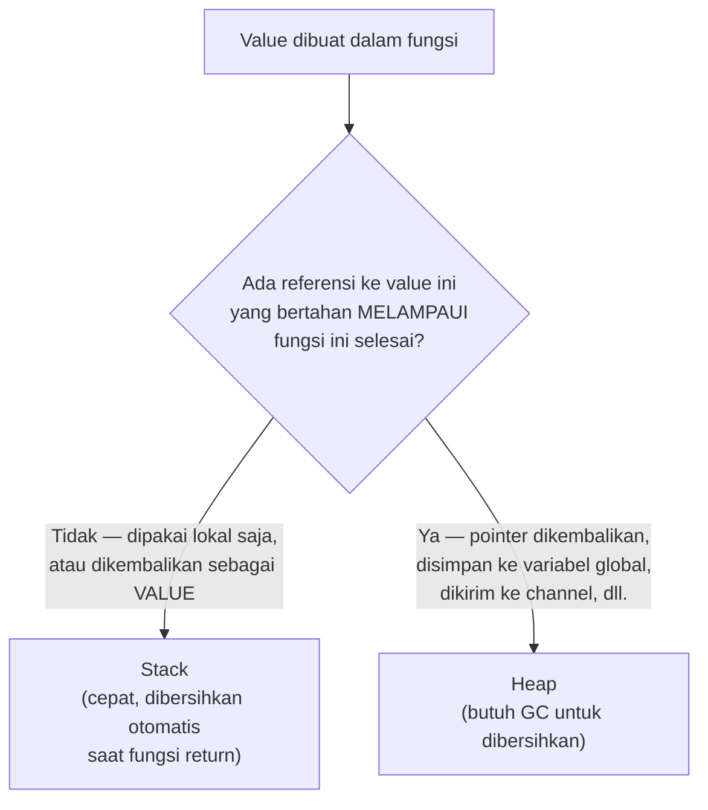

## TL;DR

[[../10 Foundations/Memory Layout - Stack vs Heap|Memory layout]] menjelaskan perbedaan stack (cepat, dibersihkan otomatis saat fungsi selesai) dan heap (fleksibel, butuh GC untuk dibersihkan). Escape analysis adalah proses yang dilakukan compiler Go **saat compile time** untuk memutuskan: apakah sebuah value bisa aman disimpan di stack (karena hidupnya tidak melebihi fungsi yang membuatnya), atau harus "kabur" (escape) ke heap (karena referensinya bisa dipakai setelah fungsi yang membuatnya selesai). Keputusan ini sepenuhnya otomatis dan tidak bisa dikontrol manual oleh developer (tidak ada keyword "taruh di stack" di Go) — tapi **cara kode ditulis** memengaruhi keputusan compiler, dan memahami polanya membantu menulis kode yang menghasilkan lebih sedikit tekanan pada GC.

## The Problem

Sebuah fungsi yang dipanggil jutaan kali per detik (hot path) membuat sebuah struct lokal dan mengembalikan **pointer** ke struct itu (`return &StructLokal{...}`) — pola yang terlihat wajar dan idiomatic, tapi memaksa compiler menyimpan struct itu di **heap**, bukan stack, karena pointer yang dikembalikan bisa dipakai pemanggil setelah fungsi ini selesai (stack frame fungsi ini akan didaur ulang begitu fungsi return, sehingga data yang masih dibutuhkan tidak bisa tetap ada di sana). Untuk fungsi yang dipanggil jutaan kali, ini berarti jutaan alokasi heap yang seharusnya bisa dihindari kalau strukturnya dikembalikan sebagai **value** (bukan pointer) dan tidak ada referensi lain yang bertahan melebihi fungsi itu — masing-masing alokasi menambah kerja untuk GC membersihkannya nanti.

Masalah ini sering tidak disadari karena kode dengan pointer **terlihat** lebih "efisien" secara intuisi (menghindari copy struct besar) — padahal untuk struct yang cukup kecil, copy di stack seringkali lebih murah dibanding alokasi heap plus overhead GC yang menyertainya. Intuisi "pointer selalu lebih cepat karena menghindari copy" tidak selalu benar begitu escape analysis dan biaya GC dipertimbangkan.

## Intuition

Bayangkan escape analysis seperti **keputusan resepsionis hotel soal kunci kamar mana yang dikembalikan ke rak (stack) vs disimpan di brankas khusus (heap)** — kalau tamu hanya butuh kunci itu selama menginap dan pasti mengembalikannya sebelum check-out (value yang hidupnya tidak melebihi fungsi), kunci itu bisa langsung kembali ke rak begitu tamu pergi, proses cepat dan sederhana. Tapi kalau ada kemungkinan tamu membawa kunci itu pulang atau meminjamkannya ke orang lain di luar hotel (referensi yang "kabur" melampaui fungsi asal), resepsionis harus menyimpannya di brankas khusus (heap) yang butuh prosedur pelacakan dan pembersihan lebih rumit (GC) untuk memastikan kunci itu akhirnya kembali dengan aman.

Analogi ini bocor pada satu hal: resepsionis hotel membuat keputusan ini berdasarkan penilaian langsung terhadap tamu. Compiler Go membuat keputusan escape analysis murni berdasarkan **analisis statis kode** saat compile time — ia menelusuri apakah ada kemungkinan (bukan kepastian) sebuah value dipakai setelah fungsi selesai, dan kalau ada kemungkinan itu (meski jarang terjadi di runtime), compiler akan **selalu** memilih heap untuk berjaga-jaga, karena keputusan ini harus benar untuk **semua** kemungkinan eksekusi, bukan hanya kasus yang paling umum.

## How It Works

```go
package main

import "fmt"

// TidakEscape: nilai n tidak pernah "kabur" dari fungsi ini — hanya
// dipakai secara lokal dan dikembalikan sebagai VALUE (disalin ke
// pemanggil, bukan direferensikan). Compiler BISA menaruh ini di stack.
func TidakEscape() int {
	n := 42
	return n
}

// Escape: struct dikembalikan sebagai POINTER — referensinya bisa
// dipakai pemanggil SETELAH fungsi ini selesai, memaksa compiler
// menaruhnya di HEAP, karena stack frame fungsi ini akan didaur ulang.
type Data struct{ Nilai int }

func Escape() *Data {
	d := Data{Nilai: 42}
	return &d // 'd' HARUS di heap, karena pointer-nya bertahan melebihi fungsi ini
}

func main() {
	fmt.Println(TidakEscape())
	fmt.Println(Escape().Nilai)
}
```

```bash
# Compiler Go bisa menunjukkan KEPUTUSAN escape analysis-nya secara
# eksplisit lewat flag -gcflags — sangat berguna untuk memverifikasi
# asumsi tentang stack vs heap tanpa menebak.
go build -gcflags="-m" main.go
# Output akan menunjukkan baris seperti:
# ./main.go:15:9: &d escapes to heap
# ./main.go:9:2: n does not escape
```



## Under The Hood

**Beberapa pola umum yang memaksa escape ke heap**: mengembalikan pointer ke variabel lokal (contoh di atas); menyimpan pointer ke variabel lokal ke dalam struct/slice/map yang hidupnya lebih panjang; mengirim pointer ke variabel lokal lewat channel ke goroutine lain; memanggil fungsi lewat **interface** (compiler seringkali tidak bisa memastikan implementasi konkret apa yang akan dipanggil saat compile time, sehingga cenderung lebih konservatif memilih heap untuk argumen yang dilewatkan lewat interface); dan closure yang menangkap variabel dari fungsi luar dan closure itu sendiri "kabur" (dikembalikan atau disimpan di tempat lain).

**Escape analysis bersifat konservatif** — compiler akan memilih heap kalau ada **kemungkinan** value itu perlu bertahan lebih lama, bahkan kalau dalam praktiknya (di banyak jalur eksekusi) value itu tidak pernah benar-benar dipakai setelah fungsi selesai. Ini kenapa refactoring kecil (misalnya mengembalikan value alih-alih pointer, ketika struct-nya cukup kecil dan tidak butuh dimodifikasi pemanggil) kadang bisa memindahkan alokasi dari heap ke stack, mengurangi tekanan pada GC tanpa mengubah perilaku fungsional program sama sekali.

## In Go

```go
package hotpath

// SebelumOptimasi: mengembalikan pointer untuk struct KECIL yang
// sebenarnya tidak perlu dimodifikasi pemanggil — memaksa alokasi heap
// yang sebenarnya bisa dihindari.
type Koordinat struct{ X, Y float64 }

func HitungPosisiSebelum(x, y float64) *Koordinat {
	return &Koordinat{X: x * 2, Y: y * 2}
}

// SetelahOptimasi: mengembalikan VALUE untuk struct kecil yang tidak
// perlu dimodifikasi pemanggil setelah dikembalikan — compiler BISA
// (tidak selalu, tergantung pemakaian di sisi pemanggil) menaruh ini
// di stack, mengurangi tekanan pada GC untuk fungsi yang dipanggil
// sangat sering.
func HitungPosisiSetelah(x, y float64) Koordinat {
	return Koordinat{X: x * 2, Y: y * 2}
}

func contohPenggunaan() {
	// Kalau hasil ini hanya dibaca (tidak disimpan sebagai pointer ke
	// tempat lain yang hidup lebih lama), versi "Setelah" berpeluang
	// jauh lebih besar untuk tetap di stack.
	posisi := HitungPosisiSetelah(1.0, 2.0)
	_ = posisi.X
}
```

## In His Stack

Untuk handler HTTP yang dipanggil ribuan kali per detik (endpoint dengan volume tinggi), memeriksa `go build -gcflags="-m"` pada fungsi-fungsi di hot path (terutama yang membuat struct dan mengembalikannya) adalah kebiasaan optimasi yang murah dilakukan — bukan berarti setiap pointer harus diubah jadi value secara membabi buta, tapi memahami kenapa sebuah value "escape" ke heap membantu menilai apakah desain fungsi bisa disederhanakan untuk mengurangi alokasi tanpa mengorbankan kebenaran atau keterbacaan kode.

## Trade-offs and When Not To Use It

Mengoptimalkan escape analysis secara agresif (mengubah setiap pointer jadi value untuk "menghindari heap") tanpa mengukur dampak nyatanya adalah optimisasi prematur yang seringkali tidak sepadan — untuk struct besar, mengembalikan value (yang berarti menyalin seluruh isi struct) bisa lebih mahal dibanding satu alokasi heap untuk pointer, terutama kalau struct itu jarang dipanggil (bukan hot path). Fokus optimasi berdasarkan escape analysis paling bernilai untuk fungsi yang **benar-benar** dipanggil sangat sering (diverifikasi lewat profiling, bukan tebakan) dan struct yang **cukup kecil** untuk disalin murah — di luar itu, keterbacaan dan kebenaran kode (pointer untuk struct yang memang perlu dimodifikasi pemanggil, misalnya) tetap harus jadi prioritas utama dibanding mikro-optimasi alokasi.

## Common Mistakes

> [!warning] Jebakan
> Mengasumsikan pointer selalu lebih cepat dari value karena "menghindari copy", tanpa mempertimbangkan biaya alokasi heap dan overhead GC yang menyertai pointer yang escape — untuk struct kecil di hot path, value yang tetap di stack seringkali lebih murah.

> [!warning] Jebakan
> Mengoptimalkan escape analysis secara membabi buta di seluruh kode tanpa mengukur dulu fungsi mana yang benar-benar hot path — optimisasi prematur pada kode yang jarang dipanggil tidak memberi manfaat nyata dan mengorbankan keterbacaan tanpa alasan kuat.

> [!warning] Jebakan
> Tidak memverifikasi keputusan escape analysis lewat `go build -gcflags="-m"` sebelum mengklaim sebuah optimasi "memindahkan alokasi ke stack" — asumsi tentang perilaku compiler tanpa verifikasi bisa keliru, terutama untuk kasus yang melibatkan interface atau closure yang kompleks.

## Exercises

1. Jelaskan kenapa mengembalikan pointer ke variabel lokal memaksa compiler menaruh variabel itu di heap.
2. Kenapa pemanggilan fungsi lewat interface cenderung membuat compiler lebih konservatif memilih heap?
3. Kenapa "pointer selalu lebih cepat dari value" adalah asumsi yang tidak selalu benar, terutama untuk struct kecil?
4. Desain terbuka: profiling menunjukkan sebuah fungsi yang dipanggil jutaan kali per detik (parsing header request) mengalokasikan heap secara signifikan, dan `go build -gcflags="-m"` menunjukkan sebuah struct kecil di dalamnya "escapes to heap" karena dikembalikan sebagai pointer. Rancang perubahan kode untuk mengurangi alokasi ini, dan jelaskan bagaimana kamu akan memverifikasi bahwa perubahanmu benar-benar mengurangi alokasi heap, bukan sekadar asumsi.

> [!success]- Kunci jawaban
> **1.** Stack sebuah fungsi didaur ulang (dianggap "bebas" untuk dipakai fungsi lain) begitu fungsi itu selesai (return) — kalau sebuah pointer ke variabel lokal dikembalikan ke pemanggil, pemanggil itu berpotensi mengakses data itu **setelah** fungsi asal selesai dan stack frame-nya sudah tidak valid lagi. Untuk mencegah data itu rusak atau tertimpa data lain, compiler memaksa variabel itu dialokasikan di heap, yang hidupnya tidak terikat pada satu stack frame fungsi tertentu, dan dibersihkan belakangan oleh GC begitu tidak ada lagi referensi yang menjangkaunya.
> **4.** Ubah fungsi untuk mengembalikan struct sebagai **value**, bukan pointer, kalau struct itu cukup kecil dan tidak ada kebutuhan pemanggil memodifikasi struct asli lewat pointer yang sama. Verifikasi perubahan: (1) jalankan ulang `go build -gcflags="-m"` pada fungsi yang sudah diubah, konfirmasi baris yang sebelumnya menunjukkan "escapes to heap" sekarang tidak muncul lagi (atau berubah jadi "does not escape"); (2) jalankan benchmark (`go test -bench=. -benchmem`, dibahas di [[Benchmarking in Go]]) sebelum dan sesudah perubahan, membandingkan kolom `allocs/op` dan `B/op` — penurunan angka ini mengonfirmasi pengurangan alokasi heap secara terukur, bukan sekadar asumsi dari membaca output compiler saja.

## Self-Check

- Kenapa mengembalikan pointer ke variabel lokal memaksa alokasi heap?
- Kenapa pemanggilan lewat interface cenderung membuat compiler lebih konservatif memilih heap?
- Bagaimana cara memverifikasi keputusan escape analysis compiler secara konkret?
- Kapan pointer tetap lebih baik dibanding value, meski memicu alokasi heap?

## Connected Notes

- [[../10 Foundations/Memory Layout - Stack vs Heap|Memory Layout - Stack vs Heap]] — escape analysis adalah mekanisme konkret yang menentukan pilihan antara stack dan heap yang dijelaskan fondasinya di note itu.
- [[Garbage Collection in Go]] — setiap value yang escape ke heap menjadi tanggung jawab GC untuk dibersihkan nanti, menghubungkan langsung kedua topik ini.
- [[Reducing Allocations]] — memahami escape analysis adalah prasyarat untuk teknik konkret mengurangi alokasi yang dibahas di note berikutnya.
- [[Benchmarking in Go]] — `benchmem` pada benchmark adalah cara mengukur dampak nyata dari keputusan escape analysis terhadap jumlah alokasi.
- [[sync.Pool]] — salah satu teknik mendaur ulang objek yang sudah escape ke heap untuk mengurangi alokasi berulang.

## Further Reading

- Dokumentasi resmi Go, flag compiler `-gcflags="-m"` untuk menampilkan keputusan escape analysis.

## Catatan Saya

*Tulis di sini hasil `go build -gcflags="-m"` pada satu fungsi hot path di kerjaanmu — apakah ada value yang escape ke heap yang mengejutkanmu.*
