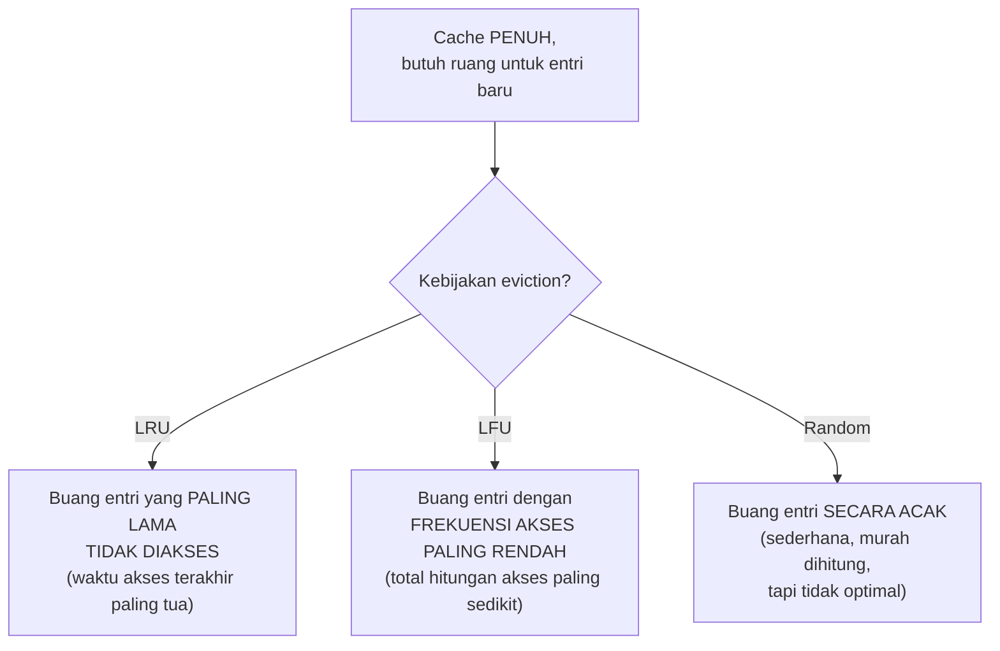

## TL;DR

TTL menentukan kapan sebuah entri cache **seharusnya** dianggap tidak valid lagi berdasarkan waktu. Eviction policy menjawab masalah yang berbeda: cache punya kapasitas memori **terbatas**, dan begitu penuh, keputusan **mana** entri yang harus dibuang untuk memberi ruang entri baru harus dibuat — terlepas apakah entri yang dibuang itu TTL-nya sudah habis atau belum. **LRU** (Least Recently Used) membuang entri yang paling lama tidak diakses; **LFU** (Least Frequently Used) membuang entri yang paling jarang diakses secara keseluruhan; keduanya adalah heuristik berbeda untuk menebak entri mana yang paling kecil kemungkinan dibutuhkan lagi dalam waktu dekat.

## The Problem

Sebuah cache Redis dikonfigurasi tanpa batas memori eksplisit, dan seiring waktu menyimpan semakin banyak entri (beberapa dengan TTL panjang, beberapa tanpa TTL sama sekali karena lupa diset) — tanpa eviction policy yang aktif dan tanpa batas memori, Redis terus mengalokasikan memori sampai akhirnya kehabisan RAM server, sebuah kegagalan yang jauh lebih parah (server crash, seluruh cache hilang mendadak) dibanding sekadar beberapa entri di-evict lebih awal dari yang diharapkan.

Masalah kedua: sebuah tim mengaktifkan eviction tapi memilih **LFU** (membuang yang paling jarang diakses) untuk cache yang menyimpan data dengan pola akses yang sangat bervariasi antar waktu — data yang sangat populer bulan lalu (dan karenanya frekuensi aksesnya tinggi secara kumulatif) tetap "dilindungi" dari eviction meski sudah tidak relevan lagi sekarang, sementara data yang baru saja menjadi populer (frekuensi kumulatifnya masih rendah karena baru mulai diakses) lebih rentan di-evict meski sebenarnya sedang sangat dibutuhkan saat ini — ketidakcocokan antara algoritma eviction dan pola akses data sesungguhnya menyebabkan cache hit rate yang lebih rendah dari yang seharusnya bisa dicapai.

## Intuition

Bayangkan eviction policy seperti **aturan membuang barang dari lemari es yang sudah penuh**. **LRU** seperti aturan "buang barang yang paling lama tidak pernah kamu sentuh" — kalau kamu terakhir mengambil selai itu tiga bulan lalu, meski selai itu dulu sering dipakai, sekarang jadi kandidat pertama dibuang saat perlu ruang untuk barang baru. **LFU** seperti aturan "buang barang yang paling jarang kamu pakai secara keseluruhan" — selai yang dulu sangat sering dipakai (frekuensi tinggi secara total) tetap dipertahankan meski sudah lama tidak disentuh, karena secara akumulasi ia "lebih berharga" dibanding barang yang jarang dipakai dari awal.

Analogi ini bocor pada satu hal: manusia yang mengelola lemari es bisa menilai konteks (selai itu jarang dipakai karena sedang diet, bukan karena tidak lagi disukai). Algoritma LRU/LFU murni tidak punya pemahaman konteks semacam itu — mereka murni statistik berdasarkan pola akses historis, dan bisa "salah menebak" relevansi data di masa depan berdasarkan asumsi yang sederhana (baru-baru ini dipakai = akan dipakai lagi; sering dipakai historis = akan dipakai lagi), asumsi yang benar untuk kebanyakan pola akses nyata tapi tidak selalu tepat untuk semua kasus.

## How It Works



**LRU** paling umum dipakai karena mencerminkan asumsi yang valid untuk banyak pola akses nyata — prinsip **temporal locality**: data yang baru saja diakses cenderung diakses lagi dalam waktu dekat (misalnya pengguna yang baru login cenderung membuka beberapa halaman berturut-turut yang berkaitan). LRU diimplementasikan efisien lewat kombinasi **hash map** (akses cepat berdasarkan key) dan **doubly linked list** (melacak urutan akses terbaru ke terlama) — struktur yang memungkinkan operasi "tandai baru diakses" dan "buang yang paling lama" keduanya berjalan dalam waktu konstan O(1).

**LFU** cocok untuk pola akses di mana popularitas item relatif **stabil** dari waktu ke waktu (item yang populer akan terus populer) — kurang cocok untuk pola akses yang berubah cepat (item yang populer minggu lalu, tapi sudah tidak relevan minggu ini), karena LFU murni butuh waktu lama untuk "melupakan" popularitas historis yang sudah tidak relevan.

## Under The Hood

**Redis** mendukung beberapa kebijakan eviction yang bisa dikonfigurasi (`maxmemory-policy`), termasuk variasi yang hanya berlaku untuk key dengan TTL (`volatile-lru`, `volatile-lfu`) versus yang berlaku untuk **seluruh** key termasuk yang tanpa TTL (`allkeys-lru`, `allkeys-lfu`) — pemilihan varian ini penting: memakai kebijakan `volatile-*` pada cache yang punya banyak key **tanpa** TTL berarti key-key itu tidak pernah menjadi kandidat eviction sama sekali, berpotensi membuat Redis tetap kehabisan memori meski kebijakan eviction sudah aktif, karena eviction hanya "melihat" key yang punya TTL.

> [!question] Perlu diverifikasi
> Klaim: nama parameter konfigurasi Redis (`maxmemory-policy`) dan opsi-opsinya (`volatile-lru`, `allkeys-lru`, dst.).
> Kenapa ragu: nama dan opsi konfigurasi bisa bertambah/berubah antar versi Redis; perlu dicek terhadap versi yang relevan.
> Cara verifikasi: dokumentasi resmi Redis mengenai "Eviction Policies" (redis.io/docs).

## In Go

```go
package cache

import "container/list"

// LRUCacheSederhana mendemonstrasikan PRINSIP LRU — implementasi
// produksi nyata biasanya memakai library matang (atau Redis itu
// sendiri) yang sudah teruji dan thread-safe.
type LRUCacheSederhana struct {
	kapasitas int
	items     map[string]*list.Element
	urutan    *list.List // depan = paling baru diakses, belakang = paling lama
}

type entri struct {
	key   string
	value string
}

func NewLRUCacheSederhana(kapasitas int) *LRUCacheSederhana {
	return &LRUCacheSederhana{
		kapasitas: kapasitas,
		items:     make(map[string]*list.Element),
		urutan:    list.New(),
	}
}

func (c *LRUCacheSederhana) Ambil(key string) (string, bool) {
	if elem, ada := c.items[key]; ada {
		c.urutan.MoveToFront(elem) // TANDAI baru diakses
		return elem.Value.(*entri).value, true
	}
	return "", false
}

func (c *LRUCacheSederhana) Simpan(key, value string) {
	if elem, ada := c.items[key]; ada {
		c.urutan.MoveToFront(elem)
		elem.Value.(*entri).value = value
		return
	}

	if c.urutan.Len() >= c.kapasitas {
		// BUANG entri PALING LAMA tidak diakses (belakang list)
		terlama := c.urutan.Back()
		if terlama != nil {
			c.urutan.Remove(terlama)
			delete(c.items, terlama.Value.(*entri).key)
		}
	}

	elem := c.urutan.PushFront(&entri{key: key, value: value})
	c.items[key] = elem
}
```

## In His Stack

Untuk Redis yang dipakai sebagai cache (bukan sebagai penyimpanan utama yang datanya tidak boleh hilang), mengonfigurasi `maxmemory` dengan batas eksplisit **dan** kebijakan eviction yang sesuai (biasanya `allkeys-lru` untuk kasus umum) adalah praktik operasional dasar yang mencegah Redis kehabisan memori secara tidak terkendali — tanpa ini, Redis yang terus menerima data baru tanpa batas memori bisa mengalami perilaku yang jauh lebih buruk (crash, atau di sistem tertentu mulai menolak semua penulisan baru) dibanding sekadar mengevict beberapa entri lama.

## Trade-offs and When Not To Use It

LRU dan LFU keduanya menambah overhead komputasi kecil untuk melacak metadata (waktu akses terakhir untuk LRU, hitungan akses untuk LFU) dibanding kebijakan random yang tidak butuh pelacakan sama sekali — untuk cache dengan volume sangat tinggi, overhead ini (meski kecil per operasi) tetap perlu dipertimbangkan, meski dalam praktik LRU/LFU hampir selalu memberi hit rate yang jauh lebih baik dibanding random, membuat trade-off overhead kecil ini hampir selalu sepadan. Memilih antara LRU dan LFU bergantung pada karakteristik pola akses data spesifik — tidak ada yang "selalu lebih baik", dan untuk kasus yang benar-benar tidak yakin, LRU adalah default yang wajar karena asumsi temporal locality-nya valid untuk mayoritas pola akses aplikasi web biasa.

## Common Mistakes

> [!warning] Jebakan
> Tidak mengonfigurasi batas memori eksplisit dan kebijakan eviction pada cache seperti Redis — cache bisa terus mengalokasikan memori tanpa batas sampai server kehabisan RAM, kegagalan yang jauh lebih parah dibanding eviction terkontrol.

> [!warning] Jebakan
> Memakai kebijakan eviction `volatile-*` (hanya berlaku untuk key dengan TTL) padahal banyak key di cache tidak diset TTL — key tanpa TTL tidak pernah menjadi kandidat eviction, tetap bisa menghabiskan memori tanpa batas meski kebijakan eviction aktif.

> [!warning] Jebakan
> Memilih LFU untuk data dengan pola akses yang berubah cepat (tren yang bergeser), tanpa menyadari LFU membutuhkan waktu lama "melupakan" popularitas historis yang sudah tidak relevan.

## Exercises

1. Jelaskan perbedaan LRU dan LFU dalam menentukan entri mana yang dibuang saat cache penuh.
2. Kenapa LRU cocok untuk pola akses dengan temporal locality yang kuat?
3. Kenapa kebijakan eviction `volatile-*` di Redis berisiko kalau banyak key tidak diset TTL?
4. Desain terbuka: cache-mu menyimpan hasil pencarian dokumen, di mana beberapa jenis pencarian (misalnya "status permohonan aktif") selalu populer secara konsisten dari hari ke hari, sementara jenis pencarian lain populer hanya sesaat (tren pencarian terkait berita atau kebijakan baru yang sedang ramai dibicarakan, lalu mereda). Diskusikan apakah LRU atau LFU lebih cocok untuk skenario campuran ini, dan pertimbangkan apakah kombinasi keduanya (yang tersedia di beberapa sistem cache modern) lebih tepat.

> [!success]- Kunci jawaban
> **1.** LRU membuang entri berdasarkan **kapan terakhir** entri itu diakses — entri yang sudah lama tidak disentuh dibuang lebih dulu, tidak peduli seberapa sering ia diakses di masa lalu. LFU membuang entri berdasarkan **seberapa sering** entri itu diakses secara total sepanjang waktu — entri yang jarang diakses secara kumulatif dibuang lebih dulu, meski mungkin baru saja diakses sekali.
> **4.** Skenario campuran ini sebenarnya adalah kasus klasik yang menunjukkan keterbatasan LRU murni maupun LFU murni: LRU murni berisiko membuang data pencarian populer konsisten ("status permohonan aktif") hanya karena kebetulan tidak diakses dalam beberapa menit terakhir, padahal secara historis dan proyeksi ke depan ia akan terus sering diakses. LFU murni berisiko "terlalu lambat" mengakomodasi tren baru yang sedang ramai (frekuensi kumulatifnya masih rendah karena baru mulai populer) sementara data lama yang sudah tidak relevan tapi frekuensi historisnya tinggi tetap dipertahankan. Kombinasi **LFU dengan peluruhan waktu** (time-decayed LFU, tersedia di beberapa sistem cache modern) — di mana skor frekuensi lama-kelamaan "meluruh" nilainya kalau tidak terus diakses — memberi keseimbangan yang lebih baik: data yang konsisten populer tetap dilindungi (frekuensi tinggi bertahan lama), sementara data yang sudah tidak relevan (meski dulu sempat sering diakses) perlahan kehilangan perlindungannya seiring waktu tanpa akses baru, dan tren baru yang sedang naik daun bisa cepat membangun skor frekuensinya sendiri tanpa harus menunggu terlalu lama.

## Self-Check

- Apa perbedaan mendasar LRU dan LFU?
- Kenapa LRU cocok untuk pola akses dengan temporal locality kuat?
- Kenapa kebijakan eviction volatile-* berisiko kalau banyak key tanpa TTL?
- Kapan kombinasi LRU dan LFU (dengan peluruhan waktu) lebih tepat dibanding salah satunya murni?

## Connected Notes

- [[TTL and Jitter]] — TTL dan eviction adalah dua mekanisme berbeda yang sering bekerja berdampingan: TTL untuk kedaluwarsa berbasis waktu, eviction untuk keterbatasan ruang.
- [[Cache Stampede]] — eviction yang agresif (kapasitas cache terlalu kecil) bisa memperbesar risiko cache stampede karena lebih banyak data yang harus di-query ulang lebih sering.
- [[Cache-Aside, Write-Through, and Write-Behind]] — pola caching yang dipilih memengaruhi seberapa besar dampak eviction terhadap konsistensi data yang ditampilkan.
- [[../92 Tools/Redis|Redis]] — implementasi konkret eviction policy yang relevan langsung di ekosistem kerja ini, dibahas lebih operasional di tool note itu.
- [[Distributed Locks and Why They Are Dangerous]] — topik penutup domain ini, dengan tema yang sama-sama soal batasan mekanisme yang terlihat sederhana di permukaan.

## Further Reading

- Dokumentasi resmi Redis, bagian "Using Redis as an LRU cache" (redis.io/docs).

## Catatan Saya

*Tulis di sini apakah cache di kerjaanmu sudah dikonfigurasi dengan batas memori dan eviction policy eksplisit, atau masih default tanpa batas.*
