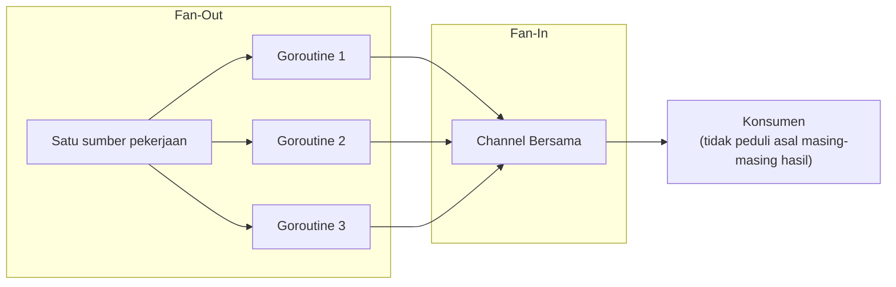

## TL;DR

**Fan-out** adalah pola mendistribusikan satu sumber pekerjaan ke banyak goroutine yang memprosesnya secara paralel — [[Worker Pools|worker pool]] adalah salah satu wujud konkret fan-out. **Fan-in** adalah kebalikannya: menyatukan hasil dari banyak goroutine/channel menjadi satu aliran tunggal, supaya kode yang mengonsumsi hasil tidak perlu tahu atau peduli berapa banyak goroutine yang sebenarnya menghasilkannya. Kedua pola ini hampir selalu muncul berpasangan — pekerjaan disebar (fan-out) untuk diproses paralel, lalu hasilnya dikumpulkan kembali (fan-in) untuk dipakai atau ditampilkan sebagai satu kesatuan.

## The Problem

Sebuah dashboard butuh menampilkan data dari lima sumber berbeda sekaligus — status permohonan dari database utama, jumlah dokumen dari service terpisah, notifikasi dari service lain, dan seterusnya. Memanggil kelima sumber ini **sekuensial** (satu per satu, menunggu masing-masing selesai sebelum memanggil berikutnya) berarti total waktu tunggu adalah **jumlah** dari kelima waktu panggilan individual — kalau masing-masing butuh 200ms, total menjadi satu detik, meski kelima panggilan itu sebenarnya sepenuhnya independen satu sama lain dan bisa dijalankan bersamaan.

Setelah kelima panggilan itu diluncurkan sebagai goroutine terpisah (fan-out), muncul masalah baru: bagaimana mengumpulkan kelima hasil itu kembali menjadi satu response gabungan, sambil tetap menangani kemungkinan salah satu dari lima panggilan itu gagal atau lebih lambat dari yang lain? Menulis logika pengumpulan ini secara ad-hoc untuk setiap kombinasi goroutine berbeda cepat menjadi berantakan dan sulit dipelihara tanpa pola yang konsisten.

## Intuition

Bayangkan fan-out seperti **membagikan satu tumpukan berkas ke beberapa petugas** untuk diperiksa bersamaan, alih-alih satu petugas memeriksa seluruh tumpukan sendirian secara berurutan — pekerjaan yang sama selesai jauh lebih cepat karena dikerjakan paralel oleh beberapa orang sekaligus. Fan-in seperti **satu kotak pengumpulan bersama** di mana setiap petugas menaruh hasil pemeriksaannya begitu selesai, tidak peduli petugas mana yang selesai duluan atau belakangan — orang yang mengambil dari kotak itu hanya melihat aliran hasil yang masuk, tanpa perlu tahu urutan atau identitas petugas yang menghasilkannya masing-masing.

Analogi ini bocor pada satu hal: kotak pengumpulan fisik tidak peduli urutan hasil masuk. Fan-in lewat channel di Go juga **tidak menjamin urutan** — hasil dari goroutine yang selesai lebih dulu akan masuk ke channel gabungan lebih dulu, terlepas dari goroutine mana yang "seharusnya" logisnya pertama — kalau urutan hasil penting untuk kebutuhan tertentu, fan-in murni tidak cukup, dan diperlukan mekanisme tambahan untuk menyusun ulang hasil sesuai urutan yang diinginkan (misalnya menyertakan indeks asli di setiap hasil, lalu diurutkan ulang setelah semua terkumpul).

## How It Works

```go
package main

import (
	"context"
	"fmt"
	"sync"
)

type HasilSumber struct {
	Sumber string
	Data   string
	Err    error
}

// FanOut meluncurkan satu goroutine PER SUMBER — paralel, bukan
// sekuensial. Setiap goroutine mengirim hasilnya ke channel yang SAMA
// (fan-in terjadi di sini, karena semua goroutine menulis ke satu channel).
func AmbilDataDariSemuaSumber(ctx context.Context, sumber []string) []HasilSumber {
	channelHasil := make(chan HasilSumber, len(sumber))
	var wg sync.WaitGroup

	// FAN-OUT: satu goroutine per sumber, berjalan PARALEL
	for _, s := range sumber {
		wg.Add(1)
		go func(namaSumber string) {
			defer wg.Done()
			data, err := panggilSumber(ctx, namaSumber)
			channelHasil <- HasilSumber{Sumber: namaSumber, Data: data, Err: err}
		}(s)
	}

	go func() {
		wg.Wait()
		close(channelHasil)
	}()

	// FAN-IN: mengumpulkan semua hasil dari satu channel bersama,
	// TIDAK PEDULI urutan goroutine mana yang selesai duluan.
	var semuaHasil []HasilSumber
	for h := range channelHasil {
		semuaHasil = append(semuaHasil, h)
	}
	return semuaHasil
}

func panggilSumber(ctx context.Context, nama string) (string, error) {
	return fmt.Sprintf("data dari %s", nama), nil
}
```



## Under The Hood

Pola fan-in generik untuk **menggabungkan beberapa channel terpisah** (bukan beberapa goroutine yang menulis ke satu channel yang sama seperti contoh di atas) butuh satu goroutine tambahan **per channel sumber** yang membaca dari channel itu dan meneruskannya ke channel gabungan — pola ini penting ketika channel-channel yang perlu digabung berasal dari fungsi terpisah yang masing-masing sudah mengembalikan channel-nya sendiri (misalnya beberapa tahap [[Pipelines|pipeline]] yang paralel).

```go
package main

import "sync"

// Merge menggabungkan BEBERAPA channel input jadi SATU channel output —
// pola fan-in murni untuk channel yang sudah ada secara terpisah,
// bukan goroutine yang menulis ke satu channel bersama sejak awal.
func Merge(channels ...<-chan int) <-chan int {
	keluaran := make(chan int)
	var wg sync.WaitGroup

	// SATU goroutine per channel sumber, masing-masing meneruskan
	// isinya ke channel gabungan yang sama.
	teruskan := func(c <-chan int) {
		defer wg.Done()
		for v := range c {
			keluaran <- v
		}
	}

	wg.Add(len(channels))
	for _, c := range channels {
		go teruskan(c)
	}

	go func() {
		wg.Wait()
		close(keluaran) // ditutup HANYA setelah SEMUA channel sumber habis
	}()

	return keluaran
}
```

## In Go

```go
package dashboard

import (
	"context"
	"fmt"
)

// AmbilRingkasanDashboard menunjukkan penggunaan fan-out/fan-in untuk
// kasus dashboard yang menampilkan data dari beberapa sumber independen —
// waktu total mendekati waktu PALING LAMBAT dari kelima panggilan,
// BUKAN jumlah kelimanya, karena berjalan paralel.
func AmbilRingkasanDashboard(ctx context.Context) map[string]string {
	sumber := []string{"status-permohonan", "jumlah-dokumen", "notifikasi", "riwayat", "profil"}
	hasil := AmbilDataDariSemuaSumber(ctx, sumber)

	ringkasan := make(map[string]string)
	for _, h := range hasil {
		if h.Err != nil {
			fmt.Printf("sumber %s gagal: %v\n", h.Sumber, h.Err)
			continue
		}
		ringkasan[h.Sumber] = h.Data
	}
	return ringkasan
}
```

## In His Stack

Fan-out/fan-in sangat relevan untuk endpoint yang perlu menggabungkan data dari beberapa layanan/database independen (pola yang umum di arsitektur yang mengarah ke microservices, atau sekadar beberapa query database yang tidak saling bergantung) — mengubah endpoint yang sebelumnya memanggil semuanya sekuensial menjadi paralel bisa memberi peningkatan latency yang signifikan tanpa mengubah logika bisnis sama sekali, murni dengan mengubah **cara** panggilan-panggilan independen itu dijadwalkan.

## Trade-offs and When Not To Use It

Fan-out tidak memberi manfaat apa pun (dan hanya menambah kompleksitas kode) kalau sumber-sumber yang dipanggil **saling bergantung** — panggilan kedua yang butuh hasil dari panggilan pertama tidak bisa dijalankan paralel dengan yang pertama, tidak peduli seberapa banyak goroutine yang diluncurkan. Fan-out juga menambah beban pada sumber yang dipanggil — memanggil lima sumber bersamaan berarti lima koneksi/request dibuka bersamaan, yang untuk sumber dengan kapasitas terbatas (misalnya API partner dengan rate limit ketat) bisa jadi kontraproduktif dibanding memanggil sekuensial dengan kontrol laju yang lebih hati-hati. Penanganan error dalam fan-in juga butuh keputusan eksplisit: apakah satu sumber yang gagal harus menggagalkan seluruh operasi, atau cukup dilaporkan sambil sumber lain yang berhasil tetap dipakai — keputusan ini harus dibuat sadar, bukan default yang tidak dipikirkan.

## Common Mistakes

> [!warning] Jebakan
> Memakai fan-out untuk panggilan yang sebenarnya saling bergantung (panggilan kedua butuh hasil panggilan pertama) — tidak memberi manfaat paralelisme apa pun, hanya menambah kompleksitas tanpa hasil.

> [!warning] Jebakan
> Mengasumsikan urutan hasil dari fan-in mengikuti urutan goroutine diluncurkan — hasil masuk ke channel gabungan sesuai urutan **selesai**, bukan urutan diluncurkan, dan mengasumsikan sebaliknya menyebabkan bug logika yang halus.

> [!warning] Jebakan
> Tidak menangani kegagalan salah satu goroutine dalam fan-out secara eksplisit — satu sumber yang gagal bisa membuat seluruh operasi macet menunggu (kalau errornya tidak dikirim ke channel yang sama) atau diam-diam diabaikan tanpa disadari.

## Exercises

1. Jelaskan kenapa memanggil lima sumber data independen secara paralel (fan-out) lebih cepat dibanding sekuensial, dan seberapa besar potensi percepatannya.
2. Kenapa fan-in tidak menjamin urutan hasil sesuai urutan goroutine diluncurkan?
3. Kapan fan-out tidak memberi manfaat apa pun, meski secara teknis bisa diterapkan?
4. Desain terbuka: dashboard-mu memanggil lima sumber data secara fan-out, tapi salah satu sumber (notifikasi) sering lambat atau kadang gagal, sementara empat sumber lain hampir selalu cepat dan andal. Rancang strategi penanganan error dan timeout untuk kasus ini, supaya kegagalan atau kelambatan satu sumber (notifikasi) tidak membuat seluruh dashboard gagal ditampilkan.

> [!success]- Kunci jawaban
> **1.** Memanggil sekuensial berarti total waktu adalah **jumlah** dari kelima waktu panggilan individual (200ms × 5 = 1 detik, kalau masing-masing 200ms). Memanggil paralel lewat fan-out berarti total waktu mendekati waktu panggilan **paling lambat** di antara kelimanya (sekitar 200ms, kalau semuanya kurang lebih sama cepatnya) — karena semuanya berjalan bersamaan, bukan bergiliran. Potensi percepatan mendekati faktor jumlah sumber (5x lebih cepat dalam contoh ini), dibatasi oleh sumber yang paling lambat di antara semuanya.
> **4.** Beri context dengan timeout yang **lebih pendek** khusus untuk panggilan ke sumber notifikasi (misalnya 500ms) dibanding sumber lain yang lebih andal, dan tangani error/timeout dari sumber ini sebagai **degradasi sebagian**, bukan kegagalan total — kalau `HasilSumber.Err` untuk notifikasi tidak nil (baik karena gagal atau timeout), dashboard tetap dirender dengan keempat sumber lain yang berhasil, hanya bagian notifikasi yang menampilkan placeholder ("notifikasi tidak tersedia saat ini") alih-alih mengembalikan error 500 untuk seluruh request. Ini adalah aplikasi dari prinsip graceful degradation (dibahas lebih formal di domain `30 APIs and Web`, resilience patterns) — kegagalan komponen non-kritis tidak boleh menjatuhkan keseluruhan pengalaman pengguna.

## Self-Check

- Kenapa fan-out mempercepat waktu total dibanding memanggil sumber secara sekuensial?
- Kenapa fan-in tidak menjamin urutan hasil?
- Kapan fan-out tidak memberi manfaat, meski secara teknis bisa diterapkan?
- Bagaimana menangani kegagalan satu sumber dalam fan-out tanpa menggagalkan seluruh operasi?

## Connected Notes

- [[Worker Pools]] — worker pool adalah salah satu wujud konkret pola fan-out untuk pekerjaan yang jumlahnya banyak dan seragam.
- [[Pipelines]] — fan-in/fan-out sering menjadi salah satu tahap dalam pipeline pemrosesan yang lebih panjang, dibahas di note berikutnya.
- [[The Select Statement]] — `select` sering dipakai dalam implementasi fan-in untuk menangani beberapa channel sumber sekaligus dengan penanganan pembatalan.
- [[errgroup]] — package `errgroup` menyediakan abstraksi siap pakai yang menyederhanakan pola fan-out/fan-in dengan penanganan error terintegrasi, dibahas di note lain domain ini.
- [[../30 APIs and Web/Graceful Degradation|Graceful Degradation]] — prinsip menangani kegagalan sebagian sumber dalam fan-out tanpa menggagalkan keseluruhan operasi, dibahas lebih formal di domain APIs.

## Further Reading

- Go blog resmi, "Go Concurrency Patterns: Pipelines and cancellation" — bagian fan-out/fan-in dijelaskan sebagai bagian dari pola pipeline yang lebih luas.

## Catatan Saya

*Tulis di sini endpoint di kerjaanmu yang memanggil beberapa sumber data independen secara sekuensial — apakah fan-out bisa mempercepatnya.*
