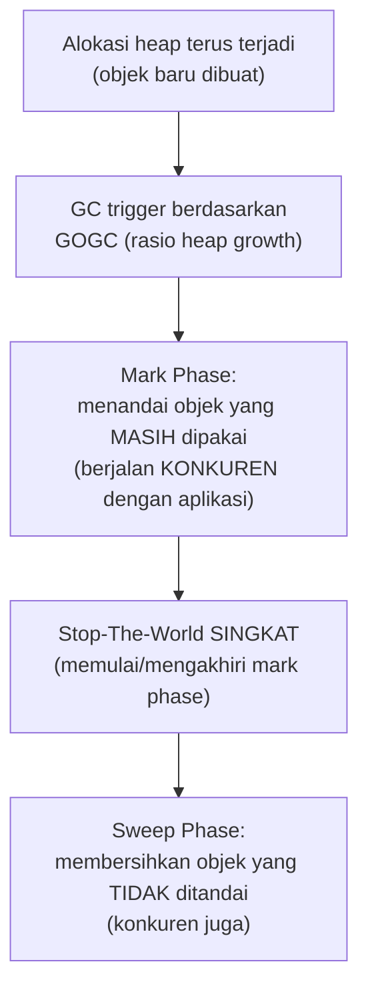

## TL;DR

Go mengelola memori heap secara otomatis lewat garbage collector (GC) — developer tidak pernah memanggil `free()` manual seperti di C. Tapi "otomatis" bukan berarti "tidak berdampak": GC Go memakai algoritma **concurrent mark-and-sweep** yang dirancang khusus untuk meminimalkan **stop-the-world pause** (jeda di mana seluruh goroutine aplikasi benar-benar berhenti total) — tapi jeda kecil ini tetap ada, dan GC tetap memakai siklus CPU untuk bekerja **bersamaan** dengan goroutine aplikasi. Memahami kapan dan kenapa GC berjalan, serta bagaimana mengukur dampaknya pada latency (bukan hanya throughput), adalah pembeda antara "Go otomatis mengurus memori" (benar tapi naif) dan "aku tahu persis dampak GC pada p99 latency aplikasiku" (paham mendalam).

## The Problem

Sebuah service yang biasanya melayani request dengan latency stabil di bawah 10ms tiba-tiba menunjukkan lonjakan latency p99 (bukan p50 — rata-rata terlihat normal) ke ratusan milidetik secara periodik, tanpa perubahan traffic yang jelas. Tim awalnya mencurigai database atau jaringan, tapi setelah investigasi mendalam (lewat profiling, dibahas di [[pprof Profiling]]), ternyata lonjakan ini berkorelasi persis dengan siklus garbage collection — aplikasi mengalokasikan memori heap dalam jumlah besar per request (misalnya membuat banyak struct sementara, unmarshalling JSON besar berulang), memicu GC berjalan lebih sering dari yang diperkirakan, dan meski mayoritas kerja GC berjalan konkuren (tidak menghentikan aplikasi), tetap ada jeda stop-the-world singkat di setiap siklus yang, meski singkat, cukup untuk mempengaruhi p99 latency pada aplikasi dengan SLA latency yang ketat.

Ini mengungkap kesalahpahaman umum: "Go punya GC otomatis, jadi aku tidak perlu memikirkan manajemen memori sama sekali" — benar bahwa developer tidak perlu memanggil `free()` manual, tapi **pola alokasi** kode yang ditulis (berapa banyak, seberapa sering, seberapa besar objek yang dialokasikan ke heap) tetap sepenuhnya memengaruhi seberapa sering dan seberapa berat GC harus bekerja, yang pada gilirannya memengaruhi latency aplikasi secara nyata.

## Intuition

Bayangkan GC seperti **petugas kebersihan yang bekerja sambil kantor tetap beroperasi**, dibanding menutup seluruh kantor untuk dibersihkan (stop-the-world penuh, model GC yang lebih sederhana dan lebih lama dipakai bahasa/runtime lain). Petugas kebersihan Go modern bekerja **di sela-sela** aktivitas kantor yang berjalan normal — mengumpulkan sampah (objek yang tidak lagi dipakai) sambil pegawai (goroutine) tetap bekerja, hanya butuh jeda **sangat singkat** sesekali untuk koordinasi (misalnya "semua berhenti sebentar sementara aku menandai ulang meja mana yang masih dipakai").

Analogi ini bocor pada satu hal: petugas kebersihan manusia bekerja dengan kecepatan tetap terlepas seberapa berantakan kantornya. GC Go **menyesuaikan** intensitas kerjanya berdasarkan **laju alokasi** aplikasi — kantor yang menghasilkan sampah lebih cepat (aplikasi yang mengalokasikan memori heap lebih agresif) memicu petugas kebersihan bekerja lebih sering dan lebih intensif, secara langsung menghubungkan pola alokasi kode aplikasi dengan seberapa sering GC "mengganggu" (meski minimal) jalannya aplikasi.

## How It Works



Diagram ini menunjukkan bahwa mayoritas pekerjaan GC (mark dan sweep) berjalan **konkuren** dengan goroutine aplikasi — hanya ada jeda stop-the-world yang sangat singkat (biasanya di bawah 1 milidetik pada implementasi modern) di titik-titik transisi tertentu, jauh lebih baik dibanding GC generasi lama yang menghentikan seluruh aplikasi selama proses penuh berlangsung.

**`GOGC`** (default 100) mengontrol seberapa sering GC dipicu — nilai 100 berarti GC dipicu ketika heap tumbuh menjadi dua kali lipat ukuran heap yang masih hidup setelah GC terakhir. Menaikkan `GOGC` (misalnya ke 200) membuat GC berjalan **lebih jarang** (heap dibiarkan tumbuh lebih besar sebelum GC dipicu) — mengurangi overhead CPU GC dengan mengorbankan pemakaian memori yang lebih tinggi. Menurunkan `GOGC` melakukan kebalikannya: GC lebih sering, memori lebih rendah, tapi overhead CPU GC lebih tinggi.

## Under The Hood

**`GOMEMLIMIT`** (ditambahkan di rilis Go yang relatif baru) memberi cara berbeda mengontrol GC: alih-alih rasio pertumbuhan (`GOGC`), ia menetapkan batas memori yang boleh dipakai runtime Go sebelum GC dipicu lebih agresif. Ini berguna khususnya untuk aplikasi yang berjalan di container dengan memory limit ketat (Kubernetes), di mana mengacu ke angka memori total lebih relevan daripada rasio pertumbuhan relatif.

`GOMEMLIMIT` adalah **batas lunak (soft limit)**, bukan batas keras. Saat pemakaian mendekati angka itu, GC bekerja jauh lebih agresif — tapi kalau program memang butuh lebih, runtime akan melampauinya daripada membuat program macet total. Ia juga hanya mengatur memori yang dikelola runtime Go. Memori yang dipegang library C lewat cgo tidak ikut terhitung.

Kombinasi `GOGC` dan `GOMEMLIMIT` tetap memberi kontrol yang lebih presisi: `GOMEMLIMIT` menahan pertumbuhan memori mendekati limit container, `GOGC` menyetel trade-off CPU-vs-memori dalam batas itu.

> [!question] Perlu diverifikasi
> Klaim: nilai default GOGC=100 dan detail interaksi GOMEMLIMIT dengan GOGC.
> Kenapa ragu: perilaku default dan interaksi kedua parameter ini adalah area yang terus disempurnakan di rilis-rilis Go yang lebih baru; detail persisnya sebaiknya diverifikasi terhadap versi Go yang relevan.
> Cara verifikasi: dokumentasi resmi Go mengenai `runtime/debug.SetGCPercent` dan `runtime/debug.SetMemoryLimit`, serta release notes versi yang relevan.

GC Go adalah **tracing garbage collector** — ia bekerja dengan menelusuri graf objek yang bisa dijangkau (reachable) dari root (goroutine stack, variabel global), menandai semua yang terjangkau sebagai "masih hidup", dan menganggap sisanya sebagai sampah yang bisa dibersihkan. Ini berbeda dari **reference counting** (dipakai beberapa bahasa lain) yang melacak jumlah referensi ke setiap objek secara langsung — tracing GC tidak punya masalah *reference cycle* (dua objek yang saling mereferensikan tapi tidak lagi dijangkau dari mana pun) yang menjadi kelemahan klasik reference counting murni.

## In Go

```go
package main

import (
	"fmt"
	"runtime"
	"runtime/debug"
	"time"
)

func main() {
	var m runtime.MemStats
	runtime.ReadMemStats(&m)
	fmt.Printf("Heap yang dipakai: %d KB\n", m.HeapAlloc/1024)
	fmt.Printf("Jumlah siklus GC sejak start: %d\n", m.NumGC)
	fmt.Printf("Total waktu berhenti STW (semua siklus): %v\n", time.Duration(m.PauseTotalNs))

	// Menaikkan GOGC secara terprogram — GC berjalan lebih jarang,
	// memori dibiarkan tumbuh lebih besar sebelum GC dipicu.
	debug.SetGCPercent(200)

	// GOMEMLIMIT (Go 1.19+) menetapkan batas memori sebagai soft limit,
	// bukan hard limit — berguna untuk container dengan memory limit ketat.
	debug.SetMemoryLimit(500 * 1024 * 1024) // contoh: batas 500 MB
}
```

```bash
# Melihat aktivitas GC secara real-time saat aplikasi berjalan — output
# menunjukkan setiap siklus GC beserta waktu yang dihabiskannya.
GODEBUG=gctrace=1 go run main.go
```

## In His Stack

Untuk service Go yang berjalan di Kubernetes dengan memory limit ketat, `GOMEMLIMIT` yang disetel sedikit di bawah memory limit container (menyisakan margin untuk overhead non-heap) adalah praktik yang mencegah OOM kill yang tiba-tiba — tanpa ini, GC Go yang hanya mengandalkan `GOGC` bisa membiarkan heap tumbuh melebihi limit container sebelum sempat menyadari perlu membersihkan lebih agresif, menyebabkan container di-kill Kubernetes (lihat [[../70 Infrastructure and Delivery/Linux for Backend Engineers|Linux for Backend Engineers]] soal OOM killer) sebelum GC sempat bereaksi.

## Trade-offs and When Not To Use It

Menurunkan `GOGC` (GC lebih sering) mengurangi pemakaian memori puncak tapi menambah overhead CPU untuk siklus GC yang lebih sering — untuk aplikasi yang dibatasi memori ketat tapi punya headroom CPU, ini trade-off yang masuk akal. Menaikkan `GOGC` (GC lebih jarang) mengurangi overhead CPU tapi membiarkan memori tumbuh lebih besar — cocok untuk aplikasi dengan headroom memori tapi CPU terbatas atau sensitif latency. Tidak ada nilai `GOGC` yang "benar" secara universal — nilai yang tepat bergantung pada karakteristik beban kerja spesifik dan constraint resource yang dihadapi, harus diuji dan diukur (lewat `GODEBUG=gctrace=1` atau metrik `runtime.MemStats`), bukan ditetapkan berdasarkan rekomendasi generik.

## Common Mistakes

> [!warning] Jebakan
> Mengubah `GOGC`/`GOMEMLIMIT` tanpa mengukur dampaknya secara nyata terhadap latency dan memori aplikasi — nilai yang "terdengar masuk akal" bisa memperbaiki satu metrik sambil memperburuk metrik lain tanpa disadari.

> [!warning] Jebakan
> Tidak menyetel `GOMEMLIMIT` untuk aplikasi container dengan memory limit ketat — GC yang hanya mengandalkan `GOGC` bisa membiarkan heap tumbuh melebihi limit container, menyebabkan OOM kill yang tiba-tiba.

> [!warning] Jebakan
> Menyalahkan "Go GC lambat" untuk masalah latency yang sebenarnya disebabkan pola alokasi memori berlebihan di kode aplikasi sendiri — mengurangi alokasi yang tidak perlu (dibahas di [[Reducing Allocations]]) seringkali jauh lebih efektif dibanding menyetel parameter GC.

> [!warning] Jebakan
> Menyetel `GOMEMLIMIT` persis sama dengan memory limit container, lalu menganggap OOM kill tidak mungkin terjadi lagi. `GOMEMLIMIT` adalah batas lunak dan hanya mencakup memori yang dikelola runtime Go — sisakan margin nyata (misalnya setel di sekitar 80-90% dari limit container, lalu ukur), dan tetap pantau pemakaian memori proses sesungguhnya, bukan hanya angka heap dari `runtime.MemStats`.

## Exercises

1. Jelaskan kenapa GC Go modern tidak sepenuhnya menghentikan aplikasi (stop-the-world penuh), dan bagian mana dari siklus GC yang tetap butuh jeda singkat.
2. Apa perbedaan `GOGC` dan `GOMEMLIMIT` dalam mengontrol perilaku GC?
3. Kenapa "Go otomatis mengurus memori" bukan berarti pola alokasi kode aplikasi tidak berpengaruh pada performa?
4. Desain terbuka: service-mu menunjukkan lonjakan p99 latency yang berkorelasi dengan siklus GC, tapi p50 latency tetap normal. Rancang langkah investigasi untuk mengonfirmasi ini benar-benar disebabkan GC (bukan penyebab lain), dan sebutkan dua pendekatan berbeda untuk menguranginya — satu dengan menyesuaikan parameter GC, satu dengan mengubah pola alokasi kode.

> [!success]- Kunci jawaban
> **1.** GC Go modern menjalankan mayoritas pekerjaannya (mark dan sweep) secara **konkuren** dengan goroutine aplikasi yang tetap berjalan normal — tapi ada titik-titik transisi tertentu (terutama di awal mark phase, untuk memastikan seluruh goroutine berada dalam state yang konsisten sebelum penandaan dimulai) yang tetap butuh **stop-the-world** singkat, biasanya di bawah satu milidetik pada implementasi modern. Jeda inilah yang, meski kecil, bisa terasa pada metrik p99 latency untuk aplikasi dengan SLA sangat ketat, meski nyaris tidak terlihat di p50.
> **4.** Investigasi: jalankan aplikasi dengan `GODEBUG=gctrace=1` untuk melihat waktu setiap siklus GC secara eksplisit, lalu bandingkan timestamp siklus GC dengan timestamp request yang mengalami latency tinggi — korelasi waktu yang konsisten mengonfirmasi GC sebagai penyebab. Pendekatan pertama (menyesuaikan parameter): naikkan `GOGC` untuk mengurangi frekuensi siklus GC (dengan trade-off pemakaian memori lebih tinggi), diukur dampaknya terhadap p99 latency dan memory footprint. Pendekatan kedua (mengubah pola alokasi): profiling heap (lewat `pprof`, dibahas di note berikutnya) untuk menemukan bagian kode yang mengalokasikan memori paling banyak per request, lalu kurangi alokasi itu (misalnya memakai `sync.Pool` untuk objek yang sering dibuat-buang, dibahas di note lain domain ini) — pendekatan ini mengurangi **akar penyebab** (laju alokasi tinggi) alih-alih hanya menyetel ulang seberapa sering GC merespons laju alokasi yang tetap tinggi.

## Self-Check

- Kenapa GC Go modern tidak sepenuhnya menghentikan aplikasi, meski tetap ada jeda singkat?
- Apa perbedaan `GOGC` dan `GOMEMLIMIT`?
- Kenapa pola alokasi kode aplikasi tetap memengaruhi performa meski GC otomatis?
- Bagaimana cara memastikan lonjakan latency benar-benar disebabkan GC, bukan penyebab lain?

## Connected Notes

- [[../10 Foundations/Memory Layout - Stack vs Heap|Memory Layout - Stack vs Heap]] — GC hanya mengelola memori heap; pemahaman perbedaan stack dan heap adalah prasyarat memahami kenapa GC relevan.
- [[Escape Analysis]] — menentukan objek mana yang benar-benar dialokasikan ke heap (dan karenanya perlu dikelola GC), dibahas di note berikutnya.
- [[pprof Profiling]] — alat utama mengukur dan mendiagnosis dampak nyata GC pada aplikasi, termasuk heap profile.
- [[Reducing Allocations]] — teknik konkret mengurangi tekanan pada GC dengan mengurangi alokasi heap yang tidak perlu, dibahas di note lain domain ini.
- [[sync.Pool]] — mekanisme mendaur ulang objek untuk mengurangi alokasi berulang di hot path, mengurangi beban kerja GC secara langsung.

## Further Reading

- Dokumentasi resmi Go, "A Guide to the Go Garbage Collector" (go.dev/doc/gc-guide).

## Catatan Saya

*Tulis di sini apakah kamu pernah melihat lonjakan p99 latency di service Go kerjaanmu yang berkorelasi dengan siklus GC — coba cek dengan GODEBUG=gctrace=1 kalau belum pernah.*
