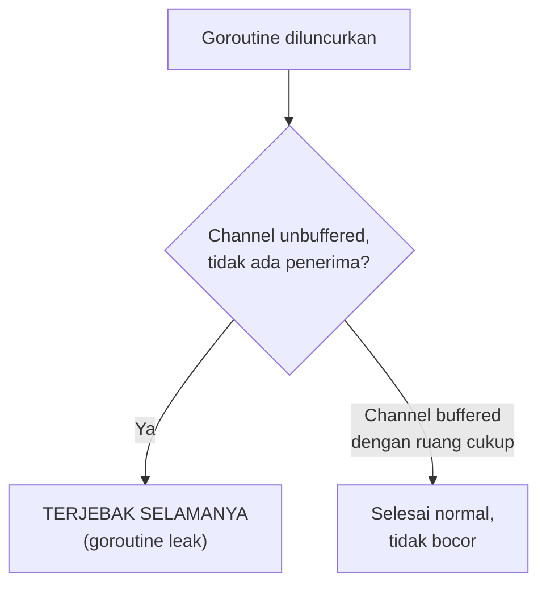

## TL;DR

Goroutine yang diluncurkan tapi tidak pernah selesai — terjebak menunggu channel yang tidak akan pernah menerima/mengirim, atau menunggu context yang tidak pernah dibatalkan — tidak hilang begitu saja. Ia terus hidup, memakai memori stack-nya, selamanya, sampai proses aplikasi di-restart. Goroutine leak adalah salah satu bug performa paling berbahaya di Go justru karena **tidak menyebabkan crash langsung** — aplikasi terus berjalan normal, hanya jumlah goroutine dan penggunaan memori terus **merayap naik** dari waktu ke waktu, sampai akhirnya (setelah jam, hari, atau minggu) benar-benar kehabisan memori dan crash — pada titik yang jauh dari kode yang sebenarnya menjadi akar masalah.

## The Problem

Sebuah fungsi meluncurkan goroutine untuk memanggil API partner eksternal dan mengirim hasilnya ke channel unbuffered, sementara fungsi pemanggil menunggu hasil itu dengan timeout: kalau timeout habis lebih dulu, fungsi pemanggil **berhenti menunggu dan langsung return** — tapi goroutine yang diluncurkan tetap berjalan, dan begitu API partner akhirnya merespons (setelah timeout pemanggil sudah habis), goroutine itu mencoba `channel <- hasil`, yang **memblokir selamanya** karena tidak ada lagi yang membaca dari channel itu (pemanggil sudah lama return dan tidak pernah kembali membaca channel tersebut). Goroutine ini bocor — ia hidup selamanya menunggu penerima yang tidak akan pernah datang, memakai memori stack-nya tanpa pernah dibebaskan.

Masalah ini nyaris tidak terlihat di testing, karena testing biasanya menjalankan skenario yang cepat (API mock yang merespons instan) — kondisi yang memicu leak (API partner yang benar-benar lambat, lebih lambat dari timeout pemanggil) jarang terjadi di lingkungan testing tapi bisa jadi kejadian rutin di production, terutama untuk partner eksternal yang kadang lambat. Setiap kali kondisi ini terjadi, satu goroutine baru bocor — dalam sistem dengan traffic tinggi, ini bisa terakumulasi jadi ribuan goroutine bocor dalam hitungan jam, masing-masing kecil tapi jumlahnya terus bertambah tanpa pernah berkurang.

## Intuition

Bayangkan goroutine leak seperti **karyawan yang ditugaskan menunggu telepon dari klien yang tidak akan pernah menelepon lagi** — karyawan itu tetap duduk di mejanya menunggu, tidak pernah diberi tahu bahwa tugasnya sudah tidak relevan (klien sudah membatalkan proyek, misalnya), dan terus memakan gaji (memori) selama perusahaan tidak menyadari dan memberhentikannya. Satu karyawan seperti ini tidak masalah besar bagi perusahaan — tapi kalau pola ini terus berulang (setiap proyek yang dibatalkan meninggalkan satu karyawan menunggu selamanya, tanpa pernah diberi tahu), jumlah karyawan yang "menunggu tak berguna" ini terus bertambah, dan pada titik tertentu perusahaan kehabisan meja (memori) untuk karyawan yang benar-benar produktif.

Analogi ini bocor pada satu hal: seorang manajer yang memperhatikan bisa menyadari karyawan yang "hanya duduk menunggu" secara visual. Goroutine yang bocor **tidak terlihat** dari luar aplikasi sama sekali — tidak ada log, tidak ada error, hanya angka `runtime.NumGoroutine()` yang perlahan naik dari waktu ke waktu, sesuatu yang hanya terlihat kalau secara eksplisit dipantau lewat metrik atau profiling (lihat [[pprof Profiling]]).

## How It Works

```go
package main

import (
	"context"
	"fmt"
	"time"
)

// BOCOR: goroutine ini bisa terjebak selamanya kalau ctx timeout lebih
// cepat dari waktu panggilan partner, karena channel unbuffered
// memblokir goroutine yang mencoba mengirim tanpa ada penerima lagi.
func panggilPartnerBocor(ctx context.Context) (string, error) {
	hasil := make(chan string) // UNBUFFERED

	go func() {
		time.Sleep(3 * time.Second) // simulasi panggilan lambat
		hasil <- "data dari partner" // BLOKIR SELAMANYA kalau tidak ada penerima
	}()

	select {
	case v := <-hasil:
		return v, nil
	case <-ctx.Done():
		return "", ctx.Err()
		// goroutine di atas MASIH BERJALAN, akan mencoba mengirim ke
		// hasil setelah 3 detik, dan TERJEBAK karena fungsi ini sudah
		// return dan tidak akan pernah membaca channel itu lagi.
	}
}

// DIPERBAIKI: buffer 1 pada channel memastikan goroutine BISA mengirim
// hasilnya meski tidak ada lagi yang membaca — ia SELESAI dengan
// normal (mengirim ke buffer), bukan terjebak menunggu penerima.
func panggilPartnerAman(ctx context.Context) (string, error) {
	hasil := make(chan string, 1) // BUFFERED, kapasitas 1

	go func() {
		time.Sleep(3 * time.Second)
		hasil <- "data dari partner" // TIDAK memblokir, buffer punya ruang
	}()

	select {
	case v := <-hasil:
		return v, nil
	case <-ctx.Done():
		return "", ctx.Err()
		// goroutine tetap berjalan di latar belakang sampai selesai
		// mengirim ke buffer, TAPI ia SELESAI (tidak bocor selamanya) —
		// nilai di buffer tidak pernah dibaca, tapi goroutine-nya sendiri
		// berhenti dengan normal setelah pengiriman berhasil.
	}
}
```



Diagram ini menunjukkan perbaikan paling sederhana untuk kasus spesifik ini — tapi penting dipahami buffer bukan solusi universal untuk semua penyebab goroutine leak (dibahas di bawah), hanya untuk kasus "pengirim mencoba mengirim satu nilai setelah penerima sudah pergi".

## Under The Hood

**Penyebab paling umum goroutine leak**: (1) mengirim/menerima dari channel unbuffered tanpa `select` + `ctx.Done()` sebagai jalan keluar, persis kasus di atas; (2) goroutine yang menunggu `WaitGroup` yang tidak pernah mencapai nol karena salah satu `Done()` lupa dipanggil (biasanya karena panic yang tidak tertangani sebelum sempat memanggil `defer wg.Done()` — meski `defer` sendiri seharusnya tetap jalan bahkan saat panic, kecuali panic terjadi sebelum defer itu didaftarkan); (3) goroutine worker yang menunggu channel job yang tidak pernah ditutup, padahal seharusnya sudah tidak ada job lagi yang akan datang.

**Mendeteksi goroutine leak** paling langsung lewat `runtime.NumGoroutine()` yang dipantau sebagai metrik dari waktu ke waktu — angka yang terus naik tanpa pernah turun kembali ke baseline (bahkan saat traffic sedang sepi) adalah sinyal kuat ada goroutine yang bocor di suatu tempat. Untuk debugging lebih detail, `pprof` (dibahas di [[pprof Profiling]]) menyediakan **goroutine profile** yang menunjukkan **stack trace** setiap goroutine yang sedang hidup, termasuk di baris kode mana masing-masing sedang menunggu — informasi yang sangat berharga untuk menemukan persis goroutine mana yang bocor dan kenapa.

## In Go

```go
package main

import (
	"fmt"
	"net/http"
	_ "net/http/pprof" // mendaftarkan endpoint pprof secara otomatis
	"runtime"
	"time"
)

// PantauJumlahGoroutine secara berkala mencatat jumlah goroutine aktif —
// baseline yang stabil menunjukkan sistem sehat; angka yang terus naik
// tanpa pernah turun adalah sinyal goroutine leak.
func PantauJumlahGoroutine() {
	ticker := time.NewTicker(30 * time.Second)
	defer ticker.Stop()

	for range ticker.C {
		fmt.Println("jumlah goroutine aktif:", runtime.NumGoroutine())
	}
}

func main() {
	go PantauJumlahGoroutine()

	// endpoint pprof (termasuk goroutine profile) otomatis tersedia di
	// /debug/pprof/ begitu package net/http/pprof di-import — akses
	// /debug/pprof/goroutine?debug=2 untuk melihat stack trace SETIAP
	// goroutine yang sedang hidup.
	http.ListenAndServe(":6060", nil)
}
```

## In His Stack

Job batch dan worker yang memanggil API partner eksternal (relevan langsung dengan integrasi lintas instansi) adalah kandidat paling umum goroutine leak — partner yang kadang lambat atau tidak responsif, dikombinasikan dengan kode yang tidak sepenuhnya menangani timeout/pembatalan dengan benar, adalah kombinasi yang persis menghasilkan skenario di "The Problem". Untuk sistem yang berjalan bertahun-tahun tanpa restart rutin (berbeda dari deployment yang sering di-restart otomatis yang bisa "menyembunyikan" leak dengan me-reset goroutine count setiap deployment), kebiasaan memantau `runtime.NumGoroutine()` sebagai metrik rutin adalah investasi kecil yang mencegah insiden kehabisan memori yang sulit didiagnosis kalau baru disadari setelah production benar-benar crash.

## Trade-offs and When Not To Use It

Tidak ada trade-off dalam mencegah goroutine leak — ini murni bug yang harus dihindari, bukan pilihan desain dengan sisi baik dan buruk. Yang perlu dipertimbangkan adalah **seberapa jauh** investasi pencegahan yang sepadan: menambah buffer channel di setiap tempat "untuk jaga-jaga" tanpa memahami penyebab sebenarnya hanya menunda gejala (mirip jebakan buffer besar yang dibahas di [[Buffered vs Unbuffered Channels]]) — pencegahan yang benar adalah memastikan **setiap** goroutine yang diluncurkan punya jalur keluar yang jelas (lewat context, lewat channel yang pasti akan menerima, atau lewat penyelesaian pekerjaan yang wajar), bukan sekadar menambah buffer sebagai tambalan generik di semua tempat.

## Common Mistakes

> [!warning] Jebakan
> Meluncurkan goroutine yang mengirim ke channel unbuffered tanpa `select` + `ctx.Done()` sebagai jalan keluar alternatif — begitu penerima berhenti menunggu (timeout, pembatalan), goroutine pengirim terjebak selamanya mencoba mengirim ke channel yang tidak lagi dibaca siapa pun.

> [!warning] Jebakan
> Tidak memantau `runtime.NumGoroutine()` atau metrik setara sebagai bagian dari observability rutin — goroutine leak tidak menyebabkan error yang terlihat sampai memori benar-benar habis, jauh setelah goroutine pertama mulai bocor.

> [!warning] Jebakan
> Menambah buffer channel di semua tempat sebagai solusi generik untuk masalah goroutine yang memblokir, tanpa memahami penyebab sebenarnya — menunda gejala leak untuk kasus tertentu, bukan mencegahnya secara menyeluruh.

## Exercises

1. Jelaskan kenapa goroutine leak berbahaya meski tidak menyebabkan crash langsung.
2. Sebutkan tiga penyebab paling umum goroutine leak yang dibahas di note ini.
3. Bagaimana cara paling langsung mendeteksi goroutine leak yang sedang terjadi di aplikasi production?
4. Desain terbuka: kamu menemukan bahwa `runtime.NumGoroutine()` di salah satu service-mu terus naik dari 200 menjadi 5000 selama seminggu terakhir, tanpa ada error yang terlihat di log. Rancang langkah investigasi untuk menemukan goroutine mana yang bocor dan kenapa, memakai tools yang dibahas di note ini.

> [!success]- Kunci jawaban
> **1.** Goroutine yang bocor tidak menyebabkan error atau crash **seketika** — aplikasi terus berjalan normal secara fungsional, hanya jumlah goroutine dan memori yang dipakainya terus bertambah secara diam-diam. Bahaya sesungguhnya muncul jauh kemudian (jam, hari, atau minggu) ketika akumulasi ini akhirnya menghabiskan memori yang tersedia dan aplikasi crash — di titik itu, sangat sulit melacak kembali goroutine mana yang mulai bocor kapan, karena tidak ada log atau sinyal langsung yang menunjuk ke akar masalahnya.
> **4.** Langkah investigasi: (1) akses endpoint pprof `/debug/pprof/goroutine?debug=2` (dengan `net/http/pprof` sudah diaktifkan) untuk melihat **stack trace** setiap goroutine yang sedang hidup — goroutine yang bocor biasanya muncul dalam jumlah besar dengan stack trace yang **identik** (menunggu di baris kode yang sama), pola yang jelas terlihat dibanding goroutine normal yang stack trace-nya bervariasi; (2) identifikasi baris kode tempat goroutine-goroutine identik ini menunggu — biasanya berupa `chan receive` atau `chan send` di baris tertentu; (3) telusuri kode di sekitar baris itu untuk memahami kondisi apa yang membuat channel itu tidak pernah menerima/mengirim seperti yang diharapkan (context yang timeout lebih cepat dari operasi, channel yang lupa ditutup, dll.) — mencocokkan pola ini dengan penyebab umum yang dibahas di note ini (unbuffered channel tanpa jalur keluar context, WaitGroup yang tidak pernah mencapai nol, dst.).

## Self-Check

- Kenapa goroutine leak tidak menyebabkan crash langsung, meski berbahaya?
- Sebutkan tiga penyebab paling umum goroutine leak.
- Bagaimana cara mendeteksi goroutine leak secara konkret memakai pprof?
- Kenapa menambah buffer channel di semua tempat bukan solusi menyeluruh untuk goroutine leak?

## Connected Notes

- [[Context for Cancellation and Deadlines]] — pemeriksaan `ctx.Done()` yang konsisten adalah pertahanan utama mencegah goroutine leak yang dibahas di note ini.
- [[Buffered vs Unbuffered Channels]] — pilihan buffer channel yang tepat (bukan sembarangan) adalah salah satu perbaikan konkret untuk kasus goroutine leak tertentu.
- [[pprof Profiling]] — alat utama mendiagnosis goroutine leak secara konkret lewat goroutine profile, dibahas mendalam di note berikutnya.
- [[The Sync Package]] — `WaitGroup` yang tidak pernah mencapai nol (karena `Done()` lupa dipanggil) adalah salah satu penyebab umum goroutine leak.
- [[Worker Pools]] — worker yang tidak menangani penutupan channel job dengan benar adalah kandidat lain penyebab goroutine leak, relevan dengan pola di note itu.

## Further Reading

- Dokumentasi resmi Go, package `net/http/pprof` — cara mengaktifkan endpoint profiling termasuk goroutine profile.

## Catatan Saya

*Tulis di sini apakah kamu pernah memantau runtime.NumGoroutine() di service kerjaanmu — dan apakah angkanya stabil atau terus naik dari waktu ke waktu.*
