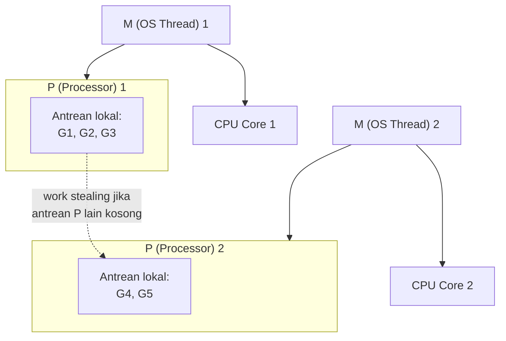

## TL;DR

[[Goroutines]] menyebut sekilas bahwa runtime Go menjadwalkan ribuan goroutine di atas segelintir OS thread — note ini menjelaskan mekanisme persisnya, dikenal sebagai **GMP scheduler**: **G** (Goroutine, unit kerja), **M** (Machine, OS thread sungguhan), dan **P** (Processor, konteks penjadwalan logis yang menjembatani keduanya). Jumlah P dibatasi oleh `GOMAXPROCS` (default sama dengan jumlah core CPU), dan setiap P menjalankan satu M pada satu waktu, memproses antrean goroutine-nya sendiri. Model tiga lapis ini adalah alasan mekanis kenapa Go bisa menjalankan jutaan goroutine secara efisien di atas segelintir thread OS, tanpa overhead context-switching penuh yang biasa dibutuhkan OS untuk mengelola thread dalam jumlah sama besarnya.

## The Problem

Seorang engineer mengira menaikkan `GOMAXPROCS` jauh melebihi jumlah core CPU fisik akan mempercepat aplikasinya, dengan asumsi "lebih banyak angka ini pasti lebih banyak paralelisme" — tanpa memahami bahwa `GOMAXPROCS` menentukan jumlah **P** (konteks penjadwalan), dan P tidak bisa benar-benar berjalan paralel melebihi jumlah **core CPU fisik** yang tersedia untuk mengeksekusi instruksi sungguhan. Menaikkan `GOMAXPROCS` melebihi jumlah core hanya menambah overhead koordinasi antar P tanpa menambah kapasitas komputasi paralel yang sebenarnya — perubahan konfigurasi yang terdengar masuk akal tapi tidak memberi manfaat nyata, kadang justru memperlambat karena overhead tambahan.

Masalah kedua yang lebih mendasar: seorang developer bingung kenapa sebuah goroutine yang menjalankan loop komputasi berat tanpa henti (tanpa I/O, tanpa channel operation) bisa "mengunci" seluruh aplikasi — goroutine lain yang seharusnya independen tampak tidak mendapat giliran dijalankan sama sekali. Ini berkaitan dengan bagaimana scheduler Go memutuskan kapan memindahkan eksekusi dari satu goroutine ke goroutine lain (dibahas lebih lanjut sebagai preemption di note berikutnya), sebuah keputusan yang tidak sepenuhnya sama dengan bagaimana OS scheduler mengelola thread biasa.

## Intuition

Bayangkan model GMP seperti **sistem kerja di sebuah kantor dengan meja terbatas dan banyak pegawai**. **G** (goroutine) adalah setiap tugas kerja yang perlu diselesaikan — bisa jumlahnya ribuan. **M** (OS thread) adalah pegawai sungguhan yang benar-benar mengerjakan tugas. Jumlah M tidak dibatasi jumlah core: runtime menambah pegawai baru setiap kali ada pegawai lama yang tersangkut menunggu sesuatu di luar kantor (syscall yang memblokir). Yang dibatasi adalah jumlah **meja kerja (P)** — itulah yang menentukan berapa banyak pegawai bisa benar-benar bekerja pada satu waktu, karena pegawai tanpa meja tidak mengerjakan apa pun. Jumlah meja diatur `GOMAXPROCS`, biasanya mendekati jumlah core CPU, dan setiap meja hanya bisa dipakai satu pegawai pada satu waktu, memproses antrean tugas (G) di meja itu satu per satu, sambil sesekali "mengintip" antrean meja lain kalau meja sendiri sudah kosong (work stealing).

Arah hubungannya penting dan mudah terbalik: **pegawai yang harus mendapat meja supaya bisa bekerja**, bukan meja yang dijatahi pegawai. Pegawai tanpa meja tidak mengerjakan apa pun — ia menunggu, atau ia sedang keluar kantor mengurus sesuatu (blocking syscall). Inilah yang membuat penyerahan meja saat syscall bisa dinalar: pegawai yang harus keluar kantor **melepas mejanya lebih dulu** supaya meja itu tidak menganggur, dan pegawai lain bisa langsung memakainya. Saat ia kembali, ia harus antre mendapat meja lagi sebelum boleh melanjutkan.

Analogi ini bocor pada satu hal: pegawai kantor sungguhan yang sedang menulis laporan panjang (komputasi berat tanpa jeda) akan terus terlihat sibuk di meja yang sama tanpa gangguan. Goroutine yang menjalankan komputasi berat tanpa titik jeda alami (tanpa panggilan fungsi yang bisa "diinterupsi" scheduler) dulu (sebelum Go 1.14) bisa benar-benar memblokir goroutine lain di P yang sama tanpa batas — situasi yang diperbaiki lewat mekanisme **preemption asinkron** yang ditambahkan kemudian, dibahas detail di [[Preemption]].

## How It Works



Diagram ini menunjukkan struktur inti: setiap **P** punya antrean goroutine lokalnya sendiri, dan **M** (OS thread) yang terpasang pada P itu mengeksekusi goroutine dari antrean tersebut. Jumlah P dibatasi `GOMAXPROCS` (biasanya mendekati jumlah core CPU), memastikan jumlah eksekusi paralel sungguhan tidak melebihi kapasitas hardware yang benar-benar tersedia.

**Work stealing**: kalau antrean goroutine di satu P kosong sementara P lain masih punya banyak goroutine menunggu, P yang menganggur akan "mencuri" sebagian goroutine dari antrean P lain — mekanisme yang menjaga beban kerja tetap merata di seluruh P yang tersedia, mencegah satu P kelebihan beban sementara P lain menganggur.

**Kapan M dilepas dari P**: ketika goroutine yang sedang dijalankan M melakukan operasi yang **memblokir** (syscall I/O seperti membaca file atau membuka koneksi jaringan), Go runtime **melepaskan** M itu dari P-nya (M yang blocking dibiarkan menunggu syscall selesai) dan **memasang M lain** (atau membuat M baru) ke P itu supaya P tetap bisa melanjutkan menjalankan goroutine lain di antreannya — inilah mekanisme kunci yang membuat goroutine yang menunggu I/O tidak "membekukan" seluruh P tempatnya berjalan.

## Under The Hood

Jumlah M bisa jauh melebihi jumlah P. Setiap M yang sedang tersangkut di blocking syscall tidak memegang P, jadi ia tidak memakan kuota paralelisme — ia hanya memakan memori stack thread. Ini kenapa program yang banyak memanggil cgo atau operasi file blocking bisa punya jumlah OS thread yang mengejutkan tingginya, tanpa itu berarti ada bug.

**Local run queue vs global run queue**: setiap P punya antrean lokal (kapasitas terbatas, biasanya 256 goroutine) untuk goroutine yang siap dijalankan — mengambil dari antrean lokal jauh lebih murah (tidak butuh lock) dibanding mengambil dari **antrean global** yang dibagikan seluruh P (butuh lock, dipakai saat antrean lokal penuh atau kosong). Desain dua tingkat ini menyeimbangkan kecepatan (antrean lokal, tanpa kontensi) dengan keadilan distribusi beban (antrean global dan work stealing, mencegah satu P kebanjiran sementara yang lain menganggur).

`GOMAXPROCS` bisa diatur eksplisit lewat `runtime.GOMAXPROCS(n)` atau environment variable `GOMAXPROCS` — untuk aplikasi yang berjalan di dalam container Kubernetes dengan **CPU limit** yang lebih kecil dari jumlah core fisik node, penting memastikan `GOMAXPROCS` **sadar** akan limit itu (bukan mengasumsikan seluruh core node tersedia), karena secara default Go membaca jumlah core dari sistem operasi, yang di dalam container bisa saja melaporkan jumlah core **node** (jauh lebih besar dari CPU limit container itu sendiri) — ketidaksesuaian ini bisa membuat Go menjadwalkan lebih banyak P dari yang sebenarnya dialokasikan untuk container itu, memicu overhead penjadwalan yang tidak perlu.

> [!question] Perlu diverifikasi
> Klaim: kapasitas antrean lokal per P sekitar 256 goroutine, dan perilaku default GOMAXPROCS terkait cgroup CPU limit di container.
> Kenapa ragu: ini detail implementasi internal runtime yang bisa berubah antar versi Go, dan sebagian sudah mulai ditangani otomatis lewat `GOMAXPROCS` yang cgroup-aware di rilis Go yang relatif baru — perlu dicek versi mana yang relevan.
> Cara verifikasi: dokumentasi resmi Go dan changelog rilis mengenai `GOMAXPROCS` dan container awareness.

## In Go

```go
package main

import (
	"fmt"
	"runtime"
)

func main() {
	// GOMAXPROCS(0) mengembalikan nilai SAAT INI tanpa mengubahnya —
	// cara aman memeriksa berapa P yang dikonfigurasi tanpa efek samping.
	fmt.Println("GOMAXPROCS saat ini:", runtime.GOMAXPROCS(0))
	fmt.Println("Jumlah CPU core terdeteksi:", runtime.NumCPU())
	fmt.Println("Jumlah goroutine aktif:", runtime.NumGoroutine())
}
```

```go
package main

import "runtime"

// Untuk aplikasi di dalam container dengan CPU limit lebih kecil dari
// core node, pastikan GOMAXPROCS sesuai limit sungguhan — beberapa
// library (seperti "go.uber.org/automaxprocs") melakukan ini otomatis
// dengan membaca cgroup, direkomendasikan untuk aplikasi container.
func init() {
	// Contoh manual (untuk ilustrasi) — di production sebaiknya pakai
	// library yang membaca cgroup CPU limit secara otomatis.
	if limitContainer := bacaLimitDariCgroup(); limitContainer > 0 {
		runtime.GOMAXPROCS(limitContainer)
	}
}

func bacaLimitDariCgroup() int { return 0 } // placeholder ilustrasi
```

## In His Stack

Untuk aplikasi Go yang di-deploy sebagai pod Kubernetes dengan `resources.limits.cpu` yang jauh lebih kecil dari core node fisik (pola umum di cluster multi-tenant), memakai library seperti `go.uber.org/automaxprocs` yang secara otomatis menyesuaikan `GOMAXPROCS` dengan CPU limit cgroup adalah praktik yang sudah cukup umum direkomendasikan — tanpa ini, Go bisa menjadwalkan lebih banyak P dari yang benar-benar dialokasikan container, menambah overhead penjadwalan yang mengurangi efisiensi CPU yang sudah terbatas.

## Trade-offs and When Not To Use It

Memahami detail GMP scheduler tidak mengubah cara menulis kode aplikasi sehari-hari — kebanyakan developer Go tidak pernah perlu menyetel `GOMAXPROCS` secara manual, karena default (mendekati jumlah core yang terdeteksi) sudah tepat untuk mayoritas kasus. Pemahaman ini paling bernilai justru saat men-debug perilaku performa yang mengejutkan (kenapa menambah goroutine tidak mempercepat komputasi CPU-bound, kenapa satu goroutine yang "nakal" tampak mengganggu goroutine lain) — pengetahuan yang dibutuhkan untuk diagnosis mendalam, bukan untuk keputusan desain sehari-hari.

## Common Mistakes

> [!warning] Jebakan
> Menaikkan `GOMAXPROCS` jauh melebihi jumlah core CPU fisik dengan asumsi ini menambah paralelisme — P tidak bisa berjalan paralel melebihi kapasitas core fisik yang benar-benar tersedia; menaikkannya berlebihan hanya menambah overhead koordinasi.

> [!warning] Jebakan
> Tidak menyesuaikan `GOMAXPROCS` untuk aplikasi yang berjalan di container dengan CPU limit lebih kecil dari core node — Go bisa menjadwalkan lebih banyak P dari yang benar-benar dialokasikan, menyebabkan overhead penjadwalan yang tidak perlu di lingkungan dengan CPU sudah terbatas.

> [!warning] Jebakan
> Mengasumsikan seluruh goroutine dijadwalkan "adil" tanpa pengecualian — goroutine yang menjalankan komputasi berat tanpa titik jeda tertentu bisa berperilaku berbeda dari yang diharapkan tergantung mekanisme preemption yang berlaku, dibahas lebih lanjut di note berikutnya.

## Exercises

1. Jelaskan peran masing-masing dari G, M, dan P dalam model GMP scheduler Go.
2. Kenapa menaikkan `GOMAXPROCS` jauh melebihi jumlah core CPU fisik tidak menambah paralelisme sungguhan?
3. Apa yang terjadi pada M dan P ketika sebuah goroutine melakukan syscall yang memblokir (misalnya membaca file)?
4. Desain terbuka: aplikasimu berjalan di pod Kubernetes dengan `resources.limits.cpu: "2"` (setara 2 core), tapi node tempatnya berjalan punya 32 core fisik. Jelaskan kenapa membiarkan Go membaca `GOMAXPROCS` default (berdasarkan core node, bukan limit container) berpotensi menjadi masalah, dan rancang solusi untuk mengatasinya.

> [!success]- Kunci jawaban
> **1.** **G** (Goroutine) adalah unit kerja individual — kode yang dijalankan lewat `go func()`, bisa berjumlah ribuan hingga jutaan. **M** (Machine) adalah OS thread sungguhan yang benar-benar dijadwalkan kernel OS untuk mengeksekusi instruksi di CPU. **P** (Processor) adalah konteks penjadwalan logis yang menjembatani keduanya — setiap P punya antrean goroutine lokal, dan tepat satu M yang terpasang padanya pada satu waktu untuk benar-benar mengeksekusi goroutine dari antrean itu. Jumlah P dibatasi `GOMAXPROCS`, memastikan jumlah eksekusi paralel sungguhan sesuai kapasitas hardware.
> **4.** Tanpa penyesuaian, Go runtime yang membaca jumlah core dari sistem operasi bisa melihat 32 core (core node fisik), bukan 2 core (limit yang sebenarnya dialokasikan container oleh Kubernetes lewat cgroup) — Go kemudian menyetel `GOMAXPROCS` mendekati 32, menjadwalkan jauh lebih banyak P dari yang benar-benar bisa dieksekusi paralel oleh 2 core yang sebenarnya dialokasikan. Ini menambah overhead penjadwalan (context switching antar P yang lebih banyak dari kapasitas riil) tanpa manfaat paralelisme tambahan, memboroskan sedikit dari 2 core yang sudah terbatas itu untuk overhead yang tidak perlu. Solusi: memakai library seperti `go.uber.org/automaxprocs` (diimpor dan dipanggil di awal `main()`) yang secara otomatis membaca CPU limit dari cgroup dan menyetel `GOMAXPROCS` sesuai limit sungguhan (2, dalam kasus ini), bukan jumlah core node yang menyesatkan.

## Self-Check

- Apa peran masing-masing G, M, dan P dalam model GMP?
- Kenapa menaikkan GOMAXPROCS melebihi jumlah core fisik tidak menambah paralelisme?
- Apa yang terjadi pada M dan P saat goroutine melakukan syscall yang memblokir?
- Kenapa GOMAXPROCS perlu disesuaikan untuk aplikasi container dengan CPU limit?

## Connected Notes

- [[Goroutines]] — model GMP adalah mekanisme konkret di balik klaim "goroutine dijadwalkan runtime, bukan OS" yang diperkenalkan di note itu.
- [[Preemption]] — kelanjutan langsung: bagaimana scheduler menangani goroutine yang tidak kooperatif (komputasi berat tanpa jeda), dibahas di note berikutnya.
- [[Goroutine Leaks]] — goroutine yang bocor tetap "hidup" dalam struktur GMP ini, terus menempati slot antrean meski tidak pernah selesai.
- [[Worker Pools]] — jumlah worker optimal untuk pekerjaan CPU-bound yang dibahas di note itu bertumpu langsung pada pemahaman GOMAXPROCS dan jumlah P yang dijelaskan di sini.
- [[Garbage Collection in Go]] — GC Go berjalan berdampingan dengan goroutine aplikasi dalam struktur GMP yang sama, berkoordinasi lewat mekanisme yang terkait dengan scheduler ini.

## Further Reading

- Dokumentasi desain resmi Go, "Scalable Go Scheduler Design Doc" (dokumen desain asli oleh tim Go).
- Dokumentasi resmi Go, package `runtime` — `GOMAXPROCS`, `NumCPU`, `NumGoroutine`.

## Catatan Saya

*Tulis di sini apakah service Go di kerjaanmu yang berjalan di Kubernetes sudah menyesuaikan GOMAXPROCS dengan CPU limit container-nya.*
