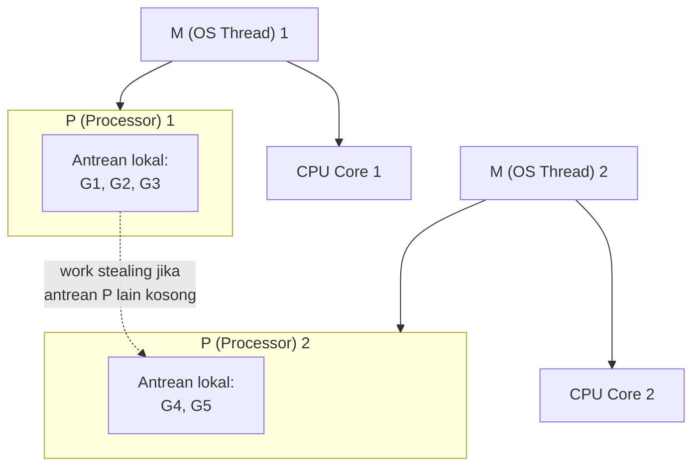

## TL;DR

[[Goroutines]] menyebut sekilas bahwa runtime Go menjadwalkan ribuan goroutine di atas segelintir OS thread — note ini menjelaskan mekanisme persisnya, dikenal sebagai **GMP scheduler**: **G** (Goroutine, unit kerja), **M** (Machine, OS thread sungguhan), dan **P** (Processor, konteks penjadwalan logis yang menjembatani keduanya). Jumlah P dibatasi oleh `GOMAXPROCS` (default sama dengan jumlah core CPU), dan setiap P menjalankan satu M pada satu waktu, memproses antrean goroutine-nya sendiri. Model tiga lapis ini adalah alasan mekanis kenapa Go bisa menjalankan jutaan goroutine secara efisien di atas segelintir thread OS, tanpa overhead context-switching penuh yang biasa dibutuhkan OS untuk mengelola thread dalam jumlah sama besarnya.

## The Problem

Seorang engineer mengira menaikkan `GOMAXPROCS` jauh melebihi jumlah core CPU fisik akan mempercepat aplikasinya, dengan asumsi "lebih banyak angka ini pasti lebih banyak paralelisme" — tanpa memahami bahwa `GOMAXPROCS` menentukan jumlah **P** (konteks penjadwalan), dan P tidak bisa benar-benar berjalan paralel melebihi jumlah **core CPU fisik** yang tersedia untuk mengeksekusi instruksi sungguhan. Menaikkan `GOMAXPROCS` melebihi jumlah core hanya menambah overhead koordinasi antar P tanpa menambah kapasitas komputasi paralel yang sebenarnya — perubahan konfigurasi yang terdengar masuk akal tapi tidak memberi manfaat nyata, kadang justru memperlambat karena overhead tambahan.

Masalah kedua yang lebih mendasar: seorang developer bingung kenapa sebuah goroutine yang menjalankan loop komputasi berat tanpa henti (tanpa I/O, tanpa channel operation) bisa "mengunci" seluruh aplikasi — goroutine lain yang seharusnya independen tampak tidak mendapat giliran dijalankan sama sekali. Ini berkaitan dengan bagaimana scheduler Go memutuskan kapan memindahkan eksekusi dari satu goroutine ke goroutine lain (dibahas lebih lanjut sebagai preemption di note berikutnya), sebuah keputusan yang tidak sepenuhnya sama dengan bagaimana OS scheduler mengelola thread biasa.

## Intuition

Bayangkan model GMP seperti **sistem kerja di sebuah kantor dengan meja terbatas dan banyak pegawai**. **G** (goroutine) adalah setiap tugas kerja yang perlu diselesaikan — bisa jumlahnya ribuan. **M** (OS thread) adalah pegawai sungguhan yang benar-benar mengerjakan tugas. Jumlah M tidak dibatasi jumlah core: runtime menambah pegawai baru setiap kali ada pegawai lama yang tersangkut menunggu sesuatu di luar kantor (syscall yang memblokir). Yang dibatasi adalah jumlah **meja kerja (P)** — itulah yang menentukan berapa banyak pegawai bisa benar-benar bekerja pada satu waktu, karena pegawai tanpa meja tidak mengerjakan apa pun. Jumlah meja diatur `GOMAXPROCS`, biasanya mendekati jumlah core CPU, dan setiap meja hanya bisa dipakai satu pegawai pada satu waktu, memproses antrean tugas (G) di meja itu satu per satu, sambil sesekali "mengintip" antrean meja lain kalau meja sendiri sudah kosong (work stealing).

Arah hubungannya penting dan mudah terbalik: **pegawai yang harus mendapat meja supaya bisa bekerja**, bukan meja yang dijatahi pegawai. Pegawai tanpa meja tidak mengerjakan apa pun — ia menunggu, atau ia sedang keluar kantor mengurus sesuatu (blocking syscall). Inilah yang membuat penyerahan meja saat syscall bisa dinalar: pegawai yang harus keluar kantor **melepas mejanya lebih dulu** supaya meja itu tidak menganggur, dan pegawai lain bisa langsung memakainya. Saat ia kembali, ia harus antre mendapat meja lagi sebelum boleh melanjutkan.

Analogi ini bocor pada satu hal: pegawai kantor sungguhan yang sedang menulis laporan panjang (komputasi berat tanpa jeda) akan terus terlihat sibuk di meja yang sama tanpa gangguan. Goroutine yang menjalankan komputasi berat tanpa titik jeda alami (tanpa panggilan fungsi yang bisa "diinterupsi" scheduler) dulu (sebelum Go 1.14) bisa benar-benar memblokir goroutine lain di P yang sama tanpa batas — situasi yang diperbaiki lewat mekanisme **preemption asinkron** yang ditambahkan kemudian, dibahas detail di [[Preemption]].

## How It Works


```mermaid
flowchart TD
    subgraph P1["P (Processor) 1"]
        Q1["Antrean lokal:\nG1, G2, G3"]
    end
    subgraph P2["P (Processor) 2"]
        Q2["Antrean lokal:\nG4, G5"]
    end
    M1["M (OS Thread) 1"] --> P1
    M2["M (OS Thread) 2"] --> P2
    M1 --> CPU1["CPU Core 1"]
    M2 --> CPU2["CPU Core 2"]
    Q1 -.->|"work stealing jika\nantrean P lain kosong"| Q2
```

Diagram ini menunjukkan struktur inti: setiap **P** punya antrean goroutine lokalnya sendiri, dan **M** (OS thread) yang terpasang pada P itu mengeksekusi goroutine dari antrean tersebut. Jumlah P dibatasi `GOMAXPROCS` (biasanya mendekati jumlah core CPU), memastikan jumlah eksekusi paralel sungguhan tidak melebihi kapasitas hardware yang benar-benar tersedia.

**Work stealing**: kalau antrean goroutine di satu P kosong sementara P lain masih punya banyak goroutine menunggu, P yang menganggur akan "mencuri" sebagian goroutine dari antrean P lain — mekanisme yang menjaga beban kerja tetap merata di seluruh P yang tersedia, mencegah satu P kelebihan beban sementara P lain menganggur.

**Kapan M dilepas dari P**: ketika goroutine yang sedang dijalankan M melakukan operasi yang **memblokir** (syscall I/O seperti membaca file atau membuka koneksi jaringan), Go runtime **melepaskan** M itu dari P-nya (M yang blocking dibiarkan menunggu syscall selesai) dan **memasang M lain** (atau membuat M baru) ke P itu supaya P tetap bisa melanjutkan menjalankan goroutine lain di antreannya — inilah mekanisme kunci yang membuat goroutine yang menunggu I/O tidak "membekukan" seluruh P tempatnya berjalan.

## Under The Hood

Jumlah M bisa jauh melebihi jumlah P. Setiap M yang sedang tersangkut di blocking syscall tidak memegang P, jadi ia tidak memakan kuota paralelisme — ia hanya memakan memori stack thread. Ini kenapa program yang banyak memanggil cgo atau operasi file blocking bisa punya jumlah OS thread yang mengejutkan tingginya, tanpa itu berarti ada bug.

**Local run queue vs global run queue**: setiap P punya antrean lokal (kapasitasnya 256 goroutine di implementasi runtime saat ini, sebuah detail internal yang bisa berubah) untuk goroutine yang siap dijalankan — mengambil dari antrean lokal jauh lebih murah (tidak butuh lock) dibanding mengambil dari **antrean global** yang dibagikan seluruh P (butuh lock, dipakai saat antrean lokal penuh atau kosong). Desain dua tingkat ini menyeimbangkan kecepatan (antrean lokal, tanpa kontensi) dengan keadilan distribusi beban (antrean global dan work stealing, mencegah satu P kebanjiran sementara yang lain menganggur).

`GOMAXPROCS` bisa diatur eksplisit lewat `runtime.GOMAXPROCS(n)` atau environment variable `GOMAXPROCS`. Nilai default-nya berubah penting di Go 1.25, dan ini relevan untuk aplikasi di Kubernetes dengan **CPU limit** yang lebih kecil dari jumlah core node:

- **Modul dengan `go` 1.24 atau lebih rendah di `go.mod`:** default-nya adalah `runtime.NumCPU()`, yaitu jumlah core yang terlihat oleh proses (pada dasarnya core node), bukan CPU limit container. Pod dengan limit 2 core di node 32 core akan mendapat `GOMAXPROCS=32`.
- **Modul dengan `go` 1.25 atau lebih:** di Linux, runtime ikut membaca kuota CPU cgroup (`cpu.max` di cgroup v2) dan memakai nilai terkecil antara jumlah CPU logis, CPU affinity mask, dan limit cgroup (dibulatkan ke atas, dan tidak kurang dari 2 kecuali mesinnya memang hanya punya 1 CPU). Runtime juga memperbarui nilai itu secara berkala kalau limit berubah. Yang dibaca adalah *CPU limit*, bukan *CPU request*.

Perilaku lama tetap bisa dipaksa lewat `GODEBUG=containermaxprocs=0`. Semua ini dijelaskan di dokumentasi `runtime.GOMAXPROCS`.

## In Go

```go
package main

import (
	"fmt"
	"runtime"
)

func main() {
	// GOMAXPROCS(0) mengembalikan nilai SAAT INI tanpa mengubahnya —
	// cara aman memeriksa berapa P yang dikonfigurasi tanpa efek samping.
	fmt.Println("GOMAXPROCS saat ini:", runtime.GOMAXPROCS(0))
	fmt.Println("Jumlah CPU core terdeteksi:", runtime.NumCPU())
	fmt.Println("Jumlah goroutine aktif:", runtime.NumGoroutine())
}
```

Untuk modul dengan `go` 1.24 ke bawah yang berjalan di container ber-CPU limit, library `go.uber.org/automaxprocs` (di-import sebagai blank import di `main`) membaca limit cgroup dan menyetel `GOMAXPROCS` sesuai limit itu. Untuk modul Go 1.25+, runtime sudah melakukannya sendiri, dan library itu tidak lagi diperlukan.

## In His Stack

Untuk aplikasi Go yang di-deploy sebagai pod Kubernetes dengan `resources.limits.cpu` yang jauh lebih kecil dari core node fisik (pola umum di cluster multi-tenant), langkah pertamanya adalah memeriksa baris `go` di `go.mod`. Kalau nilainya 1.25 atau lebih dan binary dibangun dengan toolchain yang sesuai, `GOMAXPROCS` sudah mengikuti CPU limit secara otomatis. Kalau masih 1.24 ke bawah, pakai `go.uber.org/automaxprocs` atau set environment variable `GOMAXPROCS` di manifest Deployment. Tanpa salah satunya, Go menjadwalkan jauh lebih banyak P dari CPU yang dialokasikan. Akibatnya bukan hanya overhead penjadwalan: CFS quota Linux akan *men-throttle* seluruh container begitu kuotanya habis dalam satu periode, dan throttling itu muncul sebagai lonjakan latency p99 yang sulit dijelaskan.

## Trade-offs and When Not To Use It

Memahami detail GMP scheduler tidak mengubah cara menulis kode aplikasi sehari-hari — kebanyakan developer Go tidak pernah perlu menyetel `GOMAXPROCS` secara manual, karena default (mendekati jumlah core yang terdeteksi) sudah tepat untuk mayoritas kasus. Pemahaman ini paling bernilai justru saat men-debug perilaku performa yang mengejutkan (kenapa menambah goroutine tidak mempercepat komputasi CPU-bound, kenapa satu goroutine yang "nakal" tampak mengganggu goroutine lain) — pengetahuan yang dibutuhkan untuk diagnosis mendalam, bukan untuk keputusan desain sehari-hari.

## Common Mistakes

> [!warning] Jebakan
> Menaikkan `GOMAXPROCS` jauh melebihi jumlah core CPU fisik dengan asumsi ini menambah paralelisme — P tidak bisa berjalan paralel melebihi kapasitas core fisik yang benar-benar tersedia; menaikkannya berlebihan hanya menambah overhead koordinasi.

> [!warning] Jebakan
> Tidak menyesuaikan `GOMAXPROCS` untuk aplikasi Go 1.24 ke bawah yang berjalan di container dengan CPU limit lebih kecil dari core node — Go menjadwalkan lebih banyak P dari CPU yang dialokasikan, dan container terkena CPU throttling. Sebaliknya, jangan menambahkan `automaxprocs` atau `GOMAXPROCS` manual ke modul Go 1.25+ tanpa alasan: nilai manual mematikan pembaruan otomatis dari runtime.

> [!warning] Jebakan
> Mengasumsikan seluruh goroutine dijadwalkan "adil" tanpa pengecualian — goroutine yang menjalankan komputasi berat tanpa titik jeda tertentu bisa berperilaku berbeda dari yang diharapkan tergantung mekanisme preemption yang berlaku, dibahas lebih lanjut di note berikutnya.

## Exercises

1. Jelaskan peran masing-masing dari G, M, dan P dalam model GMP scheduler Go.
2. Kenapa menaikkan `GOMAXPROCS` jauh melebihi jumlah core CPU fisik tidak menambah paralelisme sungguhan?
3. Apa yang terjadi pada M dan P ketika sebuah goroutine melakukan syscall yang memblokir (misalnya membaca file)?
4. Desain terbuka: aplikasimu berjalan di pod Kubernetes dengan `resources.limits.cpu: "2"` (setara 2 core), tapi node tempatnya berjalan punya 32 core fisik. Jelaskan kenapa membiarkan Go membaca `GOMAXPROCS` default (berdasarkan core node, bukan limit container) berpotensi menjadi masalah, dan rancang solusi untuk mengatasinya.

> [!success]- Kunci jawaban
> **1.** **G** (Goroutine) adalah unit kerja individual — kode yang dijalankan lewat `go func()`, bisa berjumlah ribuan hingga jutaan. **M** (Machine) adalah OS thread sungguhan yang benar-benar dijadwalkan kernel OS untuk mengeksekusi instruksi di CPU. **P** (Processor) adalah konteks penjadwalan logis yang menjembatani keduanya — setiap P punya antrean goroutine lokal, dan tepat satu M yang terpasang padanya pada satu waktu untuk benar-benar mengeksekusi goroutine dari antrean itu. Jumlah P dibatasi `GOMAXPROCS`, memastikan jumlah eksekusi paralel sungguhan sesuai kapasitas hardware.
> **4.** Jawabannya bergantung pada versi Go di `go.mod`. Untuk Go 1.24 ke bawah, runtime melihat 32 core node dan menyetel `GOMAXPROCS=32`, padahal container hanya boleh memakai rata-rata 2 core. Hingga 32 goroutine bisa berjalan paralel, sehingga kuota CPU container habis di awal setiap periode CFS dan seluruh container di-throttle sampai periode berikutnya, yang terlihat sebagai lonjakan latency periodik. Solusinya: `go.uber.org/automaxprocs`, environment variable `GOMAXPROCS=2` di manifest, atau (paling bersih) menaikkan versi `go` di `go.mod` ke 1.25+, di mana runtime membaca limit cgroup sendiri dan memperbaruinya kalau limit berubah.

## Self-Check

- Apa peran masing-masing G, M, dan P dalam model GMP?
- Kenapa menaikkan GOMAXPROCS melebihi jumlah core fisik tidak menambah paralelisme?
- Apa yang terjadi pada M dan P saat goroutine melakukan syscall yang memblokir?
- Kenapa GOMAXPROCS perlu disesuaikan untuk aplikasi container dengan CPU limit?

## Connected Notes

- [[Goroutines]] — model GMP adalah mekanisme konkret di balik klaim "goroutine dijadwalkan runtime, bukan OS" yang diperkenalkan di note itu.
- [[Preemption]] — kelanjutan langsung: bagaimana scheduler menangani goroutine yang tidak kooperatif (komputasi berat tanpa jeda), dibahas di note berikutnya.
- [[Goroutine Leaks]] — goroutine yang bocor tidak menempati run queue (goroutine yang terblokir diparkir di antrean tunggu channel atau lock), tapi stack dan objek yang direferensikannya tetap hidup; itulah kenapa leak memakan memori, bukan CPU.
- [[Worker Pools]] — jumlah worker optimal untuk pekerjaan CPU-bound yang dibahas di note itu bertumpu langsung pada pemahaman GOMAXPROCS dan jumlah P yang dijelaskan di sini.
- [[Garbage Collection in Go]] — GC Go berjalan berdampingan dengan goroutine aplikasi dalam struktur GMP yang sama, berkoordinasi lewat mekanisme yang terkait dengan scheduler ini.

## Further Reading

- Dokumentasi desain resmi Go, "Scalable Go Scheduler Design Doc" (dokumen desain asli oleh tim Go).
- Dokumentasi resmi Go, package `runtime` — `GOMAXPROCS`, `NumCPU`, `NumGoroutine`.

## Catatan Saya

*Tulis di sini apakah service Go di kerjaanmu yang berjalan di Kubernetes sudah menyesuaikan GOMAXPROCS dengan CPU limit container-nya.*
