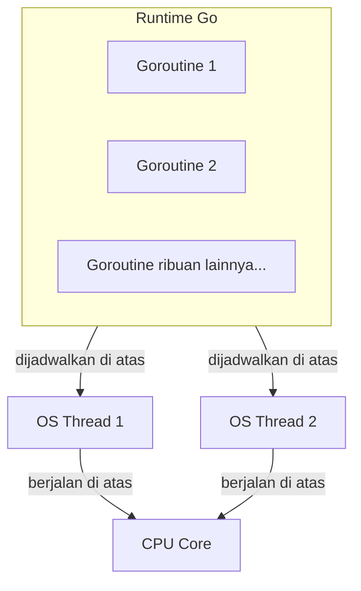

## TL;DR

Goroutine sering diperkenalkan sebagai "lightweight thread" — deskripsi yang membantu untuk intuisi awal, tapi menyembunyikan perbedaan mendasar yang penting dipahami: goroutine bukan dikelola OS scheduler seperti thread di [[../10 Foundations/Processes vs Threads|Processes vs Threads]], melainkan dikelola **runtime Go sendiri**, yang menjadwalkan ribuan bahkan jutaan goroutine di atas segelintir OS thread. Konsekuensinya nyata: membuat goroutine jauh lebih murah dari membuat OS thread (stack awal hanya beberapa kilobyte, bukan megabyte, dan bisa tumbuh/menyusut dinamis), tapi "murah" tidak berarti "gratis" — setiap goroutine tetap memakai memori dan menambah pekerjaan bagi scheduler, dan goroutine yang tidak pernah berhenti (goroutine leak, dibahas di note lain) tetap bisa menghabiskan resource sampai aplikasi crash.

## The Problem

Sebuah endpoint yang memproses upload dokumen meluncurkan satu goroutine terpisah untuk setiap tugas pemrosesan (validasi format, scan virus, generate thumbnail, kirim notifikasi) dengan asumsi "goroutine murah, jadi aman diluncurkan sebanyak apa pun". Di bawah beban ringan, ini bekerja baik-baik saja. Begitu traffic upload meningkat drastis (ribuan upload bersamaan di jam sibuk), aplikasi mulai melambat drastis dan akhirnya kehabisan memori — bukan karena goroutine itu sendiri "mahal" secara individual, tapi karena **jumlahnya tidak dibatasi**: setiap upload meluncurkan empat goroutine baru tanpa batas atas, dan ribuan upload bersamaan berarti puluhan ribu goroutine hidup sekaligus, masing-masing memakai stack memori dan menambah beban penjadwalan runtime.

Masalah kedua yang lebih halus: sebuah goroutine diluncurkan untuk memanggil API partner eksternal, tapi kode pemanggil tidak pernah menunggu goroutine itu selesai (`go panggilPartner()` lalu handler langsung mengembalikan response, tanpa `WaitGroup` atau mekanisme sinkronisasi apa pun) — kalau `panggilPartner()` panic karena alasan yang tidak terduga (misalnya response API partner yang tidak sesuai ekspektasi), panic itu **tidak akan tertangkap** oleh mekanisme recover di goroutine utama, karena panic di satu goroutine tidak menyebar ke goroutine lain — ia langsung menjatuhkan **seluruh proses aplikasi**, bukan hanya goroutine yang bermasalah, kalau tidak ditangani dengan `recover()` di dalam goroutine itu sendiri.

## Intuition

Bayangkan goroutine seperti **karyawan yang dikelola oleh satu manajer proyek internal (runtime Go)**, dibanding OS thread yang seperti karyawan yang langsung dikelola HRD perusahaan (OS scheduler) dengan seluruh birokrasi yang menyertainya. Manajer proyek internal bisa merekrut karyawan baru jauh lebih cepat dan murah (tidak perlu proses HRD penuh untuk setiap orang), dan bisa menugaskan ribuan "karyawan" ini bergiliran mengerjakan tugas di atas segelintir "meja kerja fisik" (OS thread) yang tersedia — banyak karyawan, sedikit meja, giliran diatur pintar oleh manajer.

Analogi ini bocor pada satu hal: karyawan yang direkrut manajer proyek internal murah tetaplah karyawan sungguhan yang butuh dibayar (memori) dan diberi pekerjaan (dijadwalkan CPU) — merekrut ribuan karyawan tanpa rencana kerja yang jelas ("goroutine tak terbatas") tetap membebani perusahaan (aplikasi) secara nyata, meski biaya rekrutmennya jauh lebih rendah dibanding merekrut lewat HRD penuh (OS thread). "Murah" bukan berarti "boleh tanpa batas".

## How It Works

```go
package main

import (
	"fmt"
	"sync"
)

func main() {
	var wg sync.WaitGroup

	for i := 0; i < 5; i++ {
		wg.Add(1)
		// go MELUNCURKAN goroutine baru — eksekusi function literal ini
		// berjalan KONKUREN dengan main(), tidak menunggu selesai di
		// titik ini.
		go func(id int) {
			defer wg.Done()
			fmt.Printf("goroutine %d bekerja\n", id)
		}(i)
	}

	// TANPA wg.Wait(), main() bisa selesai (dan program berhenti)
	// SEBELUM goroutine di atas sempat menjalankan Printf sama sekali —
	// goroutine tidak menahan program tetap hidup.
	wg.Wait()
}
```



Diagram ini menunjukkan lapisan indirection inti: goroutine tidak berbicara langsung dengan CPU atau OS — runtime Go menjadwalkan mereka di atas sejumlah kecil OS thread (biasanya seukuran `GOMAXPROCS`, mendekati jumlah core CPU), dan OS yang menjadwalkan thread-thread itu ke CPU. Mekanisme penjadwalan goroutine-ke-thread ini (disebut GMP scheduler) dibahas mendalam di [[Goroutine Scheduler (GMP)]] — note ini sengaja berhenti di gambaran besarnya dulu.

**Fakta penting yang membedakan goroutine dari thread**: stack goroutine dimulai sangat kecil (sekitar beberapa kilobyte) dan **tumbuh/menyusut secara dinamis** sesuai kebutuhan, berbeda dari OS thread yang biasanya dialokasikan stack berukuran tetap (seringkali megabyte) di awal — inilah salah satu alasan mekanis kenapa goroutine jauh lebih murah dibuat dalam jumlah besar dibanding OS thread.

## Under The Hood

Program Go yang sebuah goroutine di dalamnya `panic()` tanpa `recover()` akan menjatuhkan **seluruh proses**, bukan hanya goroutine itu — ini beda mendasar dari model beberapa bahasa/runtime lain yang mengisolasi kegagalan per-thread. Konsekuensinya: setiap goroutine yang diluncurkan dengan `go func() {...}()` dan berpotensi panic (memanggil kode yang bisa gagal tak terduga, seperti parsing data eksternal) idealnya membungkus dirinya sendiri dengan `defer func() { recover() }()` di baris pertamanya sendiri — menunggu goroutine lain "menangkap" panic-nya tidak mungkin dilakukan, karena `recover()` hanya bekerja dalam goroutine yang sama tempat panic terjadi.

`main()` yang selesai (return) akan **langsung menghentikan seluruh program**, termasuk goroutine lain yang masih berjalan — tidak ada "menunggu goroutine lain selesai" secara otomatis. Ini kenapa `sync.WaitGroup` (atau mekanisme sinkronisasi lain, dibahas di [[The Sync Package]]) wajib dipakai kalau `main()` (atau handler HTTP, atau fungsi mana pun) perlu memastikan goroutine yang diluncurkannya benar-benar selesai sebelum melanjutkan atau mengembalikan response.

## In Go

```go
package upload

import (
	"context"
	"fmt"
	"log/slog"
)

// Sebelumnya (BERMASALAH): meluncurkan goroutine tanpa batas dan tanpa
// penanganan panic — persis skenario "The Problem".
func prosesUploadNaif(ctx context.Context, dokumenID int64) {
	go validasiFormat(dokumenID)
	go scanVirus(dokumenID)
	go generateThumbnail(dokumenID)
	go kirimNotifikasi(dokumenID)
	// TIDAK ADA batas jumlah goroutine konkuren, TIDAK ADA penanganan
	// panic per goroutine, TIDAK ADA cara tahu kapan semuanya selesai.
}

// Versi yang lebih aman: setiap goroutine membungkus dirinya dengan
// recover, dan pemanggil bisa menunggu semuanya selesai lewat WaitGroup
// (pola lengkap dengan pembatasan jumlah konkuren dibahas di Worker Pools).
func jalankanDenganAman(nama string, tugas func(), logger *slog.Logger) {
	go func() {
		defer func() {
			if r := recover(); r != nil {
				logger.Error("goroutine panic, di-recover",
					"tugas", nama, "panic", r)
			}
		}()
		tugas()
	}()
}

func prosesUploadLebihAman(ctx context.Context, dokumenID int64, logger *slog.Logger) {
	jalankanDenganAman("validasi-format", func() { validasiFormat(dokumenID) }, logger)
	jalankanDenganAman("scan-virus", func() { scanVirus(dokumenID) }, logger)
}

func validasiFormat(id int64)    { fmt.Println("validasi", id) }
func scanVirus(id int64)         { fmt.Println("scan virus", id) }
func generateThumbnail(id int64) { fmt.Println("thumbnail", id) }
func kirimNotifikasi(id int64)   { fmt.Println("notifikasi", id) }
```

## In His Stack

PHP/Yii2 secara tradisional tidak punya model concurrency setara goroutine dalam satu proses — setiap request PHP klasik ditangani satu proses/thread terpisah oleh web server (PHP-FPM), dan "concurrency" dicapai lewat banyak proses paralel yang dikelola OS/web server, bukan lewat unit concurrency ringan dalam satu proses aplikasi. Ini pergeseran mental yang signifikan saat pindah ke Go: kode yang di PHP "otomatis" terisolasi per request (karena tiap request adalah proses terpisah) di Go harus **secara sadar** dikelola concurrency-nya dalam satu proses aplikasi yang berjalan lama, termasuk menangani panic per goroutine dan membatasi jumlah goroutine konkuren — tanggung jawab yang di PHP secara struktural tidak pernah ada.

## Trade-offs and When Not To Use It

Goroutine murah untuk dibuat, tapi tidak gratis untuk dijalankan dalam jumlah tidak terbatas — setiap goroutine tetap memakai memori stack (meski kecil di awal) dan menambah unit kerja yang harus dijadwalkan scheduler runtime. Untuk operasi yang benar-benar sekuensial dan tidak butuh concurrency (misalnya satu langkah logika bisnis yang harus terjadi sebelum langkah berikutnya), meluncurkan goroutine terpisah hanya menambah kompleksitas sinkronisasi tanpa manfaat nyata — goroutine bernilai justru ketika ada pekerjaan yang benar-benar bisa (atau perlu) berjalan konkuren, seperti menunggu I/O (panggilan API eksternal, query database) yang independen satu sama lain. Meluncurkan goroutine tanpa batas atas untuk beban kerja yang jumlahnya ditentukan input eksternal (seperti jumlah upload) adalah pola yang harus dihindari sejak awal — pembatasan lewat worker pool (dibahas di [[Worker Pools]]) hampir selalu dibutuhkan untuk kode production yang menangani volume tak terduga.

## Common Mistakes

> [!warning] Jebakan
> Meluncurkan goroutine tanpa batas atas untuk beban kerja yang jumlahnya ditentukan input eksternal (satu goroutine per item dalam daftar yang bisa sangat panjang) — bisa menghabiskan memori dan membebani scheduler tak terkendali di bawah volume tinggi.

> [!warning] Jebakan
> Meluncurkan goroutine yang berpotensi panic tanpa `recover()` di dalamnya sendiri — panic yang tidak ter-recover menjatuhkan seluruh proses aplikasi, bukan hanya goroutine yang bermasalah.

> [!warning] Jebakan
> Meluncurkan goroutine dari `main()` atau handler tanpa mekanisme menunggu (`WaitGroup` atau setara) — fungsi pemanggil bisa selesai dan mengakhiri konteksnya sebelum goroutine yang diluncurkan sempat menyelesaikan pekerjaannya sama sekali.

## Exercises

1. Jelaskan kenapa goroutine lebih murah dibuat dibanding OS thread, secara mekanis.
2. Kenapa panic di satu goroutine bisa menjatuhkan seluruh proses aplikasi, bukan hanya goroutine itu?
3. Apa yang terjadi kalau `main()` selesai (return) sementara masih ada goroutine lain yang berjalan?
4. Desain terbuka: endpoint upload dokumenmu saat ini meluncurkan goroutine tanpa batas untuk setiap tugas pemrosesan (validasi, scan, thumbnail, notifikasi), dan mulai menyebabkan masalah memori di jam sibuk. Rancang perubahan yang membatasi jumlah goroutine konkuren yang berjalan sekaligus untuk keempat tugas ini, tanpa kehilangan manfaat pemrosesan paralel untuk volume upload yang normal.

> [!success]- Kunci jawaban
> **1.** OS thread biasanya dialokasikan stack berukuran tetap yang relatif besar (seringkali megabyte) sejak dibuat, dan pembuatannya melibatkan syscall ke kernel yang punya overhead nyata (lihat [[../10 Foundations/Syscalls and File Descriptors|Syscalls and File Descriptors]]). Goroutine dimulai dengan stack yang sangat kecil (beberapa kilobyte) yang bisa tumbuh dan menyusut dinamis sesuai kebutuhan, dan pembuatannya murni dikelola runtime Go di user space tanpa perlu syscall untuk setiap goroutine baru — kombinasi stack kecil dan tanpa overhead syscall inilah yang membuat goroutine jauh lebih murah dibuat dalam jumlah besar.
> **4.** Ganti pola "satu goroutine per tugas tanpa batas" dengan **worker pool** (dibahas detail di [[Worker Pools]]): buat channel job dengan buffer terbatas, luncurkan sejumlah **tetap** goroutine worker (misalnya sejumlah `GOMAXPROCS` atau angka yang diuji lewat load testing) yang mengambil job dari channel itu satu per satu, dan setiap upload baru mengirim job ke channel alih-alih langsung meluncurkan goroutine baru. Ini membatasi jumlah goroutine konkuren yang benar-benar berjalan ke angka tetap yang telah ditentukan, sementara upload yang datang melebihi kapasitas worker saat ini akan mengantre di channel (atau ditolak dengan jelas kalau buffer channel juga penuh) alih-alih memicu ledakan goroutine tak terbatas.

## Self-Check

- Apa perbedaan mendasar goroutine dan OS thread dari sisi siapa yang menjadwalkannya?
- Kenapa goroutine dianggap "murah" tapi bukan berarti "gratis"?
- Apa yang terjadi kalau panic di sebuah goroutine tidak ditangani `recover()`?
- Kenapa `main()` yang selesai bisa menghentikan goroutine lain yang masih berjalan?

## Connected Notes

- [[../10 Foundations/Processes vs Threads|Processes vs Threads]] — kontras langsung antara goroutine dan thread/proses OS yang dijelaskan fondasinya di note itu.
- [[Buffered vs Unbuffered Channels]] — mekanisme komunikasi antar goroutine yang paling idiomatic di Go, dibahas di note berikutnya.
- [[The Sync Package]] — `WaitGroup` dan primitif sinkronisasi lain yang dibutuhkan untuk menunggu goroutine selesai dengan benar.
- [[Worker Pools]] — pola konkret membatasi jumlah goroutine konkuren, solusi langsung untuk masalah di "The Problem".
- [[Goroutine Scheduler (GMP)]] — mekanisme penjadwalan goroutine di atas OS thread yang disinggung sekilas di note ini, dibahas mendalam di note lain di domain ini.

## Further Reading

- Dokumentasi resmi Go, "Effective Go" bagian "Goroutines".
- Go blog resmi, "Share Memory By Communicating" — filosofi dasar concurrency Go yang mendasari desain goroutine dan channel.

## Catatan Saya

*Tulis di sini apakah ada kode di kerjaanmu yang meluncurkan goroutine tanpa batas atau tanpa recover — dan potensi masalah yang bisa ditimbulkannya di bawah volume tinggi.*
