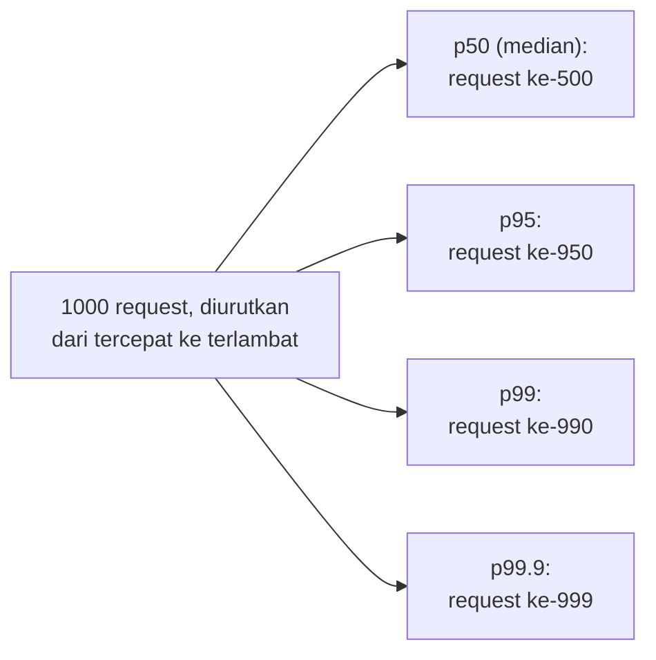

## TL;DR

Rata-rata (mean) latency adalah metrik yang secara sistematis **menyembunyikan** pengalaman terburuk pengguna — satu request yang butuh 10 detik bisa "tenggelam" secara statistik di antara ribuan request yang butuh 50ms, membuat rata-rata keseluruhan tetap terlihat baik meski sebagian pengguna benar-benar mengalami pengalaman buruk. Persentil latency (p50, p95, p99) menjawab pertanyaan yang jauh lebih jujur: "dari 100 request, berapa lama request ke-50 (median), ke-95, dan ke-99 yang paling lambat?" — p99 secara khusus penting karena ia mewakili pengalaman **1 dari 100 pengguna**, jumlah yang jauh dari sekadar "kasus langka yang bisa diabaikan" untuk sistem dengan volume traffic tinggi.

## The Problem

Sebuah tim melaporkan "rata-rata latency endpoint kami hanya 80ms, sangat baik" ke manajemen, sementara laporan keluhan pengguna terus berdatangan soal sistem yang "kadang terasa sangat lambat". Kedua hal ini bisa sama-sama benar sekaligus: rata-rata 80ms bisa dihasilkan dari distribusi di mana 95% request memang cepat (50ms), tapi 5% sisanya butuh 1-2 detik — jumlah yang cukup untuk terus mendorong rata-rata tetap rendah (karena mayoritas data memang cepat), tapi tetap berarti **ribuan pengguna** (kalau volume total tinggi) benar-benar mengalami latency yang buruk setiap harinya.

Masalah kedua: sebuah sistem dengan SLA "p99 di bawah 500ms" tampak baik-baik saja dilihat dari dashboard rata-rata, tapi tim tidak menyadari bahwa p99 sebenarnya sudah melebihi 2 detik selama beberapa jam di setiap hari kerja (jam sibuk pagi) — karena dashboard yang ada hanya menampilkan rata-rata harian yang dihitung dari seluruh 24 jam, "meratakan" lonjakan p99 di jam sibuk dengan periode sepi di malam hari, menyembunyikan pola yang sebenarnya sangat relevan untuk pengalaman pengguna nyata di jam kerja.

## Intuition

Bayangkan mengukur latency sistem seperti **mengukur waktu tunggu di sebuah loket layanan publik**. Rata-rata waktu tunggu bisa terlihat baik (5 menit) meski sebenarnya 95 dari 100 orang dilayani dalam 2 menit, sementara 5 orang terakhir harus menunggu 1 jam penuh karena antrean yang menumpuk di jam tertentu — rata-rata "menyerap" kelima orang yang menunggu sangat lama itu ke dalam angka keseluruhan yang tetap terlihat wajar. Persentil menjawab pertanyaan yang lebih jujur: "berapa lama waktu tunggu untuk orang yang ke-95 dari 100 orang yang datang?" — memberi gambaran pengalaman **near-worst-case**, bukan sekadar rata-rata yang bisa menyembunyikan penderitaan segelintir orang.

Analogi ini bocor pada satu hal: "segelintir orang" di loket fisik mungkin memang benar-benar sedikit secara absolut. Untuk sistem digital dengan traffic jutaan request per hari, "p99" berarti **puluhan ribu** request mengalami latency seburuk itu setiap harinya — jumlah yang jauh dari "bisa diabaikan", dan justru sering menjadi sumber keluhan paling vokal dari pengguna yang paling aktif memakai sistem (karena semakin sering seseorang memakai sistem, semakin besar peluangnya "kena" salah satu dari 1% kejadian terburuk itu).

## How It Works



Diagram ini menunjukkan cara paling sederhana memahami persentil: urutkan seluruh latency dari tercepat ke terlambat, lalu p95 adalah nilai di posisi ke-95% dari data yang terurut itu — **95% request lebih cepat** dari nilai p95, dan **5% request lebih lambat** dari itu.

**Kenapa rata-rata menyesatkan untuk distribusi latency yang khas**: distribusi latency sistem nyata hampir selalu **miring ke kanan** (right-skewed) — mayoritas request cepat, tapi ada "ekor panjang" (long tail) sejumlah kecil request yang jauh lebih lambat dari mayoritas (karena GC pause, lock contention, query database yang kebetulan lambat, dll.). Rata-rata sangat sensitif terhadap ekor panjang ini (satu request 10 detik menggeser rata-rata jauh lebih besar dibanding pengaruhnya pada median), sementara p50 (median) hampir tidak terpengaruh sama sekali oleh ekor itu — inilah kenapa p50 dan rata-rata bisa terlihat sangat berbeda untuk distribusi yang sama.

## Under The Hood

**Menghitung persentil dari data yang benar-benar terkumpul** (bukan estimasi) butuh menyimpan **seluruh** titik data latency dan mengurutkannya — pendekatan yang mahal secara memori untuk sistem dengan volume sangat tinggi. Sistem monitoring modern (Prometheus, dibahas di domain `70 Infrastructure and Delivery`) biasanya memakai **histogram** atau **summary** — struktur data yang mengelompokkan latency ke dalam bucket/rentang tertentu, memberi **estimasi** persentil yang cukup akurat tanpa perlu menyimpan setiap titik data mentah individual. Estimasi ini punya trade-off presisi vs biaya penyimpanan — histogram dengan bucket yang terlalu kasar bisa memberi estimasi persentil yang kurang presisi, terutama untuk persentil ekstrem seperti p99.9.

**Agregasi persentil lintas banyak instance adalah jebakan matematis yang sering tidak disadari**: rata-rata dari beberapa **p99 individual** (satu p99 per instance/pod) **bukan** p99 gabungan yang benar secara matematis — persentil tidak bisa dirata-ratakan begitu saja seperti rata-rata biasa. Menghitung p99 gabungan yang benar butuh menggabungkan histogram mentah dari seluruh instance terlebih dahulu, baru menghitung persentil dari histogram gabungan itu — kesalahan menghitung "rata-rata dari p99" adalah kesalahan statistik yang cukup umum ditemukan di dashboard yang dibangun tanpa pemahaman ini.

## In Go

```go
package metrics

import "sort"

// HitungPersentilSederhana mendemonstrasikan PRINSIP persentil dari
// data mentah — implementasi produksi sungguhan biasanya memakai
// library metrik (Prometheus histogram) yang menangani agregasi lintas
// waktu dan lintas instance secara lebih efisien dan akurat.
func HitungPersentilSederhana(latensi []float64, persentil float64) float64 {
	if len(latensi) == 0 {
		return 0
	}

	data := make([]float64, len(latensi))
	copy(data, latensi)
	sort.Float64s(data)

	indeks := int(persentil / 100 * float64(len(data)-1))
	return data[indeks]
}

func contohPenggunaan() {
	latensiRequest := []float64{45, 50, 48, 52, 47, 3200, 49, 51, 46, 4800}

	p50 := HitungPersentilSederhana(latensiRequest, 50)
	p99 := HitungPersentilSederhana(latensiRequest, 99)

	// p50 akan mendekati 49 (median, TIDAK terpengaruh dua nilai ekstrem)
	// p99 akan sangat dipengaruhi nilai 3200/4800 (ekor panjang)
	_ = p50
	_ = p99
}
```

## In His Stack

Untuk endpoint yang berinteraksi dengan partner eksternal (yang latency-nya sendiri sering punya ekor panjang tidak terduga), memantau p95/p99 — bukan hanya rata-rata — adalah kebiasaan yang membedakan dashboard yang benar-benar berguna saat insiden dari dashboard yang "terlihat hijau" padahal sebagian pengguna sedang mengalami masalah nyata. Ini juga relevan langsung untuk menentukan timeout yang wajar (lihat [[../30 APIs and Web/Timeouts in HTTP Servers|Timeouts in HTTP Servers]]) — timeout yang ditetapkan berdasarkan p50 akan menggagalkan hampir separuh request yang secara wajar sedikit lebih lambat dari median, sementara timeout yang mempertimbangkan p99 memberi ruang yang lebih realistis untuk variasi latency yang wajar.

## Trade-offs and When Not To Use It

Memantau terlalu banyak persentil (p50, p75, p90, p95, p99, p99.9, ...) sekaligus di setiap dashboard bisa membuat dashboard menjadi berlebihan dan membingungkan — untuk kebanyakan kebutuhan operasional, p50 (gambaran umum), p95 atau p99 (gambaran near-worst-case) sudah cukup memberi pemahaman yang jauh lebih jujur dibanding rata-rata saja, tanpa perlu memantau seluruh spektrum persentil setiap saat. Persentil yang sangat ekstrem (p99.9, p99.99) butuh volume data yang sangat besar untuk estimasi yang stabil secara statistik — untuk sistem dengan traffic rendah, persentil ekstrem semacam ini bisa sangat "berisik" (noisy) dan berubah drastis antar periode pengukuran hanya karena variasi statistik biasa, bukan perubahan nyata pada sistem.

## Common Mistakes

> [!warning] Jebakan
> Melaporkan atau memantau hanya rata-rata latency tanpa persentil — menyembunyikan pengalaman buruk yang dialami sebagian pengguna, meski jumlahnya bisa jadi signifikan secara absolut pada sistem dengan volume tinggi.

> [!warning] Jebakan
> Menghitung "rata-rata dari beberapa p99" lintas banyak instance sebagai p99 gabungan — persentil tidak bisa dirata-ratakan seperti itu; hasilnya secara matematis tidak mewakili p99 sesungguhnya dari keseluruhan sistem.

> [!warning] Jebakan
> Menetapkan timeout berdasarkan p50/rata-rata, bukan p95/p99 — menggagalkan proporsi request yang signifikan yang secara wajar sedikit lebih lambat dari median, padahal masih dalam rentang latency yang normal untuk sistem itu.

## Exercises

1. Jelaskan kenapa rata-rata latency bisa menyembunyikan pengalaman buruk yang dialami sebagian pengguna.
2. Kenapa distribusi latency sistem nyata biasanya miring ke kanan (right-skewed), dan bagaimana ini memengaruhi hubungan antara rata-rata dan median?
3. Kenapa menghitung "rata-rata dari beberapa p99" lintas instance bukan cara yang benar mendapatkan p99 gabungan?
4. Desain terbuka: dashboard timmu saat ini hanya menampilkan rata-rata latency harian untuk setiap endpoint. Rancang perubahan dashboard yang lebih informatif memakai persentil, dan jelaskan persentil mana yang kamu pilih untuk ditampilkan serta alasannya, mempertimbangkan bahwa dashboard tidak boleh terlalu ramai dengan terlalu banyak angka.

> [!success]- Kunci jawaban
> **1.** Rata-rata menghitung jumlah seluruh latency dibagi jumlah request — nilai-nilai yang sangat besar (ekor panjang distribusi) tetap ikut dijumlahkan dan memengaruhi hasil akhir, tapi kalau proporsi request lambat itu relatif kecil (misalnya 5% dari total), pengaruhnya pada rata-rata keseluruhan bisa "tertutupi" oleh mayoritas 95% request yang cepat — rata-rata akhir tetap terlihat rendah meski 5% pengguna (yang bisa berarti ribuan orang pada volume tinggi) benar-benar mengalami latency yang jauh lebih buruk dari angka rata-rata itu.
> **4.** Tampilkan **p50 dan p99** berdampingan (bukan seluruh spektrum persentil) — p50 memberi gambaran "pengalaman tipikal" pengguna, dan p99 memberi gambaran "pengalaman terburuk yang masih signifikan secara jumlah" (1 dari 100 request). Kombinasi keduanya cukup untuk menangkap dua ekstrem yang paling relevan secara operasional tanpa membuat dashboard penuh sesak angka: kalau p50 naik, itu tanda masalah yang memengaruhi **mayoritas** pengguna; kalau hanya p99 yang naik sementara p50 tetap stabil, itu tanda masalah yang lebih spesifik (mungkin hanya memengaruhi kondisi tertentu, seperti query lambat untuk data tertentu, atau GC pause sesekali) yang layak diselidiki terpisah dari masalah yang memengaruhi mayoritas pengguna.

## Self-Check

- Kenapa rata-rata latency bisa menyembunyikan pengalaman buruk sebagian pengguna?
- Kenapa distribusi latency sistem nyata biasanya punya ekor panjang (long tail)?
- Kenapa persentil tidak bisa dirata-ratakan lintas instance untuk mendapat persentil gabungan yang benar?
- Kenapa timeout sebaiknya ditetapkan berdasarkan p95/p99, bukan p50?

## Connected Notes

- [[Little's Law]] — hubungan matematis antara latency, throughput, dan concurrency yang melengkapi pemahaman persentil, dibahas di note berikutnya.
- [[Load Testing]] — mengukur persentil latency di bawah beban simulasi adalah salah satu tujuan utama load testing, dibahas di note lain domain ini.
- [[../30 APIs and Web/Timeouts in HTTP Servers|Timeouts in HTTP Servers]] — menetapkan timeout yang tepat bergantung langsung pada pemahaman distribusi latency (p95/p99), bukan rata-rata.
- [[pprof Profiling]] — persentil yang tinggi (p99 yang buruk) sering menjadi titik awal investigasi lewat profiling untuk menemukan penyebabnya.
- [[../70 Infrastructure and Delivery/SLIs and SLOs|SLIs and SLOs]] — persentil latency adalah salah satu SLI (Service Level Indicator) paling umum dipakai untuk mendefinisikan SLO, dibahas lebih formal di domain infrastruktur.

## Further Reading

- Gil Tene, "How NOT to Measure Latency" (talk yang banyak dirujuk industri mengenai jebakan pengukuran latency, termasuk masalah agregasi persentil).

## Catatan Saya

*Tulis di sini apakah dashboard di kerjaanmu sudah menampilkan persentil latency, atau masih hanya rata-rata — dan endpoint mana yang paling penting untuk segera ditambahkan persentilnya.*
