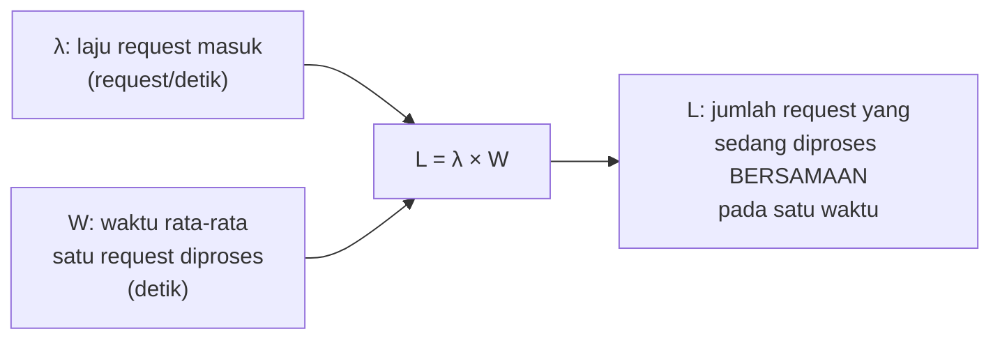

## TL;DR

[[../40 Databases/Tuning the Connection Pool|Tuning the Connection Pool]] sudah memakai Little's Law untuk menghitung ukuran connection pool yang tepat, tanpa menjelaskan hukum ini secara umum. Note ini mengisi itu: Little's Law adalah hasil matematis dari teori antrean yang menyatakan $L = \lambda \times W$ — jumlah rata-rata item dalam sebuah sistem ($L$) sama dengan laju kedatangan item baru ($\lambda$) dikalikan rata-rata waktu setiap item berada dalam sistem ($W$). Hukum ini berlaku **universal** untuk sistem antrean apa pun yang stabil (tidak terus bertambah tanpa batas) — bukan hanya connection pool, tapi juga jumlah request yang sedang diproses server, jumlah goroutine aktif, atau jumlah pelanggan di sebuah toko.

## The Problem

Sebuah tim ingin menentukan berapa banyak instance server yang dibutuhkan untuk menangani proyeksi traffic baru, tapi melakukannya dengan menebak angka berdasarkan "perasaan" — menambah server sampai terasa cukup, tanpa kerangka matematis yang menghubungkan traffic (request per detik), waktu proses per request, dan jumlah request yang bisa ditangani **bersamaan** oleh kapasitas yang ada. Pendekatan tebak-tebakan ini sering menghasilkan either over-provisioning (biaya infrastruktur berlebihan untuk kapasitas yang tidak pernah benar-benar dipakai) atau under-provisioning (sistem kewalahan begitu traffic proyeksi benar-benar terjadi) — keduanya bisa dihindari dengan perhitungan yang tepat berdasarkan Little's Law, bukan tebakan.

Masalah kedua: sebuah tim menyadari p99 latency mereka melonjak drastis di jam sibuk, dan mencoba berbagai perbaikan ad-hoc (menambah index database, menaikkan connection pool) tanpa memahami hubungan matematis antara ketiga variabel (jumlah request bersamaan, laju kedatangan, waktu proses) yang sebenarnya menjelaskan kenapa lonjakan itu terjadi secara struktural, bukan sekadar "sistem lambat" secara umum.

## Intuition

Bayangkan Little's Law seperti **hubungan matematis di sebuah restoran**: jumlah rata-rata pelanggan yang sedang berada di dalam restoran ($L$) sama dengan berapa banyak pelanggan baru yang datang per jam ($\lambda$, laju kedatangan) dikalikan berapa lama rata-rata setiap pelanggan menghabiskan waktu makan ($W$). Kalau restoran menerima 30 pelanggan per jam, dan setiap pelanggan rata-rata menghabiskan 1 jam untuk makan, maka rata-rata ada 30 pelanggan di dalam restoran pada satu waktu — angka yang bisa dihitung tanpa perlu menghitung manual berapa orang yang ada di dalam restoran setiap saat, cukup dari dua angka yang lebih mudah diukur (laju kedatangan dan waktu makan rata-rata).

Analogi ini bocor pada satu hal: hubungan ini berlaku untuk **sistem yang stabil** (jumlah pelanggan yang masuk dan keluar seimbang dalam jangka panjang). Kalau restoran menerima pelanggan lebih cepat dari kemampuannya melayani (laju kedatangan melebihi kapasitas layanan), antrean di depan restoran akan terus bertambah tanpa henti — Little's Law tidak lagi memberi gambaran "steady state" yang berguna dalam kondisi ini, karena sistemnya tidak stabil; ini justru sinyal bahwa kapasitas perlu ditambah atau laju kedatangan perlu dibatasi (rate limiting, dibahas di domain `30 APIs and Web`) sebelum sistem "meledak" secara tidak terkendali.

## How It Works

$$L = \lambda \times W$$



**Aplikasi konkret di server HTTP**: kalau sebuah server menerima 500 request per detik ($\lambda = 500$), dan setiap request rata-rata butuh 100ms untuk diproses ($W = 0.1$ detik), maka jumlah rata-rata request yang sedang diproses **bersamaan** adalah $L = 500 \times 0.1 = 50$ — angka ini secara langsung menjawab pertanyaan penting: server butuh kapasitas untuk menangani setidaknya 50 request konkuren pada kondisi rata-rata (dan lebih untuk menyerap variasi/lonjakan), baik itu berarti 50 goroutine aktif, 50 slot di worker pool, atau kapasitas setara lainnya.

**Konsekuensi langsung**: kalau $W$ (waktu proses per request) naik — misalnya karena database melambat — sementara $\lambda$ (laju request masuk) tetap sama, maka $L$ (jumlah request bersamaan) **harus** naik proporsional untuk menampung request tambahan yang "menumpuk" karena masing-masing butuh waktu lebih lama diproses. Kalau kapasitas sistem (jumlah goroutine, koneksi database, dsb.) tidak cukup menampung $L$ yang lebih besar ini, request mulai mengantre, dan waktu tunggu dalam antrean itu sendiri menambah latency yang dirasakan pengguna — sebuah efek domino yang menjelaskan kenapa satu komponen yang melambat (database) bisa memicu lonjakan latency di seluruh sistem, bukan hanya pada operasi yang langsung menyentuh komponen itu.

## Under The Hood

Little's Law secara matematis **tidak bergantung** pada distribusi statistik laju kedatangan atau waktu layanan — ia berlaku untuk distribusi apa pun (Poisson, deterministik, atau pola lain), selama sistemnya dalam keadaan stabil (steady state) dalam jangka waktu pengukuran. Ini yang membuatnya sangat berguna sebagai alat estimasi cepat — tidak perlu model statistik rumit untuk memakainya, cukup dua angka yang relatif mudah diukur ($\lambda$ dan $W$) dari sistem yang sudah berjalan atau dari load testing.

Hukum ini juga menjelaskan secara formal kenapa menambah **konkurensi** (lebih banyak goroutine, lebih banyak instance) adalah cara mengatasi $\lambda$ yang tinggi, sementara mengurangi **$W$** (mengoptimasi kode, query, atau infrastruktur agar lebih cepat) adalah cara lain mencapai $L$ yang sama dengan kapasitas lebih sedikit — dua strategi berbeda untuk masalah yang sama, dan Little's Law memberi kerangka untuk menghitung secara eksplisit trade-off antara keduanya alih-alih menebak mana yang "terasa" lebih baik.

## In Go

```go
package capacity

import "time"

// EstimasiKonkurensiDibutuhkan menghitung L dari λ dan W terukur —
// dipakai sebagai TITIK AWAL keputusan kapasitas (ukuran worker pool,
// jumlah instance), bukan angka final tanpa margin pengaman.
func EstimasiKonkurensiDibutuhkan(requestPerDetik float64, rataRataWaktuProses time.Duration) float64 {
	return requestPerDetik * rataRataWaktuProses.Seconds()
}

func contohPerencanaanKapasitas() {
	// Terukur dari observability nyata (bukan tebakan):
	// 500 request/detik, rata-rata waktu proses 100ms.
	L := EstimasiKonkurensiDibutuhkan(500, 100*time.Millisecond)
	// L = 50 — sistem butuh kapasitas menangani ~50 request konkuren
	// pada kondisi RATA-RATA; kapasitas sesungguhnya harus diset dengan
	// margin di atas ini untuk menyerap variasi/lonjakan traffic.
	_ = L
}
```

## In His Stack

Little's Law adalah kerangka yang sama yang sudah dipakai untuk menghitung ukuran connection pool database (lihat [[../40 Databases/Tuning the Connection Pool|Tuning the Connection Pool]]) — tapi berlaku sama persis untuk menghitung jumlah worker pool yang dibutuhkan (lihat [[Worker Pools]]), berapa banyak instance/pod Kubernetes yang dibutuhkan untuk menangani proyeksi traffic, atau berapa kapasitas rate limiter yang wajar untuk API yang melayani partner eksternal — satu rumus matematis yang sama, dipakai berulang di banyak keputusan kapasitas berbeda sepanjang stack backend.

## Trade-offs and When Not To Use It

Little's Law memberi estimasi **rata-rata** (steady state) — ia tidak secara langsung menangkap variasi/lonjakan traffic yang terjadi dalam periode singkat (misalnya lonjakan traffic mendadak selama beberapa menit di jam tertentu). Untuk perencanaan kapasitas yang harus menyerap lonjakan semacam ini, angka dari Little's Law perlu dikombinasikan dengan margin pengaman berdasarkan data historis lonjakan nyata (dibahas lebih lanjut di [[Capacity Planning]]), bukan dipakai sebagai angka final tanpa penyesuaian. Hukum ini juga mengasumsikan sistem dalam keadaan **stabil** — untuk sistem yang sedang mengalami degradasi berkelanjutan (laju kedatangan terus melebihi kapasitas layanan, antrean terus bertambah tanpa batas), Little's Law tidak memberi gambaran steady state yang berguna, karena sistemnya secara definisi tidak dalam kondisi stabil.

## Common Mistakes

> [!warning] Jebakan
> Menentukan kapasitas sistem (ukuran pool, jumlah instance) berdasarkan tebakan atau "perasaan aman", tanpa memakai Little's Law untuk menghubungkan laju request, waktu proses, dan kapasitas yang benar-benar dibutuhkan.

> [!warning] Jebakan
> Memakai angka dari Little's Law sebagai kapasitas final tanpa margin pengaman untuk variasi/lonjakan traffic — angka ini adalah estimasi rata-rata (steady state), bukan angka yang sudah memperhitungkan puncak beban.

> [!warning] Jebakan
> Mengukur $\lambda$ (laju request) berdasarkan traffic HTTP, padahal laju yang relevan untuk komponen tertentu (misalnya database) bisa jauh lebih tinggi kalau ada N+1 query atau pola akses lain yang memicu banyak operasi internal per satu request eksternal.

## Exercises

1. Jelaskan rumus Little's Law dan bagaimana ia menghubungkan laju kedatangan, waktu layanan, dan jumlah item dalam sistem.
2. Kenapa Little's Law berlaku terlepas dari distribusi statistik laju kedatangan atau waktu layanan?
3. Kenapa Little's Law tidak secara langsung menangkap kebutuhan menyerap lonjakan traffic jangka pendek?
4. Desain terbuka: sebuah komponen dalam sistemmu (pemanggilan API partner eksternal) memproses 20 request per detik dengan waktu rata-rata 300ms per panggilan di kondisi normal. Selama insiden partner yang lambat, waktu rata-rata naik jadi 3 detik per panggilan, sementara laju request tetap 20 per detik (aplikasi hulu tidak tahu partner sedang lambat). Hitung berapa jumlah panggilan konkuren yang dibutuhkan pada kedua kondisi ini, dan jelaskan implikasinya terhadap kebutuhan resource (goroutine, koneksi) sistemmu selama insiden berlangsung.

> [!success]- Kunci jawaban
> **1.** Little's Law ($L = \lambda \times W$) menyatakan jumlah rata-rata item yang berada dalam sebuah sistem pada satu waktu ($L$) sama dengan laju kedatangan item baru per satuan waktu ($\lambda$) dikalikan rata-rata waktu setiap item berada dalam sistem ($W$). Ini berarti tiga variabel ini saling terhubung secara matematis — mengetahui dua di antaranya (biasanya $\lambda$ dan $W$, yang relatif mudah diukur) memberi $L$ (jumlah konkurensi yang dibutuhkan), tanpa perlu menghitung langsung berapa banyak item yang sedang "di dalam sistem" pada setiap saat.
> **4.** Kondisi normal: $L = 20 \times 0.3 = 6$ — sistem butuh sekitar 6 panggilan konkuren pada kondisi rata-rata. Selama insiden: $L = 20 \times 3 = 60$ — kebutuhan konkurensi melonjak **10 kali lipat** hanya karena waktu proses naik 10x, meski laju request masuk ($\lambda$) sama sekali tidak berubah. Implikasi: kalau sistem hulu tidak siap menangani 60 panggilan konkuren (misalnya goroutine/worker pool yang hanya dirancang untuk 6-10 konkuren pada kondisi normal), request baru akan mulai mengantre atau bahkan gagal karena kehabisan resource (goroutine, koneksi) selama insiden partner berlangsung — inilah kenapa timeout budget dan circuit breaker (dibahas di domain `30 APIs and Web`) penting: mereka mencegah $W$ yang melonjak tak terkendali (dengan memotong panggilan yang terlalu lama) alih-alih membiarkan $L$ ikut melonjak proporsional dan menghabiskan resource sistem hulu.

## Self-Check

- Apa rumus Little's Law, dan apa arti masing-masing variabelnya?
- Kenapa Little's Law berlaku universal terlepas dari distribusi statistik yang mendasarinya?
- Kenapa kenaikan waktu proses ($W$) pada laju request yang tetap bisa memicu lonjakan kebutuhan konkurensi?
- Kenapa angka dari Little's Law butuh margin pengaman untuk perencanaan kapasitas nyata?

## Connected Notes

- [[../40 Databases/Tuning the Connection Pool|Tuning the Connection Pool]] — aplikasi konkret Little's Law yang sudah dibahas lebih dulu untuk menghitung ukuran connection pool database.
- [[Latency Percentiles (p50, p95, p99)]] — $W$ dalam Little's Law idealnya diukur memakai persentil yang representatif, bukan sekadar rata-rata yang bisa menyesatkan.
- [[Worker Pools]] — jumlah worker yang tepat adalah salah satu keputusan kapasitas yang bisa dihitung langsung memakai Little's Law.
- [[Load Testing]] — mengukur $\lambda$ dan $W$ secara akurat di bawah kondisi simulasi adalah salah satu tujuan utama load testing, dibahas di note berikutnya.
- [[Capacity Planning]] — kelanjutan langsung: menggabungkan Little's Law dengan margin pengaman dan data historis untuk perencanaan kapasitas nyata, dibahas di note lain domain ini.

## Further Reading

- John Little, "A Proof for the Queuing Formula: L = λW" (paper akademik asli yang membuktikan hukum ini secara formal, 1961).

## Catatan Saya

*Tulis di sini satu komponen di kerjaanmu yang kapasitasnya (worker pool, koneksi, instance) ditentukan berdasarkan tebakan — coba hitung ulang memakai Little's Law kalau data laju request dan waktu proses tersedia.*
