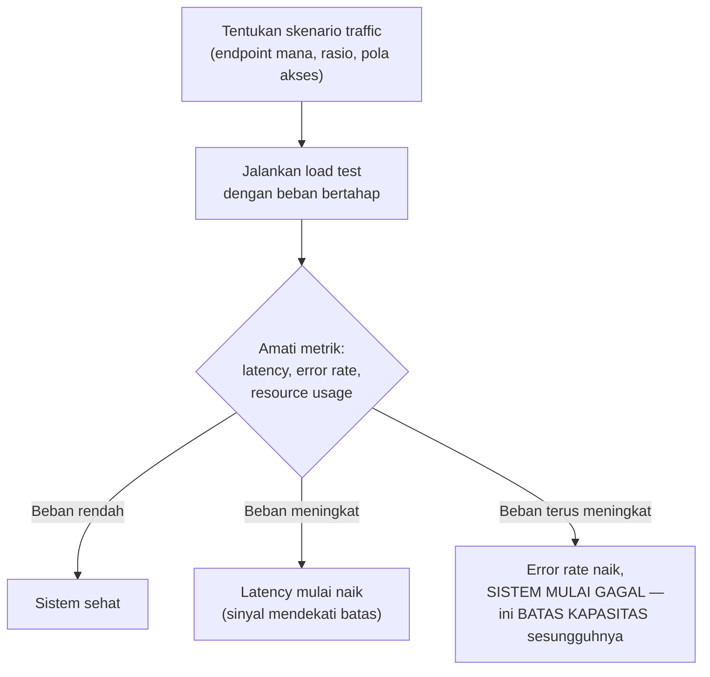

## TL;DR

[[Benchmarking in Go]] mengukur performa satu fungsi terisolasi. Load testing mengukur performa **seluruh sistem** — server, database, jaringan, semuanya bekerja bersama — di bawah beban yang mensimulasikan traffic nyata, sebelum traffic nyata itu benar-benar terjadi dan mengungkap batasan sistem dengan cara yang jauh lebih mahal (insiden production, pengguna yang kecewa). Load testing menjawab pertanyaan yang tidak bisa dijawab benchmark unit: "pada beban berapa sistem ini mulai melambat atau gagal, dan apa yang sebenarnya menjadi bottleneck-nya?"

## The Problem

Sebuah sistem pendaftaran online untuk layanan pemerintah yang biasanya menangani traffic normal dengan baik tiba-tiba down total pada hari pertama pendaftaran dibuka — ribuan warga mencoba mendaftar bersamaan di jam yang sama (pola traffic yang sangat berbeda dari hari-hari biasa), dan sistem yang tidak pernah diuji terhadap beban sebesar ini menemukan batasannya secara real-time, di hadapan pengguna yang sedang membutuhkan layanan itu. Tidak ada cara memperbaiki masalah kapasitas di tengah insiden yang sedang berlangsung dengan tenang — perbaikan yang seharusnya bisa direncanakan jauh hari sebelumnya (lewat load testing yang mensimulasikan lonjakan ini) terpaksa dilakukan secara panik sambil sistem sedang down.

Masalah kedua yang lebih halus: sebuah tim melakukan load testing tapi hanya menguji satu endpoint secara terisolasi, tanpa mensimulasikan pola traffic **realistis** (kombinasi banyak endpoint berbeda diakses bersamaan, seperti yang sebenarnya terjadi di production) — hasil load testing yang terlihat baik ini memberi rasa aman yang keliru, karena kondisi nyata (banyak endpoint bersaing memperebutkan resource yang sama, seperti connection pool database yang dipakai bersama) tidak pernah benar-benar disimulasikan.

## Intuition

Bayangkan load testing seperti **uji coba jembatan dengan beban simulasi sebelum dibuka untuk umum** — insinyur tidak menunggu ribuan kendaraan sungguhan melintas untuk tahu apakah jembatan itu kuat; mereka mensimulasikan beban maksimum yang diperkirakan (dan bahkan melebihi itu) dalam kondisi terkontrol, mengukur persis di titik beban berapa jembatan mulai menunjukkan tanda-tanda masalah. Load testing sistem software melakukan hal yang sama — mensimulasikan traffic dalam kondisi terkontrol untuk menemukan batasan sistem **sebelum** pengguna sungguhan yang menemukannya lebih dulu.

Analogi ini bocor pada satu hal: beban fisik pada jembatan relatif dapat diprediksi (berat kendaraan, jumlah kendaraan). Beban pada sistem software jauh lebih kompleks — pola akses yang berbeda (beberapa pengguna melakukan pencarian berat, beberapa hanya membaca data ringan), waktu respons yang bervariasi dari komponen eksternal (database, API partner), dan interaksi antar komponen yang tidak selalu linear — mensimulasikan beban yang **realistis** butuh usaha lebih dari sekadar "kirim banyak request bersamaan", perlu mencerminkan variasi pola akses yang sesungguhnya terjadi di production.

## How It Works



Diagram ini menunjukkan pendekatan load testing yang umum: **beban bertahap** (ramp-up), bukan langsung melempar beban maksimum — memungkinkan pengamatan titik persis di mana sistem mulai menunjukkan degradasi (latency naik) sebelum benar-benar gagal (error rate melonjak), dua sinyal berbeda yang sama-sama penting untuk dipahami.

**Jenis load testing yang relevan untuk kebutuhan berbeda**:

- **Load test** — mensimulasikan beban yang diperkirakan terjadi di kondisi normal/puncak yang wajar, memverifikasi sistem menangani beban itu dalam batas SLA yang diharapkan.
- **Stress test** — mendorong beban **melebihi** kapasitas yang diperkirakan, untuk menemukan **titik patah** sistem dan memahami bagaimana sistem gagal (gagal dengan anggun, mengembalikan error yang jelas — atau gagal secara kacau, crash total tanpa peringatan).
- **Soak test** — menjalankan beban sedang dalam durasi **lama** (jam, bahkan hari), untuk menemukan masalah yang hanya muncul seiring waktu (memory leak, goroutine leak, dibahas di [[Goroutine Leaks]]) yang tidak akan terlihat dalam load test singkat.

## Under The Hood

**Menentukan pola traffic yang realistis** adalah bagian tersulit dan paling sering diabaikan dari load testing — traffic production nyata jarang berupa satu jenis request diulang identik; ia adalah campuran (misalnya 70% baca ringan, 20% baca berat/pencarian, 10% tulis) yang masing-masing punya karakteristik beban berbeda pada komponen sistem yang berbeda pula. Load test yang hanya mensimulasikan satu jenis request (biasanya yang paling sederhana untuk diuji) memberi hasil yang tidak representatif terhadap kondisi nyata yang jauh lebih kompleks.

**Mengamati bottleneck, bukan hanya hasil akhir**, adalah nilai sesungguhnya load testing — saat sistem mulai menunjukkan degradasi di bawah beban, pertanyaan penting bukan hanya "pada beban berapa sistem gagal", tapi "**komponen mana** yang menjadi bottleneck pertama" (CPU aplikasi? Connection pool database? Memori? Rate limit API partner?) — jawaban ini menentukan mana yang harus dioptimasi atau diskalakan lebih dulu, informasi yang hanya bisa didapat dengan memantau metrik **setiap** komponen (bukan hanya latency endpoint) selama load test berjalan.

## In Go

Load testing sistem secara keseluruhan biasanya dilakukan dengan tool eksternal (k6, Vegeta, Locust), bukan ditulis manual sebagai kode Go aplikasi — tapi memahami bagaimana tool ini bekerja, dan menyiapkan aplikasi agar mudah diuji, tetap relevan:

```go
package main

import (
	"fmt"
	"net/http"
	_ "net/http/pprof" // aktifkan pprof SELAMA load test untuk profiling langsung
)

// Aplikasi yang akan di-load-test sebaiknya SUDAH mengekspos endpoint
// health check dan metrik (lihat domain 70 Infrastructure and Delivery)
// SEBELUM load test dimulai — tanpa observability yang memadai, load
// test hanya memberi tahu "sistem gagal" tanpa menjelaskan KENAPA.
func main() {
	http.HandleFunc("/healthz", func(w http.ResponseWriter, r *http.Request) {
		w.WriteHeader(http.StatusOK)
	})
	go http.ListenAndServe("localhost:6060", nil) // pprof terpisah

	fmt.Println("aplikasi siap di-load-test")
	http.ListenAndServe(":8080", nil)
}
```

```bash
# Contoh menjalankan load test dengan Vegeta (salah satu tool CLI populer),
# mensimulasikan 100 request per detik selama 30 detik.
echo "GET http://localhost:8080/api/permohonan" | vegeta attack -rate=100 -duration=30s | vegeta report
```

## In His Stack

Untuk sistem yang melayani pendaftaran/layanan publik dengan periode traffic yang bisa melonjak drastis (pembukaan pendaftaran, tenggat pengumpulan dokumen), load testing yang mensimulasikan lonjakan ini **sebelum** hari sesungguhnya adalah investasi yang jauh lebih murah dibanding insiden production yang terjadi di hadapan warga yang sedang membutuhkan layanan — terutama untuk sistem pemerintah di mana downtime bisa berdampak pada kepercayaan publik, bukan sekadar kerugian bisnis biasa.

## Trade-offs and When Not To Use It

Load testing yang realistis butuh investasi waktu dan sumber daya nyata — menyiapkan skenario traffic yang representatif, lingkungan testing yang cukup mirip production (idealnya bukan production itu sendiri, untuk menghindari dampak pada pengguna nyata), dan menganalisis hasilnya dengan cermat. Untuk sistem dengan traffic yang stabil dan dapat diprediksi (tidak pernah mengalami lonjakan drastis), investasi load testing yang ekstensif mungkin kurang sepadan dibanding untuk sistem dengan periode lonjakan yang jelas dan berdampak besar. Load testing terhadap **production sungguhan** (bukan lingkungan terpisah) berisiko nyata mengganggu pengguna asli yang sedang memakai sistem — kalau load testing production benar-benar diperlukan (misalnya untuk menguji kapasitas infrastruktur yang sulit direplikasi persis di staging), harus dilakukan dengan sangat hati-hati, di luar jam sibuk, dan dengan kemampuan menghentikan segera kalau terjadi dampak tak terduga.

## Common Mistakes

> [!warning] Jebakan
> Melakukan load testing hanya untuk satu endpoint terisolasi, tanpa mensimulasikan campuran traffic realistis yang sebenarnya terjadi di production — hasil yang terlihat baik memberi rasa aman yang keliru terhadap kondisi nyata yang jauh lebih kompleks.

> [!warning] Jebakan
> Hanya melihat hasil akhir (berhasil/gagal pada beban tertentu) tanpa memantau metrik setiap komponen selama load test berjalan — kehilangan informasi penting soal komponen mana yang sebenarnya menjadi bottleneck pertama.

> [!warning] Jebakan
> Menjalankan load test langsung terhadap production tanpa perencanaan matang dan kemampuan menghentikan segera — berisiko mengganggu pengguna nyata yang sedang memakai sistem pada saat yang sama.

## Exercises

1. Jelaskan perbedaan load test, stress test, dan soak test — pertanyaan apa yang masing-masing jawab?
2. Kenapa mensimulasikan campuran traffic realistis lebih penting dibanding menguji satu endpoint terisolasi?
3. Kenapa memantau metrik setiap komponen (bukan hanya hasil akhir) penting selama load test berjalan?
4. Desain terbuka: sistem pendaftaranmu memperkirakan lonjakan traffic 20x lipat dari normal pada hari pembukaan pendaftaran baru, dengan campuran traffic yang diperkirakan 60% cek status, 30% submit dokumen baru, 10% unduh berkas. Rancang skenario load testing untuk memvalidasi kesiapan sistem menghadapi hari itu, termasuk jenis load testing apa yang kamu pilih (load/stress/soak) dan metrik apa yang paling penting dipantau.

> [!success]- Kunci jawaban
> **1.** Load test mensimulasikan beban yang **diperkirakan** terjadi (normal atau puncak wajar), memverifikasi sistem menangani beban itu sesuai SLA. Stress test mendorong beban **melebihi** perkiraan untuk menemukan titik patah sistem dan memahami cara sistem gagal. Soak test menjalankan beban sedang dalam **durasi lama**, menemukan masalah yang hanya muncul seiring waktu (kebocoran memori/goroutine) yang tidak akan terlihat dalam pengujian singkat.
> **4.** Skenario yang tepat: kombinasikan **load test** pada 20x traffic normal dengan campuran 60/30/10 sesuai proporsi yang diperkirakan (bukan menguji ketiganya terpisah dengan proporsi sama rata) untuk memverifikasi sistem menangani beban puncak yang diperkirakan; tambahkan **stress test** yang mendorong melebihi 20x (misalnya sampai 30-40x) untuk memahami titik patah sesungguhnya dan memberi margin pengaman kalau lonjakan nyata ternyata melebihi perkiraan; pertimbangkan **soak test** singkat (beberapa jam pada beban puncak) kalau periode pendaftaran diperkirakan berlangsung berjam-jam, bukan hanya lonjakan sesaat. Metrik paling penting untuk dipantau: latency p95/p99 per jenis endpoint (karena ketiganya punya karakteristik beban berbeda pada komponen berbeda — submit dokumen kemungkinan lebih berat ke database dan storage dibanding cek status), error rate, penggunaan connection pool database (kandidat kuat jadi bottleneck pertama untuk submit dokumen bervolume tinggi), dan jumlah goroutine aktif (mendeteksi potensi leak yang baru muncul di bawah beban tinggi berkepanjangan).

## Self-Check

- Apa perbedaan load test, stress test, dan soak test?
- Kenapa campuran traffic realistis penting untuk load testing yang bermakna?
- Kenapa memantau metrik setiap komponen (bukan hanya hasil akhir) penting?
- Kenapa load testing langsung terhadap production butuh kehati-hatian ekstra?

## Connected Notes

- [[Little's Law]] — hasil load testing (laju request, waktu proses) adalah input nyata untuk perhitungan Little's Law dalam perencanaan kapasitas.
- [[Benchmarking in Go]] — benchmark mengukur fungsi individual; load testing mengukur sistem keseluruhan, keduanya saling melengkapi di level yang berbeda.
- [[Capacity Planning]] — hasil load testing adalah data utama yang dipakai untuk perencanaan kapasitas yang dibahas di note berikutnya.
- [[Goroutine Leaks]] — soak test adalah cara paling efektif menemukan goroutine leak yang hanya termanifestasi setelah durasi panjang.
- [[../30 APIs and Web/Rate Limiting Algorithms|Rate Limiting Algorithms]] — hasil load testing sering menjadi dasar menentukan angka rate limit yang tepat untuk melindungi sistem dari beban berlebihan.

## Further Reading

- Dokumentasi resmi tool load testing populer (k6.io, Vegeta) sebagai referensi konkret alat yang bisa dipakai langsung.

## Catatan Saya

*Tulis di sini apakah sistem kerjaanmu pernah menghadapi lonjakan traffic besar (pembukaan pendaftaran, tenggat) — dan apakah sudah pernah diuji lewat load testing sebelumnya.*
