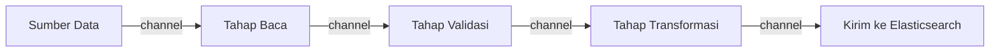

## TL;DR

Sebuah proses pengolahan data sering terdiri dari beberapa tahap berurutan — baca data mentah, validasi, transformasi, simpan hasil. Pipeline concurrency di Go merangkai tahap-tahap ini sebagai **rangkaian goroutine yang dihubungkan channel**, masing-masing tahap menerima dari channel input dan mengirim ke channel output, membentuk aliran data yang mengalir dari satu tahap ke tahap berikutnya. Keuntungannya bukan cuma soal paralelisme mentah (meski tahap-tahap berbeda memang bisa berjalan bersamaan untuk **item** yang berbeda) — pipeline memberi struktur yang jelas untuk memecah proses kompleks menjadi unit-unit kecil yang masing-masing mudah dipahami dan diuji secara terpisah.

## The Problem

Sebuah proses ETL (extract, transform, load) untuk sinkronisasi data ke Elasticsearch (lihat [[../40 Databases/Keeping Search in Sync with the Source of Truth|Keeping Search in Sync with the Source of Truth]]) ditulis sebagai satu fungsi besar: baca baris dari database, validasi, transformasi ke format Elasticsearch, kirim ke Elasticsearch — semuanya dalam satu loop sekuensial per baris. Kode ini bekerja tapi setiap baris harus menyelesaikan **seluruh** keempat langkah sebelum baris berikutnya mulai diproses sama sekali — kalau langkah "kirim ke Elasticsearch" (I/O jaringan, relatif lambat) sedang menunggu, langkah "baca dari database" (yang sebenarnya bisa dilakukan bersamaan untuk baris berikutnya) ikut menunggu tanpa alasan struktural yang memaksanya demikian.

Masalah kedua yang lebih mendasar untuk keterbacaan kode: fungsi tunggal yang menggabungkan keempat langkah ini menjadi sulit diuji secara terpisah (menguji logika transformasi berarti juga harus menyiapkan koneksi database dan Elasticsearch, meski logika transformasi itu sendiri murni memanipulasi data di memori) dan sulit dipahami sebagai satu kesatuan — pembaca kode harus menahan seluruh empat langkah sekaligus di kepala untuk memahami alurnya, alih-alih bisa memahami satu tahap sederhana pada satu waktu.

## Intuition

Bayangkan pipeline seperti **jalur produksi pabrik dengan stasiun kerja berurutan** — satu stasiun memasang komponen A, stasiun berikutnya memasang komponen B, stasiun berikutnya lagi melakukan quality check, masing-masing bekerja pada **item yang berbeda** secara bersamaan (stasiun A sedang mengerjakan item ke-5 sementara stasiun B sedang mengerjakan item ke-4 yang baru saja lewat dari stasiun A). Barang mengalir dari satu stasiun ke stasiun berikutnya lewat ban berjalan (channel), dan setiap stasiun hanya perlu tahu cara mengerjakan tugasnya sendiri, tidak perlu tahu detail stasiun lain.

Analogi ini bocor pada satu hal: ban berjalan pabrik fisik biasanya bergerak dengan kecepatan tetap yang seragam untuk semua stasiun. Channel yang menghubungkan tahap pipeline Go **tidak** memaksakan kecepatan seragam — tahap yang lebih lambat secara alami membuat tahap sebelumnya menunggu (kalau channel penghubungnya unbuffered atau buffer-nya penuh, dibahas di [[Buffered vs Unbuffered Channels]]), menciptakan backpressure yang mengalir mundur sepanjang pipeline — properti yang justru diinginkan, bukan cacat, karena mencegah tahap awal memproduksi data jauh lebih cepat dari yang bisa dikonsumsi tahap-tahap berikutnya.

## How It Works

```go
package main

import (
	"context"
	"fmt"
)

type BarisMentah struct{ ID int; Data string }
type BarisValid struct{ ID int; Data string }
type DokumenES struct{ ID int; Payload string }

// Setiap TAHAP menerima dari SATU channel input, mengirim ke SATU
// channel output — bisa diuji, dipahami, dan diganti secara terpisah.

func TahapBaca(ctx context.Context, sumber []BarisMentah) <-chan BarisMentah {
	keluaran := make(chan BarisMentah)
	go func() {
		defer close(keluaran)
		for _, b := range sumber {
			select {
			case keluaran <- b:
			case <-ctx.Done():
				return
			}
		}
	}()
	return keluaran
}

func TahapValidasi(ctx context.Context, masukan <-chan BarisMentah) <-chan BarisValid {
	keluaran := make(chan BarisValid)
	go func() {
		defer close(keluaran)
		for b := range masukan {
			if b.Data == "" {
				continue // baris tidak valid, dilewati, TIDAK diteruskan
			}
			select {
			case keluaran <- BarisValid{ID: b.ID, Data: b.Data}:
			case <-ctx.Done():
				return
			}
		}
	}()
	return keluaran
}

func TahapTransformasi(ctx context.Context, masukan <-chan BarisValid) <-chan DokumenES {
	keluaran := make(chan DokumenES)
	go func() {
		defer close(keluaran)
		for b := range masukan {
			doc := DokumenES{ID: b.ID, Payload: fmt.Sprintf("{\"id\":%d,\"data\":%q}", b.ID, b.Data)}
			select {
			case keluaran <- doc:
			case <-ctx.Done():
				return
			}
		}
	}()
	return keluaran
}

// JalankanPipeline MERANGKAI ketiga tahap — output satu tahap menjadi
// input tahap berikutnya, membentuk aliran data lengkap.
func JalankanPipeline(ctx context.Context, sumber []BarisMentah) {
	tahap1 := TahapBaca(ctx, sumber)
	tahap2 := TahapValidasi(ctx, tahap1)
	tahap3 := TahapTransformasi(ctx, tahap2)

	for doc := range tahap3 {
		fmt.Println("kirim ke Elasticsearch:", doc.Payload)
	}
}
```



Diagram ini menunjukkan struktur linear pipeline — setiap panah adalah channel, setiap kotak adalah goroutine yang berjalan independen, memproses item-item yang berbeda secara bersamaan begitu data mulai mengalir.

## Under The Hood

**Pembatalan (cancellation) harus mengalir konsisten ke seluruh tahap** — pipeline yang panjang dengan banyak tahap, kalau satu tahap di tengah berhenti (karena error atau pembatalan) tapi tahap-tahap lain tidak diberi tahu, bisa menyebabkan **goroutine leak**: tahap sebelum yang berhenti terus mencoba mengirim ke channel yang tidak pernah lagi dibaca (macet selamanya kalau channel unbuffered atau buffer penuh), dan tahap setelah yang berhenti menunggu channel yang tidak akan pernah menerima data baru. Pola yang benar (ditunjukkan di kode atas) menyertakan `select` dengan `ctx.Done()` di **setiap** tahap yang mengirim ke channel, memastikan setiap tahap bisa berhenti dengan bersih begitu pembatalan diminta, tidak peduli di tahap mana pembatalan itu berasal.

**Setiap tahap harus menutup channel output-nya** setelah selesai (biasanya lewat `defer close(keluaran)`) — ini yang memungkinkan tahap berikutnya berhenti secara alami lewat `range` atas channel begitu tahap sebelumnya benar-benar selesai, tanpa perlu mekanisme "selesai" terpisah di luar channel itu sendiri.

## In Go

Pipeline juga sering dikombinasikan dengan fan-out pada tahap tertentu yang butuh paralelisme lebih (misalnya tahap transformasi yang CPU-intensive):

```go
package main

// TahapTransformasiParalel menunjukkan KOMBINASI pipeline dengan
// fan-out/fan-in (lihat Fan-In Fan-Out) — beberapa goroutine transformasi
// berjalan paralel, hasilnya digabung kembali jadi satu channel keluaran.
func TahapTransformasiParalel(ctx context.Context, masukan <-chan BarisValid, jumlahWorker int) <-chan DokumenES {
	keluaran := make(chan DokumenES)
	var wg sync.WaitGroup

	for w := 0; w < jumlahWorker; w++ {
		wg.Add(1)
		go func() {
			defer wg.Done()
			for b := range masukan {
				doc := DokumenES{ID: b.ID, Payload: fmt.Sprintf("{\"id\":%d}", b.ID)}
				select {
				case keluaran <- doc:
				case <-ctx.Done():
					return
				}
			}
		}()
	}

	go func() {
		wg.Wait()
		close(keluaran)
	}()

	return keluaran
}
```

## In His Stack

Pipeline adalah struktur alami untuk kebutuhan ETL/sinkronisasi data yang relevan langsung dengan konteks kerja (menyalin data dari MariaDB ke Elasticsearch, atau memproses batch dokumen dari sistem legacy ke format baru) — memecah proses jadi tahap-tahap kecil yang terhubung channel membuat setiap tahap bisa diuji terpisah, diganti implementasinya (misalnya mengganti tujuan dari Elasticsearch ke sistem lain) tanpa menyentuh tahap lain, dan diberi paralelisme tambahan hanya pada tahap yang benar-benar butuh (biasanya tahap I/O atau komputasi berat), bukan seluruh pipeline sekaligus.

## Trade-offs and When Not To Use It

Pipeline menambah overhead nyata — setiap tahap adalah goroutine terpisah dengan channel yang menghubungkannya, dan untuk proses sederhana dengan sedikit data atau sedikit tahap, overhead ini (goroutine tambahan, komunikasi lewat channel) bisa melebihi manfaatnya dibanding fungsi sekuensial biasa yang jauh lebih sederhana ditulis dan di-debug. Pipeline paling bernilai untuk proses dengan **volume data besar** dan tahap-tahap yang **cukup independen** untuk diuntungkan dari berjalan bersamaan pada item berbeda — untuk proses yang volumenya kecil atau tahapnya sangat saling bergantung ketat, kompleksitas tambahan pipeline jarang sepadan.

## Common Mistakes

> [!warning] Jebakan
> Tidak menyertakan `select` dengan `ctx.Done()` di setiap tahap yang mengirim ke channel — satu tahap yang berhenti karena pembatalan bisa membuat tahap lain macet selamanya menunggu channel yang tidak akan pernah lagi menerima atau mengirim data.

> [!warning] Jebakan
> Lupa menutup channel output di setiap tahap setelah selesai — tahap berikutnya yang melakukan `range` atas channel itu tidak akan pernah tahu kapan harus berhenti, menunggu data baru yang tidak akan pernah datang.

> [!warning] Jebakan
> Membangun pipeline dengan banyak tahap untuk proses sederhana dengan volume data kecil — menambah kompleksitas kode dan overhead goroutine/channel tanpa manfaat nyata dibanding fungsi sekuensial biasa.

## Exercises

1. Jelaskan kenapa tahap-tahap pipeline bisa memproses item yang berbeda secara bersamaan, meski setiap tahap sendiri memproses item satu per satu secara berurutan.
2. Kenapa setiap tahap pipeline harus menyertakan pemeriksaan pembatalan context di titik pengiriman ke channel?
3. Apa yang terjadi kalau sebuah tahap pipeline lupa menutup channel output-nya?
4. Desain terbuka: pipeline ETL-mu punya tiga tahap (baca dari database, validasi, kirim ke Elasticsearch), dan kamu menyadari tahap "kirim ke Elasticsearch" jauh lebih lambat dibanding dua tahap lainnya (I/O jaringan vs operasi di memori), menjadi bottleneck yang membuat seluruh pipeline berjalan selambat tahap terlambat itu. Rancang perubahan pada pipeline ini untuk mengurangi dampak bottleneck tersebut, tanpa mengubah logika masing-masing tahap secara fundamental.

> [!success]- Kunci jawaban
> **1.** Setiap tahap adalah goroutine yang berjalan independen, terhubung lewat channel. Begitu tahap pertama selesai memproses item pertama dan mengirimkannya ke channel, ia langsung bisa mulai memproses item **kedua** tanpa menunggu tahap kedua selesai memproses item pertama — tahap kedua mengambil item pertama dari channel dan memprosesnya secara paralel dengan tahap pertama yang sudah bekerja pada item kedua. Ini seperti jalur produksi pabrik: banyak item berada di tahap berbeda secara bersamaan, meski setiap stasiun sendiri hanya mengerjakan satu item pada satu waktu.
> **4.** Terapkan fan-out khusus pada tahap "kirim ke Elasticsearch" — alih-alih satu goroutine tunggal untuk tahap ini, luncurkan beberapa goroutine (worker pool, lihat [[Worker Pools]]) yang semuanya membaca dari channel yang sama (keluaran tahap validasi) dan mengirim ke Elasticsearch secara paralel. Ini memungkinkan beberapa dokumen dikirim ke Elasticsearch bersamaan alih-alih satu per satu berurutan, mengurangi dampak lambatnya I/O jaringan pada throughput keseluruhan pipeline — jumlah goroutine paralel untuk tahap ini disesuaikan dengan kapasitas Elasticsearch menerima request bersamaan (mirip pertimbangan jumlah worker untuk pekerjaan I/O-bound yang dibahas di [[Worker Pools]]), bukan sekadar angka besar sembarangan.

## Self-Check

- Kenapa pipeline memungkinkan beberapa item diproses di tahap berbeda secara bersamaan?
- Kenapa setiap tahap perlu memeriksa pembatalan context saat mengirim ke channel?
- Apa yang terjadi kalau sebuah tahap tidak menutup channel output-nya?
- Kapan pipeline adalah struktur yang berlebihan untuk sebuah proses?

## Connected Notes

- [[Fan-In Fan-Out]] — pipeline sering mengombinasikan fan-out pada tahap tertentu yang butuh paralelisme tambahan, seperti ditunjukkan di note ini.
- [[Buffered vs Unbuffered Channels]] — pilihan buffer pada channel penghubung antar tahap menentukan seberapa banyak backpressure yang bisa diserap sebelum tahap sebelumnya ikut menunggu.
- [[Worker Pools]] — pola worker pool adalah cara konkret menambah paralelisme pada satu tahap pipeline tertentu.
- [[Context for Cancellation and Deadlines]] — pembatalan yang konsisten di setiap tahap pipeline bertumpu penuh pada mekanisme context yang dijelaskan di note itu.
- [[../40 Databases/Keeping Search in Sync with the Source of Truth|Keeping Search in Sync with the Source of Truth]] — kebutuhan sinkronisasi data ke Elasticsearch yang menjadi motivasi konkret pipeline di "The Problem".

## Further Reading

- Go blog resmi, "Go Concurrency Patterns: Pipelines and cancellation" — rujukan utama pola pipeline di Go, ditulis oleh tim inti Go.

## Catatan Saya

*Tulis di sini proses ETL/sinkronisasi data di kerjaanmu yang saat ini ditulis sebagai satu fungsi besar sekuensial — apakah memecahnya jadi pipeline akan membantu.*
