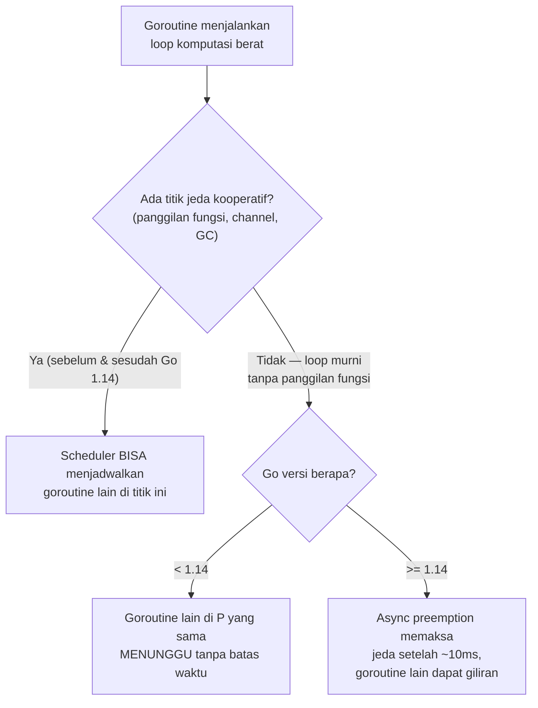

## TL;DR

[[Goroutine Scheduler (GMP)]] menjelaskan bagaimana banyak goroutine berbagi segelintir P — tapi itu memunculkan pertanyaan: apa yang memaksa sebuah goroutine **berhenti** menjalankan gilirannya dan memberi kesempatan goroutine lain di antrean yang sama? Sebelum Go 1.14, jawabannya terbatas pada **cooperative preemption** — goroutine hanya "menyerahkan" gilirannya di titik-titik tertentu (panggilan fungsi, operasi channel, alokasi memori), sehingga goroutine yang menjalankan loop komputasi murni tanpa titik-titik itu bisa memblokir goroutine lain di P yang sama tanpa batas. Sejak Go 1.14, **asynchronous preemption** memberi runtime kemampuan menghentikan paksa goroutine yang berjalan terlalu lama, bahkan di tengah loop tanpa panggilan fungsi sama sekali — perbaikan mendasar yang menutup celah nyata dalam keadilan penjadwalan.

## The Problem

Sebuah fungsi menjalankan komputasi matematis berat dalam loop murni tanpa panggilan fungsi apa pun di dalamnya (`for i := 0; i < angkaSangatBesar; i++ { hasil += hitungSesuatu(i) }`, di mana `hitungSesuatu` di-inline compiler sehingga tidak benar-benar menjadi "panggilan fungsi" dalam pengertian yang relevan untuk preemption) — sebelum Go 1.14, goroutine ini bisa **memonopoli** P tempatnya berjalan selama loop itu berlangsung, karena tidak ada titik "jeda kooperatif" yang memberi kesempatan scheduler menjadwalkan goroutine lain di P yang sama. Goroutine lain yang seharusnya independen (misalnya goroutine yang menangani request HTTP lain) bisa mengalami latency yang tidak terduga tinggi, bukan karena mereka sendiri lambat, tapi karena mereka tidak pernah mendapat giliran dijadwalkan selama goroutine "rakus" itu berjalan.

Ini adalah kelas bug performa yang sangat sulit didiagnosis sebelum memahami preemption — gejalanya adalah latency tinggi yang tidak konsisten dan sulit direproduksi, karena bergantung pada kapan tepatnya goroutine komputasi berat itu kebetulan berjalan bersamaan dengan goroutine lain yang butuh giliran.

## Intuition

Bayangkan cooperative preemption seperti **sistem antrean kamar mandi umum yang mengandalkan kesadaran diri** — setiap orang diharapkan keluar secara sukarela setelah waktu wajar, memberi giliran ke orang berikutnya yang menunggu. Sistem ini bekerja baik selama semua orang punya kesadaran yang sama untuk keluar tepat waktu — tapi satu orang yang benar-benar tidak sadar diri (atau tidak tahu ada yang menunggu) bisa terus berada di dalam tanpa batas, karena tidak ada mekanisme **paksa** yang mengeluarkannya. Asynchronous preemption seperti menambahkan **petugas keamanan** yang secara berkala memeriksa dan **memaksa keluar** siapa pun yang sudah terlalu lama di dalam, terlepas apakah orang itu "sadar" ada yang menunggu atau tidak.

Analogi ini bocor pada satu hal: petugas keamanan manusia butuh penilaian kapan harus turun tangan. Asynchronous preemption Go bekerja lewat mekanisme sinyal OS (mirip interrupt) yang secara berkala (kira-kira setiap 10 milidetik untuk goroutine yang berjalan terlalu lama) memeriksa apakah sebuah goroutine perlu dihentikan sementara untuk memberi giliran ke goroutine lain — mekanisme otomatis berbasis waktu, bukan penilaian kontekstual seperti manusia.

## How It Works



Diagram ini menunjukkan perbedaan krusial yang diperbaiki di Go 1.14: sebelumnya, loop tanpa titik jeda kooperatif benar-benar bisa memonopoli P tanpa batas waktu; setelahnya, runtime punya mekanisme independen untuk memaksa jeda meski goroutine itu sendiri tidak pernah "secara sukarela" berhenti.

**Titik jeda kooperatif** yang selalu ada (baik sebelum maupun sesudah Go 1.14) mencakup: pemanggilan fungsi (termasuk fungsi yang dipanggil dari goroutine itu sendiri, kecuali di-inline compiler), operasi channel (kirim/terima), operasi `select`, alokasi memori di heap, dan panggilan ke `runtime.Gosched()` secara eksplisit. Kode yang secara alami sering melewati salah satu titik ini (kebanyakan kode aplikasi normal, yang memanggil fungsi lain secara rutin) jarang mengalami masalah monopoli P bahkan di versi Go lama — masalah ini spesifik untuk loop komputasi yang benar-benar "murni" tanpa titik jeda sama sekali, kasus yang relatif jarang tapi nyata (misalnya loop numerik yang di-optimasi agresif oleh compiler).

## Under The Hood

Asynchronous preemption (Go 1.14+) diimplementasikan lewat sinyal OS (`SIGURG` di sistem mirip Unix) yang dikirim runtime ke thread (M) yang menjalankan goroutine yang sudah berjalan terlalu lama (melebihi ambang batas, sekitar 10 milidetik) tanpa mencapai titik jeda kooperatif — sinyal ini menginterupsi eksekusi goroutine itu di titik mana pun ia sedang berada, memungkinkan scheduler mengambil alih dan memberi giliran ke goroutine lain. Mekanisme ini jauh lebih rumit diimplementasikan dibanding preemption kooperatif (perlu menangani state CPU yang diinterupsi di titik sembarang dengan benar), tapi menutup celah keadilan penjadwalan yang sebelumnya bisa dieksploitasi (secara tidak sengaja) oleh kode komputasi berat.

> [!question] Perlu diverifikasi
> Klaim: ambang batas sekitar 10 milidetik dan sinyal `SIGURG` spesifik untuk mekanisme async preemption.
> Kenapa ragu: ini detail implementasi internal runtime yang didokumentasikan di proposal desain, tapi angka pastinya bisa saja disesuaikan di rilis-rilis berikutnya.
> Cara verifikasi: proposal desain resmi Go untuk asynchronous preemption (Go issue tracker dan design doc terkait).

## In Go

```go
package main

import (
	"fmt"
	"runtime"
	"time"
)

// SimulasiLoopBerat menunjukkan pola yang DULU (pra Go 1.14) berisiko
// memonopoli P — sekarang, async preemption memastikan goroutine lain
// tetap mendapat giliran meski loop ini tidak pernah memanggil fungsi
// atau operasi channel apa pun.
func SimulasiLoopBerat() {
	var hasil float64
	for i := 0; i < 1_000_000_000; i++ {
		hasil += float64(i) * 1.0001 // komputasi murni, tanpa panggilan fungsi
	}
	fmt.Println(hasil)
}

func main() {
	go SimulasiLoopBerat()

	// Goroutine ini SEHARUSNYA tetap mendapat giliran berkala berkat
	// async preemption, meski goroutine di atas menjalankan loop berat
	// tanpa titik jeda kooperatif eksplisit.
	go func() {
		for i := 0; i < 5; i++ {
			fmt.Println("goroutine lain tetap berjalan:", i)
			time.Sleep(100 * time.Millisecond)
		}
	}()

	time.Sleep(2 * time.Second)
	_ = runtime.NumGoroutine()
}
```

## In His Stack

Kode yang menjalankan komputasi berat murni (parsing besar, enkripsi/dekripsi manual, kompresi data) di dalam service HTTP yang juga melayani request lain adalah kandidat yang relevan untuk dipahami dalam konteks preemption — meski async preemption di Go modern sudah jauh mengurangi risiko monopoli P, memisahkan pekerjaan komputasi sangat berat ke worker pool terpisah (lihat [[Worker Pools]]) dengan jumlah goroutine yang disesuaikan `GOMAXPROCS` tetap praktik yang lebih baik daripada mengandalkan sepenuhnya pada mekanisme preemption runtime untuk menjaga keadilan penjadwalan request lain.

## Trade-offs and When Not To Use It

Memahami detail preemption tidak mengubah cara menulis kode aplikasi sehari-hari untuk mayoritas kasus — kode yang wajar (memanggil fungsi lain, melakukan I/O, berinteraksi dengan channel secara rutin) hampir tidak pernah tersentuh masalah monopoli P bahkan sebelum Go 1.14. Pemahaman ini paling relevan untuk kode numerik/komputasi berat yang ditulis dengan gaya sangat teroptimasi (loop ketat tanpa panggilan fungsi apa pun) — kategori kode yang relatif jarang ditulis di aplikasi backend biasa dibanding di kode ilmiah/numerik intensif.

## Common Mistakes

> [!warning] Jebakan
> Mengasumsikan versi Go yang dipakai sudah pasti mendukung async preemption tanpa memeriksa — kode yang berjalan di lingkungan dengan versi Go yang sangat lama (pra 1.14) tetap berisiko mengalami monopoli P dari loop komputasi murni.

> [!warning] Jebakan
> Menulis loop komputasi sangat berat langsung di goroutine yang sama dengan penanganan request HTTP, mengandalkan sepenuhnya pada preemption runtime — memisahkan ke worker pool terpisah dengan kontrol jumlah goroutine tetap praktik yang lebih dapat diprediksi.

> [!warning] Jebakan
> Menyalahkan "goroutine leak" atau bug lain untuk gejala latency tinggi yang sebenarnya disebabkan monopoli P oleh goroutine komputasi berat — dua penyebab ini punya gejala yang bisa terlihat mirip tapi diagnosis dan solusinya berbeda.

## Exercises

1. Jelaskan perbedaan cooperative preemption dan asynchronous preemption di Go.
2. Sebutkan titik-titik jeda kooperatif yang membuat goroutine bisa "diselang-seling" dengan goroutine lain.
3. Kenapa loop komputasi murni tanpa panggilan fungsi menjadi kasus khusus yang relevan untuk preemption?
4. Desain terbuka: kamu menemukan bahwa layanan Go-mu yang menjalankan enkripsi data besar (loop komputasi berat) di goroutine yang sama dengan penanganan request HTTP menyebabkan latency request lain melonjak sesekali. Meski aplikasimu sudah berjalan di Go versi modern (dengan async preemption), jelaskan kenapa memisahkan komputasi berat ke worker pool terpisah tetap lebih baik daripada mengandalkan async preemption saja.

> [!success]- Kunci jawaban
> **1.** Cooperative preemption (selalu ada di Go) mengandalkan goroutine "secara sukarela" memberi kesempatan goroutine lain di titik-titik tertentu (panggilan fungsi, operasi channel) — kalau goroutine tidak pernah mencapai titik-titik ini, ia bisa memonopoli P tanpa batas. Asynchronous preemption (Go 1.14+) menambahkan mekanisme **paksa** lewat sinyal OS yang menginterupsi goroutine yang berjalan terlalu lama (sekitar 10ms) di titik mana pun, tidak peduli apakah goroutine itu mencapai titik jeda kooperatif atau tidak — menutup celah yang sebelumnya ada di model kooperatif murni.
> **4.** Meski async preemption mencegah monopoli P **sepenuhnya**, ia tetap mengizinkan goroutine komputasi berat berjalan sampai ~10ms sebelum dipaksa jeda — untuk enkripsi data besar yang berjalan berkali-kali per detik, akumulasi jeda-jeda kecil ini (dan overhead context-switch yang menyertainya) tetap bisa memberi kontribusi pada latency yang tidak diinginkan bagi request lain yang berbagi P yang sama. Memisahkan komputasi berat ke worker pool dengan jumlah goroutine yang disesuaikan (mendekati `GOMAXPROCS` untuk pekerjaan CPU-bound, lihat [[Worker Pools]]) memberi kontrol eksplisit dan dapat diprediksi atas berapa banyak kapasitas CPU yang dialokasikan untuk komputasi berat vs penanganan request — jauh lebih dapat diprediksi dibanding mengandalkan preemption runtime (yang meski mencegah kelaparan total, tidak menjamin distribusi kapasitas CPU yang optimal antar jenis pekerjaan yang berbeda prioritasnya).

## Self-Check

- Apa perbedaan cooperative preemption dan asynchronous preemption?
- Sebutkan titik-titik jeda kooperatif yang relevan untuk preemption.
- Kenapa loop komputasi murni tanpa panggilan fungsi adalah kasus khusus?
- Kenapa memisahkan komputasi berat ke worker pool tetap lebih baik daripada mengandalkan preemption saja?

## Connected Notes

- [[Goroutine Scheduler (GMP)]] — preemption adalah mekanisme yang menentukan kapan goroutine berpindah giliran dalam struktur GMP yang dijelaskan di note sebelumnya.
- [[Worker Pools]] — memisahkan komputasi berat ke worker pool dengan jumlah terkontrol adalah praktik yang lebih dapat diprediksi dibanding mengandalkan preemption runtime semata.
- [[Garbage Collection in Go]] — GC juga berkoordinasi dengan mekanisme jeda goroutine yang terkait dengan preemption, dibahas di note berikutnya.
- [[pprof Profiling]] — profiling CPU bisa mengungkap goroutine yang menghabiskan waktu CPU tidak proporsional, gejala yang relevan dengan masalah monopoli P.
- [[Benchmarking in Go]] — mengukur dampak nyata preemption pada latency butuh benchmark yang representatif, dibahas metodologinya di note lain domain ini.

## Further Reading

- Proposal desain resmi Go, "Non-cooperative goroutine preemption" (Go issue #24543 dan design doc terkait).

## Catatan Saya

*Tulis di sini apakah ada kode komputasi berat di kerjaanmu yang berjalan di goroutine yang sama dengan penanganan request HTTP — apakah pernah menyebabkan latency yang tidak terduga.*
