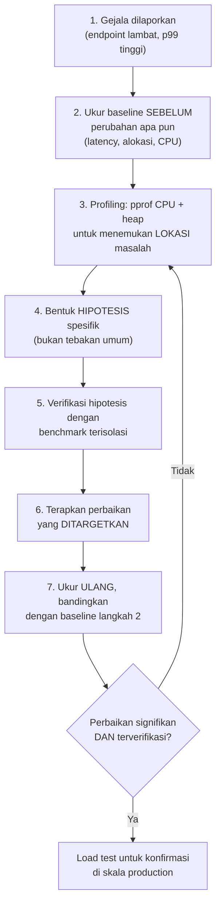

## TL;DR

Setiap note sebelumnya di domain ini membahas satu alat atau konsep secara terisolasi — pprof, benchmark, load test, escape analysis, masing-masing menjawab pertanyaan spesifik. Note penutup ini menunjukkan bagaimana semuanya dipakai **bersama**, dalam urutan yang masuk akal, untuk satu latihan optimasi performa yang utuh dari awal sampai akhir: mulai dari gejala yang dilaporkan, sampai perbaikan yang diverifikasi dengan data, bukan sekadar tebakan yang "terasa" sudah membaik.

## The Problem

Sebuah endpoint API yang menampilkan daftar permohonan dengan filter kompleks mulai menerima keluhan "terasa lambat" dari pengguna, tapi tim tidak punya metodologi jelas untuk mendiagnosis dan memperbaikinya secara sistematis — mereka mencoba beberapa perubahan berdasarkan tebakan (menambah index, mengubah beberapa query), masing-masing memakan waktu tim tapi tidak ada yang benar-benar diverifikasi dampaknya secara terukur. Tanpa metodologi yang konsisten, tim tidak tahu apakah perbaikan yang sudah dilakukan benar-benar berdampak, atau hanya kebetulan bersamaan dengan penurunan traffic sesaat yang membuat endpoint itu **terlihat** lebih cepat tanpa hubungan sebab-akibat yang jelas.

## Intuition

Bayangkan latihan profiling menyeluruh seperti **diagnosis medis yang sistematis**, dibanding menebak penyakit dari gejala permukaan lalu mencoba obat secara acak. Dokter yang baik mengikuti urutan: dengarkan gejala (laporan pengguna), lakukan pemeriksaan yang tepat untuk mempersempit kemungkinan (profiling untuk menemukan lokasi masalah), konfirmasi diagnosis dengan tes spesifik (benchmark untuk memverifikasi hipotesis), berikan pengobatan yang ditargetkan (perbaikan kode), lalu **verifikasi** hasilnya dengan pemeriksaan ulang (benchmark/load test setelah perbaikan) — bukan berhenti setelah memberi obat dan berasumsi pasien pasti sembuh.

## How It Works



Diagram ini menunjukkan siklus lengkap yang mengulang kembali ke profiling kalau perbaikan pertama tidak memberi hasil yang diharapkan — optimasi performa jarang selesai dalam satu iterasi, dan siklus yang disiplin (bukan mencoba banyak perubahan sekaligus tanpa mengukur masing-masing secara terpisah) memastikan setiap perbaikan yang diterapkan benar-benar bisa dipertanggungjawabkan dampaknya.

**Langkah 2 (baseline) adalah langkah yang paling sering dilewati** — tanpa angka "sebelum" yang jelas dan terukur dalam kondisi yang konsisten, klaim "sudah lebih cepat" setelah perubahan tidak bisa diverifikasi secara objektif, hanya berdasarkan perasaan atau anekdot.

## Under The Hood

**Kenapa urutan profiling sebelum benchmark penting**: profiling (langkah 3) pada aplikasi yang benar-benar berjalan (atau load test yang mensimulasikan kondisi nyata) menunjukkan **di mana** masalah sesungguhnya berada di antara ribuan baris kode — tanpa ini, benchmark yang ditulis berdasarkan tebakan bisa saja mengukur fungsi yang sebenarnya tidak relevan dengan masalah nyata, membuang waktu untuk mengoptimasi sesuatu yang tidak pernah menjadi bottleneck sesungguhnya. Benchmark (langkah 5) baru bernilai penuh **setelah** profiling mempersempit area yang perlu diperiksa mendalam.

**Menghubungkan berbagai jenis profil untuk gambaran lengkap**: CPU profile menunjukkan di mana waktu dihabiskan; heap profile menunjukkan di mana memori dialokasikan (yang mungkin **menyebabkan** waktu CPU tinggi secara tidak langsung, lewat tekanan GC yang meningkat, lihat [[Garbage Collection in Go]]); goroutine profile menunjukkan kalau ada goroutine yang macet atau bocor yang berkontribusi pada masalah. Masalah performa nyata seringkali adalah kombinasi dari beberapa faktor ini yang saling terkait, bukan satu penyebab tunggal yang berdiri sendiri.

## In Go

```go
package main

import (
	"fmt"
	"os"
	"runtime/pprof"
	"time"
)

// LatihanOptimasiLengkap menunjukkan STRUKTUR kode untuk latihan
// profiling menyeluruh — mengukur baseline, menjalankan dengan profiling
// aktif, dan menyediakan titik untuk membandingkan hasil setelah
// perbaikan diterapkan.
func LatihanOptimasiLengkap() error {
	// LANGKAH 2: ukur baseline SEBELUM perubahan apa pun.
	mulai := time.Now()
	jalankanEndpointSimulasi()
	baselineDurasi := time.Since(mulai)
	fmt.Printf("baseline durasi: %v\n", baselineDurasi)

	// LANGKAH 3: aktifkan CPU profiling untuk menemukan lokasi masalah.
	f, err := os.Create("cpu_sebelum.prof")
	if err != nil {
		return fmt.Errorf("buat file profil: %w", err)
	}
	defer f.Close()

	if err := pprof.StartCPUProfile(f); err != nil {
		return fmt.Errorf("mulai profiling: %w", err)
	}
	for i := 0; i < 100; i++ {
		jalankanEndpointSimulasi()
	}
	pprof.StopCPUProfile()

	fmt.Println("analisis: go tool pprof cpu_sebelum.prof")
	// Setelah analisis (langkah 3-4), hipotesis dibentuk, diverifikasi
	// lewat benchmark terisolasi (langkah 5), perbaikan diterapkan
	// (langkah 6), lalu proses ini diulang dengan nama file berbeda
	// (cpu_sesudah.prof) untuk perbandingan langsung (langkah 7).

	return nil
}

func jalankanEndpointSimulasi() {
	// simulasi logika endpoint yang sedang dianalisis
	time.Sleep(10 * time.Millisecond)
}
```

## In His Stack

Metodologi ini paling relevan justru saat menghadapi tekanan waktu — "endpoint ini lambat, perbaiki sekarang" adalah instruksi yang umum diterima, dan disiplin mengikuti urutan profiling-hipotesis-verifikasi (bukan langsung mencoba perbaikan pertama yang terpikirkan) justru **menghemat** waktu dalam skala lebih besar, karena mencegah tim menghabiskan berhari-hari mencoba perbaikan yang ternyata tidak menyentuh akar masalah sesungguhnya. Untuk koordinator teknis yang mengarahkan 10+ developer, metodologi yang konsisten ini juga memudahkan komunikasi lintas tim — "kami menemukan lewat profiling bahwa 60% waktu dihabiskan di parsing JSON" adalah klaim yang jauh lebih meyakinkan dan actionable dibanding "sepertinya endpoint ini lambat karena banyak hal".

## Trade-offs and When Not To Use It

Mengikuti metodologi lengkap ini untuk setiap masalah performa kecil adalah usaha berlebihan — untuk perbaikan yang jelas dan berisiko rendah (misalnya menambah index yang jelas-jelas hilang dari `EXPLAIN`, lihat [[../40 Databases/Reading EXPLAIN|Reading EXPLAIN]]), langsung menerapkan perbaikan dan mengamati dampaknya lebih praktis dibanding menjalankan seluruh siklus profiling formal. Metodologi penuh ini paling bernilai untuk masalah performa yang **tidak jelas** penyebabnya, atau untuk optimasi pada kode yang benar-benar kritis (hot path bervolume sangat tinggi) di mana kesalahan diagnosis bisa memakan waktu tim yang signifikan kalau diselesaikan lewat trial-and-error tanpa data.

## Common Mistakes

> [!warning] Jebakan
> Melompat langsung ke "perbaikan" tanpa mengukur baseline atau melakukan profiling terlebih dahulu — klaim "sudah lebih cepat" tidak bisa diverifikasi secara objektif tanpa data before-after yang konsisten.

> [!warning] Jebakan
> Menerapkan banyak perubahan sekaligus tanpa mengukur dampak masing-masing secara terpisah — kalau performa membaik, tidak jelas perubahan mana yang sebenarnya berkontribusi, dan kalau ada perubahan yang justru memperburuk sesuatu, sulit diidentifikasi di antara banyak perubahan yang digabung sekaligus.

> [!warning] Jebakan
> Berhenti setelah satu iterasi perbaikan tanpa mengukur ulang untuk verifikasi — asumsi bahwa perbaikan yang terlihat masuk akal secara teori pasti berhasil dalam praktik, tanpa konfirmasi data yang sebenarnya.

## Exercises

1. Jelaskan kenapa mengukur baseline sebelum melakukan perubahan apa pun adalah langkah yang tidak boleh dilewati dalam optimasi performa.
2. Kenapa profiling sebaiknya dilakukan sebelum menulis benchmark yang ditargetkan pada fungsi tertentu?
3. Kenapa menerapkan banyak perubahan sekaligus tanpa mengukur masing-masing secara terpisah bermasalah?
4. Desain terbuka: kamu menerima laporan "endpoint pencarian dokumen lambat" tanpa detail lebih lanjut. Jalankan seluruh metodologi di note ini secara naratif — jelaskan langkah demi langkah apa yang akan kamu lakukan dari menerima laporan ini sampai bisa mengonfirmasi perbaikan yang diterapkan benar-benar berdampak, sebutkan alat spesifik (pprof, benchmark, load test) yang dipakai di setiap langkah.

> [!success]- Kunci jawaban
> **1.** Tanpa baseline yang terukur dalam kondisi yang jelas dan konsisten (traffic yang sama, waktu yang sama, kondisi sistem yang sebanding), tidak ada dasar objektif untuk membandingkan "sebelum" dan "sesudah" — perbaikan yang terlihat berhasil bisa jadi kebetulan bersamaan dengan faktor lain yang berubah (traffic turun, komponen lain yang lebih cepat sesaat), bukan benar-benar disebabkan perubahan yang diterapkan. Baseline memberi titik pembanding yang solid untuk mengklaim perbaikan secara meyakinkan.
> **4.** (1) Ukur baseline latency endpoint pencarian dokumen dari metrik yang sudah ada (dashboard p50/p95/p99, lihat [[Latency Percentiles (p50, p95, p99)]]) atau, kalau belum ada, jalankan load test singkat untuk mendapat angka awal yang konsisten; (2) aktifkan CPU dan heap profiling pada endpoint ini selama traffic normal berlangsung, atau selama load test terkontrol (`go tool pprof http://host/debug/pprof/profile?seconds=30`); (3) analisis hasil profiling (`top10`, `list`) untuk menemukan fungsi yang paling banyak menghabiskan waktu/memori — misalnya ternyata dominan di fungsi yang membangun query pencarian dengan `LIKE '%kata%'` (lihat [[../40 Databases/Inverted Indexes and How Search Engines Work|Inverted Indexes and How Search Engines Work]]); (4) bentuk hipotesis spesifik: "full table scan akibat LIKE tanpa index yang tepat adalah penyebab utama"; (5) verifikasi lewat `EXPLAIN` pada query yang teridentifikasi, mengonfirmasi full table scan benar-benar terjadi; (6) terapkan perbaikan yang ditargetkan (migrasi ke full-text search index, atau minimal index yang lebih tepat); (7) ukur ulang latency endpoint yang sama dalam kondisi traffic yang sebanding dengan baseline, bandingkan angkanya secara langsung; (8) kalau perbaikan signifikan dan terverifikasi, jalankan load test untuk mengonfirmasi perbaikan ini juga bertahan di bawah beban production yang representatif, bukan hanya di kondisi pengukuran kecil.

## Self-Check

- Kenapa mengukur baseline adalah langkah pertama yang wajib sebelum optimasi apa pun?
- Kenapa profiling sebaiknya mendahului penulisan benchmark yang ditargetkan?
- Kenapa menerapkan banyak perubahan sekaligus menyulitkan verifikasi dampak masing-masing?
- Apa langkah terakhir yang mengonfirmasi perbaikan benar-benar siap untuk kondisi production?

## Connected Notes

- [[pprof Profiling]] — alat utama langkah 3 dan 7 dalam metodologi yang dijelaskan di note ini.
- [[Benchmarking in Go]] — alat verifikasi hipotesis pada langkah 5, mengukur fungsi terisolasi yang sudah dipersempit lewat profiling.
- [[Load Testing]] — konfirmasi akhir bahwa perbaikan bertahan pada skala production, langkah penutup metodologi ini.
- [[Capacity Planning]] — data dari latihan profiling menyeluruh sering menjadi input untuk perencanaan kapasitas yang lebih akurat.
- [[Latency Percentiles (p50, p95, p99)]] — metrik yang tepat untuk mengukur baseline dan hasil akhir, bukan sekadar rata-rata yang bisa menyesatkan.

## Further Reading

- Brendan Gregg, materi tentang metodologi troubleshooting performa sistem secara umum (rujukan konseptual metodologi sistematis, relevan lintas bahasa pemrograman).

## Catatan Saya

*Tulis di sini satu masalah performa nyata yang pernah kamu hadapi di kerjaan — jalankan mundur, apakah metodologi di note ini akan mengubah cara kamu mendiagnosisnya waktu itu.*
