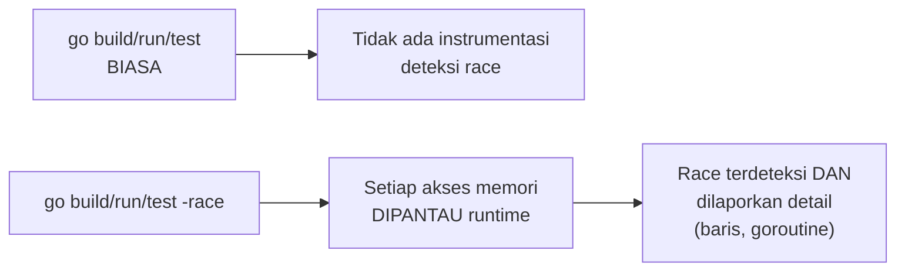

## TL;DR

Race condition terjadi ketika dua goroutine mengakses variabel yang sama secara konkuren, dan setidaknya satu di antaranya menulis, **tanpa** sinkronisasi (mutex, channel) yang mengoordinasikan akses itu. Bug ini punya sifat yang membuatnya sangat berbahaya: ia **tidak selalu muncul** — kode dengan race condition bisa lolos ratusan kali testing dan tiba-tiba menghasilkan hasil salah di percobaan ke-101, tergantung timing eksekusi goroutine yang tidak deterministik. Go menyediakan `-race` (race detector), sebuah alat yang secara instrumentasi mendeteksi akses konkuren tak tersinkronisasi ini **saat kode benar-benar dijalankan** — bukan analisis statis — menjadikannya salah satu alat paling penting untuk memvalidasi kode concurrent sebelum sampai ke production.

## The Problem

Sebuah tim menulis counter yang diakses dari banyak goroutine tanpa mutex (`counter++` langsung), dan kode ini **lolos** seluruh test suite karena test yang ada hanya menjalankan sedikit goroutine dengan beban ringan. Race condition ada secara struktural, tapi jendela waktu di mana dua goroutine benar-benar bertabrakan mengakses `counter` bersamaan sangat sempit dan jarang terjadi pada volume rendah. Begitu di-deploy ke production dengan traffic tinggi (ribuan goroutine mengakses counter yang sama per detik), tabrakan itu terjadi cukup sering untuk membuat counter secara konsisten menghitung **kurang** dari nilai yang seharusnya. Ini bug yang lolos testing lokal, lolos staging dengan traffic rendah, dan baru muncul nyata di production, jauh dari titik kode yang salah.

Masalah kedua: race condition tidak selalu bermanifestasi sebagai hasil yang salah secara halus. Kadang ia menyebabkan **crash** yang terlihat acak (misalnya `fatal error: concurrent map read and map write`, yang secara sengaja dideteksi runtime Go untuk map karena akses konkuren ke map tanpa sinkronisasi memang tidak aman secara struktural) — kegagalan yang, tanpa alat khusus, sangat sulit direproduksi secara konsisten karena bergantung pada timing yang tidak deterministik.

## Intuition

Bayangkan race condition seperti **dua orang menulis di whiteboard yang sama secara bersamaan tanpa koordinasi** — satu orang menulis "5", orang lain hampir bersamaan menghapus dan menulis "7" di posisi yang sama. Tergantung timing persis siapa menulis duluan dan siapa yang "melihat" whiteboard di titik mana, hasil akhirnya bisa "5", "7", atau bahkan campuran aneh dari keduanya (kalau tulisan tumpang tindih di tengah proses menulis). Hasilnya tidak konsisten dan bergantung pada kebetulan waktu, bukan logika program yang ditulis.

Analogi ini bocor pada satu hal: dua orang menulis di whiteboard yang tumpang tindih biasanya langsung terlihat kacau secara visual, jelas ada masalah. Race condition di kode **tidak terlihat** dari luar. Programnya tetap "berjalan", tidak crash, hanya menghasilkan nilai yang salah secara diam-diam, atau kadang benar dan kadang salah tergantung timing yang kebetulan terjadi saat itu. Inilah yang membuatnya salah satu kelas bug paling berbahaya, karena tidak ada sinyal jelas bahwa sesuatu sedang salah sampai seseorang secara spesifik mencurigainya dan memverifikasi dengan alat yang tepat.

## How It Works

```go
package main

import "fmt"

var counter int

func main() {
	done := make(chan bool)

	for i := 0; i < 1000; i++ {
		go func() {
			counter++ // RACE CONDITION: dibaca dan ditulis banyak
			          // goroutine tanpa sinkronisasi sama sekali
			done <- true
		}()
	}

	for i := 0; i < 1000; i++ {
		<-done
	}

	fmt.Println("counter:", counter) // SERINGKALI kurang dari 1000
}
```

Menjalankan kode ini dengan `go run -race main.go` akan melaporkan race condition secara eksplisit, menunjukkan **baris kode persis** mana yang terlibat konflik (baik baris yang membaca maupun yang menulis) dan goroutine mana yang terlibat — informasi yang jauh lebih berguna dibanding sekadar melihat hasil akhir yang salah tanpa tahu penyebabnya.



Diagram ini menunjukkan bahwa `-race` bukan sekadar flag opsional kosmetik — ia mengaktifkan **instrumentasi** tambahan yang memantau setiap akses memori selama eksekusi, memungkinkan deteksi race condition secara langsung berdasarkan apa yang benar-benar terjadi saat kode dijalankan, bukan analisis kode secara statis yang bisa melewatkan kondisi yang hanya muncul di runtime.

## Under The Hood

Race detector Go bekerja berdasarkan algoritma **happens-before** (konsep yang sama yang mendasari [[The Go Memory Model]]). Ia melacak setiap akses baca/tulis ke memori beserta goroutine mana yang melakukannya, dan mendeteksi kapan dua akses ke lokasi memori yang sama terjadi **tanpa** hubungan happens-before yang jelas di antara keduanya (tidak ada mutex, channel, atau mekanisme sinkronisasi lain yang menjamin salah satu terjadi sebelum yang lain). Ini kenapa race detector bisa mendeteksi race condition bahkan pada eksekusi yang **kebetulan** menghasilkan hasil yang benar — ia tidak menunggu hasil salah muncul, ia mendeteksi **potensi** konflik akses berdasarkan pola akses memori itu sendiri.

**Race detector menambah overhead signifikan** — biasanya memperlambat eksekusi 2-10x dan meningkatkan penggunaan memori beberapa kali lipat, karena setiap akses memori butuh pencatatan tambahan untuk analisis happens-before. Ini kenapa `-race` dipakai untuk **testing dan CI**, bukan untuk build production — overhead-nya terlalu besar untuk beban kerja production sungguhan, tapi sepenuhnya bisa diterima untuk menjalankan test suite yang tujuannya memang mendeteksi bug, bukan melayani traffic nyata.

> [!question] Perlu diverifikasi
> Klaim: race detector memperlambat eksekusi 2-10x.
> Kenapa ragu: angka overhead ini bisa bervariasi tergantung karakteristik kode yang diuji (seberapa banyak akses memori konkuren yang terjadi); rentang yang disebutkan adalah perkiraan umum, bukan angka pasti untuk semua kasus.
> Cara verifikasi: dokumentasi resmi Go mengenai race detector, atau mengukur langsung perbedaan waktu eksekusi test suite dengan dan tanpa `-race` pada kode yang relevan.

## In Go

```go
package main

import (
	"fmt"
	"sync"
)

var counterAman int
var mu sync.Mutex

func main() {
	var wg sync.WaitGroup

	for i := 0; i < 1000; i++ {
		wg.Add(1)
		go func() {
			defer wg.Done()
			mu.Lock()
			counterAman++ // DILINDUNGI mutex — race detector TIDAK
			              // akan melaporkan apa pun di sini
			mu.Unlock()
		}()
	}

	wg.Wait()
	fmt.Println("counter:", counterAman) // SELALU 1000
}
```

```bash
# Menjalankan test suite dengan race detector aktif — praktik standar
# yang seharusnya jadi bagian rutin CI, bukan hanya dijalankan sesekali.
go test -race ./...

# Build binary dengan instrumentasi race detector, untuk debugging manual
# terhadap kondisi yang sulit direproduksi tanpa beban production sungguhan.
go build -race -o app-debug ./cmd/server
```

## In His Stack

Menjalankan `go test -race ./...` sebagai bagian wajib pipeline CI (bukan hanya `go test` biasa) adalah salah satu langkah termurah dan paling bernilai untuk menangkap bug concurrency sebelum sampai production — untuk tim dengan 10+ developer yang menulis kode Go dengan tingkat pengalaman berbeda-beda, race detector menjadi jaring pengaman otomatis yang tidak bergantung pada setiap developer secara manual mengingat aturan sinkronisasi yang benar setiap saat. Ini relevan khususnya untuk kode yang menangani banyak request bersamaan (server HTTP, worker pool untuk job batch) — persis kode yang paling sering ditulis dalam konteks kerja ini.

## Trade-offs and When Not To Use It

Race detector menambah overhead yang membuatnya tidak cocok dipakai di build production — kode yang di-deploy ke production harus di-build **tanpa** flag `-race`, hanya dipakai selama fase testing dan development. Race detector juga hanya mendeteksi race condition yang **benar-benar terjadi** selama eksekusi yang diuji. Kalau jalur kode tertentu yang punya race condition tidak pernah dieksekusi selama testing (karena kondisi tertentu tidak pernah terpenuhi dalam skenario test yang ada), race detector tidak akan melaporkan apa pun meski bug-nya tetap ada. Alat ini bukan jaminan mutlak "tidak ada race condition sama sekali", hanya "tidak ada race condition yang terdeteksi dalam skenario yang diuji" — cakupan testing yang baik tetap penting untuk memaksimalkan efektivitasnya.

## Common Mistakes

> [!warning] Jebakan
> Hanya menjalankan `go test` biasa di CI tanpa flag `-race` — race condition yang lolos testing biasa (karena timing yang kebetulan tidak bertabrakan) tidak akan pernah terdeteksi tanpa instrumentasi race detector.

> [!warning] Jebakan
> Men-deploy binary yang di-build dengan flag `-race` ke production — overhead performanya (2-10x lebih lambat, memori jauh lebih besar) membuatnya sama sekali tidak cocok untuk melayani traffic nyata.

> [!warning] Jebakan
> Menganggap "lolos race detector" berarti kode benar-benar bebas race condition selamanya — race detector hanya mendeteksi konflik yang benar-benar teramati selama eksekusi test yang dijalankan; jalur kode yang tidak tercakup test tetap bisa menyembunyikan race condition yang belum pernah terdeteksi.

## Exercises

1. Jelaskan kenapa race condition bisa lolos testing berkali-kali dan baru muncul di production dengan traffic tinggi.
2. Bagaimana race detector mendeteksi race condition, secara prinsip (happens-before)?
3. Kenapa race detector tidak cocok dipakai untuk build production?
4. Desain terbuka: tim CI-mu saat ini hanya menjalankan `go test ./...` biasa, dan kamu ingin mengusulkan penambahan `-race`. Sebutkan satu argumen konkret yang bisa kamu sampaikan ke tim untuk meyakinkan investasi ini sepadan (mengingat overhead waktu CI yang bertambah), dan jelaskan bagaimana kamu akan menjawab kekhawatiran bahwa ini akan memperlambat pipeline CI secara signifikan.

> [!success]- Kunci jawaban
> **1.** Race condition bergantung pada **timing** eksekusi goroutine yang tidak deterministik — dua goroutine harus benar-benar mengakses variabel yang sama pada jendela waktu yang cukup sempit untuk terjadi konflik. Pada volume rendah (testing lokal, sedikit goroutine), jendela waktu ini jarang terjadi secara kebetulan, sehingga kode "terlihat" bekerja benar. Pada volume tinggi (production, ribuan goroutine mengakses data yang sama), peluang dua goroutine bertabrakan pada jendela waktu itu meningkat drastis (mirip prinsip di balik "birthday paradox" yang juga disinggung di [[../40 Databases/Deadlocks|Deadlocks]]), membuat bug yang secara struktural selalu ada akhirnya benar-benar termanifestasi secara konsisten.
> **4.** Argumen konkret: bug race condition yang lolos ke production jauh lebih mahal diperbaiki (downtime, data yang salah/hilang, waktu debugging yang sulit karena bug tidak reproducible) dibanding beberapa menit tambahan waktu CI — trade-off yang hampir selalu menguntungkan investasi `-race` meski memperlambat pipeline. Untuk menjawab kekhawatiran soal waktu CI: `-race` tidak harus dijalankan di **setiap** commit kalau itu benar-benar menjadi bottleneck — bisa dijalankan di pipeline terpisah (misalnya nightly build, atau khusus pada pull request menuju branch utama, bukan setiap push ke branch fitur), memberi jaring pengaman tanpa menambah waktu tunggu di setiap iterasi development sehari-hari.

## Self-Check

- Kenapa race condition sulit terdeteksi lewat testing manual biasa?
- Bagaimana race detector Go mendeteksi race condition, secara prinsip?
- Kenapa race detector tidak boleh dipakai di build production?
- Apa yang TIDAK dijamin oleh "lolos race detector"?

## Connected Notes

- [[The Sync Package]] — mutex dan primitif sinkronisasi lain adalah cara mencegah race condition yang dideteksi race detector, dijelaskan di note sebelumnya.
- [[The Go Memory Model]] — konsep happens-before yang mendasari cara kerja race detector dibahas formal di note berikutnya.
- [[Goroutines]] — race condition adalah salah satu risiko paling mendasar dari concurrency berbasis goroutine yang dijelaskan fondasinya di note itu.
- [[Pipelines]] — pipeline dengan banyak goroutine yang saling terhubung adalah kandidat yang wajib diuji dengan race detector, karena kompleksitas sinkronisasinya lebih tinggi dari kode sekuensial biasa.
- [[Benchmarking in Go]] — perbedaan penting antara mengukur performa (benchmark, tanpa `-race`) dan memvalidasi kebenaran concurrency (`-race`, dengan overhead) dibahas lebih jauh di note itu.

## Further Reading

- Dokumentasi resmi Go, "Data Race Detector" (go.dev/doc/articles/race_detector).

## Catatan Saya

*Tulis di sini apakah pipeline CI di kerjaanmu sudah menjalankan `go test -race` — dan kalau belum, rencanakan kapan bisa mengusulkannya.*
