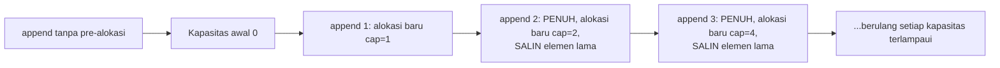

## TL;DR

[[Garbage Collection in Go]] menjelaskan bahwa laju alokasi heap secara langsung memengaruhi seberapa sering dan seberapa berat GC harus bekerja. Note ini mengumpulkan teknik konkret mengurangi alokasi yang tidak perlu — bukan sebagai daftar "trik micro-optimization" untuk dipakai serampangan di semua tempat, tapi sebagai perkakas yang dipakai **setelah** profiling (lihat [[pprof Profiling]]) menunjukkan sebuah fungsi hot path benar-benar mengalokasikan berlebihan. Pola paling umum: pre-alokasi slice dengan kapasitas yang sudah diketahui, menghindari konversi string-byte bolak-balik yang tidak perlu, dan menggunakan pointer/value secara sadar berdasarkan pemahaman escape analysis.

## The Problem

Sebuah fungsi yang memproses ribuan baris data per request membangun slice hasil dengan `append` berulang tanpa pre-alokasi kapasitas (`var hasil []Item` lalu `hasil = append(hasil, item)` di dalam loop) — pola yang terlihat wajar, tapi setiap kali slice mencapai kapasitas maksimalnya, Go harus mengalokasikan array baru yang lebih besar (biasanya dua kali lipat) dan **menyalin seluruh isi lama** ke lokasi baru. Untuk slice yang tumbuh dari nol sampai ribuan elemen, ini berarti puluhan alokasi dan penyalinan berulang, ketika sebenarnya jumlah elemen akhir sudah bisa diperkirakan (atau bahkan diketahui persis) sebelum loop dimulai.

Masalah kedua: sebuah fungsi yang memproses request HTTP berulang kali mengonversi `[]byte` (body request) ke `string` dan sebaliknya untuk berbagai keperluan (`string(bodyBytes)`, lalu `[]byte(stringHasil)` lagi nanti) — setiap konversi ini **menyalin** seluruh data, karena string di Go bersifat immutable dan tidak bisa berbagi memori langsung dengan `[]byte` yang mutable. Untuk payload besar yang diproses berkali-kali, konversi bolak-balik yang tidak perlu ini menjadi sumber alokasi dan penyalinan yang signifikan, sesuatu yang mudah dihindari kalau kode ditulis sadar akan biaya konversi ini sejak awal.

## Intuition

Bayangkan pre-alokasi slice seperti **menyiapkan kotak berukuran pas sebelum mulai mengemas barang**, dibanding mengemas ke kotak kecil dan terus-menerus memindahkan seluruh isi ke kotak yang lebih besar setiap kali kotak lama penuh. Kalau kamu tahu (atau bisa memperkirakan) akan mengemas seratus barang, menyiapkan kotak berkapasitas seratus dari awal jauh lebih efisien dibanding memulai dengan kotak kecil dan berulang kali memindahkan seluruh isi setiap kali kotak itu penuh — proses "pindah kotak" berulang ini persis apa yang terjadi saat slice Go tumbuh melebihi kapasitasnya tanpa pre-alokasi.

Analogi ini bocor pada satu hal: memindahkan barang fisik ke kotak lebih besar butuh usaha manual yang jelas terlihat. Pertumbuhan slice Go terjadi **transparan** di balik satu baris `append` — tidak ada tanda visual bahwa sebuah alokasi dan penyalinan besar baru saja terjadi, membuatnya mudah tidak disadari sampai profiling secara eksplisit menunjukkan biaya tersembunyi ini.

## How It Works

```go
package main

// TIDAK OPTIMAL: slice tumbuh dari kapasitas 0, memicu beberapa kali
// realokasi + penyalinan seiring bertambahnya elemen.
func BangunHasilTanpaPreAlokasi(jumlah int) []int {
	var hasil []int
	for i := 0; i < jumlah; i++ {
		hasil = append(hasil, i)
	}
	return hasil
}

// OPTIMAL: kapasitas akhir SUDAH DIKETAHUI sebelum loop dimulai —
// make() dengan kapasitas eksplisit menghindari realokasi SAMA SEKALI,
// karena array yang mendasari slice sudah cukup besar sejak awal.
func BangunHasilDenganPreAlokasi(jumlah int) []int {
	hasil := make([]int, 0, jumlah) // len=0, cap=jumlah
	for i := 0; i < jumlah; i++ {
		hasil = append(hasil, i)
	}
	return hasil
}
```



Diagram ini menunjukkan pola pertumbuhan slice tanpa pre-alokasi — setiap kali kapasitas terlampaui, alokasi baru (biasanya dua kali lipat kapasitas lama) dan penyalinan seluruh elemen yang sudah ada terjadi, sebuah biaya kumulatif yang sepenuhnya dihindari kalau kapasitas akhir sudah diketahui di awal.

## Under The Hood

**Konversi `string` ↔ `[]byte`** selalu menyalin data secara penuh karena keduanya punya properti mutability yang berbeda (string immutable, byte slice mutable) — compiler Go **tidak bisa** membiarkan keduanya berbagi memori yang sama, karena itu akan melanggar jaminan immutability string (seseorang bisa mengubah `[]byte` dan diam-diam mengubah isi string yang "seharusnya" immutable). Pengecualian kecil: konversi `[]byte(s)` yang **hanya** dipakai sebagai argumen langsung ke fungsi tanpa disimpan ke variabel (misalnya `someFunc([]byte(s))` di beberapa kasus tertentu) bisa dioptimasi compiler untuk menghindari alokasi/salinan — tapi ini optimasi kompiler spesifik yang tidak boleh diandalkan secara umum tanpa verifikasi lewat benchmark.

**`strings.Builder`** dan **`bytes.Buffer`** menghindari alokasi berulang untuk penggabungan string/byte bertahap dengan cara yang mirip pre-alokasi slice — keduanya menyimpan buffer internal yang tumbuh secara terkontrol (dan bisa di-pre-alokasi lewat `Grow(n)` kalau ukuran akhir sudah diperkirakan), jauh lebih efisien dibanding operator `+=` berulang pada string (yang, karena string immutable, membuat **string baru sepenuhnya** setiap kali digabung, bukan menambah ke string yang sudah ada).

## In Go

```go
package processing

import "strings"

// BuatLaporanTanpaOptimasi menggabungkan ribuan baris teks dengan +=
// berulang — SETIAP iterasi membuat string BARU sepenuhnya (karena
// string immutable), menyalin seluruh isi sebelumnya plus tambahan baru.
func BuatLaporanTanpaOptimasi(baris []string) string {
	var laporan string
	for _, b := range baris {
		laporan += b + "\n"
	}
	return laporan
}

// BuatLaporanDenganBuilder memakai strings.Builder dengan Grow() —
// pre-alokasi kapasitas berdasarkan ESTIMASI ukuran akhir, menghindari
// realokasi buffer internal berulang kali.
func BuatLaporanDenganBuilder(baris []string) string {
	var sb strings.Builder
	// Estimasi kapasitas: rata-rata panjang baris + newline, dikali jumlah baris.
	sb.Grow(len(baris) * 50)

	for _, b := range baris {
		sb.WriteString(b)
		sb.WriteByte('\n')
	}
	return sb.String()
}
```

## In His Stack

Untuk endpoint yang memproses dan mengembalikan daftar data dalam jumlah besar (laporan, hasil pencarian dengan banyak baris), kebiasaan pre-alokasi slice hasil berdasarkan `COUNT(*)` query atau estimasi ukuran yang wajar adalah optimasi kecil dengan biaya penerapan yang rendah tapi manfaat nyata untuk endpoint bervolume tinggi — terutama relevan untuk laporan yang diakses berulang kali oleh banyak petugas di berbagai instansi sepanjang hari.

## Trade-offs and When Not To Use It

Mengoptimalkan alokasi untuk kode yang jarang dipanggil atau memproses data dalam jumlah kecil adalah usaha yang tidak sepadan — kompleksitas tambahan (menghitung estimasi kapasitas, misalnya) untuk manfaat yang tidak akan pernah terasa dalam praktik. Pre-alokasi dengan estimasi yang **terlalu besar** juga punya biaya sendiri — memori yang dialokasikan tapi tidak dipakai tetap memakan ruang sampai slice/buffer itu sendiri dilepas, sehingga estimasi yang jauh melebihi kebutuhan nyata bisa memboroskan memori tanpa manfaat performa yang sepadan. Aturan yang sama berulang di seluruh domain ini: optimasi alokasi paling bernilai untuk kode yang **terverifikasi** hot path lewat profiling, bukan diterapkan secara membabi buta di seluruh kode berdasarkan asumsi "lebih sedikit alokasi selalu lebih baik".

## Common Mistakes

> [!warning] Jebakan
> Membangun slice dengan `append` berulang tanpa pre-alokasi kapasitas, padahal ukuran akhir sudah diketahui atau bisa diperkirakan sebelum loop dimulai — memicu realokasi dan penyalinan berulang yang sepenuhnya bisa dihindari.

> [!warning] Jebakan
> Menggabungkan string dengan operator `+=` berulang dalam loop, alih-alih `strings.Builder` — setiap iterasi membuat string baru sepenuhnya karena immutability, jauh lebih mahal dibanding menulis ke buffer yang bisa tumbuh terkontrol.

> [!warning] Jebakan
> Mengoptimalkan alokasi di kode yang jarang dipanggil atau memproses data kecil, tanpa verifikasi lewat profiling bahwa kode itu benar-benar hot path — usaha optimasi yang tidak memberi manfaat nyata, hanya menambah kompleksitas kode.

## Exercises

1. Jelaskan kenapa pre-alokasi slice dengan kapasitas yang diketahui menghindari realokasi dan penyalinan berulang.
2. Kenapa konversi `string` ke `[]byte` (dan sebaliknya) selalu menyalin data, tidak bisa berbagi memori?
3. Kenapa `strings.Builder` lebih efisien dibanding operator `+=` untuk menggabungkan string dalam loop?
4. Desain terbuka: fungsi laporanmu memproses hasil query database (jumlah baris tidak diketahui pasti sebelumnya, tapi biasanya antara seribu sampai sepuluh ribu baris) dan membangun slice DTO untuk response API. Rancang strategi pre-alokasi yang wajar untuk kasus ini, dengan mempertimbangkan bahwa jumlah baris pasti tidak diketahui sebelum query selesai dijalankan sepenuhnya.

> [!success]- Kunci jawaban
> **1.** Slice Go disimpan sebagai array yang mendasarinya (underlying array) dengan kapasitas tetap — begitu jumlah elemen (`len`) mencapai kapasitas (`cap`), `append` berikutnya harus mengalokasikan array baru yang lebih besar dan menyalin seluruh elemen lama ke array baru itu sebelum menambahkan elemen baru. Kalau kapasitas akhir sudah dialokasikan sejak awal (`make([]T, 0, kapasitasAkhir)`), seluruh operasi `append` berikutnya cukup menambah elemen ke array yang sudah cukup besar, tanpa pernah perlu realokasi atau penyalinan sama sekali.
> **4.** Karena jumlah baris pasti tidak diketahui sebelum query selesai, dua pendekatan wajar: (a) kalau database mendukung `COUNT(*)` yang murah dijalankan terpisah sebelum query utama (atau tersedia dari total hasil paginasi), jalankan itu dulu untuk mendapat estimasi kapasitas yang akurat; (b) kalau `COUNT` terpisah dianggap terlalu mahal (query tambahan yang menambah latency), pre-alokasi dengan **estimasi wajar** berdasarkan pengalaman historis (misalnya rata-rata jumlah baris untuk laporan sejenis, katakanlah 5000 sebagai titik tengah dari rentang seribu sampai sepuluh ribu) — estimasi yang meleset tetap jauh lebih baik daripada tidak pre-alokasi sama sekali, karena `append` yang melebihi kapasitas awal tetap akan melakukan realokasi seperti biasa (hanya lebih jarang terjadi dibanding mulai dari kapasitas nol), sementara estimasi yang mendekati tetap menghindari mayoritas realokasi yang seharusnya terjadi.

## Self-Check

- Kenapa pre-alokasi slice menghindari realokasi berulang?
- Kenapa konversi string ke []byte selalu menyalin data?
- Kenapa strings.Builder lebih efisien dibanding operator += dalam loop?
- Kapan optimasi alokasi tidak sepadan dilakukan?

## Connected Notes

- [[Garbage Collection in Go]] — mengurangi alokasi secara langsung mengurangi tekanan pada GC, menghubungkan kedua topik ini secara langsung.
- [[Escape Analysis]] — memahami kapan value escape ke heap adalah prasyarat memahami di mana alokasi sebenarnya terjadi.
- [[Benchmarking in Go]] — alat verifikasi utama untuk mengonfirmasi teknik pengurangan alokasi di note ini benar-benar berdampak secara terukur.
- [[sync.Pool]] — teknik lain mengurangi alokasi berulang dengan mendaur ulang objek, dibahas di note berikutnya.
- [[pprof Profiling]] — heap profile adalah cara mengidentifikasi fungsi mana yang benar-benar butuh optimasi alokasi, sebelum menerapkan teknik di note ini.

## Further Reading

- Dave Cheney, "Slices from the ground up" dan artikel terkait performa slice Go.

## Catatan Saya

*Tulis di sini fungsi di kerjaanmu yang membangun slice besar tanpa pre-alokasi — apakah ukurannya bisa diperkirakan sebelum loop dimulai.*
