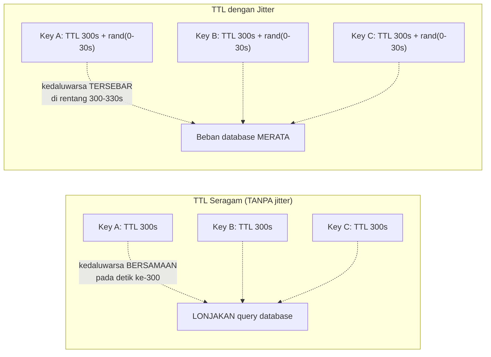

## TL;DR

TTL (Time To Live) menentukan berapa lama sebuah entri cache dianggap valid sebelum otomatis kedaluwarsa — mekanisme sederhana yang sudah disinggung di [[Cache Invalidation Strategies]]. Masalah yang sering tidak disadari: kalau **banyak** entri cache diisi pada waktu yang hampir bersamaan (misalnya saat aplikasi baru di-deploy, atau saat proses warming cache berjalan) dengan TTL yang **identik**, seluruh entri itu akan kedaluwarsa hampir **bersamaan** pula — memicu lonjakan tiba-tiba permintaan ke database persis di momen yang sama, sebuah pola yang berkontribusi pada cache stampede. **Jitter** — menambahkan variasi acak kecil ke TTL — menyebarkan waktu kedaluwarsa itu, mencegah seluruh cache "jatuh" secara bersamaan.

## The Problem

Sebuah aplikasi baru saja di-deploy ulang (atau cache-nya di-flush total karena maintenance), dan proses warming cache mengisi ribuan entri hampir bersamaan, semuanya dengan TTL yang sama persis (misalnya 5 menit). Lima menit kemudian, **seluruh** ribuan entri itu kedaluwarsa dalam rentang waktu yang sangat sempit — setiap request yang mencoba mengakses salah satu dari ribuan key itu mengalami cache miss hampir bersamaan, memicu lonjakan mendadak query ke database yang persis meniru pola cache stampede, meski penyebabnya bukan satu key populer, melainkan **banyak** key yang kebetulan kedaluwarsa serentak karena TTL yang seragam.

Masalah ini sering tidak disadari sampai terjadi berulang secara periodik — pola "lonjakan database setiap lima menit tepat" adalah gejala klasik TTL yang seragam tanpa jitter, dan bisa sangat membingungkan didiagnosis kalau tim tidak menyadari korelasinya dengan siklus TTL cache.

## Intuition

Bayangkan TTL tanpa jitter seperti **seluruh karyawan kantor yang jam istirahatnya diatur mulai persis pukul 12:00 tanpa variasi** — begitu jam 12:00 tiba, semua orang bersamaan menuju kantin, menciptakan antrean panjang dan tekanan besar pada dapur kantin di momen yang sangat sempit, meski total orang yang makan siang sepanjang hari sebenarnya sama. Jitter seperti **menyebar jam istirahat** — sebagian mulai pukul 11:45, sebagian 12:00, sebagian 12:15 — total orang yang makan siang tetap sama, tapi tekanan pada dapur kantin tersebar merata sepanjang periode itu, bukan menumpuk di satu titik.

Analogi ini bocor pada satu hal: jam istirahat kantor diatur eksplisit oleh kebijakan perusahaan. Jitter pada TTL cache diterapkan secara **acak** (biasanya lewat penambahan durasi acak kecil ke TTL dasar) — tidak ada koordinasi terpusat yang "mengatur" kapan setiap entri kedaluwarsa secara spesifik, hanya distribusi acak yang secara statistik menyebarkan titik-titik kedaluwarsa itu, bukan penjadwalan yang presisi.

## How It Works



```go
package cache

import (
	"math/rand"
	"time"
)

// TTLDenganJitter menambahkan variasi acak ke TTL dasar, mencegah
// banyak entri kedaluwarsa persis bersamaan.
func TTLDenganJitter(ttlDasar time.Duration, jitterMaks time.Duration) time.Duration {
	jitter := time.Duration(rand.Int63n(int64(jitterMaks)))
	return ttlDasar + jitter
}

func contohPenggunaan() {
	// TTL dasar 5 menit, jitter acak 0-30 detik — setiap entri
	// kedaluwarsa di suatu titik antara 5:00 dan 5:30, TERSEBAR,
	// bukan tepat di 5:00 untuk semua entri.
	ttl := TTLDenganJitter(5*time.Minute, 30*time.Second)
	_ = ttl
}
```

## Under The Hood

**Besaran jitter yang tepat** biasanya sebuah persentase kecil dari TTL dasar (misalnya 5-10%) — cukup untuk menyebarkan waktu kedaluwarsa secara berarti tanpa membuat TTL efektif jadi terlalu bervariasi dari yang direncanakan. Jitter yang terlalu besar (misalnya rentang jitter sama besar dengan TTL dasarnya) membuat sebagian entri kedaluwarsa jauh lebih cepat dari yang diharapkan, sementara jitter yang terlalu kecil tidak cukup menyebarkan lonjakan yang ingin dihindari.

**Jitter juga relevan di luar TTL cache** — pola yang sama (menambah variasi acak untuk mencegah banyak hal terjadi bersamaan) dipakai luas dalam retry dengan backoff (dibahas di domain `30 APIs and Web`, resilience patterns): tanpa jitter, banyak client yang gagal bersamaan (misalnya karena partner API down sesaat) akan mencoba retry pada waktu yang **sama** persis, menciptakan lonjakan permintaan baru yang justru memperburuk kondisi partner yang sedang pulih — jitter pada retry menyebarkan percobaan ulang itu, mencegah "thundering herd" versi retry.

## In Go

```go
package cache

import (
	"context"
	"fmt"
	"math/rand"
	"time"
)

// SimpanDenganTTLJitter menunjukkan penerapan jitter saat WARMING cache
// dalam jumlah besar sekaligus — skenario paling rentan terhadap
// masalah "seluruh cache kedaluwarsa bersamaan" tanpa jitter.
func SimpanDenganTTLJitter(ctx context.Context, entries map[string]string) error {
	const ttlDasar = 5 * time.Minute
	const jitterMaks = 30 * time.Second

	for key, value := range entries {
		jitter := time.Duration(rand.Int63n(int64(jitterMaks)))
		ttlAkhir := ttlDasar + jitter

		if err := simpanKeRedisDenganTTL(ctx, key, value, ttlAkhir); err != nil {
			return fmt.Errorf("simpan cache %s: %w", key, err)
		}
	}
	return nil
}

func simpanKeRedisDenganTTL(ctx context.Context, key, value string, ttl time.Duration) error {
	return nil
}
```

## In His Stack

Proses warming cache setelah deployment atau maintenance terjadwal (yang sering terjadi di malam hari untuk sistem pemerintah, menghindari jam kerja) adalah momen paling rentan terhadap masalah TTL seragam — banyak entri diisi hampir bersamaan sebagai bagian dari proses startup, dan tanpa jitter, seluruh entri itu berpotensi kedaluwarsa bersamaan di jam kerja berikutnya, menciptakan lonjakan database yang bisa disalahartikan sebagai masalah lain kalau tim tidak menyadari korelasinya dengan siklus TTL.

## Trade-offs and When Not To Use It

Jitter menambah sedikit variasi yang membuat waktu kedaluwarsa entri cache menjadi kurang presisi — untuk kasus yang butuh TTL yang sangat tepat (jarang terjadi dalam praktik), jitter mungkin dianggap mengganggu. Untuk sistem dengan jumlah entri cache yang sangat kecil (bukan ribuan entri yang di-warm bersamaan), risiko lonjakan dari TTL seragam jauh lebih kecil, dan jitter memberi manfaat yang tidak terlalu signifikan — jitter paling bernilai justru untuk sistem dengan volume entri cache besar yang cenderung diisi dalam batch (warming cache, deployment) daripada diisi satu per satu secara alami tersebar seiring waktu.

## Common Mistakes

> [!warning] Jebakan
> Mengisi banyak entri cache sekaligus (warming cache) dengan TTL yang identik tanpa jitter — seluruh entri kedaluwarsa hampir bersamaan, memicu lonjakan permintaan ke database yang berulang secara periodik mengikuti siklus TTL.

> [!warning] Jebakan
> Menetapkan besaran jitter yang terlalu besar relatif terhadap TTL dasar — sebagian entri kedaluwarsa jauh lebih cepat dari yang diharapkan, mengurangi manfaat cache secara tidak proporsional.

> [!warning] Jebakan
> Tidak menerapkan jitter pada mekanisme retry, hanya pada TTL cache — thundering herd bisa terjadi pada retry yang tidak di-jitter dengan cara yang persis sama seperti cache yang kedaluwarsa bersamaan.

## Exercises

1. Jelaskan kenapa TTL yang seragam untuk banyak entri cache bisa memicu lonjakan permintaan database secara periodik.
2. Bagaimana jitter menyelesaikan masalah ini, dan berapa besaran jitter yang umum dipakai relatif terhadap TTL dasar?
3. Sebutkan satu konteks di luar cache TTL di mana jitter juga relevan diterapkan.
4. Desain terbuka: sistemmu melakukan warming cache untuk 50.000 entri sekaligus setiap kali aplikasi baru di-deploy (yang terjadi beberapa kali per minggu). Rancang strategi TTL dan jitter untuk skenario ini, dan jelaskan bagaimana kamu akan memverifikasi bahwa lonjakan database periodik akibat TTL seragam benar-benar teratasi setelah menerapkan jitter.

> [!success]- Kunci jawaban
> **1.** Kalau banyak entri diisi pada waktu yang hampir bersamaan dengan TTL yang identik (misalnya semua 5 menit), maka seluruh entri itu akan mencapai waktu kedaluwarsanya pada titik waktu yang hampir sama pula (5 menit setelah pengisian) — cache miss untuk seluruh entri itu terjadi hampir serentak, dan setiap cache miss memicu query ke database, menciptakan lonjakan permintaan yang terkonsentrasi di jendela waktu yang sangat sempit, alih-alih tersebar merata seiring waktu.
> **4.** Terapkan TTL dasar (misalnya 10 menit) dengan jitter acak sekitar 10% dari TTL dasar (1 menit, direntang 0-60 detik ditambahkan ke setiap entri) — untuk 50.000 entri, ini menyebarkan waktu kedaluwarsa ke rentang satu menit penuh alih-alih titik tunggal, mengurangi lonjakan database secara signifikan. Verifikasi: pantau metrik query rate ke database (query per detik) di sekitar waktu yang diperkirakan menjadi titik kedaluwarsa TTL sebelum dan sesudah penerapan jitter — sebelum jitter, grafik akan menunjukkan lonjakan tajam (spike) yang jelas pada interval TTL; setelah jitter diterapkan dengan benar, lonjakan itu seharusnya berubah menjadi peningkatan yang lebih landai dan tersebar sepanjang rentang jitter, bukan spike tajam pada satu titik waktu.

## Self-Check

- Kenapa TTL seragam untuk banyak entri bisa memicu lonjakan database periodik?
- Bagaimana jitter menyebarkan waktu kedaluwarsa cache?
- Berapa besaran jitter yang umum dipakai relatif terhadap TTL dasar?
- Sebutkan konteks lain (selain cache) di mana jitter relevan diterapkan.

## Connected Notes

- [[Cache Invalidation Strategies]] — TTL adalah salah satu strategi invalidasi utama yang dibahas di note sebelumnya; jitter adalah penyempurnaan atas TTL murni.
- [[Cache Stampede]] — lonjakan database akibat TTL seragam adalah salah satu bentuk cache stampede, dibahas lebih luas di note berikutnya.
- [[singleflight]] — mekanisme mitigasi tambahan yang bekerja berdampingan dengan jitter untuk mengurangi dampak cache miss yang tetap terjadi bersamaan meski sudah di-jitter.
- [[../30 APIs and Web/Retries with Exponential Backoff and Jitter|Retries with Exponential Backoff and Jitter]] — penerapan jitter pada retry, konteks lain di luar cache yang disinggung di note ini, dibahas lebih dalam di domain APIs.
- [[Eviction Policies]] — mekanisme berbeda mengatur kapan entri cache dibuang karena keterbatasan ruang, dibahas di note berikutnya.

## Further Reading

- Materi umum tentang "thundering herd problem" dalam sistem terdistribusi — konteks yang lebih luas dari masalah yang diselesaikan jitter.

## Catatan Saya

*Tulis di sini apakah kamu pernah melihat lonjakan database yang berulang secara periodik di kerjaanmu — coba cek apakah polanya cocok dengan siklus TTL cache yang seragam.*
