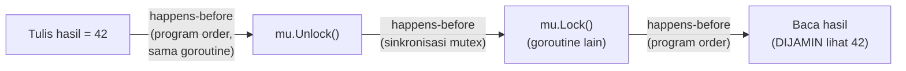

## TL;DR

Compiler dan CPU modern secara agresif **menyusun ulang urutan operasi** (reordering) dan menyimpan nilai di cache/register lokal demi performa — optimasi yang sepenuhnya aman untuk kode sekuensial satu goroutine (hasil akhirnya tetap sama), tapi bisa menghasilkan perilaku yang mengejutkan untuk kode yang dibaca oleh goroutine **lain**, yang mungkin melihat efek dari reordering itu. Go Memory Model adalah spesifikasi formal yang menjawab pertanyaan: "dalam kondisi apa, tulisan yang dilakukan satu goroutine dijamin terlihat oleh goroutine lain, dalam urutan yang bisa diandalkan?" Jawabannya berpusat pada konsep **happens-before** — relasi formal yang menentukan kapan sebuah jaminan urutan benar-benar ada, dan tanpa relasi itu, tidak ada jaminan apa pun, meski secara empiris kode "kelihatan bekerja" di banyak percobaan.

## The Problem

Sebuah goroutine menulis hasil komputasi ke sebuah variabel, lalu mengeset flag boolean terpisah (`selesai = true`) tanpa mutex atau channel apa pun, dengan asumsi "kan flag-nya di-set setelah variabel ditulis, jadi goroutine lain yang melihat flag `true` pasti juga melihat variabel yang sudah terisi". Asumsi ini **tidak dijamin** oleh spesifikasi bahasa Go — tanpa mekanisme sinkronisasi resmi (mutex, channel, atau primitif `sync/atomic`), compiler dan CPU **diizinkan** menyusun ulang kedua tulisan itu dari sudut pandang goroutine lain yang membacanya, sehingga goroutine pembaca berpotensi melihat `selesai == true` tapi variabel hasil masih berisi nilai lama — sebuah bug yang bahkan lebih halus dari race condition biasa, karena sering "kebetulan bekerja" pada hardware dan compiler tertentu, lalu gagal secara misterius setelah upgrade compiler atau pindah ke arsitektur CPU yang berbeda.

Masalah ini mengungkap kesalahpahaman umum: banyak developer mengira "kalau kode terlihat berjalan benar berkali-kali di testing, berarti aman". Go Memory Model justru menegaskan sebaliknya — kebenaran concurrency tidak bisa dibuktikan lewat observasi empiris semata; ia harus dijamin lewat **relasi happens-before** yang eksplisit dalam kode, dan kode yang bergantung pada perilaku yang "kebetulan terlihat benar" tanpa jaminan formal ini adalah kode yang salah, terlepas seberapa sering ia lolos testing.

## Intuition

Bayangkan Go Memory Model seperti **aturan resmi tentang kapan pesan yang dikirim dijamin sudah dibaca**, dalam sistem pengiriman surat antar kantor. Tanpa aturan resmi, seorang pengirim mungkin **berasumsi** penerima sudah membaca surat pertama sebelum surat kedua tiba, hanya karena ia mengirim surat pertama lebih dulu — tapi kantor pos (compiler/CPU) berhak mengantarkan surat dalam urutan berbeda dari urutan pengiriman kalau tidak ada instruksi eksplisit "surat ini harus sampai sebelum yang berikutnya dikirim" (mekanisme sinkronisasi). Happens-before adalah instruksi eksplisit itu — tanpanya, urutan kedatangan surat di sisi penerima sama sekali tidak terjamin mengikuti urutan pengiriman.

Analogi ini bocor pada satu hal: kantor pos di dunia nyata biasanya cukup dapat diandalkan menjaga urutan meski tidak ada instruksi eksplisit (properti fisik surat fisik). Compiler dan CPU **secara aktif dan sengaja** menyusun ulang operasi demi optimasi performa (menyimpan nilai di register, menjalankan instruksi out-of-order) — ini bukan kelalaian yang jarang terjadi, ini adalah perilaku yang **diharapkan dan sering terjadi** tanpa sinkronisasi eksplisit, membuat asumsi "urutan penulisan kode = urutan yang terlihat goroutine lain" jauh lebih rapuh dibanding intuisi tentang pengiriman surat fisik.

## How It Works

```go
package main

import "sync"

var hasil int
var mu sync.Mutex

func tulis() {
	hasil = 42 // (A)
	mu.Lock()
	mu.Unlock() // (B) — Unlock DIJAMIN "happens-before" Lock berikutnya
}

func baca() {
	mu.Lock() // (C) — Lock ini "happens-after" Unlock (B) di atas
	mu.Unlock()
	println(hasil) // (D) — DIJAMIN melihat hasil = 42 dari (A),
	               // KARENA ada rantai happens-before: A "sebelum" B,
	               // B "sebelum" C (lewat mutex), C "sebelum" D
}
```



Diagram ini menunjukkan **rantai** happens-before yang lengkap — setiap panah adalah jaminan formal, dan hanya karena **seluruh rantai** ini utuh (dari A sampai D), goroutine yang membaca `hasil` dijamin melihat nilai yang ditulis goroutine lain. Putuskan satu mata rantai saja (misalnya hilangkan mutex sepenuhnya), dan jaminan itu hilang total — bukan berkurang sedikit, hilang sepenuhnya secara formal, meski secara empiris kode mungkin tetap "terlihat" bekerja pada kondisi tertentu.

**Sumber happens-before yang paling umum di Go**:
- **Urutan dalam satu goroutine** (program order) — dalam satu goroutine yang sama, urutan penulisan kode selalu happens-before satu sama lain, ini yang selalu benar tanpa sinkronisasi apa pun.
- **Operasi channel** — pengiriman ke channel happens-before penerimaan yang sesuai selesai; menutup channel happens-before penerima yang menerima nilai zero akibat penutupan itu.
- **`sync.Mutex`** — `Unlock()` happens-before `Lock()` berikutnya yang berhasil terhadap mutex yang sama.
- **`sync.Once.Do`** — pemanggilan fungsi di dalam `Do` happens-before **semua** pemanggilan `Do` lain (yang tidak menjalankan fungsi itu lagi) yang kembali.

## Under The Hood

**`sync/atomic`** menyediakan operasi baca-tulis yang atomik pada level primitif (int32, int64, pointer) **tanpa** mutex penuh, dengan jaminan happens-before yang serupa untuk operasi atomik itu sendiri — cocok untuk kasus sederhana seperti counter atau flag yang tidak butuh melindungi blok kode yang lebih besar. Penting dipahami: memakai tipe data yang "kebetulan" bisa ditulis/dibaca dalam satu instruksi CPU (seperti `int64` di banyak arsitektur modern) **tanpa** `sync/atomic` tetap **tidak** memberi jaminan happens-before apa pun — atomicity pada level hardware (tidak ada "nilai setengah tertulis" yang terlihat) adalah hal yang **berbeda** dari jaminan visibility dan ordering yang diberikan Go Memory Model; keduanya sering disalahpahami sebagai hal yang sama.

Go Memory Model secara eksplisit **tidak** menjamin bahwa operasi tanpa happens-before relationship "pasti gagal" atau "pasti terlihat salah" — ia hanya menyatakan **tidak ada jaminan**, yang berarti perilaku bisa benar secara kebetulan pada compiler/hardware tertentu, dan berubah (termasuk menjadi salah) pada compiler/hardware lain, bahkan tanpa perubahan kode aplikasi sama sekali. Inilah yang membuat bug memory model jauh lebih berbahaya dari bug logika biasa — ia bisa "lolos" bertahun-tahun sampai perubahan lingkungan (upgrade Go, migrasi arsitektur CPU) tiba-tiba memicunya.

## In Go

```go
package main

import "sync/atomic"

// Flag menggunakan sync/atomic memberi jaminan happens-before yang
// EKSPLISIT — berbeda dari variabel boolean biasa yang diakses tanpa
// sinkronisasi sama sekali (yang TIDAK memberi jaminan apa pun).
var hasil int64
var selesai atomic.Bool

func tulisDenganAtomic() {
	atomic.StoreInt64(&hasil, 42)
	selesai.Store(true) // "happens-before" pembacaan Load yang melihat true
}

func bacaDenganAtomic() {
	for !selesai.Load() {
		// menunggu sampai selesai == true
	}
	// DIJAMIN melihat hasil = 42 di sini, KARENA sync/atomic memberi
	// jaminan happens-before yang setara dengan mutex untuk kasus ini.
	println(atomic.LoadInt64(&hasil))
}
```

## In His Stack

Memahami Go Memory Model paling relevan justru saat men-debug bug concurrency yang "sangat jarang terjadi" atau "hanya muncul di production, tidak pernah di staging" — gejala klasik race condition atau pelanggaran memory model yang lolos race detector karena jalur kode yang bermasalah kebetulan tidak teruji. Untuk tim yang menulis banyak kode concurrent (worker pool, pipeline pemrosesan job), pemahaman ini membedakan developer yang bisa menjelaskan **kenapa** sebuah pola sinkronisasi benar (bukan sekadar "sudah saya coba dan kelihatannya jalan") dari yang hanya menghafal pola tanpa memahami jaminan formal di baliknya.

## Trade-offs and When Not To Use It

Menulis kode yang bergantung langsung pada detail Go Memory Model (misalnya memakai `sync/atomic` manual untuk sinkronisasi kompleks) lebih sulit dibaca dan lebih rawan kesalahan halus dibanding memakai abstraksi tingkat lebih tinggi (`sync.Mutex`, channel) yang sudah terbukti benar dan lebih mudah dipahami maksudnya. Aturan praktis yang dipegang luas komunitas Go: pakai channel atau mutex sebagai default untuk sinkronisasi, dan hanya turun ke `sync/atomic` untuk kasus yang benar-benar butuh performa ekstra pada operasi sederhana (counter, flag) setelah diukur bahwa mutex memang jadi bottleneck nyata — bukan sebagai pilihan pertama karena "terdengar lebih cepat".

## Common Mistakes

> [!warning] Jebakan
> Mengakses variabel bersama dari banyak goroutine tanpa mekanisme sinkronisasi apa pun, dengan asumsi "urutan penulisan kode pasti terlihat sama oleh goroutine lain" — compiler dan CPU boleh menyusun ulang operasi tanpa happens-before yang eksplisit, membuat asumsi ini tidak terjamin sama sekali.

> [!warning] Jebakan
> Mengira tipe data yang "atomik secara hardware" (seperti `int64` di banyak CPU modern) otomatis memberi jaminan visibility antar goroutine tanpa `sync/atomic` — atomicity hardware dan jaminan happens-before Go Memory Model adalah dua hal yang berbeda.

> [!warning] Jebakan
> Mempercayai kode concurrent "benar" hanya karena lolos testing berkali-kali tanpa kegagalan — tanpa jaminan happens-before yang eksplisit, perilaku yang "kebetulan benar" bisa berubah kapan saja (upgrade compiler, migrasi hardware) tanpa peringatan.

## Exercises

1. Jelaskan apa itu relasi happens-before, dan kenapa ia penting untuk memahami kebenaran kode concurrent.
2. Kenapa "urutan penulisan kode" tidak otomatis menjamin urutan yang terlihat goroutine lain, tanpa sinkronisasi eksplisit?
3. Apa perbedaan "atomicity pada level hardware" dan "jaminan happens-before" dari Go Memory Model?
4. Desain terbuka: kolegamu menulis kode yang menset sebuah flag boolean biasa (bukan `sync/atomic` atau mutex) setelah menyelesaikan inisialisasi data, dan goroutine lain melakukan polling terhadap flag itu dalam loop untuk mengetahui kapan data siap dipakai. Kode ini sudah berjalan di production selama berbulan-bulan tanpa masalah yang terlihat. Jelaskan kenapa kode ini tetap salah menurut Go Memory Model meski belum pernah menimbulkan bug yang teramati, dan usulkan perbaikan minimal yang memberi jaminan formal yang benar.

> [!success]- Kunci jawaban
> **1.** Happens-before adalah relasi formal yang menyatakan: kalau operasi A happens-before operasi B, maka efek A (misalnya nilai yang ditulis A ke suatu variabel) **dijamin** terlihat oleh B. Tanpa relasi ini di antara dua operasi dari goroutine berbeda, spesifikasi bahasa **tidak memberi jaminan apa pun** soal urutan atau visibility — kode yang benar secara concurrent harus bisa ditelusuri lewat rantai happens-before yang eksplisit (lewat mutex, channel, atau primitif sinkronisasi lain), bukan berdasarkan asumsi informal tentang bagaimana kode "biasanya" berjalan.
> **4.** Kode ini salah karena **tidak ada mekanisme sinkronisasi apa pun** antara penulisan flag dan pembacaannya — compiler dan CPU secara sah boleh menyusun ulang operasi (baik di sisi penulis maupun pembaca) karena tidak ada happens-before yang eksplisit menghubungkan keduanya. Kode ini "berjalan tanpa masalah" selama ini kemungkinan besar karena kebetulan perilaku compiler/hardware yang dipakai saat ini tidak (atau jarang) benar-benar menyusun ulang operasi ini dengan cara yang merusak dalam praktik — bukan karena kode ini benar secara formal. Risikonya: upgrade versi Go, perubahan level optimasi compiler, atau migrasi ke arsitektur CPU berbeda bisa memicu kegagalan yang sebelumnya tidak pernah terlihat, tanpa perubahan kode aplikasi sama sekali. Perbaikan minimal: ganti flag boolean biasa dengan `atomic.Bool` (dari `sync/atomic`), yang memberi jaminan happens-before eksplisit antara `Store` dan `Load` — perubahan kecil di kode, tapi mengubah kode dari "kebetulan sering benar" menjadi "dijamin benar oleh spesifikasi bahasa".

## Self-Check

- Apa itu relasi happens-before, dan kenapa itu inti dari Go Memory Model?
- Sebutkan tiga sumber happens-before yang paling umum di Go.
- Apa perbedaan atomicity hardware dan jaminan happens-before?
- Kenapa kode yang "lolos testing berkali-kali" belum tentu benar secara memory model?

## Connected Notes

- [[Race Conditions and the Race Detector]] — race detector mendeteksi pelanggaran memory model berdasarkan analisis happens-before yang dijelaskan formal di note ini.
- [[The Sync Package]] — mutex dan `sync.Once` adalah sumber happens-before konkret yang dipakai luas untuk menjamin kebenaran concurrent.
- [[Buffered vs Unbuffered Channels]] — operasi channel adalah salah satu sumber happens-before paling penting dan paling sering dipakai di Go.
- [[Goroutine Scheduler (GMP)]] — pemahaman kenapa compiler/runtime bisa menyusun ulang operasi berkaitan dengan bagaimana scheduler dan runtime Go mengelola eksekusi goroutine.
- [[Goroutine Leaks]] — beberapa pola goroutine leak bersinggungan dengan kesalahan sinkronisasi yang berakar dari pemahaman memory model yang keliru.

## Further Reading

- Spesifikasi resmi Go, "The Go Memory Model" (go.dev/ref/mem) — dokumen formal yang mendefinisikan seluruh jaminan happens-before di Go.

## Catatan Saya

*Tulis di sini apakah ada kode di kerjaanmu yang mengakses variabel bersama tanpa mutex/channel/atomic — dan apakah kode itu "kebetulan bekerja" tanpa jaminan formal yang jelas.*
