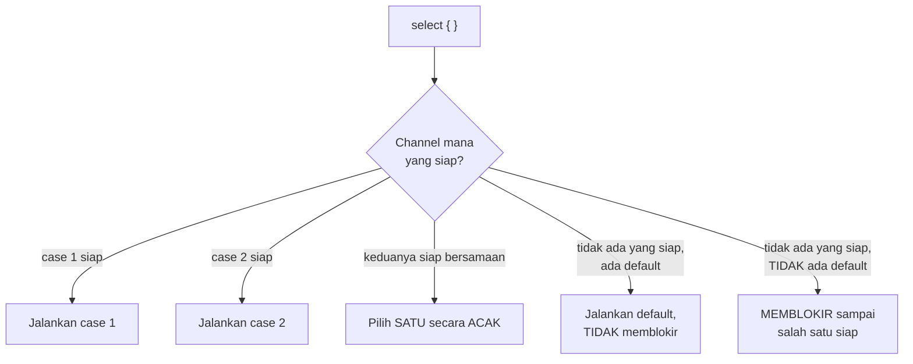

## TL;DR

Sebuah goroutine sering perlu menunggu **lebih dari satu** channel sekaligus — hasil dari operasi, sinyal pembatalan dari context, atau timeout, mana pun yang tiba lebih dulu. `select` adalah cara idiomatic Go menunggu banyak channel bersamaan tanpa polling (memeriksa satu per satu dalam loop, yang membuang CPU) — ia memblokir sampai **salah satu** dari beberapa case channel siap, lalu menjalankan case itu. Kalau lebih dari satu case siap bersamaan, Go memilih salah satu **secara acak**, bukan berdasarkan urutan penulisan — detail kecil yang penting dipahami supaya tidak menulis kode yang diam-diam bergantung pada urutan yang sebenarnya tidak dijamin.

## The Problem

Sebuah goroutine worker perlu berhenti bekerja begitu menerima sinyal pembatalan dari context (misalnya karena request HTTP yang memicunya sudah dibatalkan pengguna), tapi juga tetap perlu menerima job baru dari channel kerja selama belum dibatalkan. Menulis ini sebagai dua blok kode terpisah (`if ctx.Err() != nil { ... }` lalu `job := <-channelKerja`) tidak bekerja dengan benar — goroutine bisa "terjebak" menunggu `<-channelKerja` tanpa pernah memeriksa ulang apakah context sudah dibatalkan di antaranya, karena `<-channelKerja` sendiri memblokir sampai ada job baru, tidak peduli context sudah dibatalkan atau belum.

Masalah kedua: sebuah panggilan ke API partner eksternal perlu dibatalkan kalau responsnya tidak datang dalam waktu tertentu (timeout), tapi kode yang menunggu hasil panggilan itu lewat channel biasa (`hasil := <-channelHasil`) akan menunggu **selamanya** kalau panggilan API itu sendiri macet tanpa pernah mengirim ke channel — tidak ada mekanisme bawaan pada channel biasa untuk "menyerah setelah waktu tertentu" tanpa bantuan mekanisme tambahan.

## Intuition

Bayangkan `select` seperti **resepsionis yang menjaga beberapa telepon sekaligus di meja yang sama** — alih-alih mengangkat telepon satu per satu secara bergiliran dan memeriksa apakah masing-masing berdering (polling, membuang waktu memeriksa telepon yang diam), resepsionis ini bisa langsung tahu telepon mana yang berdering dan mengangkatnya seketika, tanpa harus memeriksa satu per satu secara aktif. Kalau dua telepon berdering **persis bersamaan**, resepsionis mengangkat salah satu secara acak (bukan selalu telepon di sisi kiri, misalnya) — keputusan yang adil tapi tidak bisa diprediksi urutannya.

Analogi ini bocor pada satu hal: resepsionis manusia punya alasan tersirat untuk memilih telepon tertentu (mungkin telepon itu terlihat lebih penting). Pemilihan acak `select` di Go benar-benar **tanpa prioritas** apa pun kecuali dinyatakan eksplisit lewat pola tambahan (misalnya `select` bersarang, atau case `default` yang memberi jalur "kalau tidak ada yang siap") — kode yang menaruh case tertentu "di atas" dengan asumsi ia lebih diprioritaskan adalah salah paham terhadap cara `select` sesungguhnya bekerja.

## How It Works

```go
package main

import (
	"context"
	"fmt"
	"time"
)

func tungguHasilAtauBatal(ctx context.Context, hasil <-chan int) {
	select {
	case v := <-hasil:
		fmt.Println("hasil diterima:", v)
	case <-ctx.Done():
		// ctx.Done() mengembalikan channel yang DITUTUP saat context
		// dibatalkan/timeout — menerima dari channel yang ditutup
		// TIDAK PERNAH memblokir, langsung memberi zero value.
		fmt.Println("dibatalkan:", ctx.Err())
	}
}

func tungguDenganTimeout(hasil <-chan int) {
	select {
	case v := <-hasil:
		fmt.Println("hasil diterima:", v)
	case <-time.After(3 * time.Second):
		// time.After mengembalikan channel yang menerima nilai SEKALI
		// setelah durasi tertentu — pola umum timeout tanpa context.
		fmt.Println("timeout setelah 3 detik")
	}
}

func periksaTanpaMemblokir(ch <-chan int) {
	select {
	case v := <-ch:
		fmt.Println("ada nilai:", v)
	default:
		// default membuat select TIDAK PERNAH memblokir — langsung
		// jalan ke sini kalau tidak ada channel yang siap SAAT INI.
		fmt.Println("tidak ada nilai, lanjut kerja lain")
	}
}
```



Diagram ini menunjukkan seluruh kemungkinan perilaku `select` — poin paling sering disalahpahami adalah pemilihan acak saat beberapa case siap bersamaan, dan bahwa `select` tanpa `default` **memblokir sepenuhnya** (berbeda dari `select` dengan `default` yang tidak pernah memblokir sama sekali).

## Under The Hood

`time.After(d)` yang dipanggil berulang di dalam loop (misalnya di dalam `for { select { ... case <-time.After(d): ... } }`) adalah jebakan performa halus — setiap pemanggilan `time.After` membuat timer **baru**, dan timer lama yang belum sempat "berbunyi" tidak langsung dibersihkan garbage collector sampai durasinya benar-benar habis, berpotensi menumpuk banyak timer aktif kalau loop itu berjalan cepat berulang-ulang. Untuk pola loop berulang dengan timeout yang sama, `time.NewTimer` yang di-reset secara eksplisit (atau `time.NewTicker` untuk interval berulang) adalah pola yang lebih efisien dibanding memanggil `time.After` setiap iterasi.

**`select {}`** kosong tanpa case apa pun adalah idiom yang sengaja memblokir **selamanya** — kadang dipakai di `main()` program yang seluruh pekerjaannya dijalankan goroutine lain dan `main()` hanya perlu tetap hidup tanpa melakukan apa-apa, meski pola `context` atau channel sinyal eksplisit biasanya lebih jelas maksudnya untuk kode production.

## In Go

```go
package worker

import (
	"context"
	"fmt"
)

// JalankanWorker menunjukkan pola LENGKAP: menerima job dari channel
// SAMBIL tetap responsif terhadap pembatalan context — select memeriksa
// KEDUANYA setiap iterasi, tidak pernah terjebak menunggu salah satu saja.
func JalankanWorker(ctx context.Context, channelKerja <-chan int) {
	for {
		select {
		case job, ok := <-channelKerja:
			if !ok {
				// channel ditutup, tidak ada job lagi — keluar dengan bersih.
				fmt.Println("channel kerja ditutup, worker berhenti")
				return
			}
			fmt.Println("memproses job:", job)

		case <-ctx.Done():
			// context dibatalkan KAPAN PUN, bahkan di tengah menunggu
			// job berikutnya — worker berhenti segera, tidak menunggu
			// job berikutnya datang dulu.
			fmt.Println("worker dibatalkan:", ctx.Err())
			return
		}
	}
}
```

## In His Stack

Pola `select` dengan `ctx.Done()` di setiap titik yang berpotensi menunggu lama adalah kebiasaan penting untuk kode yang memanggil API partner eksternal — sistem yang menangani integrasi dengan banyak instansi (yang responsnya kadang lambat atau tidak terduga) sangat diuntungkan oleh pola ini, memastikan satu panggilan yang macet ke satu partner tidak menahan resource (goroutine, koneksi) selamanya kalau request yang memicunya sudah dibatalkan atau timeout di sisi pemanggil.

## Trade-offs and When Not To Use It

`select` menambah kompleksitas kode untuk kasus yang benar-benar hanya perlu menunggu **satu** channel tanpa kebutuhan pembatalan atau timeout — untuk kasus sesederhana itu, `<-channel` biasa sudah cukup dan lebih mudah dibaca. `select` menjadi wajib begitu ada kebutuhan nyata menunggu lebih dari satu sumber (channel hasil dan channel pembatalan, atau timeout), yang hampir selalu berarti kode production yang berinteraksi dengan sumber eksternal yang tidak sepenuhnya bisa diandalkan waktunya.

## Common Mistakes

> [!warning] Jebakan
> Berasumsi urutan penulisan case di dalam `select` menentukan prioritas — Go memilih secara acak di antara case yang sama-sama siap, tanpa mempedulikan urutan penulisan.

> [!warning] Jebakan
> Memanggil `time.After(d)` berulang di dalam loop yang berjalan cepat — setiap pemanggilan membuat timer baru yang tidak langsung dibersihkan, berpotensi menumpuk banyak timer aktif; `time.NewTimer`/`Reset` lebih efisien untuk pola berulang.

> [!warning] Jebakan
> Menunggu channel kerja tanpa menyertakan case `ctx.Done()` di `select` yang sama — goroutine bisa terjebak menunggu job yang tidak pernah datang, tidak responsif terhadap pembatalan sampai job berikutnya benar-benar tiba.

## Exercises

1. Jelaskan apa yang terjadi kalau dua case dalam `select` sama-sama siap bersamaan.
2. Kenapa `select` dengan `default` tidak pernah memblokir, berbeda dari `select` tanpa `default`?
3. Kenapa memanggil `time.After` berulang di dalam loop yang berjalan cepat adalah jebakan performa?
4. Desain terbuka: worker-mu perlu menerima job dari channel kerja, tapi juga perlu berhenti kalau tidak ada job baru selama 30 detik berturut-turut (idle timeout, untuk melepas resource worker yang tidak dipakai), DAN tetap responsif terhadap pembatalan context kapan saja. Rancang struktur `select` yang menangani ketiga kondisi ini sekaligus.

> [!success]- Kunci jawaban
> **1.** Go memilih salah satu dari case yang siap secara **acak** (pseudo-random, dengan distribusi yang adil) — tidak ada jaminan urutan tertentu akan selalu menang, dan kode yang menulis case dalam urutan tertentu dengan asumsi itu memengaruhi prioritas adalah salah paham terhadap spesifikasi bahasa.
> **4.** Struktur select di dalam loop: `select { case job, ok := <-channelKerja: ... (proses job, lanjut loop); case <-ctx.Done(): return; case <-time.After(30 * time.Second): fmt.Println("idle timeout, worker berhenti"); return }`. Perhatikan `time.After` di sini dipanggil ulang setiap iterasi loop — untuk kasus ini sebenarnya masuk akal karena setiap iterasi memang butuh timer idle timeout yang "reset" (dihitung ulang dari titik itu), tapi untuk worker dengan volume job sangat tinggi (banyak iterasi per detik), pola yang lebih efisien memakai `time.NewTimer` yang di-`Reset()` secara eksplisit setiap kali job diterima, alih-alih membuat timer baru di setiap iterasi select — trade-off antara kesederhanaan kode (`time.After`) dan efisiensi (`time.NewTimer` + `Reset`) tergantung volume iterasi yang sesungguhnya diharapkan.

## Self-Check

- Bagaimana Go memilih case ketika beberapa channel siap bersamaan di `select`?
- Apa perbedaan `select` dengan dan tanpa `default`?
- Kenapa `time.After` dalam loop cepat bisa jadi jebakan performa?
- Kenapa `select` dengan `ctx.Done()` penting untuk goroutine yang menunggu channel kerja?

## Connected Notes

- [[Buffered vs Unbuffered Channels]] — `select` menunggu kesiapan channel yang perilakunya (blocking/non-blocking) ditentukan oleh jenis channel yang dijelaskan di note sebelumnya.
- [[Context for Cancellation and Deadlines]] — `ctx.Done()` yang dipakai luas dalam pola `select` dibahas mendalam mekanismenya di note berikutnya.
- [[Pipelines]] — `select` adalah building block penting dalam pola pipeline untuk menangani pembatalan di setiap tahap.
- [[Goroutine Leaks]] — goroutine yang menunggu channel tanpa `select`+`ctx.Done()` adalah salah satu pola penyebab goroutine leak paling umum.
- [[Worker Pools]] — pola worker yang menggabungkan channel kerja dan pembatalan context lewat select adalah komponen inti implementasi worker pool.

## Further Reading

- Dokumentasi resmi Go, "A Tour of Go" bagian "Select".
- Go blog resmi, "Go Concurrency Patterns: Timing out, moving on".

## Catatan Saya

*Tulis di sini apakah ada goroutine di kerjaanmu yang menunggu channel tanpa mekanisme pembatalan — dan skenario apa yang bisa membuatnya menunggu selamanya.*
