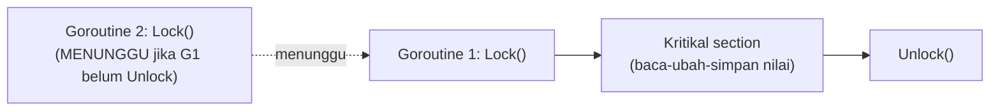

## TL;DR

Channel adalah cara idiomatic Go mengomunikasikan **data** antar goroutine, tapi tidak semua kebutuhan concurrency adalah soal mengirim data — kadang yang dibutuhkan murni **melindungi akses bersamaan** ke satu nilai bersama (`sync.Mutex`), memastikan sebuah inisialisasi hanya terjadi **sekali** meski dipanggil banyak goroutine (`sync.Once`), atau menunggu sekumpulan goroutine selesai sebelum melanjutkan (`sync.WaitGroup`). Package `sync` menyediakan primitif tingkat rendah ini — lebih dekat ke model "communicate by sharing memory" (dengan proteksi eksplisit) dibanding filosofi channel, dan keduanya adalah alat yang sama-sah untuk masalah yang berbeda, bukan satu menggantikan yang lain.

## The Problem

Sebuah counter yang menghitung jumlah request aktif diakses dan diubah oleh banyak goroutine sekaligus (`counter++` dipanggil dari setiap handler request) tanpa proteksi apa pun. Kode ini **terlihat** bekerja di testing lokal dengan traffic rendah, tapi `counter++` sebenarnya bukan operasi atomik — ia terdiri dari tiga langkah (baca nilai, tambah satu, simpan kembali), dan dua goroutine yang menjalankan ketiga langkah ini nyaris bersamaan bisa saling menimpa hasil satu sama lain (keduanya membaca nilai yang sama sebelum salah satu sempat menyimpan hasilnya) — race condition klasik yang menyebabkan counter menghitung **kurang** dari jumlah increment yang sebenarnya terjadi, sebuah bug yang secara statistik jarang terlihat di volume rendah tapi menjadi nyata dan konsisten di production dengan traffic tinggi.

Masalah kedua: sebuah konfigurasi mahal (koneksi ke layanan eksternal, atau parsing file besar) perlu diinisialisasi **tepat sekali**, meski fungsi yang memicunya dipanggil dari banyak goroutine berbeda secara konkuren saat startup aplikasi. Menjaga ini lewat flag boolean manual (`if !sudahInit { inisialisasi(); sudahInit = true }`) rentan terhadap race condition yang sama seperti counter di atas — dua goroutine bisa sama-sama melihat `sudahInit` masih `false` sebelum salah satu sempat mengubahnya, menyebabkan inisialisasi berjalan dua kali.

## Intuition

Bayangkan `sync.Mutex` seperti **kunci toilet umum dengan satu slot** — hanya satu orang boleh masuk sekaligus; orang berikutnya yang datang harus menunggu di luar sampai yang di dalam keluar dan membuka kunci. Ini melindungi "resource bersama" (toilet) dari dipakai lebih dari satu orang bersamaan, mencegah situasi kacau yang terjadi kalau dua orang mencoba masuk serentak. `sync.WaitGroup` seperti **penyelenggara acara yang menunggu semua tamu undangan check-in sebelum memulai acara** — ia tidak peduli urutan tamu datang, hanya peduli **semua** sudah check-in sebelum melanjutkan ke langkah berikutnya. `sync.Once` seperti **tombol darurat yang hanya bisa ditekan efeknya sekali** — berapa kali pun ditekan oleh berapa banyak orang, hanya penekanan pertama yang benar-benar memicu aksi.

Analogi ini bocor pada satu hal: kunci toilet fisik bisa lupa dikunci, menyebabkan dua orang masuk tanpa sengaja. `sync.Mutex` di Go tidak "lupa" dengan sendirinya, tapi **bisa terlupa dipanggil sama sekali** oleh developer — mutex hanya melindungi kode yang secara eksplisit memanggil `Lock()`/`Unlock()` di sekelilingnya; kode lain yang mengakses variabel yang sama tanpa mutex yang sama sekali tidak terlindungi, meski variabelnya sama persis.

## How It Works

```go
package main

import (
	"fmt"
	"sync"
)

type CounterAman struct {
	mu    sync.Mutex
	nilai int
}

// Tambah dilindungi Lock/Unlock — HANYA satu goroutine bisa berada di
// antara Lock() dan Unlock() pada saat bersamaan, mencegah race
// condition pada operasi baca-ubah-simpan yang tidak atomik.
func (c *CounterAman) Tambah() {
	c.mu.Lock()
	defer c.mu.Unlock() // defer memastikan Unlock TETAP dipanggil meski panic
	c.nilai++
}

func (c *CounterAman) Nilai() int {
	c.mu.Lock()
	defer c.mu.Unlock()
	return c.nilai
}

func contohWaitGroup() {
	var wg sync.WaitGroup
	counter := &CounterAman{}

	for i := 0; i < 100; i++ {
		wg.Add(1) // tambah "hitungan tunggu" SEBELUM meluncurkan goroutine
		go func() {
			defer wg.Done() // kurangi hitungan tunggu saat goroutine selesai
			counter.Tambah()
		}()
	}

	wg.Wait() // memblokir sampai hitungan tunggu kembali ke nol
	fmt.Println("total:", counter.Nilai()) // SELALU 100, berkat Mutex
}

var sekaliSaja sync.Once

func InisialisasiMahal() {
	sekaliSaja.Do(func() {
		fmt.Println("inisialisasi dijalankan HANYA SEKALI")
	})
}
```



Diagram ini menunjukkan bahwa `Mutex` memaksa akses ke bagian kode yang dilindungi (*critical section*) terjadi **satu per satu**, bukan bersamaan — goroutine kedua yang mencoba `Lock()` sementara goroutine pertama masih memegang lock akan menunggu sampai lock itu dilepas.

## Under The Hood

**`sync.RWMutex`** membedakan lock untuk membaca (`RLock`/`RUnlock`) dari lock untuk menulis (`Lock`/`Unlock`) — banyak goroutine bisa memegang read lock **bersamaan** (karena membaca bersamaan aman selama tidak ada yang menulis), tapi write lock bersifat eksklusif penuh (tidak ada read lock atau write lock lain yang boleh aktif bersamaan). Ini optimasi penting untuk beban kerja yang didominasi baca — mutex biasa (`sync.Mutex`) akan memblokir pembaca lain meski keduanya sama-sama hanya ingin membaca, padahal itu sebenarnya aman dilakukan bersamaan.

**Mutex Go bersifat non-reentrant** — memanggil `Lock()` dua kali dari goroutine yang **sama** tanpa `Unlock()` di antaranya akan **deadlock**, berbeda dari beberapa bahasa lain yang punya reentrant lock yang mengizinkan goroutine yang sama mengunci ulang lock yang sudah dipegangnya sendiri. Ini konsekuensi penting saat menulis fungsi yang memanggil fungsi lain yang juga mengunci mutex yang sama — harus dirancang hati-hati untuk menghindari pemanggilan berlapis yang mengunci mutex yang sama dari alur eksekusi yang sama.

`sync.WaitGroup.Add()` harus dipanggil **sebelum** goroutine yang bersangkutan diluncurkan (bukan di dalam goroutine itu sendiri) — memanggilnya di dalam goroutine menciptakan race condition antara `Add()` dan `Wait()` yang mungkin sudah dipanggil goroutine lain lebih dulu, membuat `Wait()` bisa kembali lebih awal dari yang seharusnya karena `Add()` belum sempat dijalankan.

## In Go

```go
package cache

import "sync"

// CacheDenganRWMutex menunjukkan pola RWMutex untuk beban baca-berat —
// banyak goroutine bisa membaca cache bersamaan TANPA saling menunggu,
// hanya operasi tulis yang benar-benar eksklusif.
type CacheDenganRWMutex struct {
	mu   sync.RWMutex
	data map[string]string
}

func NewCacheDenganRWMutex() *CacheDenganRWMutex {
	return &CacheDenganRWMutex{data: make(map[string]string)}
}

func (c *CacheDenganRWMutex) Ambil(key string) (string, bool) {
	c.mu.RLock() // BANYAK goroutine bisa RLock bersamaan
	defer c.mu.RUnlock()
	v, ada := c.data[key]
	return v, ada
}

func (c *CacheDenganRWMutex) Simpan(key, value string) {
	c.mu.Lock() // EKSKLUSIF — tidak ada RLock/Lock lain aktif bersamaan
	defer c.mu.Unlock()
	c.data[key] = value
}
```

## In His Stack

PHP/Yii2 klasik jarang butuh mutex secara eksplisit karena model eksekusi per-request yang terisolasi (setiap request adalah proses/thread terpisah, tidak ada state yang benar-benar dibagikan **dalam memori yang sama** antar request kecuali lewat mekanisme eksternal seperti Redis/database). Go, dengan model aplikasi jangka panjang yang menangani banyak request **dalam proses yang sama**, membuat kebutuhan proteksi data bersama (cache in-memory, counter, konfigurasi yang bisa di-reload) jadi tanggung jawab eksplisit yang harus dipikirkan sejak menulis kode — sesuatu yang di PHP klasik secara struktural tidak pernah menjadi masalah karena tidak ada memori yang benar-benar dibagikan lintas request dalam satu proses yang sama.

## Trade-offs and When Not To Use It

Mutex menambah kompleksitas dan risiko baru (deadlock kalau lupa `Unlock`, atau mengunci ulang mutex yang sama secara tidak sengaja) — untuk kasus yang bisa diselesaikan lebih sederhana lewat channel (komunikasi data, bukan sekadar proteksi akses), filosofi "communicate by sharing memory" lewat channel seringkali menghasilkan kode yang lebih mudah dipahami alurnya. Aturan praktis yang umum dipegang komunitas Go: pakai mutex untuk melindungi **state bersama sederhana** (counter, cache, map) yang diakses banyak goroutine tapi tidak perlu "mengalir" sebagai pesan; pakai channel untuk **mengalirkan data** antar goroutine atau mengoordinasikan alur kerja yang lebih kompleks. Untuk kode yang sangat sensitif performa dengan operasi sederhana (increment counter), `sync/atomic` (operasi atomik tingkat rendah tanpa lock sama sekali) bisa lebih efisien dibanding mutex, meski dengan API yang lebih terbatas.

## Common Mistakes

> [!warning] Jebakan
> Mengakses variabel bersama dari banyak goroutine tanpa mutex atau mekanisme sinkronisasi apa pun ("kan cuma increment sederhana") — operasi yang terlihat sederhana seperti `counter++` bukan atomik, rentan race condition di bawah concurrency nyata.

> [!warning] Jebakan
> Memanggil `wg.Add()` di dalam goroutine yang diluncurkan, bukan sebelum `go func()` dipanggil — menciptakan race condition antara `Add()` dan `Wait()` yang bisa membuat `Wait()` kembali lebih awal dari seharusnya.

> [!warning] Jebakan
> Lupa `Unlock()` (terutama di jalur kode dengan banyak early return) — selalu pakai `defer mu.Unlock()` tepat setelah `Lock()` untuk menjamin lock dilepas apa pun yang terjadi di dalam fungsi, termasuk saat panic.

## Exercises

1. Jelaskan kenapa `counter++` bukan operasi atomik, dan bagaimana ini bisa menyebabkan race condition.
2. Apa perbedaan `sync.Mutex` dan `sync.RWMutex`, dan kapan `RWMutex` memberi manfaat nyata?
3. Kenapa `wg.Add()` harus dipanggil sebelum goroutine diluncurkan, bukan di dalamnya?
4. Desain terbuka: kamu punya cache in-memory yang dibaca ribuan kali per detik oleh banyak goroutine, tapi hanya ditulis ulang sekitar sekali per menit (refresh data dari database). Jelaskan kenapa `sync.RWMutex` lebih tepat dibanding `sync.Mutex` biasa untuk kasus ini, dan perkirakan dampaknya terhadap throughput dibanding memakai Mutex biasa.

> [!success]- Kunci jawaban
> **1.** `counter++` sebenarnya terdiri dari tiga langkah terpisah di level mesin: membaca nilai `counter` saat ini, menambahkannya dengan satu, dan menyimpan hasilnya kembali. Kalau dua goroutine menjalankan ketiga langkah ini hampir bersamaan, keduanya bisa membaca nilai **awal yang sama** sebelum salah satu sempat menyimpan hasilnya — goroutine kedua menimpa hasil goroutine pertama dengan nilai yang dihitung dari data yang sudah usang, sehingga satu increment "hilang" secara efektif.
> **4.** Beban kerja ini didominasi baca (ribuan baca per detik) dengan tulis yang sangat jarang (sekali per menit) — `RWMutex` memungkinkan **seluruh** ribuan pembaca itu mengakses cache **bersamaan** tanpa saling menunggu (karena `RLock` tidak eksklusif terhadap `RLock` lain), hanya tertahan sesaat saat refresh sekali per menit terjadi (yang butuh `Lock` eksklusif). Dengan `sync.Mutex` biasa, setiap satu dari ribuan pembaca itu harus **antre satu per satu** untuk mendapat lock, meski secara logis membaca bersamaan sepenuhnya aman — dampaknya throughput baca bisa jauh lebih rendah dengan `Mutex` biasa dibanding `RWMutex`, karena `Mutex` menciptakan kontensi yang sebenarnya tidak perlu ada untuk operasi baca yang aman dilakukan konkuren.

## Self-Check

- Kenapa `counter++` bukan operasi atomik?
- Apa perbedaan `sync.Mutex` dan `sync.RWMutex`?
- Kenapa `wg.Add()` harus dipanggil sebelum goroutine diluncurkan?
- Kapan channel lebih tepat dibanding mutex, dan sebaliknya?

## Connected Notes

- [[The Select Statement]] — mekanisme sinkronisasi berbasis channel yang menjadi alternatif filosofis dari primitif `sync` di note ini.
- [[Goroutines]] — `WaitGroup` adalah mekanisme paling umum untuk menunggu sekumpulan goroutine selesai, dijelaskan kebutuhannya di note tentang goroutine.
- [[Race Conditions and the Race Detector]] — bug yang dicegah `sync.Mutex`, dan alat konkret mendeteksinya sebelum production, dibahas di note berikutnya.
- [[The Go Memory Model]] — jaminan formal soal urutan operasi yang diberikan mutex dan primitif sync lainnya, dibahas secara mendalam di note lain.
- [[Context for Cancellation and Deadlines]] — pola sinkronisasi berbasis context yang saling melengkapi dengan primitif `sync` untuk kebutuhan pembatalan.

## Further Reading

- Dokumentasi resmi Go, package `sync` — `Mutex`, `RWMutex`, `WaitGroup`, `Once`.
- Dokumentasi resmi Go, package `sync/atomic` — alternatif operasi atomik tanpa lock untuk kasus sederhana.

## Catatan Saya

*Tulis di sini apakah ada state bersama (cache, counter, map) di kerjaanmu yang diakses banyak goroutine tanpa proteksi mutex — dan risiko race condition yang mungkin ada di sana.*
