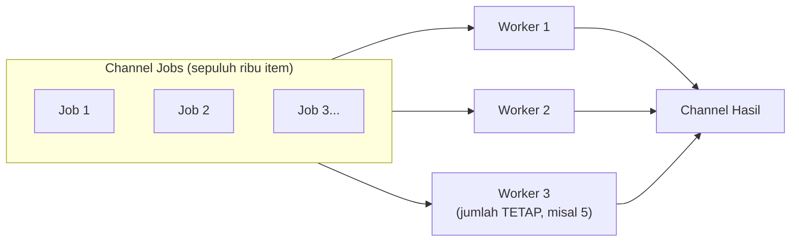

## TL;DR

[[Goroutines]] menyinggung bahaya meluncurkan goroutine tanpa batas untuk beban kerja yang jumlahnya ditentukan input eksternal. Worker pool adalah pola konkret yang menyelesaikan ini: alih-alih satu goroutine per item pekerjaan, sejumlah **tetap** goroutine worker diluncurkan sekali di awal, masing-masing mengambil pekerjaan dari satu channel bersama secara terus-menerus sampai pekerjaan habis atau dibatalkan. Jumlah goroutine konkuren yang benar-benar berjalan dibatasi ke angka yang ditentukan sengaja (biasanya diukur, bukan ditebak), tidak peduli seberapa besar volume pekerjaan yang masuk.

## The Problem

Sebuah job batch memproses sepuluh ribu dokumen yang perlu di-generate thumbnail-nya, ditulis dengan meluncurkan satu goroutine per dokumen (`for _, doc := range dokumen { go generateThumbnail(doc) }`). Di lingkungan testing dengan seratus dokumen, ini bekerja cepat dan terlihat elegan. Begitu dijalankan terhadap sepuluh ribu dokumen sungguhan, aplikasi kehabisan memori dan CPU-nya jenuh — sepuluh ribu goroutine yang semuanya berusaha memproses gambar secara bersamaan bersaing memperebutkan CPU yang sama (yang mungkin hanya punya beberapa core), dan overhead penjadwalan sepuluh ribu goroutine sekaligus jauh melebihi manfaat paralelisme yang sebenarnya bisa dicapai — proses generate thumbnail yang CPU-intensive tidak menjadi lebih cepat hanya karena dijalankan di lebih banyak goroutine daripada jumlah core CPU yang tersedia untuk benar-benar memprosesnya secara paralel.

Masalah kedua yang sama pentingnya: tanpa pembatasan, tidak ada cara mudah mengetahui **kapan** seluruh pekerjaan benar-benar selesai, atau menghentikan pemrosesan lebih awal kalau diperlukan (misalnya job dibatalkan operator) — sepuluh ribu goroutine independen tanpa koordinasi terpusat sulit dikelola sebagai satu kesatuan pekerjaan.

## Intuition

Bayangkan worker pool seperti **loket pelayanan dengan jumlah petugas tetap**, dibanding memanggil satu petugas baru untuk **setiap** orang yang datang mengantre. Kalau ada sepuluh ribu warga yang butuh dilayani, memanggil sepuluh ribu petugas sekaligus (satu goroutine per item) hanya akan membuat ruangan penuh sesak, petugas saling berdesakan, dan tidak ada yang benar-benar bekerja lebih cepat — kapasitas ruangan (CPU) tetap terbatas berapa pun banyak petugas yang dipanggil. Solusi yang masuk akal: tetapkan **jumlah petugas** yang sesuai kapasitas ruangan (misalnya lima loket), dan warga yang datang **mengantre** menunggu giliran salah satu dari lima loket itu kosong.

Analogi ini bocor pada satu hal: loket fisik punya batas ruangan yang jelas terlihat. Batas "jumlah worker yang tepat" untuk goroutine tidak selalu sejelas itu — untuk pekerjaan yang CPU-intensive (seperti generate thumbnail), jumlah worker optimal mendekati jumlah core CPU (`GOMAXPROCS`); untuk pekerjaan yang I/O-intensive (menunggu respons API partner eksternal), jumlah worker optimal bisa jauh lebih tinggi dari jumlah core, karena goroutine yang menunggu I/O tidak membebani CPU sama sekali selama menunggu — angka yang tepat harus diukur untuk jenis pekerjaan spesifik, bukan diasumsikan sama untuk semua kasus.

## How It Works

```go
package main

import (
	"context"
	"fmt"
	"sync"
)

type Job struct {
	ID int
}

type Hasil struct {
	JobID  int
	Output string
}

// JalankanWorkerPool meluncurkan JUMLAH TETAP worker (bukan satu per
// job) yang mengambil job dari satu channel bersama — jumlah goroutine
// konkuren yang benar-benar berjalan dibatasi ke jumlahWorker, tidak
// peduli berapa banyak job yang masuk.
func JalankanWorkerPool(ctx context.Context, jobs <-chan Job, jumlahWorker int) <-chan Hasil {
	hasil := make(chan Hasil, jumlahWorker)
	var wg sync.WaitGroup

	for w := 0; w < jumlahWorker; w++ {
		wg.Add(1)
		go func(workerID int) {
			defer wg.Done()
			for {
				select {
				case job, ok := <-jobs:
					if !ok {
						return // channel jobs ditutup, tidak ada job lagi
					}
					output := prosesJob(job)
					select {
					case hasil <- Hasil{JobID: job.ID, Output: output}:
					case <-ctx.Done():
						return
					}
				case <-ctx.Done():
					return
				}
			}
		}(w)
	}

	// Goroutine terpisah menutup channel hasil setelah SEMUA worker
	// selesai — memastikan konsumen hasil tahu kapan berhenti membaca.
	go func() {
		wg.Wait()
		close(hasil)
	}()

	return hasil
}

func prosesJob(j Job) string {
	return fmt.Sprintf("hasil-%d", j.ID)
}
```



Diagram ini menunjukkan bahwa jumlah worker (goroutine yang benar-benar memproses) tetap **konstan** terlepas dari berapa banyak job yang mengalir masuk — job baru menunggu di channel sampai salah satu worker yang ada selesai dengan job sebelumnya dan siap mengambil job berikutnya.

## Under The Hood

**Menentukan jumlah worker yang tepat** bergantung pada karakteristik pekerjaan: untuk pekerjaan **CPU-bound** (komputasi berat seperti kompresi gambar, enkripsi, parsing berat), jumlah worker optimal biasanya mendekati `runtime.GOMAXPROCS(0)` (jumlah OS thread yang bisa menjalankan goroutine Go secara paralel sungguhan, biasanya sama dengan jumlah core CPU) — menambah worker melebihi ini hanya menambah overhead penjadwalan tanpa mempercepat throughput riil. Untuk pekerjaan **I/O-bound** (menunggu respons jaringan, query database), jumlah worker optimal bisa jauh lebih tinggi, karena goroutine yang menunggu I/O "melepaskan" OS thread yang mendasarinya untuk dipakai goroutine lain (dibahas mekanismenya di [[Goroutine Scheduler (GMP)]]) — di sini, batasan yang lebih relevan biasanya bukan CPU, melainkan resource eksternal (jumlah koneksi database yang tersedia, rate limit API partner).

Worker pool yang baik harus **responsif terhadap pembatalan** (lewat context, lihat [[Context for Cancellation and Deadlines]]) — tanpa ini, membatalkan pekerjaan di tengah jalan berarti menunggu seluruh channel job kosong secara alami, yang bisa memakan waktu lama untuk antrean job yang panjang.

## In Go

```go
package batch

import (
	"context"
	"fmt"
	"runtime"
)

// ProsesRibuanDokumen menunjukkan penentuan jumlah worker berdasarkan
// KARAKTERISTIK pekerjaan — generate thumbnail adalah CPU-bound, jadi
// jumlah worker mendekati GOMAXPROCS, BUKAN jumlah dokumen yang ada.
func ProsesRibuanDokumen(ctx context.Context, idDokumen []int64) {
	jumlahWorker := runtime.GOMAXPROCS(0)

	jobs := make(chan Job, len(idDokumen))
	for _, id := range idDokumen {
		jobs <- Job{ID: int(id)}
	}
	close(jobs) // semua job sudah dikirim, worker akan berhenti setelah channel kosong

	hasil := JalankanWorkerPool(ctx, jobs, jumlahWorker)

	for h := range hasil {
		fmt.Println("selesai:", h.JobID, h.Output)
	}
}
```

## In His Stack

Untuk job batch yang memproses banyak dokumen atau memanggil banyak API partner eksternal (relevan langsung dengan konteks kerja), worker pool dengan jumlah yang diukur sesuai kapasitas eksternal (rate limit partner, kapasitas koneksi database) — bukan asal besar — adalah pola yang sering menentukan apakah proses batch selesai dalam hitungan menit yang wajar atau justru membebani sistem lain (database, partner eksternal) sampai menimbulkan masalah di tempat lain. Ini juga relevan dengan cron job yang memproses antrean dari database (lihat pola `SELECT ... FOR UPDATE SKIP LOCKED` di [[../40 Databases/Locking and Row Locks|Locking and Row Locks]]) — worker pool sering menjadi lapisan konkurensi di atas mekanisme pengambilan job dari database itu.

## Trade-offs and When Not To Use It

Worker pool menambah kompleksitas kode (channel, sinkronisasi, penentuan jumlah worker) dibanding sekadar loop sekuensial biasa — untuk pekerjaan dengan volume kecil yang wajar diproses satu per satu tanpa paralelisme (misalnya memproses sepuluh item, bukan sepuluh ribu), worker pool adalah over-engineering yang tidak sepadan. Jumlah worker yang salah (terlalu banyak untuk CPU-bound, terlalu sedikit untuk I/O-bound) bisa membuat worker pool tidak lebih cepat (atau bahkan lebih lambat karena overhead) dibanding pendekatan naif — angka yang tepat harus divalidasi lewat pengukuran nyata (benchmark, load testing), bukan diasumsikan dari intuisi semata.

## Common Mistakes

> [!warning] Jebakan
> Meluncurkan satu goroutine per item pekerjaan tanpa batas (bukan worker pool) untuk volume pekerjaan yang bisa sangat besar — menghabiskan memori dan CPU tanpa manfaat paralelisme nyata melebihi kapasitas hardware yang tersedia.

> [!warning] Jebakan
> Menetapkan jumlah worker yang sama untuk pekerjaan CPU-bound dan I/O-bound tanpa mempertimbangkan karakteristiknya — jumlah worker optimal untuk keduanya bisa sangat berbeda, dan angka yang tepat untuk satu jenis pekerjaan bisa jauh dari optimal untuk jenis lain.

> [!warning] Jebakan
> Worker pool yang tidak memeriksa pembatalan context — pekerjaan yang seharusnya bisa dihentikan lebih awal terus berjalan sampai seluruh antrean job habis secara alami, meski pembatalan sudah diminta jauh sebelumnya.

## Exercises

1. Jelaskan kenapa meluncurkan satu goroutine per item pekerjaan bisa lebih lambat dibanding worker pool dengan jumlah terbatas, untuk pekerjaan CPU-bound.
2. Kenapa jumlah worker optimal untuk pekerjaan I/O-bound bisa jauh lebih tinggi dibanding pekerjaan CPU-bound?
3. Apa yang terjadi kalau worker pool tidak memeriksa pembatalan context sama sekali?
4. Desain terbuka: kamu punya job batch yang memanggil API partner eksternal untuk memverifikasi sepuluh ribu NIK, dan partner tersebut punya rate limit 50 request per detik. Rancang worker pool untuk job ini, dan jelaskan bagaimana jumlah worker dan mekanisme tambahan (kalau ada) memastikan rate limit partner tidak dilanggar meski job berjalan secepat mungkin dalam batas itu.

> [!success]- Kunci jawaban
> **1.** Untuk pekerjaan CPU-bound, kecepatan pemrosesan dibatasi oleh jumlah core CPU yang benar-benar bisa menjalankan komputasi secara paralel — meluncurkan goroutine jauh melebihi jumlah core tidak membuat komputasi selesai lebih cepat (core yang sama tetap harus bergantian menjalankan goroutine-goroutine itu), sementara overhead penjadwalan (scheduler harus mengelola jauh lebih banyak goroutine) justru menambah biaya tanpa manfaat. Worker pool dengan jumlah mendekati jumlah core menghindari overhead ini sambil tetap memanfaatkan seluruh core yang tersedia secara maksimal.
> **4.** Worker pool dengan jumlah worker yang wajar (misalnya 10-20, jauh lebih rendah dari rate limit itu sendiri karena setiap worker juga butuh waktu memproses respons), dikombinasikan dengan **rate limiter** eksplisit (token bucket, dibahas di domain `30 APIs and Web`) yang membatasi total laju request ke partner ke maksimal 50 per detik terlepas dari berapa banyak worker yang aktif. Setiap worker, sebelum mengirim request ke partner, harus mendapat "izin" dari rate limiter bersama (misalnya channel token bucket, atau library rate limiting Go seperti `golang.org/x/time/rate`) — ini memisahkan dua kekhawatiran: jumlah worker menentukan seberapa banyak permintaan bisa **disiapkan** bersamaan (termasuk parsing response, dll.), sementara rate limiter yang menentukan seberapa cepat permintaan **benar-benar dikirim** ke partner, memastikan batas 50/detik dihormati meski ada puluhan worker yang siap mengirim kapan saja.

## Self-Check

- Kenapa satu goroutine per item pekerjaan bisa lebih lambat dibanding worker pool untuk pekerjaan CPU-bound?
- Bagaimana menentukan jumlah worker yang tepat untuk pekerjaan CPU-bound vs I/O-bound?
- Kenapa worker pool perlu memeriksa pembatalan context?
- Apa yang membatasi throughput worker pool selain jumlah worker itu sendiri?

## Connected Notes

- [[Goroutines]] — worker pool adalah solusi konkret untuk masalah "goroutine tak terbatas" yang disinggung di note itu.
- [[Context for Cancellation and Deadlines]] — worker pool yang responsif terhadap pembatalan bergantung langsung pada mekanisme context yang dijelaskan di note sebelumnya.
- [[Fan-In Fan-Out]] — pola terkait yang menyatukan hasil dari banyak goroutine, sering dipakai berdampingan dengan worker pool, dibahas di note berikutnya.
- [[Goroutine Scheduler (GMP)]] — pemahaman kenapa jumlah worker optimal berbeda untuk CPU-bound vs I/O-bound bertumpu pada mekanisme scheduler yang dijelaskan di note itu.
- [[../40 Databases/Locking and Row Locks|Locking and Row Locks]] — pola `SKIP LOCKED` untuk antrean job di database sering menjadi sumber job yang diproses worker pool.

## Further Reading

- Go blog resmi, "Go Concurrency Patterns: Pipelines and cancellation" — pola worker pool sebagai bagian dari pipeline concurrency yang lebih luas.

## Catatan Saya

*Tulis di sini job batch di kerjaanmu yang meluncurkan goroutine tanpa batas — apakah worker pool dengan jumlah yang diukur bisa memperbaikinya.*
