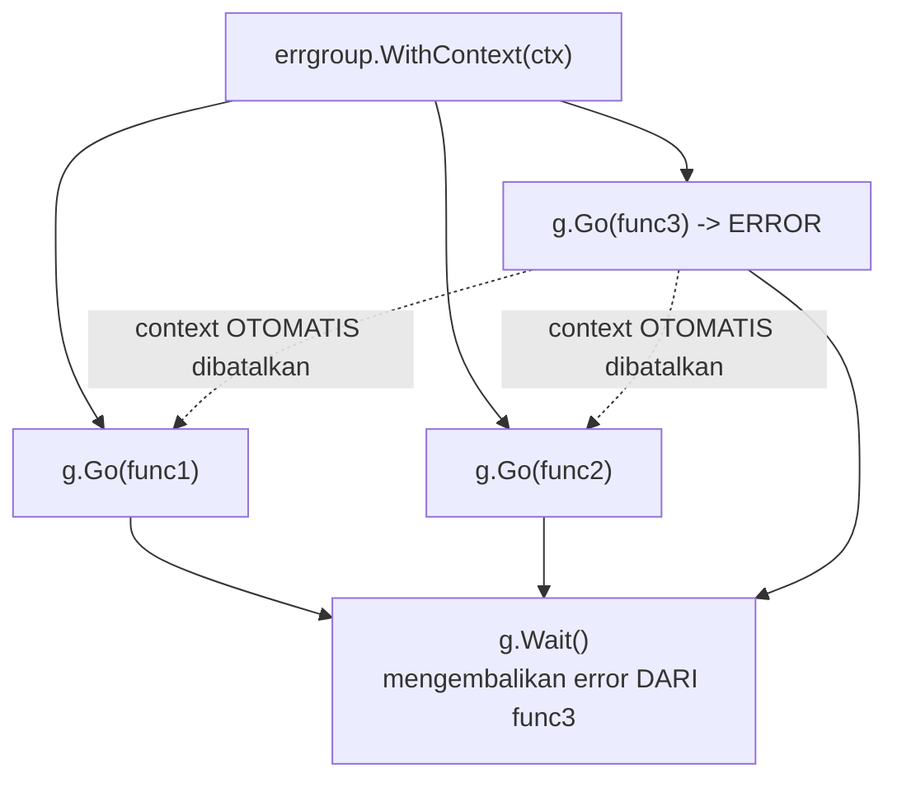

## TL;DR

[[Fan-In Fan-Out]] menunjukkan pola manual mengumpulkan hasil dari banyak goroutine lewat `sync.WaitGroup` dan channel — tapi menangani **error** dari masing-masing goroutine secara benar (goroutine mana yang gagal, haruskah goroutine lain dibatalkan begitu satu gagal) butuh banyak kode boilerplate berulang. `golang.org/x/sync/errgroup` menyediakan abstraksi siap pakai untuk pola "luncurkan beberapa goroutine, kumpulkan error pertama yang terjadi, opsional batalkan yang lain begitu satu gagal" — menggantikan `WaitGroup` + channel error manual dengan API yang jauh lebih ringkas dan sudah teruji benar.

## The Problem

Sebuah fungsi memanggil tiga API partner eksternal secara paralel (fan-out), dan perlu mengembalikan error kalau **salah satu** dari ketiganya gagal — ditulis manual dengan `WaitGroup` dan channel error, kode ini butuh menangani beberapa hal sekaligus: mengumpulkan error dari channel tanpa memblokir goroutine yang masih berjalan, memutuskan error mana yang dikembalikan kalau lebih dari satu goroutine gagal bersamaan, dan (kalau diinginkan) membatalkan goroutine yang masih berjalan begitu salah satu gagal, supaya tidak menunggu operasi yang hasilnya sudah tidak relevan. Menulis ulang logika ini setiap kali dibutuhkan pola serupa adalah sumber duplikasi kode dan potensi bug kecil yang berbeda-beda di setiap implementasi manual.

## Intuition

Bayangkan `errgroup` seperti **koordinator tim proyek yang menangani banyak sub-tugas paralel** — setiap anggota tim mengerjakan tugasnya sendiri secara independen, tapi koordinator ini secara otomatis mencatat "tugas mana yang gagal duluan" dan (kalau diminta) langsung memberi sinyal ke anggota tim lain untuk berhenti begitu satu tugas gagal, alih-alih membiarkan semua orang menyelesaikan tugas masing-masing meski hasilnya sudah tidak akan dipakai karena proyek keseluruhan sudah gagal.

Analogi ini bocor pada satu hal: koordinator manusia bisa menilai secara fleksibel apakah kegagalan satu tugas benar-benar berarti seluruh proyek harus berhenti. `errgroup.Group` (dalam mode dasarnya) selalu mengembalikan **error pertama yang terjadi** dan (kalau dibuat dengan `WithContext`) selalu membatalkan context bersama begitu ada satu goroutine yang error — perilaku yang tetap (tidak bisa dikustomisasi secara halus per kasus) yang mencakup mayoritas kebutuhan umum, tapi untuk kebutuhan yang lebih rumit (misalnya "lanjutkan meski dua dari lima gagal, hanya berhenti kalau lebih dari separuh gagal") tetap butuh implementasi manual.

## How It Works

```go
package main

import (
	"context"
	"fmt"

	"golang.org/x/sync/errgroup"
)

func panggilPartner(ctx context.Context, nama string) (string, error) {
	// simulasi panggilan API
	if nama == "partner-c" {
		return "", fmt.Errorf("partner-c tidak merespons")
	}
	return fmt.Sprintf("data dari %s", nama), nil
}

func ambilSemuaData(ctxInduk context.Context) error {
	// WithContext mengembalikan Group DAN context turunan yang OTOMATIS
	// dibatalkan begitu salah satu goroutine mengembalikan error.
	g, ctx := errgroup.WithContext(ctxInduk)

	var dataA, dataB, dataC string

	g.Go(func() error {
		var err error
		dataA, err = panggilPartner(ctx, "partner-a")
		return err
	})
	g.Go(func() error {
		var err error
		dataB, err = panggilPartner(ctx, "partner-b")
		return err
	})
	g.Go(func() error {
		var err error
		dataC, err = panggilPartner(ctx, "partner-c") // ini akan error
		return err
	})

	// Wait() memblokir sampai SEMUA goroutine selesai, mengembalikan
	// ERROR PERTAMA yang terjadi (kalau ada), TIDAK PEDULI goroutine
	// mana yang menghasilkannya.
	if err := g.Wait(); err != nil {
		return fmt.Errorf("ambil data partner: %w", err)
	}

	fmt.Println(dataA, dataB, dataC)
	return nil
}
```



Diagram ini menunjukkan perilaku kunci `errgroup.WithContext`: begitu satu goroutine (func3) mengembalikan error, context yang dibagikan ke **seluruh** goroutine lain langsung dibatalkan — goroutine lain yang memeriksa `ctx.Done()` (lihat [[The Select Statement]]) bisa berhenti lebih awal, bukan menunggu selesai secara penuh untuk pekerjaan yang hasilnya sudah tidak relevan.

## Under The Hood

`errgroup.Group` secara internal memakai `sync.WaitGroup` dan `sync.Once` (untuk memastikan hanya error **pertama** yang disimpan, error berikutnya diabaikan) — memberi abstraksi yang jauh lebih aman dari implementasi manual yang rawan lupa menangani salah satu kasus tepi (misalnya lupa menangani race condition saat beberapa goroutine sama-sama mencoba menyimpan error mereka ke variabel bersama tanpa sinkronisasi). `g.Go(func)` bisa dipanggil kapan saja sebelum `g.Wait()`, termasuk dari dalam goroutine lain yang sedang berjalan — memungkinkan pola dinamis di mana jumlah goroutine yang diluncurkan tidak perlu diketahui sepenuhnya di awal.

## In Go

```go
package validasi

import (
	"context"

	"golang.org/x/sync/errgroup"
)

// ValidasiPermohonanParalel menunjukkan errgroup untuk validasi yang
// terdiri dari beberapa pemeriksaan independen (masing-masing mungkin
// butuh query database terpisah) — jauh lebih ringkas dibanding
// WaitGroup + channel error manual.
func ValidasiPermohonanParalel(ctx context.Context, permohonanID int64) error {
	g, ctx := errgroup.WithContext(ctx)

	g.Go(func() error {
		return validasiDokumenLengkap(ctx, permohonanID)
	})
	g.Go(func() error {
		return validasiKuotaTersedia(ctx, permohonanID)
	})
	g.Go(func() error {
		return validasiTidakDuplikat(ctx, permohonanID)
	})

	return g.Wait()
}

func validasiDokumenLengkap(ctx context.Context, id int64) error { return nil }
func validasiKuotaTersedia(ctx context.Context, id int64) error  { return nil }
func validasiTidakDuplikat(ctx context.Context, id int64) error  { return nil }
```

## In His Stack

`errgroup` sangat relevan untuk kode yang memvalidasi permohonan lewat beberapa pemeriksaan independen (kuota, duplikasi, kelengkapan dokumen) yang masing-masing butuh query terpisah — menjalankannya paralel lewat `errgroup` mempercepat validasi tanpa kode boilerplate berlebihan, dan pembatalan otomatis begitu satu pemeriksaan gagal (misalnya kuota sudah habis) berarti pemeriksaan lain yang masih berjalan tidak perlu diselesaikan penuh kalau hasilnya sudah pasti tidak relevan (permohonan akan ditolak apa pun hasil pemeriksaan lain).

## Trade-offs and When Not To Use It

`errgroup` cocok untuk pola "jalankan semua, kumpulkan error pertama, opsional batalkan sisanya" — untuk kebutuhan yang lebih kompleks (mengumpulkan **semua** error, bukan hanya yang pertama; atau melanjutkan meski sebagian gagal dengan kriteria yang lebih rumit dari sekadar "yang pertama menang"), `errgroup` standar tidak cukup dan implementasi manual (atau varian `errgroup` yang dimodifikasi) tetap dibutuhkan. Untuk kasus yang hanya punya satu goroutine (tidak ada paralelisme sama sekali), `errgroup` tidak memberi manfaat apa pun dibanding pemanggilan fungsi biasa — ia bernilai justru saat ada lebih dari satu operasi independen yang benar-benar dijalankan bersamaan.

## Common Mistakes

> [!warning] Jebakan
> Mengharapkan `g.Wait()` mengembalikan **semua** error dari goroutine yang gagal — `errgroup` standar hanya menyimpan error **pertama** yang terjadi, error dari goroutine lain yang gagal setelahnya diabaikan sepenuhnya.

> [!warning] Jebakan
> Tidak memakai context yang dikembalikan `errgroup.WithContext` di dalam goroutine yang diluncurkan (memakai context asli, bukan context turunan) — kehilangan manfaat pembatalan otomatis begitu salah satu goroutine gagal.

> [!warning] Jebakan
> Menulis ke variabel bersama dari dalam beberapa `g.Go(func)` tanpa menyadari variabel itu tetap butuh perlakuan hati-hati kalau diakses lebih dari satu goroutine yang sama — `errgroup` menangani sinkronisasi error, bukan sinkronisasi variabel lain yang mungkin ditulis di dalam closure yang sama.

## Exercises

1. Jelaskan apa yang terjadi kalau dua goroutine dalam satu `errgroup.Group` sama-sama mengembalikan error — error mana yang dikembalikan `g.Wait()`?
2. Kenapa memakai context yang dikembalikan `errgroup.WithContext` (bukan context asli) penting di dalam goroutine yang diluncurkan?
3. Kapan `errgroup` standar tidak cukup untuk kebutuhan yang lebih kompleks?
4. Desain terbuka: kamu perlu menjalankan validasi terhadap lima aturan bisnis independen untuk sebuah permohonan, dan kamu ingin **seluruh** aturan yang gagal dilaporkan sekaligus ke pengguna (bukan hanya yang pertama), supaya pengguna bisa memperbaiki semuanya dalam satu kali submit ulang, bukan menemukan error satu per satu secara bertahap. Jelaskan kenapa `errgroup` standar tidak cocok untuk kebutuhan ini, dan rancang pendekatan alternatif yang tetap menjalankan kelima validasi secara paralel.

> [!success]- Kunci jawaban
> **1.** `errgroup.Group` menyimpan **error pertama** yang terjadi (ditentukan oleh urutan mana yang benar-benar selesai lebih dulu, bukan urutan `g.Go` dipanggil) — begitu error pertama tersimpan, error dari goroutine lain yang gagal setelahnya tidak disimpan sama sekali (diabaikan). `g.Wait()` hanya mengembalikan satu error itu, meski mungkin ada lebih dari satu goroutine yang sebenarnya gagal.
> **4.** `errgroup` standar tidak cocok karena ia dirancang untuk mengumpulkan hanya error pertama, sementara kebutuhan ini butuh **seluruh** error dari kelima validasi. Pendekatan alternatif: luncurkan lima goroutine secara manual (mirip pola [[Fan-In Fan-Out]]) yang masing-masing mengirim hasilnya (nil kalau valid, error kalau tidak) ke sebuah channel bersama atau slice yang dilindungi mutex, tunggu seluruh lima goroutine selesai lewat `sync.WaitGroup` (bukan `errgroup`), lalu kumpulkan seluruh error yang tidak nil dari kelima hasil itu menjadi satu daftar gabungan untuk dikembalikan ke pengguna sekaligus. Trade-off: kode yang lebih verbose dibanding `errgroup`, tapi memberi kontrol penuh atas bagaimana kumpulan error ditangani, sesuatu yang memang di luar cakupan desain `errgroup` standar.

## Self-Check

- Error mana yang dikembalikan `errgroup.Group` kalau lebih dari satu goroutine gagal?
- Kenapa context dari `errgroup.WithContext` penting dipakai di dalam goroutine yang diluncurkan?
- Kapan implementasi manual lebih tepat dibanding `errgroup` standar?
- Apa yang disederhanakan `errgroup` dibanding `WaitGroup` + channel error manual?

## Connected Notes

- [[Fan-In Fan-Out]] — `errgroup` adalah abstraksi siap pakai untuk pola fan-out dengan penanganan error yang dijelaskan manual di note itu.
- [[Context for Cancellation and Deadlines]] — pembatalan otomatis `errgroup.WithContext` bertumpu penuh pada mekanisme context yang dijelaskan di note itu.
- [[The Sync Package]] — `errgroup` dibangun di atas `sync.WaitGroup` dan `sync.Once`, primitif yang dijelaskan di note itu.
- [[singleflight]] — package terkait lain dari `golang.org/x/sync` yang menyelesaikan masalah concurrency berbeda (deduplikasi request), dibahas di note berikutnya.
- [[../20 Go Language/Sentinel Errors vs Error Types|Sentinel Errors vs Error Types]] — error yang dikembalikan dari goroutine di dalam errgroup tetap mengikuti prinsip error handling yang sama seperti kode Go biasa.

## Further Reading

- Dokumentasi resmi package `golang.org/x/sync/errgroup`.

## Catatan Saya

*Tulis di sini kode fan-out manual di kerjaanmu yang bisa disederhanakan dengan errgroup.*
