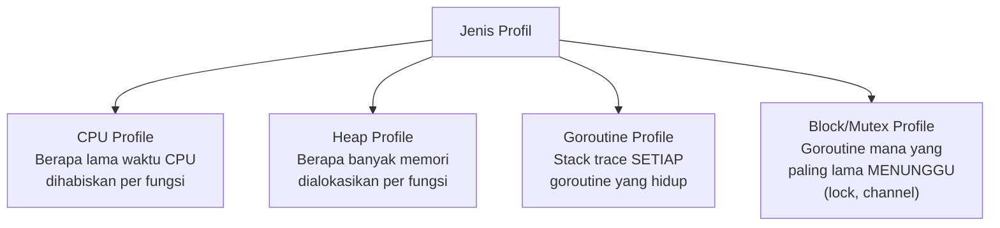

## TL;DR

Setiap note di domain ini sejauh ini menyebut "diverifikasi lewat profiling" sebagai langkah konfirmasi — `pprof` adalah alat konkret di baliknya. Ia adalah profiler bawaan Go yang bisa menjawab pertanyaan paling penting dalam optimasi performa: **di baris kode mana**, persis, waktu CPU atau memori sebenarnya dihabiskan — bukan tebakan atau intuisi, tapi data nyata dari eksekusi program yang sesungguhnya. `pprof` mendukung beberapa jenis profil (CPU, heap/memori, goroutine, block, mutex), masing-masing menjawab pertanyaan performa yang berbeda, dan bisa diaktifkan baik untuk benchmark lokal maupun aplikasi production yang sedang berjalan.

## The Problem

Sebuah endpoint yang tiba-tiba melambat setelah perubahan kode terbaru dicurigai banyak pihak dengan alasan berbeda-beda — satu developer menduga masalah di query database, developer lain menduga JSON marshalling yang tidak efisien, developer ketiga menduga alokasi memori berlebihan. Tanpa data konkret, diskusi ini berputar di seputar tebakan yang masing-masing terdengar masuk akal, dan tim menghabiskan waktu mencoba memperbaiki dugaan-dugaan itu satu per satu secara coba-coba — beberapa perbaikan mungkin sedikit membantu, tapi tidak ada yang benar-benar tahu apakah mereka sudah menemukan akar masalah sesungguhnya atau baru menambal gejala yang kebetulan terlihat.

Masalah kedua: sebuah aplikasi menunjukkan pemakaian memori yang terus bertambah dari waktu ke waktu (mengarah ke kecurigaan goroutine leak atau memory leak), tapi tanpa alat yang tepat, sulit membedakan apakah ini benar-benar kebocoran (goroutine yang tidak pernah selesai, referensi yang tidak sengaja dipertahankan) atau sekadar pola alokasi yang wajar tapi belum di-tuning (GC yang belum dikonfigurasi optimal, lihat [[Garbage Collection in Go]]).

## Intuition

Bayangkan `pprof` seperti **kamera thermal yang menunjukkan persis bagian mesin mana yang paling panas** — alih-alih menebak dari gejala luar (mesin terasa lambat, ada bau aneh) bagian mana yang bermasalah, kamera thermal langsung menunjukkan titik panas yang sebenarnya, seringkali di tempat yang tidak terduga oleh intuisi awal siapa pun. `pprof` melakukan hal yang sama untuk kode — ia menunjukkan persis fungsi dan baris mana yang menghabiskan waktu CPU paling banyak, atau mengalokasikan memori paling banyak, berdasarkan pengukuran nyata selama eksekusi, bukan dugaan berdasarkan membaca kode.

Analogi ini bocor pada satu hal: kamera thermal memberi hasil instan tanpa mengubah cara mesin bekerja. Profiling CPU/memori **menambah overhead** selama pengukuran berlangsung (instrumentasi tambahan untuk mencatat sampel) — overhead ini biasanya cukup kecil untuk profiling CPU (berbasis sampling berkala, bukan mencatat setiap operasi), tapi tetap ada dan perlu dipertimbangkan terutama saat mengaktifkan profiling di aplikasi production yang sedang melayani traffic nyata.

## How It Works

```go
package main

import (
	"net/http"
	_ "net/http/pprof" // side-effect import: mendaftarkan handler pprof
	                    // di http.DefaultServeMux secara otomatis
)

func main() {
	// Endpoint pprof (CPU, heap, goroutine, dll.) otomatis tersedia di
	// /debug/pprof/ pada port ini, TERPISAH dari server aplikasi utama
	// untuk menghindari mengekspos endpoint debug ke publik.
	go http.ListenAndServe("localhost:6060", nil)

	// ... server aplikasi utama berjalan seperti biasa ...
}
```

```bash
# Mengambil profil CPU selama 30 detik dari aplikasi yang sedang berjalan,
# lalu membuka analisis interaktif.
go tool pprof http://localhost:6060/debug/pprof/profile?seconds=30

# Mengambil profil heap (memori) SAAT INI.
go tool pprof http://localhost:6060/debug/pprof/heap

# Di dalam sesi interaktif pprof:
# (pprof) top10        -- 10 fungsi yang paling banyak menghabiskan resource
# (pprof) list NamaFungsi  -- tampilkan baris per baris dalam satu fungsi
# (pprof) web          -- visualisasi graf panggilan (butuh graphviz)
```



Diagram ini menunjukkan empat jenis profil paling umum, masing-masing menjawab pertanyaan performa yang berbeda — memilih jenis profil yang salah untuk masalah yang dihadapi (misalnya CPU profile untuk masalah yang sebenarnya soal goroutine yang macet menunggu lock) tidak akan menunjukkan apa pun yang berguna.

## Under The Hood

**CPU profiling** bekerja berbasis **sampling** — runtime Go secara berkala (biasanya 100 kali per detik) mencatat stack trace goroutine yang sedang aktif dieksekusi, dan setelah periode pengumpulan selesai, `pprof` menganalisis sampel-sampel ini untuk memperkirakan proporsi waktu CPU yang dihabiskan setiap fungsi — pendekatan berbasis sampel ini membuat overhead-nya relatif kecil (tidak mencatat **setiap** eksekusi instruksi, hanya sampel berkala), cocok dijalankan bahkan di production untuk periode singkat.

**Heap profiling**, sebaliknya, mencatat alokasi memori berdasarkan sampel alokasi (bukan setiap alokasi, untuk mengurangi overhead), menunjukkan fungsi mana yang bertanggung jawab atas alokasi memori yang **masih hidup** (in-use) di titik pengambilan profil, atau total alokasi kumulatif sejak awal (tergantung mode yang dipilih) — perbedaan penting: "in-use" menunjukkan kandidat memory leak (memori yang terus bertambah dan tidak pernah dilepas), sementara "alloc" (kumulatif) menunjukkan fungsi mana yang paling sering mengalokasikan memori, relevan untuk mengurangi tekanan GC (lihat [[Reducing Allocations]]) meski memori itu sendiri dilepas dengan benar.

**Goroutine profile** menunjukkan stack trace **setiap** goroutine yang hidup saat ini — alat paling langsung untuk mendiagnosis goroutine leak (lihat [[Goroutine Leaks]]), karena goroutine yang bocor biasanya muncul dalam jumlah besar dengan stack trace yang identik, pola yang mudah dikenali dibanding goroutine normal yang bervariasi.

## In Go

```go
package main

import (
	"fmt"
	"os"
	"runtime/pprof"
)

// ProfilCPUManual menunjukkan cara mengambil profil CPU dari dalam
// kode itu sendiri (bukan lewat HTTP endpoint) — berguna untuk skrip
// batch atau CLI tool yang tidak menjalankan server HTTP.
func ProfilCPUManual() error {
	f, err := os.Create("cpu.prof")
	if err != nil {
		return fmt.Errorf("buat file profil cpu: %w", err)
	}
	defer f.Close()

	if err := pprof.StartCPUProfile(f); err != nil {
		return fmt.Errorf("mulai profil cpu: %w", err)
	}
	defer pprof.StopCPUProfile()

	// ... kode yang ingin diprofil dijalankan di sini ...
	jalankanPekerjaanBerat()

	return nil
}

func jalankanPekerjaanBerat() {}
```

```bash
# Setelah cpu.prof dihasilkan, analisis dengan cara yang SAMA seperti
# profil dari HTTP endpoint.
go tool pprof cpu.prof
```

## In His Stack

Mengaktifkan `net/http/pprof` di endpoint terpisah (bukan di port yang sama dengan API publik) adalah praktik standar untuk service Go production — penting memastikan endpoint ini **tidak** terekspos ke internet publik (biasanya diikat ke `localhost` atau dilindungi lewat network policy Kubernetes yang membatasi akses hanya dari dalam cluster), karena `pprof` bisa membocorkan detail internal aplikasi (termasuk kemungkinan data sensitif dalam heap dump) kalau bisa diakses sembarang pihak.

## Trade-offs and When Not To Use It

Profiling menambah overhead nyata selama pengukuran berlangsung — CPU profiling relatif ringan (berbasis sampling), tapi heap profiling dan terutama **mengambil goroutine profile lengkap** (`debug=2`, yang menyertakan stack trace penuh setiap goroutine) bisa menambah beban CPU dan memori sesaat, terutama untuk aplikasi dengan jumlah goroutine sangat besar. Untuk aplikasi production dengan traffic tinggi, mengambil profil sebaiknya dilakukan dalam jendela waktu terbatas dan dipantau dampaknya, bukan dibiarkan aktif secara terus-menerus dengan interval sangat pendek. `pprof` juga tidak menggantikan kebutuhan memahami kode — ia menunjukkan **di mana** waktu/memori dihabiskan, tapi memutuskan **kenapa** itu terjadi dan **bagaimana** memperbaikinya tetap butuh pemahaman konteks kode yang mendalam.

## Common Mistakes

> [!warning] Jebakan
> Menebak-nebak penyebab masalah performa tanpa data profiling konkret — diskusi berbasis intuisi bisa menghabiskan waktu tanpa pernah menemukan akar masalah sesungguhnya, yang seringkali ada di tempat yang tidak terduga.

> [!warning] Jebakan
> Mengekspos endpoint `/debug/pprof/` ke akses publik tanpa proteksi — berpotensi membocorkan detail internal aplikasi, termasuk kemungkinan data sensitif dalam heap dump, ke pihak yang tidak seharusnya punya akses.

> [!warning] Jebakan
> Mengambil goroutine profile lengkap (`debug=2`) secara rutin dengan interval sangat pendek di aplikasi dengan traffic tinggi — overhead-nya bisa signifikan dan mengganggu performa aplikasi yang sedang dianalisis, kontraproduktif terhadap tujuan awal profiling.

## Exercises

1. Jelaskan perbedaan CPU profile dan heap profile — pertanyaan performa apa yang masing-masing jawab?
2. Kenapa CPU profiling berbasis sampling punya overhead yang relatif kecil dibanding heap profiling penuh?
3. Kenapa endpoint `/debug/pprof/` tidak boleh diekspos ke akses publik tanpa proteksi?
4. Desain terbuka: sebuah endpoint API tiba-tiba melambat setelah deployment terbaru, dan tim berdebat antara dugaan "query database lambat" dan "JSON marshalling tidak efisien". Rancang langkah konkret memakai pprof untuk menyelesaikan perdebatan ini dengan data, bukan opini, dan jelaskan jenis profil mana yang paling relevan untuk masing-masing dugaan.

> [!success]- Kunci jawaban
> **1.** CPU profile menjawab "di fungsi/baris mana **waktu CPU** dihabiskan" — relevan untuk masalah performa yang disebabkan komputasi berat atau operasi yang memblokir CPU. Heap profile menjawab "di fungsi mana **memori** dialokasikan (dan berapa banyak yang masih dipakai)" — relevan untuk masalah memori tinggi, kecurigaan memory leak, atau untuk mengurangi tekanan GC lewat pengurangan alokasi.
> **4.** Ambil CPU profile dari endpoint yang bermasalah selama periode traffic normal (`go tool pprof http://host:6060/debug/pprof/profile?seconds=30`), lalu jalankan `top10` di sesi interaktif pprof — kalau waktu CPU didominasi fungsi yang berkaitan dengan driver database (menunggu I/O query, meski ini sebenarnya lebih tepat dilihat lewat block profile atau tracing eksternal karena waktu **menunggu** I/O tidak selalu sepenuhnya tertangkap CPU profile berbasis sampling), itu mendukung dugaan "query database lambat". Kalau waktu CPU didominasi fungsi `encoding/json` atau fungsi custom marshalling, itu mendukung dugaan "JSON marshalling tidak efisien". Kombinasikan dengan `list NamaFungsi` untuk melihat baris spesifik yang paling banyak menghabiskan waktu dalam fungsi yang teridentifikasi — memberi jawaban berbasis data konkret alih-alih memperdebatkan dua dugaan tanpa bukti, dan berpotensi mengungkap bahwa kedua dugaan sama-sama salah dan penyebab sesungguhnya ada di tempat yang tidak pernah disebutkan dalam perdebatan awal.

## Self-Check

- Apa perbedaan CPU profile dan heap profile?
- Kenapa CPU profiling berbasis sampling memiliki overhead relatif kecil?
- Kenapa endpoint pprof tidak boleh diekspos ke publik?
- Bagaimana goroutine profile membantu mendiagnosis goroutine leak?

## Connected Notes

- [[Goroutine Leaks]] — goroutine profile adalah alat konkret mendiagnosis kebocoran yang dibahas di note itu.
- [[Garbage Collection in Go]] — heap profile membantu memahami pola alokasi yang memengaruhi frekuensi dan beban kerja GC.
- [[Escape Analysis]] — keputusan escape analysis yang terlihat lewat `-gcflags="-m"` bisa diverifikasi dampak nyatanya lewat heap profile.
- [[Benchmarking in Go]] — pprof sering dikombinasikan dengan benchmark (`go test -bench -cpuprofile`) untuk profiling yang lebih terarah pada fungsi spesifik.
- [[Profiling a Real Application]] — note penutup domain performance yang menggabungkan pprof, benchmark, dan load test jadi satu latihan utuh.

## Further Reading

- Dokumentasi resmi Go, package `runtime/pprof` dan `net/http/pprof`.
- Go blog resmi, "Profiling Go Programs".

## Catatan Saya

*Tulis di sini apakah service Go di kerjaanmu sudah mengaktifkan net/http/pprof — dan kalau sudah, kapan terakhir kali benar-benar dipakai untuk investigasi nyata.*
