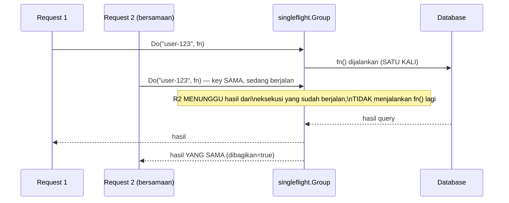

## TL;DR

Ketika sebuah cache key kedaluwarsa (atau belum pernah diisi) dan ribuan request bersamaan mencoba membacanya di jendela waktu yang sama, tanpa mekanisme tambahan, **setiap** request itu akan sama-sama gagal menemukan cache dan sama-sama memicu query database yang identik ke sumber data yang sama — fenomena yang dibahas lebih luas sebagai [[Cache Stampede|cache stampede]]. `golang.org/x/sync/singleflight` menyelesaikan masalah ini di level aplikasi: request-request yang identik yang tiba bersamaan **digabung** jadi satu eksekusi nyata, dan seluruh request itu menerima hasil yang sama dari satu eksekusi tunggal itu, bukan masing-masing memicu pekerjaan duplikat.

## The Problem

Sebuah endpoint yang menampilkan profil pengguna melakukan cache-aside sederhana: cek Redis, kalau tidak ada (cache miss), query database, simpan hasilnya ke Redis, kembalikan hasil. Untuk pengguna yang jarang diakses, ini bekerja sempurna. Tapi untuk profil yang sangat populer (misalnya akun instansi resmi yang dilihat ribuan warga sekaligus), begitu cache key-nya kedaluwarsa, ribuan request yang datang **hampir bersamaan** semuanya mengalami cache miss di waktu yang sama — dan tanpa koordinasi, ribuan query database yang **identik** dijalankan hampir bersamaan untuk data yang sama persis, membebani database jauh melebihi yang seharusnya dibutuhkan (yang idealnya cukup satu query untuk melayani seluruh ribuan request itu).

Masalah ini sulit terlihat di testing biasa (yang jarang mensimulasikan ribuan request identik bersamaan) dan baru muncul nyata di production saat data yang benar-benar populer kebetulan kedaluwarsa di jam sibuk — sebuah lonjakan beban database yang tiba-tiba dan sulit dijelaskan tanpa memahami mekanisme di baliknya.

## Intuition

Bayangkan singleflight seperti **satu orang yang ditugaskan mengantre di loket untuk mewakili seluruh tetangga yang butuh dokumen yang sama**, alih-alih setiap tetangga mengantre sendiri-sendiri untuk permintaan yang identik. Kalau sepuluh tetangga sama-sama butuh fotokopi dokumen yang sama persis di waktu yang sama, jauh lebih efisien satu orang mengantre sekali, mendapat hasilnya, lalu membagikan salinan ke sembilan tetangga lain — dibanding sepuluh orang mengantre terpisah untuk permintaan yang secara substansi identik.

Analogi ini bocor pada satu hal: perwakilan yang mengantre di dunia nyata butuh koordinasi eksplisit ("siapa mau ikut titip fotokopi?") sebelum antre dimulai. `singleflight` melakukan penggabungan ini **secara otomatis dan transparan** — goroutine yang memanggil fungsi yang sama dengan key yang sama, di jendela waktu yang tumpang tindih dengan panggilan yang sedang berlangsung, otomatis "menumpang" pada eksekusi yang sudah berjalan, tanpa perlu koordinasi eksplisit dari kode pemanggil.

## How It Works

```go
package main

import (
	"fmt"
	"sync"

	"golang.org/x/sync/singleflight"
)

var grup singleflight.Group

func ambilProfilDenganSingleflight(userID string) (string, error) {
	// Do() menerima KEY (untuk mengidentifikasi request yang "sama") dan
	// fungsi yang benar-benar mengambil data. Kalau ada panggilan LAIN
	// dengan key yang SAMA sedang berjalan, panggilan ini MENUNGGU hasil
	// panggilan itu, TIDAK menjalankan fungsinya sendiri lagi.
	hasil, err, dibagikan := grup.Do(userID, func() (interface{}, error) {
		return queryDatabaseProfil(userID)
	})

	if dibagikan {
		fmt.Println("hasil ini dibagikan dari panggilan lain yang sedang berjalan")
	}

	if err != nil {
		return "", err
	}
	return hasil.(string), nil
}

func queryDatabaseProfil(userID string) (string, error) {
	// simulasi query database yang relatif lambat
	return fmt.Sprintf("profil-%s", userID), nil
}

func contohSimulasi() {
	var wg sync.WaitGroup
	// SERATUS goroutine memanggil dengan key yang SAMA, hampir bersamaan —
	// TANPA singleflight, ini akan memicu 100 query database. DENGAN
	// singleflight, hanya SATU query yang benar-benar dijalankan.
	for i := 0; i < 100; i++ {
		wg.Add(1)
		go func() {
			defer wg.Done()
			ambilProfilDenganSingleflight("user-populer-123")
		}()
	}
	wg.Wait()
}
```



Diagram ini menunjukkan inti mekanisme: `Request 2` yang datang **selagi** `Request 1` masih menunggu hasil query, tidak memicu query kedua — ia menunggu dan menerima hasil yang sama persis begitu query pertama selesai, mengurangi seratus query duplikat menjadi satu query nyata.

## Under The Hood

`singleflight.Group` secara internal memakai mutex untuk melindungi map dari key ke "panggilan yang sedang berjalan" (`call`) — begitu sebuah `Do(key, fn)` dipanggil dan tidak ada panggilan lain dengan key yang sama sedang berjalan, ia mendaftarkan dirinya sebagai panggilan aktif untuk key itu, menjalankan `fn()`, lalu menghapus pendaftaran itu dan mendistribusikan hasil ke seluruh pemanggil yang menunggu (termasuk dirinya sendiri). Nilai kembalian ketiga, `dibagikan` (`shared` di dokumentasi resmi), memberi tahu apakah hasil ini didapat dari eksekusi yang benar-benar dijalankan pemanggil ini sendiri, atau "dipinjam" dari eksekusi pemanggil lain — berguna untuk logging/metrik yang ingin membedakan keduanya.

Penting dipahami: `singleflight` hanya menggabungkan panggilan yang **tumpang tindih waktu eksekusinya** — kalau panggilan pertama sudah selesai sebelum panggilan kedua dengan key sama tiba (meski hanya berselang sepersekian detik), panggilan kedua akan menjalankan `fn()`-nya sendiri dari awal, bukan memakai hasil panggilan pertama yang sudah selesai. `singleflight` bukan cache — ia murni mendeduplikasi permintaan yang **sedang berjalan** bersamaan, tidak menyimpan hasil untuk dipakai di masa depan.

## In Go

```go
package cache

import (
	"context"
	"fmt"

	"golang.org/x/sync/singleflight"
)

// CacheDenganSingleflight menggabungkan cache-aside biasa dengan
// singleflight — mencegah cache stampede TEPAT pada titik cache miss,
// di mana banyak request bersamaan sama-sama gagal menemukan cache.
type CacheDenganSingleflight struct {
	grup singleflight.Group
}

func (c *CacheDenganSingleflight) AmbilProfil(ctx context.Context, userID string) (string, error) {
	if v, ada := cekRedis(userID); ada {
		return v, nil
	}

	// Cache miss — TAPI singleflight memastikan hanya SATU dari banyak
	// request bersamaan yang benar-benar menjalankan query + simpan cache.
	hasil, err, _ := c.grup.Do(userID, func() (interface{}, error) {
		data, err := queryDatabaseProfil(userID)
		if err != nil {
			return nil, fmt.Errorf("query profil %s: %w", userID, err)
		}
		simpanKeRedis(userID, data)
		return data, nil
	})
	if err != nil {
		return "", err
	}
	return hasil.(string), nil
}

func cekRedis(key string) (string, bool)   { return "", false }
func simpanKeRedis(key, value string)      {}
```

## In His Stack

Cache stampede pada key populer adalah risiko nyata untuk sistem dengan data yang diakses tidak merata (beberapa entitas jauh lebih populer dari yang lain) — `singleflight` adalah pertahanan murah yang bisa ditambahkan di level aplikasi Go tanpa perlu infrastruktur tambahan (berbeda dari solusi seperti distributed lock yang butuh koordinasi lintas instance, dibahas di [[Distributed Locks and Why They Are Dangerous]]) — meski perlu diingat `singleflight` hanya bekerja **dalam satu instance/proses**, tidak mencegah stampede yang terjadi lintas banyak instance aplikasi yang berjalan paralel (untuk itu, mekanisme tambahan seperti locking di level Redis tetap dibutuhkan).

## Trade-offs and When Not To Use It

`singleflight` hanya efektif untuk mengurangi duplikasi **dalam satu proses/instance** — kalau aplikasi berjalan sebagai banyak pod/instance (umum di Kubernetes), setiap instance punya `singleflight.Group` sendiri-sendiri, sehingga stampede tetap bisa terjadi **lintas instance** meski masing-masing instance sudah mendeduplikasi permintaan internalnya sendiri. Untuk kebutuhan itu, `singleflight` perlu dikombinasikan dengan mekanisme lain (cache yang di-refresh proaktif sebelum kedaluwarsa, atau locking terdistribusi) — `singleflight` adalah satu lapis pertahanan yang murah dan mudah diterapkan, bukan solusi lengkap untuk seluruh masalah cache stampede pada sistem multi-instance.

## Common Mistakes

> [!warning] Jebakan
> Mengira `singleflight` adalah cache — ia hanya mendeduplikasi panggilan yang **sedang berjalan bersamaan**, tidak menyimpan hasil untuk dipakai permintaan yang datang setelah eksekusi sebelumnya selesai.

> [!warning] Jebakan
> Mengandalkan `singleflight` sebagai satu-satunya pertahanan cache stampede pada aplikasi yang berjalan sebagai banyak instance/pod — deduplikasi hanya terjadi dalam satu proses, stampede lintas instance tetap mungkin terjadi.

> [!warning] Jebakan
> Memakai key yang terlalu generik untuk `Do()` (misalnya key yang sama untuk request yang sebenarnya butuh data berbeda) — menyebabkan request yang seharusnya independen keliru menerima hasil yang dimaksudkan untuk request lain.

## Exercises

1. Jelaskan bagaimana `singleflight` mengurangi cache stampede pada key yang sangat populer.
2. Kenapa `singleflight` bukan pengganti cache, meski keduanya sama-sama mengurangi beban ke sumber data?
3. Kenapa `singleflight` tidak sepenuhnya menyelesaikan cache stampede untuk aplikasi yang berjalan sebagai banyak instance?
4. Desain terbuka: endpoint dashboard-mu memanggil tiga fungsi berbeda yang masing-masing mengambil data dari sumber berbeda (status permohonan, jumlah dokumen, notifikasi), dan ketiganya sering diakses bersamaan oleh banyak pengguna untuk entitas yang sama. Rancang bagaimana `singleflight` diterapkan untuk ketiga fungsi ini, dan jelaskan apakah kamu akan memakai satu `singleflight.Group` bersama atau tiga terpisah, beserta alasannya.

> [!success]- Kunci jawaban
> **1.** Ketika cache key yang sangat populer kedaluwarsa, ribuan request yang datang hampir bersamaan semuanya mengalami cache miss — tanpa `singleflight`, masing-masing memicu query database sendiri-sendiri. Dengan `singleflight`, permintaan pertama yang mengalami cache miss benar-benar menjalankan query, sementara permintaan-permintaan lain yang datang selagi query pertama masih berjalan **menunggu** hasil query itu alih-alih menjalankan query mereka sendiri — mengurangi ribuan query duplikat menjadi satu query nyata yang hasilnya dibagikan ke semua yang menunggu.
> **4.** Pakai **tiga `singleflight.Group` terpisah**, satu untuk masing-masing fungsi (status permohonan, jumlah dokumen, notifikasi) — karena ketiganya adalah operasi yang secara substansi berbeda dengan sumber data berbeda; menggabungkannya dalam satu Group dengan key yang mencoba membedakan ketiganya (misalnya `"status:"+id`, `"dokumen:"+id`) secara teknis bisa bekerja, tapi memisahkan Group per jenis operasi lebih jelas secara desain dan menghindari risiko key yang tumpang tindih secara tidak sengaja antar jenis operasi yang berbeda. Setiap Group tetap mendeduplikasi berdasarkan ID entitas sebagai key-nya sendiri (`grup.Do(permohonanID, fn)`), sehingga permintaan bersamaan untuk permohonan yang sama pada masing-masing dari ketiga jenis data itu tetap terdeduplikasi secara independen satu sama lain.

## Self-Check

- Bagaimana `singleflight` mengurangi cache stampede?
- Kenapa `singleflight` bukan pengganti cache?
- Kenapa `singleflight` tidak cukup untuk aplikasi yang berjalan sebagai banyak instance?
- Apa yang ditunjukkan nilai kembalian `dibagikan`/`shared` dari `Do()`?

## Connected Notes

- [[Cache Stampede]] — masalah yang diselesaikan sebagian oleh `singleflight`, dibahas lebih luas (termasuk solusi lain) di note itu.
- [[errgroup]] — package terkait dari `golang.org/x/sync` yang menyelesaikan masalah concurrency berbeda (agregasi error dari fan-out).
- [[The Sync Package]] — `singleflight` dibangun di atas mutex dan mekanisme sinkronisasi dasar yang dijelaskan di note itu.
- [[Distributed Locks and Why They Are Dangerous]] — mekanisme tambahan yang dibutuhkan untuk mencegah stampede lintas banyak instance, di luar cakupan `singleflight` yang hanya bekerja dalam satu proses.
- [[Cache-Aside, Write-Through, and Write-Behind]] — pola cache-aside yang menjadi konteks utama di mana cache stampede dan `singleflight` menjadi relevan.

## Further Reading

- Dokumentasi resmi package `golang.org/x/sync/singleflight`.

## Catatan Saya

*Tulis di sini apakah ada endpoint di kerjaanmu dengan data populer yang berisiko cache stampede — dan apakah singleflight bisa membantu di sana.*
