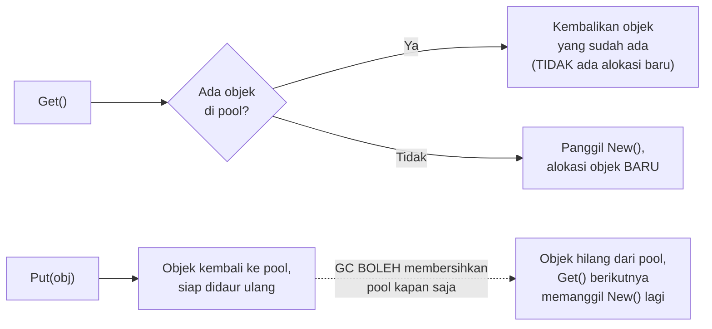

## TL;DR

[[Reducing Allocations]] membahas cara menghindari alokasi yang tidak perlu sejak awal. `sync.Pool` menyelesaikan masalah yang sedikit berbeda: untuk objek yang **memang** perlu terus-menerus dibuat dan dibuang (misalnya buffer sementara yang dipakai lalu tidak diperlukan lagi setelah satu request selesai), `sync.Pool` menyediakan tempat **mendaur ulang** objek itu — alih-alih membuang objek lama ke GC dan mengalokasikan objek baru untuk request berikutnya, objek lama diletakkan kembali ke pool dan diambil ulang oleh request berikutnya, mengurangi jumlah alokasi baru secara signifikan pada hot path yang berulang.

## The Problem

Sebuah handler yang memproses upload file besar mengalokasikan buffer sementara (`make([]byte, 64*1024)`) di setiap request untuk membaca data secara chunk — untuk aplikasi dengan ribuan upload per detik, ini berarti ribuan alokasi buffer 64KB per detik, sebagian besar berumur sangat pendek (dipakai sebentar lalu langsung tidak dipakai lagi setelah request selesai). Setiap alokasi ini menambah beban GC (lihat [[Garbage Collection in Go]]) untuk membersihkannya kembali — pola "alokasi cepat, buang cepat, berulang-ulang" ini adalah kandidat ideal untuk didaur ulang, karena bentuk dan ukuran objeknya konsisten dari satu request ke request berikutnya.

## Intuition

Bayangkan `sync.Pool` seperti **rak nampan di kantin yang dipakai bergantian**, dibanding setiap orang membawa nampan baru dan membuangnya setelah sekali pakai. Nampan yang sudah dipakai satu orang dikembalikan ke rak, dicuci (kalau perlu), dan siap dipakai orang berikutnya — jauh lebih efisien dibanding memproduksi nampan baru setiap kali ada orang makan, dan membuang nampan lama begitu saja. `sync.Pool` bekerja dengan filosofi yang sama: objek yang sudah "dipakai" dan tidak dibutuhkan lagi dikembalikan ke pool, siap diambil ulang oleh kode yang membutuhkan objek serupa berikutnya.

Analogi ini bocor pada satu hal penting: rak nampan kantin **selalu** menyimpan nampan sampai benar-benar dipakai lagi. `sync.Pool` **tidak menjamin** objek yang dikembalikan akan tetap ada di pool — GC boleh membersihkan isi pool kapan saja (biasanya di antara siklus GC), sehingga kode yang mengambil dari pool **harus** selalu siap menerima kemungkinan pool itu kosong dan perlu membuat objek baru — `sync.Pool` adalah optimasi best-effort, bukan jaminan objek akan selalu tersedia untuk didaur ulang.

## How It Works

```go
package main

import (
	"fmt"
	"sync"
)

// bufferPool menyimpan []byte berukuran 64KB yang bisa didaur ulang
// antar request — New() dipanggil HANYA kalau pool kosong dan tidak
// ada objek yang bisa didaur ulang saat ini.
var bufferPool = sync.Pool{
	New: func() interface{} {
		fmt.Println("membuat buffer BARU (pool kosong)")
		return make([]byte, 64*1024)
	},
}

func prosesUpload(data []byte) {
	// Get() mengambil objek dari pool (atau memanggil New() kalau kosong).
	buf := bufferPool.Get().([]byte)
	// PENTING: defer Put() SEGERA setelah Get(), memastikan buffer
	// selalu dikembalikan meski terjadi early return atau panic.
	defer bufferPool.Put(buf)

	// ... pakai buf untuk memproses data ...
	copy(buf, data)
}
```



## Under The Hood

`sync.Pool` bersifat **per-P** (per konteks penjadwalan, lihat [[Goroutine Scheduler (GMP)]]) secara internal — setiap P punya penyimpanan lokalnya sendiri untuk pool, mengurangi kontensi lock yang akan terjadi kalau seluruh goroutine di semua P berebut satu penyimpanan pool tunggal yang sama. Objek juga bisa "dicuri" (work stealing, mirip goroutine) dari pool P lain kalau pool lokal kosong, sebelum benar-benar memanggil `New()`.

**Objek di `sync.Pool` dibersihkan GC secara agresif** — pada implementasi yang berlaku di banyak versi Go, objek yang tidak diambil sebelum siklus GC berikutnya berisiko dibersihkan sepenuhnya (pool dikosongkan). Ini desain yang **disengaja** — `sync.Pool` bukan cache jangka panjang, ia murni mengurangi alokasi untuk objek berumur pendek yang polanya "alokasi cepat, buang cepat, ulangi" dalam rentang waktu singkat antar siklus GC.

**Objek yang dikembalikan ke pool harus di-reset** ke keadaan bersih sebelum (atau segera setelah) diambil kembali — `sync.Pool` tidak melakukan ini secara otomatis. Melupakan reset adalah sumber bug yang serius: objek yang masih menyimpan data dari pemakaian sebelumnya bisa **bocor** ke pemakaian berikutnya yang tidak menyadarinya, berpotensi membocorkan data antar request yang seharusnya sepenuhnya terisolasi satu sama lain — kelas bug keamanan yang serius kalau melibatkan data sensitif.

## In Go

```go
package main

import (
	"bytes"
	"sync"
)

// Pool untuk *bytes.Buffer adalah pola sangat umum — buffer sering
// dipakai sementara untuk membangun output (JSON, response body) dan
// dibuang setelah request selesai.
var bufferPool = sync.Pool{
	New: func() interface{} {
		return new(bytes.Buffer)
	},
}

func BangunResponse(data map[string]string) []byte {
	buf := bufferPool.Get().(*bytes.Buffer)
	buf.Reset() // WAJIB: bersihkan isi dari pemakaian SEBELUMNYA sebelum dipakai lagi
	defer bufferPool.Put(buf)

	for k, v := range data {
		buf.WriteString(k)
		buf.WriteString("=")
		buf.WriteString(v)
		buf.WriteString("\n")
	}

	// Salin hasil SEBELUM buffer dikembalikan ke pool — mengembalikan
	// slice yang MENUNJUK ke buffer internal akan rusak begitu buffer
	// itu dipakai ulang oleh Get() berikutnya.
	hasil := make([]byte, buf.Len())
	copy(hasil, buf.Bytes())
	return hasil
}
```

## In His Stack

`sync.Pool` untuk buffer sementara adalah optimasi yang relevan untuk endpoint dengan volume tinggi yang memproses payload besar berulang kali (upload dokumen, response JSON besar) — tapi seperti teknik optimasi lain di domain ini, sebaiknya diterapkan **setelah** profiling (lihat [[pprof Profiling]]) mengonfirmasi alokasi buffer memang menjadi kontributor signifikan pada tekanan GC, bukan diterapkan di semua tempat secara membabi buta berdasarkan asumsi.

## Trade-offs and When Not To Use It

`sync.Pool` menambah kompleksitas kode nyata — kewajiban me-reset objek sebelum dipakai ulang, risiko bug kebocoran data antar pemakaian kalau reset terlupa, dan kode yang lebih sulit dibaca dibanding sekadar `make()` biasa. Untuk objek yang **tidak** dialokasikan dalam volume tinggi berulang (dipanggil jarang, atau ukurannya sangat kecil), `sync.Pool` tidak memberi manfaat yang sepadan dengan kompleksitas tambahannya — GC modern Go sudah cukup efisien untuk menangani alokasi objek berumur pendek dalam volume rendah tanpa perlu didaur ulang manual. `sync.Pool` paling bernilai untuk objek yang **cukup besar** (sehingga alokasinya benar-benar terasa) dan dipakai dalam **volume sangat tinggi** dengan pola pakai-buang yang konsisten — kombinasi yang relatif spesifik, bukan pola optimasi default untuk semua kode.

## Common Mistakes

> [!warning] Jebakan
> Lupa me-reset objek yang diambil dari pool sebelum dipakai — objek yang masih menyimpan data dari pemakaian sebelumnya bisa bocor ke pemakaian berikutnya, berpotensi membocorkan data sensitif antar request yang seharusnya terisolasi.

> [!warning] Jebakan
> Mengembalikan slice/pointer yang menunjuk ke bagian internal objek pool (misalnya `buf.Bytes()` tanpa disalin) setelah objek dikembalikan ke pool — data itu bisa berubah atau rusak begitu objek yang sama diambil ulang dan dipakai kode lain.

> [!warning] Jebakan
> Menerapkan `sync.Pool` untuk objek yang jarang dialokasikan atau berukuran sangat kecil — menambah kompleksitas kode tanpa manfaat performa yang sepadan, karena GC modern sudah cukup efisien untuk kasus volume rendah.

## Exercises

1. Jelaskan kenapa `sync.Pool` disebut optimasi "best-effort", bukan jaminan objek akan selalu bisa didaur ulang.
2. Kenapa objek yang diambil dari pool wajib di-reset sebelum dipakai?
3. Kenapa mengembalikan slice yang menunjuk ke buffer internal objek pool berbahaya setelah objek itu dikembalikan ke pool?
4. Desain terbuka: kamu ingin menerapkan `sync.Pool` untuk struct `KonteksPemrosesan` yang dipakai setiap kali memproses satu dokumen upload (berisi beberapa field slice dan map internal). Rancang fungsi reset yang tepat untuk struct ini sebelum dikembalikan ke pool, dan jelaskan kenapa sekadar membuat struct baru dengan `KonteksPemrosesan{}` alih-alih me-reset field satu per satu bisa jadi kurang optimal untuk kasus tertentu.

> [!success]- Kunci jawaban
> **1.** `sync.Pool` tidak menjamin objek yang dikembalikan lewat `Put()` akan tetap tersedia untuk diambil kembali lewat `Get()` di kemudian hari — runtime Go boleh membersihkan isi pool kapan saja, terutama di sekitar siklus GC. Ini "best-effort" karena kode yang memakai pool harus selalu siap menerima kemungkinan `New()` dipanggil (objek benar-benar baru dibuat) meski sebelumnya sudah pernah mengembalikan objek serupa ke pool — tidak ada jaminan objek yang dikembalikan pasti akan didaur ulang.
> **4.** Fungsi reset idealnya mengosongkan **isi** field yang bisa membawa data sisa (misalnya `slice = slice[:0]` untuk mempertahankan kapasitas yang sudah dialokasikan sambil mengosongkan isi, dan `for k := range map { delete(map, k) }` atau membuat map baru kalau map itu sendiri kecil) — tujuannya mempertahankan **kapasitas** memori yang sudah dialokasikan (slice, map) sambil membersihkan **isi** data lama. Membuat struct benar-benar baru dengan `KonteksPemrosesan{}` justru **membuang** kapasitas slice/map yang sudah dialokasikan sebelumnya — pemakaian berikutnya harus mengalokasikan ulang kapasitas itu dari awal saat slice/map itu mulai diisi lagi, meniadakan sebagian besar manfaat `sync.Pool` (yang tujuannya justru mendaur ulang alokasi yang sudah ada, bukan hanya struct wadahnya).

## Self-Check

- Kenapa `sync.Pool` disebut optimasi best-effort?
- Kenapa objek dari pool wajib di-reset sebelum dipakai?
- Kenapa mengembalikan referensi ke bagian internal objek pool berbahaya?
- Kapan `sync.Pool` tidak memberi manfaat yang sepadan dengan kompleksitasnya?

## Connected Notes

- [[Reducing Allocations]] — `sync.Pool` melengkapi teknik pengurangan alokasi dengan mendaur ulang objek yang memang perlu terus dialokasikan, dibahas di note sebelumnya.
- [[Garbage Collection in Go]] — mengurangi alokasi lewat pool secara langsung mengurangi beban kerja GC yang dijelaskan di note itu.
- [[Goroutine Scheduler (GMP)]] — penyimpanan pool per-P bertumpu pada struktur GMP yang dijelaskan di note itu.
- [[pprof Profiling]] — heap profile adalah cara memverifikasi bahwa penerapan sync.Pool benar-benar mengurangi alokasi secara terukur.
- [[Benchmarking in Go]] — benchmark before-after adalah cara yang tepat memverifikasi manfaat nyata sync.Pool untuk kasus spesifik.

## Further Reading

- Dokumentasi resmi Go, package `sync`, tipe `Pool`.

## Catatan Saya

*Tulis di sini apakah ada buffer atau objek sementara di kerjaanmu yang dialokasikan berulang dalam volume tinggi — apakah sync.Pool bisa membantu di sana.*
