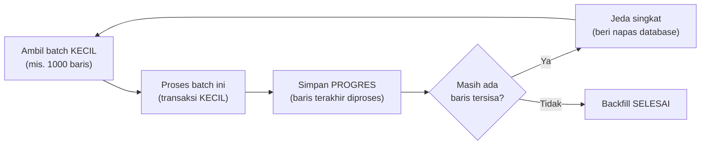

## TL;DR

Backfill adalah proses mengisi atau memperbarui data historis dalam jumlah besar — mengisi kolom baru untuk jutaan baris lama, menghitung ulang agregat untuk seluruh riwayat data, atau menyalin data ke sistem baru (seperti tahap snapshot di [[Zero-Downtime Database Migration Using CDC]]). Berbeda dari operasi harian yang menyentuh sedikit baris, backfill menyentuh **jutaan baris sekaligus**, dan cara menjalankannya secara naif (satu operasi besar mencakup semuanya) hampir selalu berakhir buruk: mengunci tabel dalam waktu lama, membebani database sampai memperlambat operasi normal, atau gagal di tengah jalan tanpa cara melanjutkan dari titik terakhir tanpa mengulang dari awal.

## The Problem

Sebuah tim perlu mengisi kolom baru `wilayah_hukum` untuk 15 juta baris kasus lama yang sudah ada, dihitung dari data provinsi yang sudah tersimpan di kolom lain. Pendekatan yang terlihat paling sederhana: satu statement `UPDATE kasus SET wilayah_hukum = hitung_wilayah(provinsi)` yang mencakup seluruh tabel sekaligus. Statement ini dijalankan — dan setelah lima menit berjalan tanpa tanda selesai, tim mulai menerima laporan bahwa aplikasi production melambat drastis, karena statement `UPDATE` besar ini mengunci baris (atau bahkan seluruh tabel, tergantung mesin database dan konfigurasinya) dalam waktu lama, memblokir operasi tulis normal yang sedang berlangsung dari pengguna nyata.

Tim akhirnya membatalkan statement itu di tengah jalan — tapi karena statement itu berjalan sebagai satu transaksi besar, pembatalan berarti **seluruh** progres yang sudah dibuat (baris yang sudah sempat diperbarui) ikut di-rollback, kembali ke titik nol. Waktu dan beban database yang sudah dikeluarkan untuk lima menit pertama itu sia-sia sepenuhnya, dan tim harus memikirkan ulang pendekatan dari awal — sesuatu yang seharusnya bisa dihindari kalau strategi backfill yang lebih aman dipakai sejak awal.

## Intuition

Cara paling mudah memahaminya: backfill naif seperti **mencoba memindahkan seluruh isi gudang dalam satu angkutan truk raksasa** yang memblokir seluruh jalan akses gudang selama proses berlangsung — siapa pun yang butuh masuk atau keluar gudang untuk urusan lain harus menunggu truk itu selesai, dan kalau truk itu mogok di tengah jalan, seluruh barang yang sudah dimuat (tapi belum sampai tujuan) terjebak, tidak ada progres yang tersimpan aman. Backfill yang aman seperti **memindahkan barang secara bertahap memakai truk kecil**, satu muatan kecil per perjalanan, dengan jeda di antara perjalanan supaya jalan akses gudang tetap bisa dipakai kegiatan lain — kalau satu truk kecil mogok di tengah jalan, hanya muatan truk itu yang tertunda, seluruh muatan yang sudah berhasil diantar sebelumnya tetap aman di tempat tujuan.

Analogi ini nyaris sepenuhnya menangkap esensinya. Detail teknis yang tidak sepenuhnya tertangkap: "jeda di antara perjalanan" pada backfill database punya tujuan yang lebih spesifik dari sekadar analogi kemacetan jalan — jeda ini secara sengaja memberi database waktu memproses beban normal (query dari pengguna nyata) di antara setiap batch backfill, mencegah beban backfill menumpuk dan mendominasi kapasitas database yang seharusnya melayani traffic production.

## How It Works


Prinsip inti: pecah operasi besar jadi **banyak transaksi kecil**, bukan satu transaksi raksasa. Setiap batch (biasanya beberapa ratus hingga beberapa ribu baris, disesuaikan dengan karakteristik tabel dan beban sistem) diproses dalam transaksinya sendiri, dan **progresnya disimpan** — biasanya berupa ID baris terakhir yang berhasil diproses. Kalau proses backfill terhenti di tengah jalan (karena gangguan, atau sengaja dihentikan), ia bisa **dilanjutkan** dari titik terakhir yang tersimpan, bukan mengulang dari awal — perbedaan besar dari statement raksasa di "The Problem" yang kehilangan seluruh progres begitu dibatalkan.

## Under The Hood

Ukuran batch yang tepat adalah keseimbangan antara kecepatan penyelesaian dan dampak ke beban database — batch yang terlalu besar mendekati masalah statement raksasa (mengunci terlalu banyak baris sekaligus untuk waktu yang cukup lama untuk terasa), batch yang terlalu kecil membuat proses keseluruhan sangat lambat karena overhead memulai dan menyelesaikan transaksi kecil berulang kali. Ukuran ideal biasanya ditemukan lewat eksperimen di lingkungan yang mirip production (mengukur berapa lama satu batch memakan waktu dan seberapa besar dampaknya ke latency query normal), bukan angka yang ditebak tanpa pengujian.

Jeda antar batch juga penting bukan hanya untuk "memberi napas" — pada beberapa database, jeda ini juga memberi kesempatan proses vacuum/cleanup internal database (di PostgreSQL, misalnya) untuk mengejar ketertinggalan, mencegah bloat yang bisa terjadi kalau backfill besar dijalankan tanpa jeda sama sekali dalam waktu yang cukup lama. Backfill yang benar-benar besar (puluhan juta baris) sering dijalankan dengan **throttling adaptif** — kecepatan batch disesuaikan otomatis berdasarkan metrik beban database saat ini (lihat [[../70 Infrastructure and Delivery/Metrics - The RED and USE Methods|Metrics - The RED and USE Methods]]), memperlambat backfill otomatis kalau database terdeteksi sedang sibuk melayani traffic production, dan mempercepat kembali saat beban normal turun.

## In Go

```go
package backfill

import (
	"context"
	"database/sql"
	"fmt"
	"time"
)

// State disimpan PERSISTEN — bukan hanya di memori proses backfill,
// supaya bisa DILANJUTKAN kalau proses ini terhenti (crash, restart,
// atau dihentikan sengaja) tanpa mengulang dari awal.
type State struct {
	LastProcessedID int64
}

func LoadState(ctx context.Context, db *sql.DB, jobName string) (State, error) {
	var lastID int64
	err := db.QueryRowContext(ctx, `SELECT last_id FROM backfill_progress WHERE job_name = $1`, jobName).Scan(&lastID)
	if err == sql.ErrNoRows {
		return State{LastProcessedID: 0}, nil
	}
	return State{LastProcessedID: lastID}, err
}

func SaveState(ctx context.Context, db *sql.DB, jobName string, state State) error {
	_, err := db.ExecContext(ctx, `
		INSERT INTO backfill_progress (job_name, last_id) VALUES ($1, $2)
		ON CONFLICT (job_name) DO UPDATE SET last_id = $2
	`, jobName, state.LastProcessedID)
	return err
}

// RunBackfill memproses PER-BATCH KECIL, bukan satu operasi besar —
// setiap batch adalah transaksi TERPISAH, dan progres disimpan
// setelah SETIAP batch berhasil.
func RunBackfill(ctx context.Context, db *sql.DB, jobName string, batchSize int, pause time.Duration) error {
	state, err := LoadState(ctx, db, jobName)
	if err != nil {
		return fmt.Errorf("backfill: memuat progres: %w", err)
	}

	for {
		res, err := db.ExecContext(ctx, `
			UPDATE kasus
			SET wilayah_hukum = compute_wilayah(provinsi)
			WHERE id > $1 AND id <= $1 + $2
		`, state.LastProcessedID, batchSize)
		if err != nil {
			return fmt.Errorf("backfill: batch gagal (progres tersimpan di ID %d, aman dilanjutkan): %w", state.LastProcessedID, err)
		}

		rows, _ := res.RowsAffected()
		if rows == 0 {
			return nil // backfill selesai
		}

		state.LastProcessedID += int64(batchSize)
		if err := SaveState(ctx, db, jobName, state); err != nil {
			return fmt.Errorf("backfill: menyimpan progres: %w", err)
		}

		select {
		case <-ctx.Done():
			return ctx.Err()
		case <-time.After(pause):
			// jeda sengaja diberi — memberi database "napas" untuk
			// melayani beban production normal di antara batch.
		}
	}
}
```

## In His Stack

Untuk tabel besar di sistem legal-services (riwayat kasus yang terus bertambah bertahun-tahun), disiplin backfill per-batch bukan opsional — statement `UPDATE` raksasa pada tabel dengan jutaan baris kasus, dijalankan tanpa strategi batch, berisiko mengunci sistem tepat saat petugas sedang aktif mengakses layanan, persis skenario di "The Problem" yang bisa terjadi kapan saja tanpa disiplin ini. Sebelum menjalankan backfill apa pun di production, praktik yang aman adalah menguji dulu di lingkungan staging dengan volume data yang mendekati production, mengukur waktu dan dampak nyata batch tertentu sebelum menjalankannya di sistem yang sungguhan melayani pengguna.

## Trade-offs and When Not To Use It

Backfill per-batch dengan jeda dan penyimpanan progres menambah kompleksitas implementasi dibanding statement tunggal sederhana — untuk tabel kecil (ribuan baris, bukan jutaan) yang bisa diperbarui dalam hitungan detik tanpa dampak berarti ke beban database, statement sederhana langsung sudah cukup dan lebih mudah diimplementasikan. Disiplin batch dan progres tersimpan jelas sepadan untuk tabel besar (jutaan baris ke atas) di sistem production yang aktif dipakai — di titik itu, risiko dampak ke pengguna nyata dari pendekatan naif jauh melebihi biaya implementasi pendekatan yang lebih hati-hati.

## Common Mistakes

> [!warning] Jebakan
> Menjalankan backfill sebagai satu statement besar yang mencakup seluruh tabel sekaligus — mengunci baris dalam waktu lama dan berisiko memblokir operasi normal, persis masalah di "The Problem".

> [!warning] Jebakan
> Tidak menyimpan progres backfill secara persisten — kalau proses terhenti di tengah jalan, seluruh progres hilang dan harus dimulai ulang dari awal, membuang waktu dan beban database yang sudah dikeluarkan sebelumnya.

> [!warning] Jebakan
> Menjalankan backfill tanpa jeda antar batch, mengandalkan batch kecil saja untuk aman — batch kecil yang dijalankan tanpa henti bisa tetap membebani database secara signifikan kalau tidak diberi jeda untuk melayani beban normal di antaranya.

## Exercises

1. Jelaskan kenapa backfill sebagai satu statement besar berisiko untuk tabel dengan jutaan baris.
2. Kenapa progres backfill harus disimpan persisten, bukan hanya di memori proses yang menjalankannya?
3. Jelaskan trade-off ukuran batch yang terlalu besar versus terlalu kecil.
4. Desain terbuka: kamu perlu menghitung ulang dan mengisi kolom agregat baru (`total_dokumen`) untuk 20 juta baris kasus lama di salah satu dari 13 aplikasimu, dan sistem ini harus tetap melayani petugas 24/7 tanpa gangguan berarti. Rancang strategi backfill lengkap untuk operasi ini, termasuk bagaimana menentukan ukuran batch yang tepat dan bagaimana memantau dampaknya selama backfill berjalan.

> [!success]- Kunci jawaban
> **1.** Statement besar yang mencakup jutaan baris sekaligus mengunci baris (atau bahkan seluruh tabel, tergantung mesin database) dalam waktu yang cukup lama untuk terasa oleh operasi normal, memblokir tulisan dari pengguna nyata yang sedang aktif memakai sistem — dan kalau statement ini gagal atau dibatalkan di tengah jalan sebagai satu transaksi besar, seluruh progres yang sudah dibuat ikut hilang.
> **4.** (1) Uji dulu di lingkungan staging dengan volume data yang mendekati production untuk menemukan ukuran batch yang memberi waktu proses wajar tanpa mengunci terlalu lama — mulai dari batch kecil (misalnya 1000 baris) dan ukur dampaknya, sesuaikan naik atau turun berdasarkan hasil pengujian; (2) implementasikan backfill dengan penyimpanan progres persisten (ID baris terakhir diproses tersimpan di tabel terpisah), memastikan proses bisa dilanjutkan dari titik terhenti kalau terjadi gangguan; (3) tambahkan jeda antar batch (misalnya beberapa ratus milidetik) untuk memberi database waktu melayani beban normal di antara setiap batch backfill; (4) jalankan backfill di jam dengan traffic lebih rendah kalau memungkinkan (meski tidak wajib mengingat pendekatan batch sudah dirancang aman untuk beban 24/7), dan pantau metrik latency query normal secara real-time selama backfill berjalan (lihat [[../70 Infrastructure and Delivery/Metrics - The RED and USE Methods|Metrics - The RED and USE Methods]]) — kalau terdeteksi dampak signifikan ke latency normal, perlambat atau hentikan sementara backfill, lanjutkan lagi setelah beban database kembali normal, memakai progres yang sudah tersimpan.

## Self-Check

- Kenapa backfill sebagai satu statement besar berisiko untuk tabel besar?
- Kenapa progres backfill harus disimpan persisten?
- Apa trade-off ukuran batch yang terlalu besar versus terlalu kecil?
- Apa fungsi throttling adaptif dalam backfill skala besar?

## Connected Notes

- [[Zero-Downtime Database Migration Using CDC]] — tahap snapshot awal pada migrasi berbasis CDC pada dasarnya adalah operasi backfill skala besar yang dibahas prinsip amannya di note ini.
- [[../70 Infrastructure and Delivery/Zero-Downtime Database Migrations|Zero-Downtime Database Migrations]] — backfill per-batch adalah teknik konkret yang disebut di note itu untuk tahap migrasi data pada pola expand-contract.
- [[../70 Infrastructure and Delivery/Metrics - The RED and USE Methods|Metrics - The RED and USE Methods]] — memantau dampak backfill ke beban database secara real-time butuh metrik yang dibahas di note itu.
- [[../94 Case Studies/_Overview|Case Studies Overview]] — skenario migrasi skema pada tabel 200 juta baris tanpa downtime adalah salah satu tema case study yang relevan langsung dengan prinsip di note ini.
- [[Dual Writes and Their Dangers]] — backfill yang dijalankan bersamaan dengan periode dual-write (saat migrasi) butuh koordinasi ekstra untuk menghindari konflik antara data yang di-backfill dan data yang baru ditulis aplikasi secara real-time.

## Further Reading

- Dokumentasi resmi berbagai tool migrasi database (gh-ost, pt-online-schema-change untuk MySQL/MariaDB) — implementasi nyata strategi batch dan throttling adaptif untuk operasi skala besar pada database production.

## Catatan Saya

*Tulis di sini operasi backfill paling besar yang pernah (atau perlu) dijalankan di salah satu dari 13 aplikasimu, dan apakah strategi batch yang aman sudah diterapkan atau belum.*
