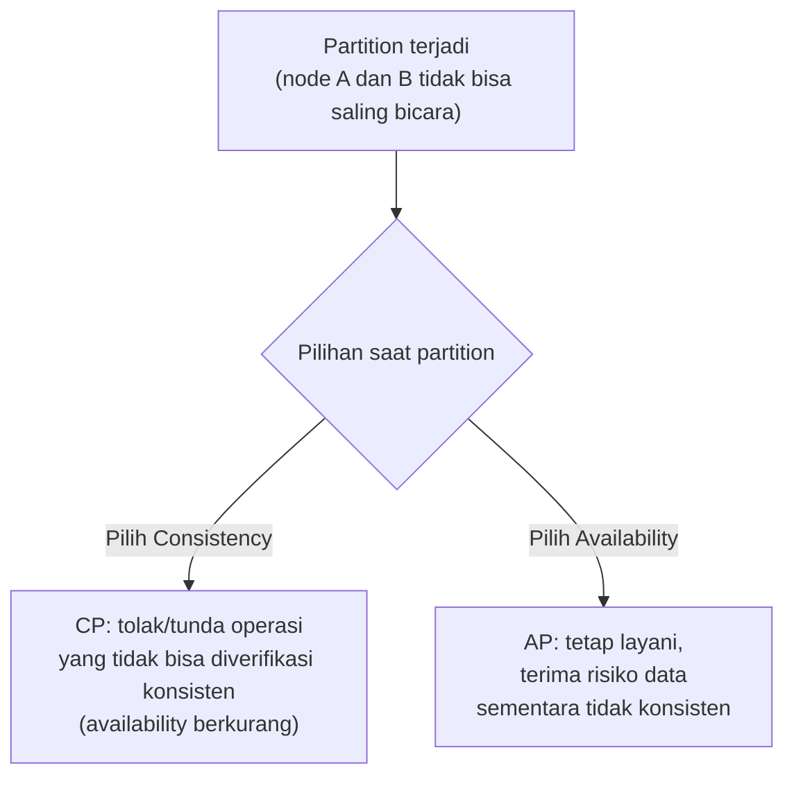

## TL;DR

CAP theorem menyatakan: saat terjadi **partition** (jaringan antar node terputus atau tidak bisa saling bicara), sebuah sistem terdistribusi harus memilih antara **consistency** (semua node melihat data yang sama, konsisten) atau **availability** (sistem tetap merespons, meski sebagian node terputus) — tidak bisa mendapat keduanya sekaligus selama partition itu berlangsung. Ini bukan trade-off yang bisa direkayasa hilang lewat desain yang lebih pintar — ia adalah keterbatasan matematis yang berlaku untuk **setiap** sistem terdistribusi yang menyimpan data di lebih dari satu node. **PACELC** memperluas CAP dengan pertanyaan lanjutan yang sama pentingnya: bahkan saat **tidak** ada partition (kondisi normal), sistem tetap harus memilih antara **latency** rendah atau **consistency** ketat — trade-off yang berlaku setiap saat, bukan hanya saat partition terjadi.

## The Problem

Sebuah tim merancang sistem yang menyimpan data kasus hukum di dua data center berbeda untuk redundansi — kalau satu data center mati total, yang lain tetap bisa melayani. Suatu hari, koneksi jaringan antara kedua data center terputus (partition) selama beberapa menit karena masalah infrastruktur di luar kendali tim. Selama jendela waktu itu, tim dihadapkan pertanyaan yang tidak bisa dihindari: kalau seorang petugas mengubah data kasus di data center A selama partition berlangsung, apakah sistem (1) tetap menerima perubahan itu dan melayani petugas seperti biasa, menerima risiko data center A dan B sekarang punya versi data yang berbeda (memilih availability), atau (2) menolak perubahan itu sampai partition pulih dan kedua data center bisa saling verifikasi lagi, membuat petugas tidak bisa bekerja sementara (memilih consistency)?

Tidak ada jawaban yang "benar secara universal" — ini murni trade-off yang harus diputuskan sadar berdasarkan konsekuensi masing-masing pilihan untuk kasus penggunaan spesifik. Masalah sebenarnya bukan partition itu sendiri (yang menurut kenyataan jaringan, cepat atau lambat pasti terjadi) — masalahnya adalah tim tidak pernah secara eksplisit memutuskan mana yang mereka pilih **sebelum** partition terjadi, sehingga saat insiden nyata berlangsung, keputusan diambil terburu-buru di bawah tekanan, bukan sebagai desain yang sudah dipikirkan matang.

## Intuition

Cara paling mudah memahaminya: bayangkan dua kasir di toko yang sama, masing-masing punya catatan stok barang sendiri, biasanya saling menyinkronkan catatan tiap beberapa menit lewat telepon. Suatu saat, telepon di antara mereka putus (partition). Kasir pertama menerima pelanggan yang ingin membeli barang terakhir yang tersisa menurut catatannya — ia punya dua pilihan: **jual saja** (availability — tetap melayani, meski berisiko kasir kedua juga menjual barang yang sama karena catatannya belum tersinkron, menghasilkan dua penjualan untuk satu barang), atau **tolak dulu** sampai telepon tersambung lagi dan bisa memastikan kasir kedua belum menjualnya (consistency — aman dari duplikasi, tapi pelanggan menunggu atau pergi kecewa).

Analogi ini nyaris tidak bocor — inilah persis esensi CAP theorem dalam bentuk paling sederhana. Yang tidak tertangkap analogi ini adalah skala: sistem terdistribusi nyata punya lebih dari dua node, dan pilihan consistency-availability bisa diambil **berbeda-beda per operasi**, bukan satu keputusan tunggal untuk seluruh sistem — sebagian operasi (baca saldo) mungkin memilih consistency, sebagian lain (baca katalog produk) memilih availability, dalam sistem yang sama.

## How It Works


Nama "CAP" sering disalahpahami seolah sistem harus memilih dua dari tiga huruf secara bebas — kenyataannya, **Partition tolerance bukan pilihan** untuk sistem yang benar-benar terdistribusi (jaringan **akan** terputus cepat atau lambat, itu fakta yang harus diterima, bukan opsi yang bisa "dimatikan"). Pilihan nyata hanya ada di antara **C** dan **A**, dan hanya relevan **selama partition berlangsung** — di luar partition, sistem yang didesain baik bisa memberi keduanya sekaligus.

**PACELC** memperluas gambaran ini: **P**artition → pilih antara **A**vailability atau **C**onsistency (ini CAP); **E**lse (kondisi normal, tidak ada partition) → pilih antara **L**atency rendah atau **C**onsistency ketat. Baris kedua ini penting karena menunjukkan trade-off yang berlaku **setiap saat**, bukan hanya saat insiden jaringan langka — bahkan sistem yang berjalan normal tanpa partition tetap harus memilih: menunggu konfirmasi dari semua replika sebelum menganggap tulisan berhasil (consistency ketat, latency lebih tinggi), atau menganggap tulisan berhasil begitu satu node menerimanya, mengorbankan sedikit consistency demi respons yang lebih cepat.

## Under The Hood

CAP theorem, sebagaimana dibuktikan formal oleh Eric Brewer dan kemudian Seth Gilbert dan Nancy Lynch, berlaku spesifik untuk sistem yang menyimpan **data yang sama di lebih dari satu node** dan harus menjaga konsistensi di antara node-node itu. Sistem yang tidak menyimpan data terduplikasi di banyak node (sistem single-node murni) tidak tunduk pada trade-off ini sama sekali — CAP hanya relevan begitu replikasi data lintas node masuk ke gambaran.

Kesalahpahaman umum yang perlu diluruskan: CAP bukan tentang memilih arsitektur sekali untuk selamanya — banyak sistem nyata (termasuk database modern) memungkinkan **konfigurasi per-operasi**, memilih tingkat consistency yang berbeda untuk kebutuhan berbeda dalam sistem yang sama. Baca saldo rekening mungkin butuh consistency ketat (linearizable, lihat [[Consistency Models]]); baca jumlah "like" di postingan media sosial mungkin bisa menerima eventual consistency demi latency yang jauh lebih rendah. Trade-off CAP/PACELC diambil di level **keputusan desain per kebutuhan**, bukan di level "seluruh sistem harus satu pilihan".

## In Go

```go
package replication

import (
	"context"
	"fmt"
)

// WriteConcern merepresentasikan keputusan CAP/PACELC yang DIAMBIL
// SECARA SADAR per operasi — bukan satu pilihan tunggal untuk
// seluruh sistem.
type WriteConcern int

const (
	// AcknowledgeOne: tulisan dianggap berhasil begitu SATU node
	// menerimanya — latency rendah, tapi risiko konsistensi kalau
	// node itu gagal sebelum sempat mereplikasi ke node lain.
	AcknowledgeOne WriteConcern = iota
	// AcknowledgeQuorum: tulisan dianggap berhasil setelah MAYORITAS
	// node mengonfirmasi — latency lebih tinggi, konsistensi lebih kuat.
	AcknowledgeQuorum
	// AcknowledgeAll: tulisan HARUS dikonfirmasi SEMUA node — latency
	// paling tinggi, konsistensi paling kuat, availability paling rendah
	// (satu node mati berarti tulisan gagal sepenuhnya).
	AcknowledgeAll
)

type Node interface {
	Write(ctx context.Context, key, value string) error
}

// Write menunjukkan keputusan trade-off PACELC yang EKSPLISIT,
// dipilih berdasarkan kebutuhan operasi ini, bukan hardcoded satu
// pilihan untuk seluruh sistem.
func Write(ctx context.Context, nodes []Node, concern WriteConcern, key, value string) error {
	required := requiredAcks(concern, len(nodes))
	acked := 0

	for _, node := range nodes {
		if err := node.Write(ctx, key, value); err == nil {
			acked++
		}
		if acked >= required {
			return nil // Syarat concern terpenuhi, TIDAK menunggu sisa node
		}
	}

	return fmt.Errorf("replication: hanya %d/%d node mengonfirmasi, butuh %d", acked, len(nodes), required)
}

func requiredAcks(concern WriteConcern, totalNodes int) int {
	switch concern {
	case AcknowledgeOne:
		return 1
	case AcknowledgeQuorum:
		return totalNodes/2 + 1
	case AcknowledgeAll:
		return totalNodes
	default:
		return 1
	}
}
```

## In His Stack

MariaDB dengan replikasi master-replica (lihat [[../40 Databases/Read Replicas and Replication Lag|Read Replicas and Replication Lag]]) yang sudah dipakai di banyak sistem 13 aplikasi sebenarnya sudah membuat pilihan PACELC secara implisit: replikasi asinkron standar memilih **latency rendah** (tulisan ke master tidak menunggu replica selesai menyalin) dengan konsekuensi **eventual consistency** ke replica (ada jeda, replication lag, sebelum replica benar-benar konsisten dengan master). Memahami CAP/PACELC membantu tim menjelaskan **kenapa** pilihan ini masuk akal untuk kebanyakan kasus penggunaan (laporan yang dibaca dari replica boleh sedikit tertinggal), dan kapan trade-off ini justru berbahaya (baca saldo yang harus selalu akurat, tidak boleh membaca dari replica yang mungkin tertinggal).

## Trade-offs and When Not To Use It

Bukan CAP theorem itu sendiri yang punya "kapan tidak dipakai" — ia berlaku universal untuk sistem terdistribusi. Yang punya trade-off adalah **pilihan** yang diambil di dalamnya: memilih consistency ketat (CP) untuk semua operasi menjamin data selalu benar tapi mengorbankan availability dan latency, cocok untuk data yang konsekuensi ketidakkonsistenannya mahal (transaksi finansial, keputusan hukum). Memilih availability (AP) menjaga sistem tetap responsif bahkan saat partition, cocok untuk data yang bisa menerima ketidakkonsistenan sementara (jumlah pengunjung halaman, rekomendasi yang tidak kritis) — memaksakan CP untuk semua data, termasuk yang tidak butuh, membuat sistem lebih rapuh dan lebih lambat dari yang seharusnya.

## Common Mistakes

> [!warning] Jebakan
> Menganggap CAP berarti memilih dua dari tiga huruf secara bebas ("kami pilih CA") — partition tolerance bukan opsional untuk sistem yang benar-benar terdistribusi; pilihan nyata hanya antara C dan A, dan hanya relevan selama partition berlangsung.

> [!warning] Jebakan
> Menganggap seluruh sistem harus memilih satu titik di spektrum CAP/PACELC untuk semua data — kebanyakan sistem nyata bermanfaat memilih trade-off berbeda untuk kebutuhan data berbeda dalam sistem yang sama.

> [!warning] Jebakan
> Baru memikirkan trade-off consistency-availability saat insiden partition sungguhan terjadi, bukan sebagai keputusan desain yang sudah dipertimbangkan sejak awal — persis situasi tim di "The Problem", memutuskan di bawah tekanan alih-alih lewat desain yang matang.

## Exercises

1. Jelaskan pernyataan inti CAP theorem, dan kenapa partition tolerance bukan pilihan yang bisa "dimatikan" untuk sistem terdistribusi sungguhan.
2. Apa yang ditambahkan PACELC di atas CAP, dan kenapa tambahan itu penting bahkan saat tidak ada partition?
3. Jelaskan kenapa pilihan CAP/PACELC bisa diambil berbeda-beda per jenis operasi dalam satu sistem yang sama.
4. Desain terbuka: sistem legal-services yang kamu bangun menyimpan dua jenis data — (a) status pengajuan permohonan yang harus selalu akurat karena jadi dasar keputusan hukum, dan (b) jumlah kunjungan halaman untuk statistik penggunaan internal. Rancang trade-off CAP/PACELC yang berbeda untuk masing-masing jenis data ini, dan jelaskan alasannya.

> [!success]- Kunci jawaban
> **1.** CAP menyatakan bahwa saat terjadi partition jaringan, sistem terdistribusi harus memilih antara consistency (semua node melihat data sama) atau availability (sistem tetap merespons meski ada node yang terputus) — tidak bisa mendapat keduanya sekaligus selama partition. Partition tolerance bukan pilihan karena jaringan nyata, cepat atau lambat, pasti mengalami gangguan — sistem yang "memilih tidak toleran terhadap partition" sebenarnya hanya berarti ia akan rusak total begitu partition terjadi, bukan benar-benar menghindarinya.
> **4.** Untuk status pengajuan permohonan: pilih **consistency ketat** (CP, dan di PACELC sisi Else memilih consistency di atas latency) — konsekuensi status yang salah atau tidak sinkron (dua petugas melihat status berbeda untuk kasus yang sama) berdampak hukum nyata, latency ekstra untuk memastikan semua node sinkron sepadan dengan risiko yang dihindari. Untuk jumlah kunjungan halaman: pilih **availability dan latency rendah** (AP, dan di PACELC sisi Else memilih latency di atas consistency) — statistik yang sedikit tertinggal atau tidak sepenuhnya presisi tidak berdampak keputusan apa pun yang konsekuensinya serius, dan pengguna internal yang mengakses statistik ini jauh lebih diuntungkan oleh respons cepat dibanding akurasi sempurna hitungan detik terakhir.

## Self-Check

- Apa pernyataan inti CAP theorem?
- Kenapa partition tolerance bukan pilihan yang bisa dihindari?
- Apa yang ditambahkan PACELC di atas CAP?
- Kenapa pilihan CAP/PACELC bisa berbeda per jenis operasi dalam sistem yang sama?

## Connected Notes

- [[The Fallacies of Distributed Computing]] — CAP theorem adalah formalisasi trade-off yang muncul langsung dari kenyataan bahwa jaringan tidak selalu andal (fallacy #1), dibahas di note sebelumnya.
- [[Consistency Models]] — kelanjutan langsung: spektrum consistency yang lebih terperinci dari sekadar "consistent atau tidak" yang disederhanakan CAP.
- [[../40 Databases/Read Replicas and Replication Lag|Read Replicas and Replication Lag]] — replikasi database adalah contoh paling konkret trade-off PACELC yang sudah dipakai luas di sistem production.
- [[../40 Databases/Basic Isolation Levels|Basic Isolation Levels]] — isolation level pada database tunggal adalah analog lokal dari trade-off consistency-latency yang jadi tema CAP/PACELC di skala terdistribusi.
- [[Quorums]] — mekanisme konkret (mayoritas node) yang sering dipakai mengimplementasikan pilihan consistency dalam trade-off CAP.

## Further Reading

- Eric Brewer, presentasi asli CAP theorem (2000), dan pembuktian formal oleh Seth Gilbert dan Nancy Lynch (2002) — sumber akademik asli yang layak dibaca langsung untuk pemahaman rigor, relevan untuk ambisi studi master distributed systems.
- Daniel Abadi, tulisan asli yang memperkenalkan PACELC sebagai perluasan CAP.

## Catatan Saya

*Tulis di sini data mana di salah satu dari 13 aplikasimu yang butuh consistency ketat, dan data mana yang sebenarnya bisa menerima eventual consistency tapi saat ini diperlakukan terlalu ketat (atau sebaliknya).*
