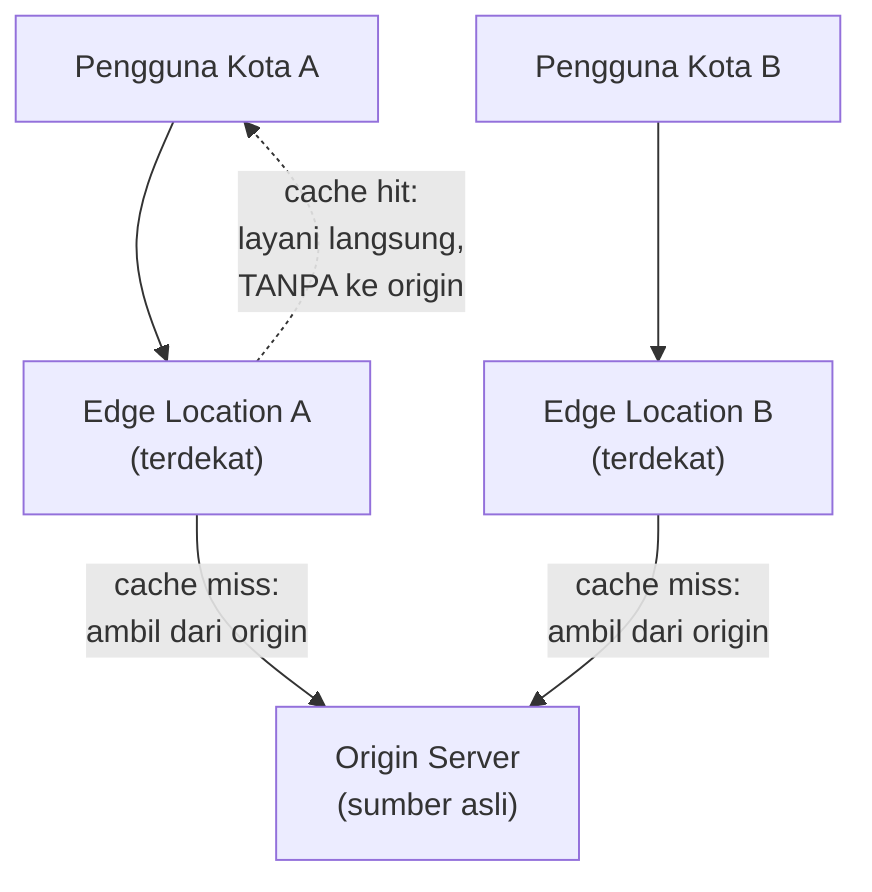

## TL;DR

[[Multi-Region Architecture and Geo-Replication]] menyelesaikan masalah latency dengan mereplikasi **seluruh sistem** (termasuk data yang bisa berubah) ke banyak lokasi — solusi lengkap tapi mahal dan kompleks. Untuk konten yang **tidak sering berubah** — aset statis (gambar, CSS, JavaScript), halaman yang jarang di-update, hasil API yang bisa di-cache — solusi yang jauh lebih murah dan sederhana cukup: **CDN (Content Delivery Network)** menyimpan salinan konten itu di banyak lokasi geografis (edge location) yang dekat dengan pengguna, tanpa perlu mereplikasi seluruh sistem backend. **Edge compute** melangkah lebih jauh: menjalankan **logika komputasi ringan** (bukan hanya menyimpan file statis) di lokasi edge yang sama, mendekatkan pemrosesan ke pengguna untuk kasus yang tidak butuh akses ke seluruh sistem backend.

## The Problem

Sebuah aplikasi web melayani pengguna dari seluruh Indonesia, tapi server backend dan seluruh aset statisnya (gambar logo, file CSS, JavaScript aplikasi) semuanya dilayani dari satu server di satu kota. Pengguna dari kota yang jauh mengalami waktu muat halaman yang lambat, bukan karena logika bisnis aplikasi itu lambat, tapi karena mengunduh file-file statis yang ukurannya cukup besar (gambar, bundle JavaScript) lewat jaringan yang harus menempuh jarak fisik jauh memakan waktu signifikan, terulang setiap kali pengguna baru mengunjungi halaman itu.

Solusi yang terlalu berat: membangun multi-region architecture penuh (replikasi seluruh backend dan database ke banyak lokasi) untuk masalah yang sebenarnya sederhana — file-file statis ini **tidak pernah berubah** berdasarkan siapa yang memintanya atau kapan, mereka identik untuk semua pengguna. Mereplikasi seluruh sistem backend (termasuk database yang berubah-ubah dan butuh konsistensi) untuk melayani file yang statis dan tidak pernah berubah adalah solusi yang jauh melebihi kebutuhan sebenarnya.

## Intuition

Cara paling mudah memahaminya: CDN seperti **jaringan minimarket waralaba** yang menyimpan stok barang yang sama (air mineral, camilan populer) di setiap cabangnya, dekat dengan pelanggan di berbagai wilayah — pelanggan tidak perlu pergi ke gudang pusat setiap kali butuh air mineral, cukup ke minimarket terdekat yang sudah menyimpan stok yang sama. Bandingkan dengan produk yang butuh dipesan khusus dan diproses di gudang pusat (analog data dinamis yang butuh backend) — untuk itu, pelanggan tetap harus menunggu proses dari pusat, tidak bisa cukup diambil dari cabang terdekat.

Analogi ini bocor pada soal seberapa sering "stok" itu diperbarui. Minimarket biasanya menerima pasokan baru secara berkala (mingguan, misalnya). CDN modern bisa memperbarui salinannya jauh lebih cepat dan otomatis (dalam hitungan detik hingga menit) begitu konten aslinya berubah, lewat mekanisme invalidasi cache — meski tetap ada jeda sesaat sebelum semua edge location "tahu" konten sudah diperbarui, mirip pertimbangan eventual consistency yang dibahas di [[Defensible Eventual Consistency]].

## How It Works


Permintaan pertama untuk sebuah file dari sebuah edge location (cache miss) diteruskan ke origin server, hasilnya disimpan di edge itu, dan **dikembalikan** ke pengguna. Permintaan berikutnya untuk file yang sama dari pengguna di dekat edge location yang sama (cache hit) dilayani langsung dari edge, tanpa perlu menempuh jarak jauh ke origin server sama sekali — inilah yang membuat CDN mengurangi latency secara dramatis untuk konten yang sering diakses berulang dari lokasi yang sama.

**Edge compute** memperluas ide ini melampaui sekadar menyimpan file statis — menjalankan kode (biasanya fungsi ringan, bukan aplikasi backend penuh) langsung di edge location, untuk kebutuhan yang tidak perlu akses penuh ke database atau state backend: memvalidasi header request, melakukan redirect berdasarkan lokasi geografis pengguna, personalisasi ringan berdasarkan data yang tersedia di edge, atau bahkan rendering halaman statis yang digabung dengan sedikit data dinamis sederhana.

## Under The Hood

Perbedaan mendasar CDN/edge compute dari multi-region architecture penuh ([[Multi-Region Architecture and Geo-Replication]]): CDN tidak perlu menyelesaikan masalah **konsistensi tulisan** karena kontennya (mayoritas) bersifat **read-only** dari sudut pandang edge — edge tidak pernah menerima tulisan langsung yang perlu direplikasi ke tempat lain, ia hanya menyimpan salinan dari satu sumber kebenaran (origin server), membuat masalah konsistensi jauh lebih sederhana (hanya perlu invalidasi cache saat origin berubah, bukan resolusi konflik tulisan ganda seperti active-active multi-region).

Cache invalidation — memberi tahu semua edge location bahwa konten yang mereka simpan sudah usang dan perlu diperbarui — adalah tantangan teknis nyata dalam praktik CDN, sering disebut sebagai salah satu dari sedikit masalah yang "benar-benar sulit" dalam ilmu komputer (bersama penamaan dan off-by-one error, sebagai lelucon terkenal di kalangan engineer). Strategi umum: memberi setiap konten waktu kedaluwarsa eksplisit (TTL, time-to-live) sehingga edge otomatis mengambil ulang dari origin setelah waktu tertentu berlalu, dikombinasikan dengan mekanisme invalidasi manual eksplisit untuk perubahan mendesak yang tidak bisa menunggu TTL habis.

## In Go

```go
package edge

import "net/http"

// CacheControlHeaders menunjukkan mekanisme PALING dasar yang
// membuat CDN tahu berapa lama konten boleh disimpan di edge
// sebelum dianggap usang — TANPA ini, CDN tidak tahu kapan harus
// mengambil ulang dari origin.
func SetCacheHeaders(w http.ResponseWriter, maxAgeSeconds int, isPublic bool) {
	visibility := "private"
	if isPublic {
		visibility = "public"
	}
	w.Header().Set("Cache-Control", "max-age="+itoa(maxAgeSeconds)+", "+visibility)
}

// ServeStaticAsset menunjukkan konten yang COCOK untuk CDN — tidak
// berubah berdasarkan siapa yang meminta, aman disimpan di banyak
// edge location sekaligus.
func ServeStaticAsset(w http.ResponseWriter, r *http.Request, assetPath string) {
	// Aset statis: TTL panjang, karena kontennya jarang berubah dan
	// sama untuk semua pengguna.
	SetCacheHeaders(w, 86400, true) // 24 jam
	http.ServeFile(w, r, assetPath)
}

// ServePersonalizedContent menunjukkan konten yang TIDAK cocok
// disimpan CDN publik — berbeda per pengguna, harus selalu ke origin
// (atau memakai private cache per pengguna, BUKAN cache bersama).
func ServePersonalizedContent(w http.ResponseWriter, r *http.Request, userID string) {
	SetCacheHeaders(w, 0, false) // TIDAK di-cache secara publik
	// proses personalisasi di sini
}

func itoa(n int) string {
	// implementasi sederhana, dalam praktik pakai strconv.Itoa
	return ""
}
```

## In His Stack

Untuk 13 aplikasi yang melayani pengguna di seluruh Indonesia, CDN adalah investasi dengan rasio manfaat-biaya yang jauh lebih baik dibanding multi-region architecture penuh untuk masalah latency aset statis — logo instansi, file CSS/JavaScript, dokumen publik yang bisa diunduh siapa saja, semuanya kandidat kuat untuk dilayani lewat CDN tanpa mengubah arsitektur backend sama sekali. Untuk konten yang benar-benar dinamis dan spesifik per pengguna (data kasus, status permohonan pribadi), CDN tidak relevan — kontennya harus selalu diambil segar dari backend, dan di sinilah pertimbangan multi-region (kalau memang dibutuhkan) baru masuk sebagai solusi yang berbeda untuk masalah yang berbeda.

## Trade-offs and When Not To Use It

CDN dan edge compute menambah kompleksitas invalidasi cache — konten yang salah kedaluwarsa (TTL terlalu panjang untuk konten yang sering berubah) bisa menyajikan versi usang ke pengguna, sementara TTL terlalu pendek mengurangi manfaat caching yang jadi alasan CDN dipakai sejak awal. Untuk sistem dengan basis pengguna yang secara geografis terkonsentrasi dekat dengan server (tidak tersebar luas), atau untuk konten yang seluruhnya dinamis dan personal (tidak ada aset statis atau konten bersama yang bisa di-cache), manfaat CDN jadi terbatas. CDN bernilai jelas justru untuk konten yang **statis atau jarang berubah** dan diakses banyak pengguna dari lokasi tersebar — kombinasi yang membuat caching di edge memberi manfaat maksimal dengan risiko minimal.

## Common Mistakes

> [!warning] Jebakan
> Menyimpan konten yang bersifat personal atau sensitif (data spesifik pengguna) di CDN publik dengan cache header yang salah (`public` alih-alih `private`) — berisiko satu pengguna melihat data cache milik pengguna lain yang kebetulan diminta dari edge location yang sama.

> [!warning] Jebakan
> Menetapkan TTL yang terlalu panjang untuk konten yang sebenarnya cukup sering berubah — pengguna melihat versi usang lebih lama dari yang seharusnya, dan invalidasi manual jadi kebutuhan rutin yang merepotkan alih-alih pengecualian jarang.

> [!warning] Jebakan
> Membangun multi-region architecture penuh untuk masalah yang sebenarnya bisa diselesaikan CDN — investasi berlebihan untuk masalah yang skalanya jauh lebih sederhana dari yang dikira, seperti dibahas di "The Problem".

## Exercises

1. Jelaskan perbedaan mendasar CDN dengan multi-region architecture penuh, dan kenapa CDN lebih sederhana untuk masalah yang tepat.
2. Apa itu cache invalidation, dan kenapa ia dianggap salah satu masalah yang secara terkenal sulit dalam praktik?
3. Kenapa CDN tidak relevan untuk konten yang benar-benar personal dan dinamis?
4. Desain terbuka: salah satu dari 13 aplikasimu menyajikan dokumen publik (peraturan, formulir yang bisa diunduh siapa saja) yang sesekali diperbarui (beberapa kali sebulan), dan saat ini semua permintaan dokumen ini langsung ke server backend meski isinya jarang berubah. Rancang strategi CDN untuk dokumen ini, termasuk kebijakan TTL dan bagaimana menangani pembaruan dokumen yang mendesak.

> [!success]- Kunci jawaban
> **1.** Multi-region architecture mereplikasi seluruh sistem (termasuk data yang berubah-ubah) untuk mengurangi latency operasi baca dan tulis. CDN hanya menyimpan salinan konten yang tidak sering berubah di banyak lokasi, tanpa perlu mereplikasi backend atau menyelesaikan masalah konsistensi tulisan — jauh lebih sederhana karena kontennya bersifat read-only dari sudut pandang edge.
> **4.** Sajikan dokumen ini lewat CDN dengan TTL sedang (misalnya 1-6 jam, cukup untuk mengurangi beban origin secara signifikan tanpa membuat pembaruan terasa terlalu lambat sampai ke pengguna) — kombinasikan dengan mekanisme invalidasi manual eksplisit yang bisa dipicu tim saat dokumen benar-benar butuh diperbarui segera (misalnya perubahan peraturan mendesak) tanpa menunggu TTL habis. Untuk dokumen yang jarang berubah (bulanan), TTL yang lebih panjang (misalnya 24 jam) dengan invalidasi manual untuk kasus mendesak adalah keseimbangan yang wajar antara mengurangi beban origin server secara maksimal dan tetap memberi jalur cepat untuk pembaruan yang benar-benar butuh segera terlihat pengguna.

## Self-Check

- Apa perbedaan mendasar CDN dengan multi-region architecture penuh?
- Apa itu cache invalidation, dan kenapa ia terkenal sulit?
- Kenapa CDN tidak relevan untuk konten personal dan dinamis?
- Kapan CDN memberi manfaat maksimal?

## Connected Notes

- [[Multi-Region Architecture and Geo-Replication]] — CDN adalah solusi yang jauh lebih ringan untuk sebagian masalah latency yang tidak selalu butuh replikasi data penuh seperti dibahas di note sebelumnya.
- [[Defensible Eventual Consistency]] — jeda antara konten diperbarui di origin dan tersinkron ke seluruh edge location adalah bentuk eventual consistency yang perlu dipertanggungjawabkan lewat kebijakan TTL yang jelas.
- [[../30 APIs and Web/Pre-signed URLs|Pre-signed URLs]] — pola penyimpanan file eksternal yang sering dipasangkan dengan CDN untuk distribusi konten publik seperti dokumen atau gambar.
- [[../50 Concurrency and Performance/Cache-Aside, Write-Through, and Write-Behind|Cache-Aside, Write-Through, and Write-Behind]] — prinsip caching yang dibahas di domain performance berlaku dengan pertimbangan serupa untuk CDN, hanya diterapkan di skala geografis.
- [[Multi-Tenancy]] — kelanjutan langsung: pertimbangan arsitektur skala berikutnya, melayani banyak pelanggan dari satu sistem yang sama.

## Further Reading

- Dokumentasi CDN dari penyedia besar (Cloudflare, AWS CloudFront) bagian strategi cache invalidation — sumber praktis yang membahas implementasi nyata trade-off yang dibahas di note ini.

## Catatan Saya

*Tulis di sini aset statis atau konten publik di salah satu dari 13 aplikasimu yang masih dilayani langsung dari backend, dan potensi manfaat kalau dipindah ke CDN.*
