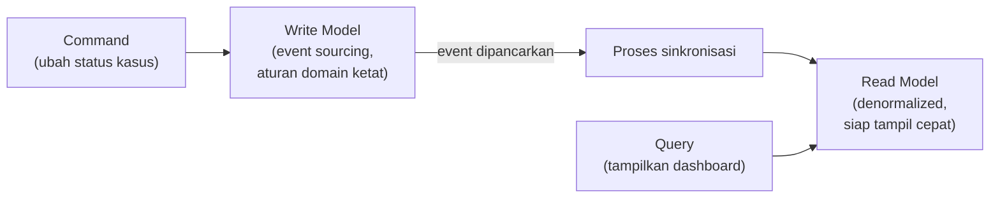

## TL;DR

CQRS (Command Query Responsibility Segregation) memisahkan jalur **menulis** data (command) dari jalur **membaca** data (query) menjadi dua model yang berbeda, alih-alih memakai satu model data yang sama untuk keduanya seperti kebanyakan aplikasi CRUD konvensional. Alasannya: kebutuhan menulis dan membaca sering punya bentuk yang sangat berbeda — menulis butuh validasi bisnis yang ketat dan struktur yang mencerminkan aturan domain (cocok dengan model event sourcing di [[Event Sourcing]]), sementara membaca butuh bentuk yang dioptimalkan untuk ditampilkan cepat (denormalized, siap pakai, kadang digabung dari beberapa sumber) — memaksakan satu model untuk keduanya sering berarti kompromi yang tidak optimal untuk kedua kebutuhan sekaligus.

## The Problem

Sebuah sistem kasus hukum memakai event sourcing (lihat [[Event Sourcing]]) untuk mencatat setiap perubahan kasus sebagai event. Halaman dashboard yang menampilkan ringkasan ratusan kasus sekaligus — status, tanggal pengajuan, petugas yang menangani, jumlah dokumen — butuh menghitung ulang state dari event untuk **setiap** kasus yang ditampilkan setiap kali halaman itu dibuka. Untuk satu kasus, replay event mungkin cepat; untuk menampilkan ratusan kasus sekaligus di satu halaman, replay berulang ini menjadi lambat secara nyata, membuat dashboard yang seharusnya cepat dibuka jadi terasa berat.

Masalahnya bukan event sourcing itu sendiri salah pilih — masalahnya adalah memakai model yang sama (replay event) untuk kebutuhan menulis (yang memang butuh riwayat lengkap dan aturan domain ketat) dan kebutuhan membaca skala besar (yang butuh kecepatan dan bentuk data yang sudah siap ditampilkan). Keduanya adalah kebutuhan yang berbeda secara fundamental, dan memaksakan satu model data melayani keduanya menghasilkan kompromi yang buruk untuk salah satu (atau keduanya).

## Intuition

Cara paling mudah memahaminya: bayangkan dapur restoran (menulis/command) dan etalase display makanan jadi (membaca/query). Dapur adalah tempat proses rumit terjadi — bahan mentah diolah lewat banyak langkah, dengan aturan dan standar ketat (higiene, resep, urutan memasak). Etalase display hanya menampilkan hasil akhir yang sudah jadi, disusun rapi dan siap dilihat pelanggan secepat mungkin — pelanggan tidak perlu (dan tidak mau) melihat proses memasak yang rumit di dapur setiap kali ingin tahu menu apa yang tersedia. Keduanya menangani "makanan" yang sama, tapi dengan bentuk dan tujuan yang sangat berbeda — memaksa etalase menampilkan proses memasak mentah-mentah (analog memakai model command untuk query) akan lambat dan membingungkan pelanggan.

Analogi ini bocor pada soal kesegaran. Etalase restoran diperbarui manual oleh koki setiap kali ada makanan baru jadi. CQRS butuh mekanisme **otomatis** yang menjaga read model tetap sinkron dengan write model — biasanya lewat event yang dipancarkan setiap kali command berhasil, memicu update ke read model. Ada jeda waktu antara command selesai dan read model ter-update (biasanya sangat singkat, tapi bukan nol), sesuatu yang jadi pertimbangan trade-off penting, dibahas di [[Defensible Eventual Consistency]].

## How It Works


Command mengalir lewat write model yang menegakkan aturan bisnis ketat dan mencatat setiap perubahan sebagai event. Setiap event yang berhasil memicu proses sinkronisasi yang memperbarui read model — bentuk data terpisah yang sudah "diratakan" (denormalized) dan dioptimalkan khusus untuk kecepatan tampilan, seringkali menggabungkan data dari beberapa write model sekaligus dalam satu tabel read yang siap di-`SELECT` langsung tanpa join atau perhitungan rumit.

Query **tidak pernah** menyentuh write model sama sekali — seluruh kebutuhan membaca dilayani read model yang sudah dioptimalkan, membuat dashboard di "The Problem" tinggal membaca tabel read model yang sudah siap pakai, tanpa perlu replay event apa pun setiap kali halaman dibuka.

## Under The Hood

CQRS tidak **mengharuskan** event sourcing di baliknya — keduanya sering dipasangkan karena saling melengkapi secara alami (event sourcing menyediakan sumber kebenaran yang kaya untuk write model, CQRS menyediakan cara efisien menampilkannya), tapi CQRS bisa diterapkan pada sistem dengan write model konvensional juga: command menulis ke tabel normal seperti biasa, lalu memicu update terpisah ke tabel read model yang di-denormalisasi. Pemisahan intinya ada di **tanggung jawab** (command vs query), bukan pada teknologi penyimpanan spesifik yang dipakai di baliknya.

Read model bisa memakai teknologi penyimpanan yang **sama sekali berbeda** dari write model — write model di database relasional untuk transaksi ACID yang ketat, read model di [[../92 Tools/Elasticsearch|Elasticsearch]] untuk pencarian cepat, atau di [[../92 Tools/Redis|Redis]] untuk akses super cepat dengan struktur sederhana. Fleksibilitas ini adalah salah satu manfaat terbesar CQRS: setiap kebutuhan baca yang berbeda (pencarian teks, dashboard agregat, tampilan detail) bisa punya read model sendiri yang dioptimalkan khusus untuk kebutuhan itu, tanpa terikat pada satu struktur tabel yang harus melayani semuanya sekaligus.

## In Go

```go
package cqrs

import "context"

// Command dan Query TERPISAH secara EKSPLISIT — bukan satu
// interface generik yang menangani keduanya.
type ChangeStatusCommand struct {
	CaseID    string
	NewStatus string
	Actor     string
}

type CommandHandler interface {
	Handle(ctx context.Context, cmd ChangeStatusCommand) error
}

// CaseSummary adalah READ MODEL — bentuk data yang SUDAH SIAP
// ditampilkan, TIDAK memerlukan replay event atau join rumit.
type CaseSummary struct {
	CaseID       string
	Status       string
	PetugasNama  string
	JumlahDokumen int
	TanggalAjuan string
}

type QueryHandler interface {
	ListCaseSummaries(ctx context.Context, filter Filter) ([]CaseSummary, error)
}

type Filter struct {
	Status string
}

// Projector adalah proses SINKRONISASI — mendengarkan event dari
// write model, memperbarui read model. Ini yang menjembatani
// keduanya, TANPA query pernah menyentuh write model langsung.
type Projector struct {
	ReadModelStore ReadModelStore
}

type ReadModelStore interface {
	UpdateSummary(ctx context.Context, summary CaseSummary) error
}

func (p *Projector) OnStatusChanged(ctx context.Context, caseID, newStatus string) error {
	// Bentuk sederhana: dalam praktik nyata, projector sering perlu
	// membaca data tambahan untuk melengkapi read model.
	return p.ReadModelStore.UpdateSummary(ctx, CaseSummary{
		CaseID: caseID,
		Status: newStatus,
	})
}
```

## In His Stack

Dashboard yang menampilkan ringkasan banyak kasus sekaligus (seperti di "The Problem") adalah kandidat tepat untuk CQRS di sistem legal-services — write model tetap menegakkan aturan bisnis ketat (siapa boleh mengubah status apa), sementara read model terpisah (bisa berupa tabel denormalized biasa di MariaDB, tidak harus teknologi baru) dilayani cepat tanpa replay atau join berat. Untuk 13 aplikasi yang belum siap investasi event sourcing penuh, CQRS tetap bisa diterapkan sebagian: memisahkan tabel "read" yang diperbarui lewat trigger atau job sinkron dari tabel "write" normal, mendapat sebagian manfaat kecepatan baca tanpa harus migrasi penuh ke event sourcing.

## Trade-offs and When Not To Use It

CQRS menambah kompleksitas nyata — dua model data yang harus dijaga sinkron, proses sinkronisasi yang bisa gagal atau tertunda (menciptakan jeda eventual consistency antara command dan query yang melihatnya), dan kode yang harus ditulis dua kali untuk konsep yang sama (write model dan read model). Untuk aplikasi CRUD sederhana dengan volume baca-tulis rendah, satu model data yang sama untuk keduanya jauh lebih sederhana dan CQRS adalah overhead yang tidak sepadan. CQRS bernilai jelas begitu kebutuhan baca dan tulis benar-benar berbeda secara signifikan (validasi kompleks di tulis, agregasi berat di baca) atau begitu volume baca jauh melebihi tulis dan butuh optimasi terpisah.

## Common Mistakes

> [!warning] Jebakan
> Menerapkan CQRS untuk seluruh sistem tanpa mempertimbangkan bagian mana yang benar-benar butuh pemisahan ini — kebanyakan sistem hanya punya beberapa bagian (biasanya dashboard atau laporan agregat) yang benar-benar diuntungkan CQRS, sementara CRUD sederhana lain tidak perlu dipaksakan ke pola ini.

> [!warning] Jebakan
> Tidak menangani kegagalan proses sinkronisasi antara write model dan read model — kalau event gagal diproses projector (karena bug atau gangguan sesaat), read model bisa tertinggal permanen tanpa mekanisme pemulihan, membuat data yang ditampilkan makin lama makin tidak akurat.

> [!warning] Jebakan
> Membiarkan query mengakses write model langsung "sesekali" untuk kebutuhan yang dianggap mendesak, melewati read model — meniadakan sebagian manfaat pemisahan ini dan membuat sistem inkonsisten dalam menerapkan pola yang sudah dipilih.

## Exercises

1. Jelaskan alasan utama memisahkan model menulis dan membaca dalam CQRS.
2. Kenapa CQRS tidak mengharuskan event sourcing, meski keduanya sering dipasangkan?
3. Jelaskan kenapa read model boleh (dan sering menguntungkan) memakai teknologi penyimpanan yang berbeda dari write model.
4. Desain terbuka: dashboard laporan bulanan di salah satu dari 13 aplikasimu perlu menampilkan agregat data dari tiga sumber berbeda (jumlah kasus per status, waktu rata-rata penyelesaian, distribusi per petugas), dan saat ini dihitung langsung dari tabel transaksional setiap kali laporan dibuka, membuat halaman itu lambat. Rancang solusi CQRS untuk masalah ini, termasuk bagaimana read model diperbarui dan seberapa "segar" data yang ditampilkan perlu (dan boleh) tertinggal dari data transaksional yang sesungguhnya.

> [!success]- Kunci jawaban
> **1.** Kebutuhan menulis (validasi bisnis ketat, struktur mencerminkan aturan domain) dan membaca (kecepatan, bentuk data siap tampil) sering sangat berbeda secara fundamental — memaksakan satu model data untuk keduanya menghasilkan kompromi yang tidak optimal untuk salah satu atau keduanya, seperti dashboard yang lambat di "The Problem".
> **4.** Buat tabel read model terpisah `laporan_bulanan_summary` yang sudah berisi hasil agregat siap pakai (jumlah per status, rata-rata waktu penyelesaian, distribusi per petugas), diperbarui lewat job terjadwal (misalnya setiap jam, atau dipicu setiap kali ada perubahan status kasus lewat event/trigger) — bukan dihitung ulang setiap kali laporan dibuka. Untuk seberapa segar data boleh tertinggal: laporan bulanan secara alami tidak butuh data real-time detik-ke-detik (berbeda dari, misalnya, status kasus individual yang mungkin butuh akurasi lebih tinggi) — jeda beberapa jam atau bahkan sekali sehari untuk data agregat laporan biasanya bisa diterima sepenuhnya, membuat pilihan job terjadwal berkala (bukan sinkronisasi real-time yang lebih kompleks) sebagai solusi yang cukup dan lebih sederhana diimplementasikan.

## Self-Check

- Apa alasan utama memisahkan model menulis dan membaca dalam CQRS?
- Kenapa CQRS tidak mengharuskan event sourcing?
- Kenapa read model boleh memakai teknologi penyimpanan berbeda dari write model?
- Kapan CQRS adalah overhead yang tidak sepadan?

## Connected Notes

- [[Event Sourcing]] — CQRS sering dipasangkan dengan event sourcing untuk mengatasi biaya menghitung ulang state dari event setiap kali dibutuhkan, dibahas di note sebelumnya.
- [[Defensible Eventual Consistency]] — jeda antara command selesai dan read model ter-update adalah bentuk eventual consistency yang butuh dipertanggungjawabkan secara sadar, dibahas di klaster yang sama.
- [[../92 Tools/Elasticsearch|Elasticsearch]] dan [[../92 Tools/Redis|Redis]] — dua contoh teknologi yang sering dipakai sebagai read model terpisah dari write model relasional.
- [[../50 Concurrency and Performance/Cache-Aside, Write-Through, and Write-Behind|Cache-Aside, Write-Through, and Write-Behind]] — read model pada CQRS berbagi banyak pertimbangan trade-off yang sama dengan strategi caching yang dibahas di domain itu.
- [[Change Data Capture]] — mekanisme praktis yang sering dipakai memicu sinkronisasi dari write model ke read model tanpa mengubah kode aplikasi write model itu sendiri.

## Further Reading

- Greg Young, "CQRS Documents" — dokumen yang banyak dirujuk sebagai penjelasan awal pola CQRS oleh salah satu tokoh yang mempopulerkannya bersama event sourcing.
- Martin Fowler, "CQRS" (martinfowler.com) — pengantar yang membahas juga kapan CQRS **tidak** dibutuhkan, penyeimbang penting terhadap antusiasme berlebihan memakai pola ini di mana-mana.

## Catatan Saya

*Tulis di sini dashboard atau laporan di salah satu dari 13 aplikasimu yang lambat karena menghitung ulang agregat setiap kali dibuka, dan apakah CQRS bisa jadi solusi yang realistis untuknya.*
