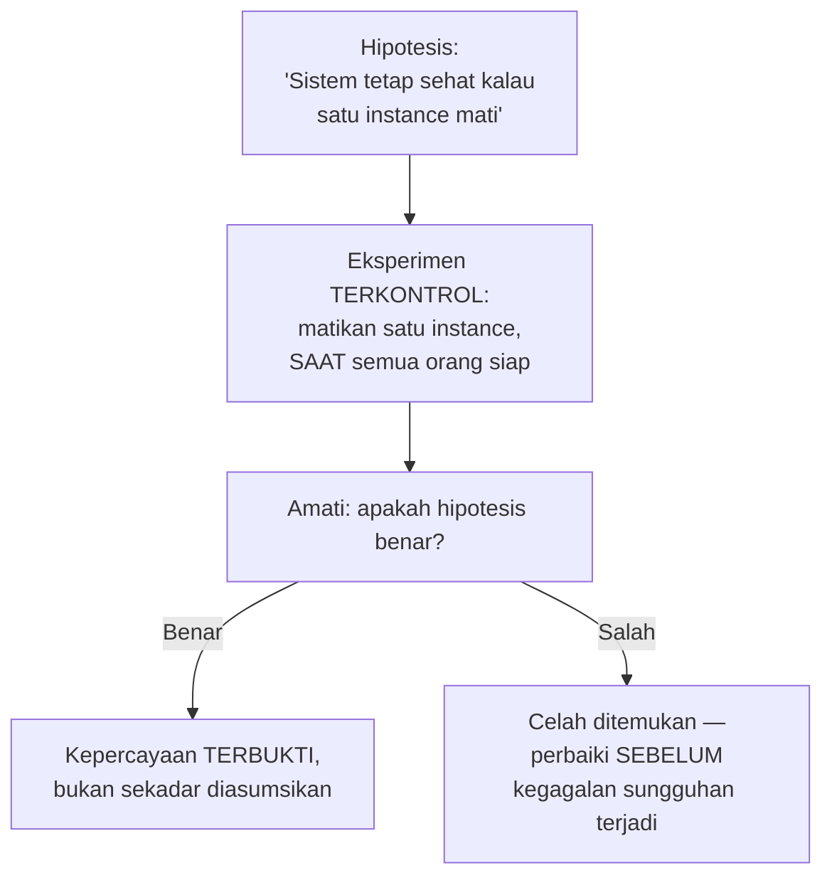

## TL;DR

Chaos engineering adalah praktik **sengaja** merusak bagian dari sistem production (atau lingkungan yang sangat mirip production) secara terkontrol, saat semua orang siap dan waspada, untuk menemukan kelemahan ketahanan sistem **sebelum** kelemahan itu terungkap oleh kegagalan sungguhan di waktu yang tidak terduga. Filosofinya bertolak belakang dengan insting alami menghindari risiko: alih-alih berharap sistem tidak pernah gagal, chaos engineering menerima bahwa kegagalan **pasti** terjadi cepat atau lambat (persis fallacy pertama di [[The Fallacies of Distributed Computing]]), dan memilih untuk menguji ketahanan terhadap kegagalan itu di waktu yang kita pilih sendiri, bukan menunggu kegagalan memilih waktunya sendiri — biasanya di saat paling tidak nyaman.

## The Problem

Sebuah tim yakin sistem mereka "tahan gangguan" karena sudah didesain dengan redundansi — beberapa instance service berjalan paralel, database punya replica, ada mekanisme retry di banyak tempat. Keyakinan ini tidak pernah benar-benar diuji sampai suatu malam salah satu instance service benar-benar mati karena masalah hardware — dan ternyata, mekanisme failover yang **diasumsikan** bekerja otomatis punya bug yang tidak pernah terdeteksi: konfigurasi load balancer salah mengarahkan sebagian traffic ke instance yang sudah mati, menyebabkan sebagian pengguna mengalami error selama beberapa menit sebelum tim menyadari dan memperbaikinya secara manual.

Masalahnya bukan desain redundansi yang salah secara konsep — masalahnya adalah mekanisme itu **tidak pernah benar-benar diuji** dalam kondisi kegagalan nyata sebelum insiden ini terjadi. Kepercayaan bahwa sistem "tahan gangguan" hanya berdasarkan desain di atas kertas, bukan berdasarkan bukti bahwa mekanisme itu benar-benar bekerja saat dibutuhkan — celah antara "seharusnya bekerja" dan "terbukti bekerja" yang baru terungkap justru di momen paling buruk, bukan di waktu yang direncanakan dan dipersiapkan tim.

## Intuition

Cara paling mudah memahaminya: chaos engineering seperti **latihan kebakaran** di gedung perkantoran. Organisasi tidak menunggu kebakaran sungguhan untuk tahu apakah jalur evakuasi berfungsi, apakah alarm benar-benar terdengar di semua lantai, apakah karyawan tahu harus berkumpul di mana — mereka menjalankan latihan terjadwal, di waktu yang direncanakan, dengan semua orang tahu ini adalah latihan (atau setidaknya pihak yang berwenang tahu), untuk menemukan celah dalam rencana evakuasi **sebelum** kebakaran sungguhan menguji rencana itu dengan taruhan nyawa sungguhan.

Analogi ini bocor pada soal skala dan frekuensi. Latihan kebakaran biasanya dijadwalkan jarang (setahun sekali atau lebih jarang) dan mencakup seluruh gedung sekaligus. Chaos engineering yang matang justru sering dijalankan **kontinu dan otomatis** dalam skala kecil — mematikan satu instance secara acak setiap hari kerja, misalnya — bukan hanya latihan besar yang jarang, karena kegagalan kecil yang sering justru lebih mirip kondisi nyata sistem terdistribusi dibanding satu bencana besar yang jarang terjadi.

## How It Works


Chaos engineering dimulai dari **hipotesis** eksplisit tentang bagaimana sistem seharusnya berperilaku saat komponen tertentu gagal — bukan sekadar "mari kita rusak sesuatu dan lihat apa yang terjadi" tanpa tujuan jelas. Eksperimen dijalankan terkontrol: cakupannya dibatasi (satu instance, bukan seluruh cluster), dilakukan di waktu yang direncanakan dengan tim siaga, dan punya **kill switch** — cara menghentikan eksperimen segera kalau dampaknya lebih besar dari yang diperkirakan.

Tingkat kematangan chaos engineering biasanya bertahap: mulai dari lingkungan staging (belum menyentuh pengguna sungguhan), lalu production dengan blast radius kecil dan terkontrol ketat, sampai (untuk organisasi yang sangat matang) eksperimen otomatis kontinu di production dengan cakupan yang diperluas bertahap seiring kepercayaan terhadap ketahanan sistem meningkat.

## Under The Hood

Nilai chaos engineering paling terasa justru untuk sistem terdistribusi kompleks, di mana interaksi antar komponen sulit diprediksi penuh hanya dari membaca kode atau desain arsitektur — kegagalan di dunia nyata jarang terjadi persis seperti yang dibayangkan saat desain (skenario yang dipikirkan dan diantisipasi biasanya sudah ditangani dengan baik; yang justru berbahaya adalah skenario yang **tidak** terpikirkan). Eksperimen chaos yang baik secara sengaja mencari celah di titik-titik yang **diasumsikan** aman tanpa pernah benar-benar diverifikasi — persis seperti mekanisme failover di "The Problem" yang diasumsikan bekerja tapi tidak pernah diuji sungguhan.

Chaos engineering yang matang selalu berjalan berdampingan dengan [[Error Budgets]] — eksperimen yang secara sengaja menyebabkan gangguan sebaiknya dilakukan saat error budget masih cukup tersisa, memberi ruang menyerap dampak eksperimen tanpa melanggar SLO yang sudah disepakati dengan pengguna. Menjalankan eksperimen chaos saat budget sudah menipis (atau di tengah insiden lain yang sedang berlangsung) adalah kesalahan waktu yang jelas — tujuannya menemukan celah di waktu tenang, bukan menambah kekacauan di waktu genting.

## In Go

```go
package chaos

import (
	"context"
	"math/rand"
	"time"
)

// FaultInjector menunjukkan gagasan inti: kegagalan disuntikkan
// SECARA SENGAJA dan TERKONTROL — dengan probabilitas dan cakupan
// yang bisa diatur, BUKAN kegagalan acak yang tidak terkendali.
type FaultInjector struct {
	FailureProbability float64 // misalnya 0.01 untuk 1% dari request
	Enabled            bool    // KILL SWITCH — bisa dimatikan seketika
}

func (f *FaultInjector) MaybeInjectLatency(ctx context.Context) {
	if !f.Enabled {
		return
	}
	if rand.Float64() < f.FailureProbability {
		// Menyuntikkan latency tambahan, mensimulasikan jaringan lambat
		time.Sleep(2 * time.Second)
	}
}

func (f *FaultInjector) MaybeInjectFailure() error {
	if !f.Enabled {
		return nil
	}
	if rand.Float64() < f.FailureProbability {
		return context.DeadlineExceeded // simulasi kegagalan terkontrol
	}
	return nil
}

// Hipotesis EKSPLISIT dicatat sebelum eksperimen — bukan sekadar
// "mari lihat apa yang terjadi" tanpa tujuan jelas.
type Experiment struct {
	Hypothesis   string
	BlastRadius  string // "1 instance dari 5", bukan seluruh cluster
	Rollback     func()
}
```

## In His Stack

Untuk 13 aplikasi yang mengklaim punya redundansi (multiple instance, database replica), chaos engineering sederhana — sengaja mematikan satu instance di lingkungan staging yang mirip production, saat tim siap mengamati — adalah langkah pertama yang realistis dan murah untuk memverifikasi apakah mekanisme failover benar-benar bekerja seperti yang diasumsikan, sebelum insiden sungguhan yang menguji asumsi itu dengan taruhan nyata seperti "The Problem". Untuk sistem legal-services yang kritis, verifikasi ini bukan sekadar praktik baik teknis, tapi juga bagian dari tanggung jawab memastikan layanan publik benar-benar tahan gangguan seperti yang diklaim, bukan sekadar tahan gangguan di atas kertas.

## Trade-offs and When Not To Use It

Chaos engineering menambah risiko nyata jika tidak dijalankan dengan disiplin ketat — eksperimen yang blast radius-nya tidak benar-benar terkontrol bisa menyebabkan insiden sungguhan alih-alih menemukan celah dengan aman. Untuk sistem yang belum punya observability matang untuk mengamati dampak eksperimen secara real-time (lihat [[../70 Infrastructure and Delivery/The Three Pillars of Observability|The Three Pillars of Observability]]), menjalankan chaos engineering berisiko tidak menyadari eksperimen sudah menyebabkan dampak lebih besar dari yang diperkirakan sampai terlambat. Chaos engineering bernilai jelas untuk sistem yang sudah punya observability dan mekanisme kill switch yang matang, dan yang benar-benar mengklaim redundansi/ketahanan yang butuh diverifikasi, bukan sekadar diasumsikan.

## Common Mistakes

> [!warning] Jebakan
> Menjalankan eksperimen chaos tanpa hipotesis eksplisit tentang perilaku yang diharapkan — "mari kita rusak sesuatu dan lihat apa yang terjadi" tanpa tujuan jelas kehilangan nilai ilmiah eksperimen, dan sulit menyimpulkan apakah hasilnya "sesuai harapan" atau "menemukan celah".

> [!warning] Jebakan
> Menjalankan eksperimen tanpa kill switch yang benar-benar bisa menghentikan dampak seketika — eksperimen yang lepas kendali dan berkembang jadi insiden sungguhan tanpa cara cepat menghentikannya bertentangan langsung dengan tujuan chaos engineering itu sendiri.

> [!warning] Jebakan
> Menjalankan eksperimen chaos saat error budget sudah menipis atau di tengah insiden lain — menambah risiko di waktu yang salah, alih-alih menemukan celah di waktu tenang seperti yang seharusnya menjadi tujuan utama praktik ini.

## Exercises

1. Jelaskan filosofi inti chaos engineering, dan kenapa ia bertolak belakang dengan insting alami menghindari risiko.
2. Kenapa eksperimen chaos harus dimulai dari hipotesis eksplisit, bukan sekadar "merusak sesuatu dan melihat apa yang terjadi"?
3. Kenapa kill switch adalah komponen wajib, bukan opsional, dalam eksperimen chaos engineering?
4. Desain terbuka: salah satu dari 13 aplikasimu mengklaim tahan gangguan karena punya tiga instance service dan database dengan replica, tapi klaim ini belum pernah diuji sungguhan. Rancang eksperimen chaos engineering pertama untuk aplikasi ini, termasuk hipotesis, blast radius, dan bagaimana memastikan eksperimen ini aman dijalankan.

> [!success]- Kunci jawaban
> **1.** Filosofi intinya: kegagalan pada sistem terdistribusi tidak bisa dihindari sepenuhnya, hanya bisa dipilih **kapan** kita menghadapinya — chaos engineering memilih menghadapinya di waktu yang direncanakan dan dipersiapkan, alih-alih menunggu kegagalan sungguhan memilih waktunya sendiri (biasanya di saat paling tidak nyaman). Ini bertolak belakang dengan insting menghindari risiko karena secara sengaja menciptakan risiko terkontrol, dengan keyakinan bahwa risiko kecil yang dikelola sekarang lebih murah dibanding risiko besar tak terduga nanti.
> **4.** Hipotesis: "kalau satu dari tiga instance service dimatikan, sistem tetap melayani seluruh traffic tanpa error yang terlihat pengguna, karena load balancer mengarahkan traffic ke dua instance yang tersisa." Blast radius: satu instance dari tiga (bukan seluruhnya), dijalankan di lingkungan staging dulu (bukan langsung production) sebagai langkah pertama yang lebih aman. Keamanan eksperimen: jadwalkan di jam kerja saat tim lengkap siaga mengamati dashboard (bukan tengah malam saat sedikit orang yang bisa merespons cepat), siapkan cara menyalakan kembali instance yang dimatikan seketika (kill switch), dan pantau metrik error rate dan latency secara real-time selama eksperimen berlangsung — kalau ada tanda-tanda dampak melebihi yang diharapkan (error rate naik signifikan, bukan tetap nol seperti hipotesis), hentikan eksperimen segera dan analisis kenapa hipotesis meleset, sebelum mencoba lagi dengan perbaikan yang sesuai.

## Self-Check

- Apa filosofi inti chaos engineering?
- Kenapa eksperimen harus dimulai dari hipotesis eksplisit?
- Kenapa kill switch adalah komponen wajib?
- Kapan sebaiknya tidak menjalankan eksperimen chaos?

## Connected Notes

- [[Incident Command and Blameless Postmortems]] — latihan simulasi insiden lewat chaos engineering adalah cara membuat struktur incident command benar-benar teruji sebelum dibutuhkan sungguhan.
- [[Error Budgets]] — eksperimen chaos idealnya dijalankan saat error budget masih cukup tersisa, memberi ruang menyerap dampak tanpa melanggar SLO.
- [[The Fallacies of Distributed Computing]] — chaos engineering adalah penerapan praktis menerima fallacy pertama (jaringan/sistem tidak selalu andal) sebagai kenyataan yang harus diuji, bukan diabaikan.
- [[../70 Infrastructure and Delivery/The Three Pillars of Observability|The Three Pillars of Observability]] — observability matang adalah prasyarat menjalankan chaos engineering dengan aman, memungkinkan pengamatan dampak eksperimen secara real-time.
- [[Planned Degradation]] — kelanjutan langsung: eksperimen chaos sering mengungkap kebutuhan rencana degradasi terkontrol yang dibahas di note berikutnya.

## Further Reading

- Netflix Technology Blog, berbagai tulisan tentang Chaos Monkey dan Chaos Engineering — Netflix adalah salah satu pelopor paling berpengaruh mempraktikkan dan mempopulerkan disiplin ini di industri.
- "Principles of Chaos Engineering" (principlesofchaos.org) — dokumen ringkas yang merangkum prinsip inti praktik ini dari komunitas praktisi.

## Catatan Saya

*Tulis di sini apakah klaim "tahan gangguan" di salah satu dari 13 aplikasimu pernah benar-benar diuji, atau masih sekadar asumsi di atas kertas.*
