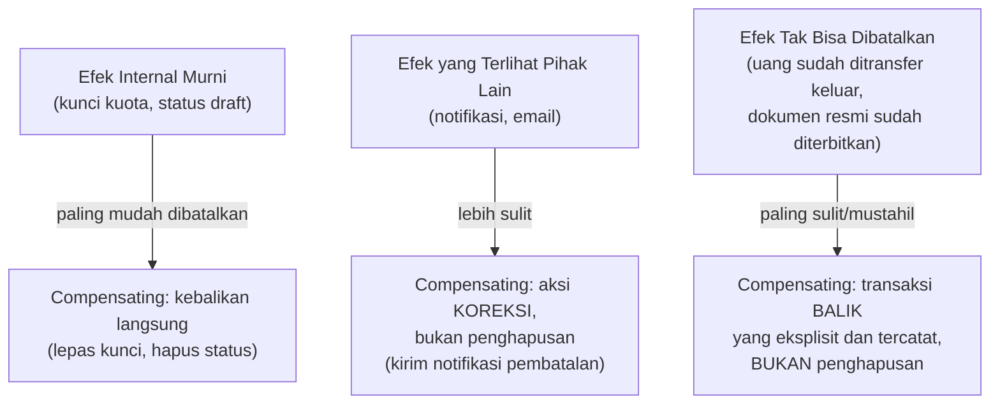

## TL;DR

Compensating transaction adalah operasi yang secara sengaja dirancang untuk **membatalkan efek** dari operasi sebelumnya, dipakai ketika rollback database sungguhan tidak tersedia — situasi yang selalu terjadi begitu operasi asli sudah **commit** (baik karena melintasi batas service seperti di [[Sagas - Orchestration vs Choreography]], atau karena efek sampingnya sudah terlanjur terlihat pihak luar). Bedanya dengan rollback: rollback mengembalikan sistem **persis** ke keadaan sebelum operasi terjadi, seolah operasi itu tidak pernah ada. Compensating transaction hanya bisa mengembalikan sistem **sedekat mungkin** ke keadaan semula — perbedaan yang terlihat sepele tapi sebenarnya adalah inti dari kenapa mendesain compensating transaction yang benar jauh lebih sulit dari sekadar menulis "kebalikan" dari operasi aslinya.

## The Problem

Sebuah saga membatalkan proses pengajuan yang gagal di langkah terakhir — compensating transaction untuk langkah "kirim notifikasi ke petugas bahwa dokumen baru masuk" ditulis sebagai "kirim notifikasi pembatalan ke petugas". Tim yang menulis compensating action ini berasumsi ini setara dengan "membatalkan" notifikasi pertama — tapi kenyataannya, petugas **sudah membaca** notifikasi pertama dan mulai memproses dokumen itu secara manual sebelum notifikasi pembatalan sempat dikirim. Compensating action yang dikirim tidak bisa "menarik kembali" fakta bahwa petugas sudah membaca dan bertindak berdasarkan notifikasi pertama — yang bisa dilakukan compensating action hanyalah memberi tahu bahwa proses itu **sekarang** dibatalkan, sesuatu yang sudah lain dari sekadar "seolah-olah notifikasi pertama tidak pernah dikirim".

Masalah ini mengungkap batasan mendasar compensating transaction: ia bekerja baik untuk efek yang murni internal dan bisa "dibalik" secara bersih (melepas kuota yang dikunci, membatalkan status di database), tapi menjadi jauh lebih rumit — kadang mustahil dibalik sepenuhnya — untuk efek yang sudah "keluar" ke dunia nyata dan dilihat atau ditindaklanjuti pihak lain (manusia yang sudah membaca notifikasi, email yang sudah terkirim dan dibaca, keputusan yang sudah dikomunikasikan ke pihak eksternal).

## Intuition

Cara paling mudah memahaminya: rollback database seperti **menghapus tulisan di whiteboard** — begitu dihapus, seolah-olah tulisan itu tidak pernah ada di sana, tidak ada bekas apa pun. Compensating transaction lebih seperti **mencoret tulisan yang sudah difoto orang lain** — kamu bisa mencoretnya di whiteboard, tapi orang yang sudah memotretnya (dan mungkin sudah membagikan fotonya, atau bertindak berdasarkan apa yang dibacanya) tidak ikut "ter-update" otomatis hanya karena kamu mencoret whiteboard-nya. Compensating transaction adalah **aksi baru** yang berusaha mengoreksi keadaan, bukan penghapusan sejarah yang benar-benar bersih.

Analogi ini nyaris sepenuhnya menangkap kenyataan yang dihadapi desainer saga. Perbedaan pentingnya: pada whiteboard yang difoto, kamu setidaknya tahu siapa yang mungkin sudah memotretnya. Pada sistem terdistribusi, kamu sering **tidak tahu pasti** apakah efek samping sudah "terlihat" pihak lain sebelum compensating action sempat dijalankan — inilah yang membuat desain compensating action harus mempertimbangkan skenario terburuk (efeknya sudah terlihat) secara eksplisit, bukan berasumsi "biasanya cukup cepat sehingga jarang terlihat".

## How It Works

Tiga kategori efek samping, dari paling mudah dibatalkan sampai paling sulit:


Kategori pertama (efek internal murni) memungkinkan compensating action yang mendekati rollback sungguhan — melepas kunci kuota yang belum pernah terlihat siapa pun di luar sistem, misalnya, memang bisa mengembalikan keadaan hampir persis seperti semula. Kategori kedua dan ketiga butuh pendekatan yang berbeda secara fundamental: alih-alih "menghapus" efek, compensating action **menambahkan** aksi baru yang secara eksplisit mengoreksi atau membalikkan dampak — pembayaran yang sudah terlanjur diproses tidak "dihapus" begitu saja, tapi dibalik lewat transaksi refund baru yang tercatat sebagai transaksi terpisah, dengan jejak audit yang jelas menunjukkan urutan kejadian (bayar, lalu refund), bukan berpura-pura pembayaran pertama tidak pernah terjadi.

## Under The Hood

Prinsip desain yang membedakan compensating transaction yang matang dari yang naif: compensating action **tidak berusaha memalsukan sejarah** (berpura-pura sesuatu tidak pernah terjadi), melainkan **menambahkan koreksi yang jujur** ke sejarah itu. Ini selaras langsung dengan kebutuhan [[../80 Security/Audit Logging|Audit Logging]] dan [[../80 Security/Compliance Trails for Government Systems|Compliance Trails for Government Systems]] — sistem yang mencoba "menghapus" jejak transaksi yang dibatalkan (bukan mencatatnya sebagai dibatalkan) kehilangan kemampuan menjawab pertanyaan audit "apa yang sebenarnya terjadi dengan transaksi ini", justru di titik yang paling penting untuk sistem yang butuh akuntabilitas tinggi.

Urutan eksekusi compensating action dalam sebuah saga juga penting — dijalankan dalam urutan **terbalik** dari urutan aksi asli (langkah terakhir yang berhasil dibatalkan lebih dulu, langkah pertama dibatalkan terakhir), mencerminkan prinsip bahwa langkah yang lebih belakangan biasanya bergantung pada keadaan yang dihasilkan langkah sebelumnya, jadi harus dibongkar dulu sebelum langkah sebelumnya aman dibatalkan.

## In Go

```go
package compensating

import (
	"context"
	"fmt"
	"time"
)

// CompensatingAction TIDAK menghapus catatan aksi asli — ia
// menciptakan CATATAN BARU yang secara eksplisit menunjukkan
// pembatalan, menjaga jejak audit tetap jujur dan lengkap.
type CompensatingAction struct {
	OriginalActionID string
	Reason           string
	ExecutedAt       time.Time
}

// RefundPayment adalah CONTOH compensating action untuk efek yang
// TIDAK BISA dibatalkan begitu saja — bukan "menghapus" pembayaran,
// tapi transaksi BARU yang membalikkan dampaknya, dengan jejak
// audit yang jelas.
func RefundPayment(ctx context.Context, originalPaymentID string, amount int64, reason string) error {
	refund := CompensatingAction{
		OriginalActionID: originalPaymentID,
		Reason:           reason,
		ExecutedAt:       time.Now(),
	}

	// Catat SEBAGAI transaksi terpisah — riwayat lengkap (bayar,
	// lalu refund) tetap terlihat, BUKAN seolah pembayaran pertama
	// tidak pernah terjadi.
	if err := recordRefundTransaction(ctx, refund, amount); err != nil {
		return fmt.Errorf("compensating: refund gagal dicatat: %w", err)
	}
	return nil
}

// NotifyCancellation adalah CONTOH compensating action untuk efek
// yang SUDAH TERLIHAT pihak lain — mengirim KOREKSI, bukan mencoba
// "menarik kembali" notifikasi asli yang sudah dibaca.
func NotifyCancellation(ctx context.Context, originalNotificationID string, recipient string) error {
	message := fmt.Sprintf(
		"Proses terkait notifikasi %s telah DIBATALKAN. Mohon abaikan tindakan yang sudah dimulai berdasarkan notifikasi tersebut.",
		originalNotificationID,
	)
	return sendNotification(ctx, recipient, message)
}

func recordRefundTransaction(ctx context.Context, action CompensatingAction, amount int64) error { return nil }
func sendNotification(ctx context.Context, recipient, message string) error                       { return nil }
```

## In His Stack

Untuk proses lintas 13 aplikasi yang melibatkan notifikasi ke petugas manusia (seperti di "The Problem"), desain compensating action harus secara eksplisit mempertimbangkan bahwa manusia mungkin sudah bertindak berdasarkan informasi yang sekarang dibatalkan — bukan hanya mengirim "notifikasi pembatalan" dan menganggap masalah selesai, tapi memastikan pesan koreksi itu cukup jelas untuk mencegah petugas melanjutkan tindakan yang sudah tidak relevan, dan idealnya disertai eskalasi manual (misalnya menandai kasus untuk ditinjau supervisor) kalau ada kemungkinan tindakan berbasis notifikasi lama sudah terlanjur dilakukan.

## Trade-offs and When Not To Use It

Mendesain compensating action yang benar-benar mempertimbangkan seluruh skenario "efek sudah terlihat pihak lain" butuh usaha ekstra dibanding sekadar menulis kebalikan operasi secara naif — untuk sistem internal dengan efek samping yang murni teknis dan tidak pernah terlihat manusia sebelum seluruh saga selesai, compensating action sederhana (kebalikan langsung) sudah cukup. Begitu ada kemungkinan nyata manusia melihat atau bertindak berdasarkan efek samping sebelum compensating action sempat dijalankan, investasi desain yang lebih matang (notifikasi koreksi eksplisit, eskalasi manual) jadi sepadan — mengabaikannya berisiko masalah yang jauh lebih sulit diperbaiki dibanding biaya mendesainnya dengan benar sejak awal.

## Common Mistakes

> [!warning] Jebakan
> Menulis compensating action sebagai "kebalikan otomatis" tanpa mempertimbangkan apakah efek aslinya mungkin sudah terlihat atau ditindaklanjuti pihak lain — persis masalah di "The Problem", di mana notifikasi pembatalan dikirim seolah masalah selesai padahal petugas sudah terlanjur bertindak.

> [!warning] Jebakan
> Mencoba "menghapus" jejak transaksi yang dibatalkan alih-alih mencatatnya sebagai koreksi eksplisit — merusak kemampuan audit trail menjawab pertanyaan "apa yang sebenarnya terjadi", bertentangan langsung dengan kebutuhan compliance yang butuh riwayat lengkap dan jujur.

> [!warning] Jebakan
> Tidak mempertimbangkan urutan eksekusi compensating action dalam saga — menjalankannya dalam urutan yang sama (bukan terbalik) dengan aksi asli bisa mencoba membatalkan langkah yang bergantung pada langkah lain yang belum dibatalkan, menghasilkan keadaan yang tidak konsisten di tengah proses pembatalan itu sendiri.

## Exercises

1. Jelaskan perbedaan mendasar antara rollback dan compensating transaction.
2. Sebutkan tiga kategori efek samping dan tingkat kesulitan membatalkannya masing-masing.
3. Kenapa compensating action yang matang tidak berusaha "menghapus" jejak aksi asli, melainkan menambahkan koreksi eksplisit?
4. Desain terbuka: proses persetujuan dokumen di salah satu dari 13 aplikasimu melibatkan langkah "kirim dokumen ke petugas eksternal untuk ditandatangani secara fisik" sebagai salah satu langkah saga. Langkah berikutnya dalam saga gagal, dan proses ini perlu dibatalkan — tapi dokumen fisik sudah terkirim dan mungkin sudah diterima petugas eksternal. Rancang compensating action untuk skenario ini, dengan mempertimbangkan bahwa efek fisik (dokumen yang sudah terkirim) tidak bisa "ditarik kembali" secara digital.

> [!success]- Kunci jawaban
> **1.** Rollback mengembalikan sistem persis ke keadaan sebelum operasi terjadi, seolah operasi itu tidak pernah ada — tersedia lewat mekanisme database (write-ahead log, transaksi) sebelum commit. Compensating transaction adalah operasi baru yang berusaha mengembalikan sistem sedekat mungkin ke keadaan semula, dipakai setelah operasi asli sudah commit dan tidak bisa dibatalkan secara teknis murni.
> **4.** Compensating action untuk langkah ini tidak bisa berupa "penarikan kembali" dokumen fisik — yang bisa dilakukan: (1) segera kirim notifikasi eksplisit ke petugas eksternal (lewat kanal komunikasi yang sama atau lebih cepat dari pengiriman dokumen fisik, misalnya telepon atau email mendesak) bahwa proses ini **dibatalkan** dan dokumen yang mereka terima **tidak boleh ditindaklanjuti**; (2) catat status "pembatalan dikomunikasikan" secara eksplisit di sistem, termasuk timestamp dan metode komunikasi, sebagai bagian dari audit trail; (3) tandai kasus ini untuk **verifikasi manual** oleh supervisor atau tim terkait — memastikan secara aktif bahwa petugas eksternal benar-benar menerima dan memahami pembatalan ini, bukan berasumsi notifikasi otomatis cukup, karena konsekuensi dokumen fisik yang sudah ditandatangani secara keliru bisa punya implikasi hukum nyata; (4) desain proses ke depan mempertimbangkan menambah jeda konfirmasi sebelum benar-benar mengirim dokumen fisik (misalnya menunggu semua langkah sebelumnya benar-benar final terlebih dulu), mengurangi kemungkinan skenario pembatalan setelah dokumen fisik terlanjur terkirim.

## Self-Check

- Apa perbedaan mendasar rollback dan compensating transaction?
- Sebutkan tiga kategori efek samping dan tingkat kesulitan membatalkannya.
- Kenapa compensating action sebaiknya tidak menghapus jejak aksi asli?
- Kenapa urutan eksekusi compensating action dalam saga harus terbalik dari urutan asli?

## Connected Notes

- [[Sagas - Orchestration vs Choreography]] — compensating transaction adalah mekanisme inti yang membuat saga bisa membatalkan proses yang gagal di tengah jalan, dibahas dasar-dasarnya di note sebelumnya.
- [[Exactly-Once Delivery as an Illusion]] — compensating action, seperti aksi lain dalam saga, harus idempoten untuk aman dijalankan berulang saat retry.
- [[../80 Security/Audit Logging|Audit Logging]] — compensating transaction yang matang selalu tercatat sebagai koreksi eksplisit, selaras dengan prinsip audit trail yang jujur dan lengkap.
- [[Event Sourcing]] — kelanjutan langsung: pola menyimpan setiap perubahan (termasuk pembatalan) sebagai kejadian baru, bukan menimpa riwayat lama, adalah gagasan yang berakar dari prinsip yang sama dengan compensating transaction.
- [[../80 Security/Compliance Trails for Government Systems|Compliance Trails for Government Systems]] — kebutuhan mencatat riwayat lengkap termasuk pembatalan adalah pertimbangan langsung yang relevan untuk sistem legal-services.

## Further Reading

- Hector Garcia-Molina dan Kenneth Salem, "Sagas" (1987) — paper yang sama dengan rujukan di note sebelumnya, membahas compensating transaction sebagai bagian inti dari konsep saga.

## Catatan Saya

*Tulis di sini proses di salah satu dari 13 aplikasimu yang punya efek samping sulit dibatalkan (dokumen fisik, notifikasi yang sudah dibaca), dan bagaimana pembatalannya ditangani sekarang (kalau pernah terjadi).*
