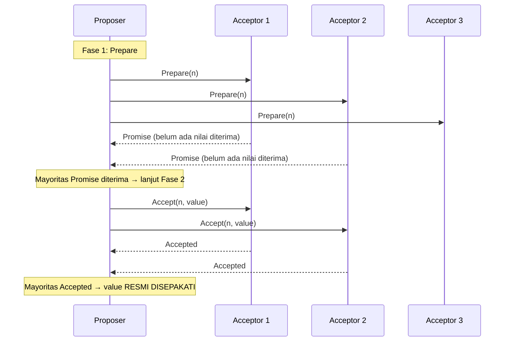

## TL;DR

Paxos, diperkenalkan Leslie Lamport pada akhir 1980-an, adalah algoritma consensus pertama yang terbukti benar secara matematis dan dipakai luas — tapi terkenal luas juga karena kesulitannya dipahami, sampai-sampai paper aslinya sendiri ditulis dengan gaya naratif yang oleh sebagian pembaca justru dianggap menambah kebingungan, bukan menguranginya. Raft (dibahas di note sebelumnya) diciptakan khusus sebagai respons terhadap masalah ini: menyelesaikan masalah consensus yang **sama persis** dengan Paxos, tapi dengan struktur yang secara sengaja dirancang lebih mudah diajarkan dan diimplementasikan. Memahami Paxos tetap layak — bukan untuk diimplementasikan dari nol, tapi karena sebagian sistem penting di industri (termasuk sistem-sistem awal Google) dibangun di atasnya, dan karena memahami kesulitan Paxos membuat menghargai kenapa Raft dirancang seperti itu.

## The Problem

Sebelum Paxos, memastikan sekumpulan node yang tidak saling percaya sepenuhnya sepakat pada satu nilai — meski sebagian node bisa gagal atau pesan bisa hilang — tidak punya solusi yang terbukti benar secara matematis. Solusi ad-hoc yang dicoba berbagai sistem sebelum consensus formal ada cenderung punya celah tersembunyi: skenario tertentu (kombinasi kegagalan node dan pesan yang hilang di waktu yang tepat) bisa membuat dua node berbeda menyimpulkan nilai yang berbeda sebagai "yang disepakati", persis masalah split brain yang dibahas di [[Leader Election and Split Brain]].

Paxos adalah jawaban formal pertama: sebuah protokol yang, lewat pembuktian matematis, menjamin **safety** (tidak akan pernah ada dua node yang menyimpulkan nilai berbeda sebagai keputusan final) bahkan dalam kondisi jaringan paling buruk sekalipun (pesan hilang, tertunda, atau tiba tidak berurutan) — selama mayoritas node pada akhirnya bisa saling berkomunikasi. Nilainya bukan sekadar "solusi yang bekerja", tapi solusi yang **terbukti** bekerja dalam setiap skenario kegagalan yang bisa dibayangkan dalam model formalnya.

## Intuition

Cara paling mudah memahaminya: Paxos seperti **proses melamar seseorang di kota kecil zaman dulu tanpa telepon**, di mana pelamar harus mengirim utusan berkali-kali bolak-balik untuk memastikan tidak ada pelamar lain yang lebih dulu diterima sebelum lamarannya sendiri benar-benar dianggap final. Proses ini punya dua babak: babak pertama, pelamar mengirim utusan bertanya "apakah boleh saya melamar dengan nomor urutan ini, dan apakah sudah ada yang diterima sebelumnya?" — kalau mayoritas keluarga menjawab "belum ada, silakan", ia lanjut ke babak kedua: mengirim lamaran sungguhan dengan nilai yang diusulkan, dan lamaran ini sah kalau lagi-lagi disetujui mayoritas.

Analogi ini bocor pada soal kerumitan nyata Paxos. Skenario di atas menyederhanakan menjadi satu pelamar tunggal — kerumitan sesungguhnya Paxos muncul saat **banyak pelamar mengirim lamaran hampir bersamaan**, dan protokol harus menjamin hanya satu yang akhirnya "menang" secara konsisten di mata semua pihak, meski pesan-pesan mereka bisa saling menyalip atau tertunda dengan cara yang rumit — inilah bagian yang membuat pembuktian dan penjelasan Paxos jadi kompleks, jauh melampaui analogi sederhana di atas.

## How It Works


Dua fase yang tidak bisa dilewati: **Prepare/Promise** (proposer memastikan tidak ada proposal dengan nomor lebih tinggi yang sudah berjalan, dan mengumpulkan informasi kalau ternyata ada nilai yang sudah pernah "hampir" disepakati sebelumnya), lalu **Accept/Accepted** (proposer benar-benar mengirim nilai yang diusulkan, dan itu resmi disepakati begitu mayoritas acceptor menerimanya — persis konsep quorum di [[Quorums]]).

Peran dalam Paxos: **Proposer** mengusulkan nilai. **Acceptor** memutuskan menerima atau menolak proposal (mayoritas acceptor yang setuju membuat nilai itu resmi). **Learner** mempelajari nilai apa yang akhirnya disepakati. Satu node bisa memegang lebih dari satu peran sekaligus dalam implementasi praktis.

## Under The Hood

Kesulitan Paxos yang sebenarnya bukan di deskripsi dasar dua fase di atas — kesulitannya muncul saat menangani **multi-Paxos** (menyepakati bukan cuma satu nilai, tapi rangkaian nilai berurutan, seperti log operasi) dan skenario di mana **banyak proposer bersaing bersamaan**, yang bisa menyebabkan livelock (setiap proposer terus-menerus disalip proposal lain dengan nomor lebih tinggi, tidak ada yang pernah benar-benar selesai). Paxos dasar tidak secara eksplisit menentukan siapa yang boleh mengusulkan kapan — perbedaan mendasar dari Raft yang secara eksplisit memakai leader tunggal untuk menghindari persaingan proposal semacam ini.

Ini persis yang dimaksud Diego Ongaro dan John Ousterhout (penulis paper Raft) sebagai motivasi mereka: Paxos menjelaskan **keamanan** (safety) dengan elegan, tapi meninggalkan banyak detail praktis (bagaimana leadership berjalan, bagaimana log direplikasi berurutan) sebagai "latihan bagi pembaca" — detail yang justru paling rumit dan paling rawan salah diimplementasikan dalam praktik nyata. Raft secara sengaja menggabungkan leadership eksplisit ke dalam algoritma dasarnya, menghilangkan sebagian besar ambiguitas ini.

## In Go

```go
package paxos

// Proposal merepresentasikan nomor urut yang HARUS unik dan
// terurut secara total di antara seluruh proposer — biasanya
// kombinasi counter dan ID node, memastikan tidak ada dua proposer
// yang kebetulan memakai nomor yang sama.
type Proposal struct {
	Number int
	NodeID string
}

func (p Proposal) GreaterThan(other Proposal) bool {
	if p.Number != other.Number {
		return p.Number > other.Number
	}
	return p.NodeID > other.NodeID // tie-break memakai NodeID
}

type Acceptor struct {
	PromisedProposal Proposal
	AcceptedProposal *Proposal
	AcceptedValue    string
}

// Prepare mengimplementasikan Fase 1 — acceptor HANYA berjanji
// (promise) kalau proposal ini punya nomor lebih tinggi dari
// SEMUA yang pernah dijanjikan sebelumnya.
func (a *Acceptor) Prepare(p Proposal) (promised bool, priorValue *string, priorProposal *Proposal) {
	if p.GreaterThan(a.PromisedProposal) {
		a.PromisedProposal = p
		return true, &a.AcceptedValue, a.AcceptedProposal
	}
	return false, nil, nil
}

// Accept mengimplementasikan Fase 2 — acceptor HANYA menerima kalau
// proposal ini masih yang tertinggi sejak Prepare terakhir.
func (a *Acceptor) Accept(p Proposal, value string) bool {
	if !p.GreaterThan(a.PromisedProposal) && p != a.PromisedProposal {
		return false
	}
	a.PromisedProposal = p
	a.AcceptedProposal = &p
	a.AcceptedValue = value
	return true
}
```

## In His Stack

Paxos jarang perlu diimplementasikan langsung untuk kebutuhan praktis 13 aplikasi — pengetahuannya paling bernilai sebagai fondasi konseptual yang memperdalam pemahaman kenapa tool seperti Consul dan etcd (yang memakai Raft) dirancang seperti sekarang, dan sebagai latar belakang akademik yang relevan untuk ambisi studi master distributed systems. Sistem industri skala sangat besar (Google Chubby, Spanner) yang pernah dibangun di atas varian Paxos adalah bacaan lebih lanjut yang berguna untuk memahami bagaimana konsep ini benar-benar dipakai di skala produksi nyata.

## Trade-offs and When Not To Use It

Mengimplementasikan Paxos dari nol untuk kebutuhan praktis modern hampir tidak pernah ide yang baik — kerumitan dan kerawanan kesalahan implementasinya jauh lebih tinggi dibanding Raft yang menyelesaikan masalah yang sama dengan struktur yang lebih eksplisit dan lebih mudah diverifikasi benar. Untuk kebutuhan sistem baru yang butuh consensus, Raft (atau tool yang sudah mengimplementasikannya) hampir selalu pilihan yang lebih praktis. Nilai mempelajari Paxos ada di pemahaman konseptual dan akademik, bukan sebagai rekomendasi implementasi.

## Common Mistakes

> [!warning] Jebakan
> Mencoba mengimplementasikan Paxos dari nol untuk kebutuhan production tanpa keahlian mendalam di bidang ini — kerumitan detail (terutama multi-Paxos dan penanganan proposer bersaing) membuat implementasi yang terlihat benar tapi punya celah tersembunyi jadi risiko nyata, jauh lebih besar dibanding memakai Raft atau tool yang sudah teruji.

> [!warning] Jebakan
> Menganggap Paxos dan Raft menyelesaikan masalah yang berbeda — keduanya menyelesaikan masalah consensus yang **sama persis** (dibuktikan setara secara matematis), hanya berbeda dalam struktur dan kemudahan pemahaman/implementasi.

> [!warning] Jebakan
> Membaca paper asli Paxos ("The Part-Time Parliament") sebagai pengantar pertama tanpa latar belakang — paper ini terkenal ditulis dengan gaya alegoris yang oleh banyak pembaca justru dianggap menambah kebingungan; materi pengantar yang lebih modern biasanya jalan masuk yang lebih baik sebelum membaca paper asli.

## Exercises

1. Jelaskan dua fase inti Paxos, dan apa yang dijamin masing-masing fase.
2. Kenapa Raft diciptakan meski Paxos sudah ada dan terbukti benar secara matematis?
3. Apa perbedaan mendasar cara Paxos dan Raft menangani "siapa yang boleh mengusulkan nilai baru"?
4. Desain terbuka: seorang junior di timmu mengusulkan membangun sistem consensus kustom berbasis Paxos dari nol untuk kebutuhan koordinasi internal salah satu dari 13 aplikasi, karena "Paxos adalah algoritma consensus yang paling terbukti secara matematis". Bagaimana kamu akan merespons usulan ini, dan apa yang akan kamu rekomendasikan sebagai gantinya?

> [!success]- Kunci jawaban
> **1.** Fase Prepare/Promise: proposer memastikan tidak ada proposal dengan nomor lebih tinggi yang sudah berjalan, dan mengumpulkan informasi nilai yang mungkin sudah "hampir" disepakati sebelumnya — menjamin proposal baru tidak diam-diam menimpa keputusan yang sudah dalam proses. Fase Accept/Accepted: proposer mengirim nilai yang diusulkan, resmi disepakati begitu mayoritas acceptor menerimanya — menjamin safety (tidak ada dua nilai berbeda yang sama-sama dianggap final).
> **4.** Apresiasi ketertarikan pada teori consensus, tapi jelaskan bahwa terbukti benar secara matematis tidak sama dengan mudah diimplementasikan benar dalam praktik — Paxos dasar tidak mendefinisikan banyak detail praktis penting (leadership, replikasi log berurutan) yang justru paling rawan kesalahan implementasi, dan kesalahan di sistem consensus sering menghasilkan bug yang sangat sulit dideteksi (data yang diam-diam tidak konsisten, bukan crash yang jelas terlihat). Rekomendasi konkret: pakai tool yang sudah mengimplementasikan consensus dengan benar dan teruji luas di industri (Consul atau etcd, keduanya berbasis Raft) alih-alih membangun ulang dari nol — investasi tim jauh lebih baik dialokasikan ke integrasi dan operasional tool yang sudah matang, bukan ke implementasi algoritma consensus kustom yang risikonya jauh melebihi manfaatnya untuk kebutuhan koordinasi internal biasa.

## Self-Check

- Sebutkan dua fase inti Paxos dan apa yang dijamin masing-masing.
- Kenapa Raft diciptakan meski Paxos sudah terbukti benar?
- Apa perbedaan cara Paxos dan Raft menangani proposal nilai baru?
- Kenapa mengimplementasikan Paxos dari nol jarang jadi ide yang baik?

## Connected Notes

- [[Consensus - Raft]] — Paxos dan Raft menyelesaikan masalah consensus yang sama; note ini memberi konteks kenapa Raft dirancang seperti dibahas di note sebelumnya.
- [[Quorums]] — mayoritas acceptor yang jadi syarat proposal disepakati di Paxos adalah penerapan langsung konsep quorum.
- [[Leader Election and Split Brain]] — kelanjutan langsung: masalah yang diselesaikan Paxos dan Raft pada akhirnya adalah mencegah keadaan split brain yang dibahas mendalam di note berikutnya.
- [[../92 Tools/Consul|Consul]] — memilih Raft, bukan Paxos, sebagai fondasi consensus-nya — pilihan yang lebih masuk akal setelah memahami perbandingan di note ini.
- [[Time and Ordering - Lamport and Vector Clocks]] — Leslie Lamport, penulis Paxos, juga penulis Lamport clock — dua kontribusi fundamental yang berkaitan erat dalam sejarah distributed systems.

## Further Reading

- Leslie Lamport, "The Part-Time Parliament" (1998) — paper asli Paxos, ditulis dengan gaya alegoris yang terkenal sulit; layak dibaca setelah memahami dasar-dasarnya lewat sumber lain.
- Leslie Lamport, "Paxos Made Simple" (2001) — usaha Lamport sendiri menjelaskan ulang Paxos dengan lebih langsung, jalan masuk yang lebih baik sebelum paper asli.

## Catatan Saya

*Tulis di sini pertanyaan yang muncul saat membandingkan Paxos dan Raft, relevan untuk persiapan studi master distributed systems-mu.*
